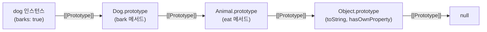

## 정의

JavaScript 의 모든 객체는 **`[[Prototype]]`** (내부 슬롯) 을 가진다. 속성 lookup 시 자신에게 없으면 **prototype chain 을 따라 올라가며** 검색.

```javascript
const animal = { eats: true };
const dog = Object.create(animal);
dog.barks = true;

dog.barks    // true (own)
dog.eats     // true (prototype 에서)
```

## 접근

```javascript
Object.getPrototypeOf(obj)     // [[Prototype]] 반환
Object.setPrototypeOf(obj, p)  // 변경 (성능 주의)
obj.__proto__                   // 비표준 getter (피하기)
```

## 함수의 prototype

함수는 `prototype` property 를 가진다 (객체).

```javascript
function Foo() {}
Foo.prototype                  // {} (객체)
Foo.prototype.constructor      // Foo

const obj = new Foo();
Object.getPrototypeOf(obj) === Foo.prototype    // true
obj.__proto__ === Foo.prototype                 // true
```

`new Foo()` 시 새 객체의 `[[Prototype]]` 이 `Foo.prototype` 으로 설정.

## class 와의 관계

```javascript
class Animal {
    eat() { return 'eating'; }
}

class Dog extends Animal {
    bark() { return 'woof'; }
}

const d = new Dog();
d.bark()    // 'woof' (own)
d.eat()     // 'eating' (prototype chain)
```

내부적으로 같은 prototype chain.

```text
d → Dog.prototype → Animal.prototype → Object.prototype → null
```

## prototype chain 의 끝

```javascript
Object.getPrototypeOf({}) === Object.prototype       // true
Object.getPrototypeOf(Object.prototype) === null     // true

const clean = Object.create(null);
Object.getPrototypeOf(clean)    // null
```

`Object.create(null)` 은 **prototype 없는 진짜 깨끗한 객체** (사전처럼 사용).

## 속성 lookup 순서

```javascript
const grandparent = { x: 1 };
const parent = Object.create(grandparent);
parent.y = 2;
const child = Object.create(parent);
child.z = 3;

child.z   // 3 (own)
child.y   // 2 (parent)
child.x   // 1 (grandparent)
child.w   // undefined (chain 끝까지 못 찾음)
```

자신 → prototype → ... → null 까지 탐색.

## 속성 검색 시점

- **읽기** : chain 전체 검색
- **쓰기** : 자기 자신에 추가 (chain 변경 안 함)

```javascript
const parent = { x: 1 };
const child = Object.create(parent);
child.x   // 1 (parent 에서)
child.x = 2;
child.x   // 2 (own, parent 의 x 는 1 그대로)
parent.x  // 1
```

## constructor

```javascript
function Foo() {}
const obj = new Foo();
obj.constructor === Foo    // true (Foo.prototype.constructor)

[].constructor === Array   // true
'hi'.constructor === String  // true (auto-boxing)
```

## Object 메서드들

| 메서드 | 의미 |
|:---|:---|
| `Object.hasOwn(obj, key)` | own property 검사 (Object.hasOwnProperty 대체) |
| `obj.hasOwnProperty(key)` | 같음 (옛 방식) |
| `key in obj` | chain 포함 포함 검사 |
| `Object.keys(obj)` | own enumerable string 키 |
| `Object.getOwnPropertyNames(obj)` | own non-enumerable 포함 |
| `Reflect.ownKeys(obj)` | 모든 own (Symbol 포함) |

```javascript
const parent = { x: 1 };
const child = Object.create(parent);
child.y = 2;

'y' in child           // true
'x' in child           // true (chain)
Object.hasOwn(child, 'y')   // true
Object.hasOwn(child, 'x')   // false

Object.keys(child)     // ['y']
```

## class 의 static vs instance

```javascript
class Foo {
    static staticMethod() { return 'static'; }
    instanceMethod() { return 'instance'; }
}

Foo.staticMethod()           // ✓ (Foo 자체에 있음)
new Foo().staticMethod()      // ❌ (instance 의 prototype 에 없음)

new Foo().instanceMethod()    // ✓ (Foo.prototype 에 있음)
Foo.instanceMethod()          // ❌
```

## 함정

### 1. __proto__ vs prototype

```javascript
// instance → __proto__ 또는 getPrototypeOf
// function → prototype
function Foo() {}
const f = new Foo();
f.__proto__ === Foo.prototype    // true
f.prototype                       // undefined
```

### 2. setPrototypeOf 의 성능

엔진이 prototype chain 을 캐시 / 최적화. 변경하면 deoptimization. 가능하면 `Object.create` 로 처음부터.

### 3. arrow function 에는 prototype 없음

```javascript
const arrow = () => {};
arrow.prototype     // undefined
new arrow()         // ❌ TypeError
```

생성자로 사용 불가.

### 4. delete 후 chain 검색

```javascript
const parent = { x: 1 };
const child = Object.create(parent);
child.x = 2;
delete child.x;
child.x   // 1 (parent 의 x 가 다시 보임)
```

## 체인 시각화



속성 lookup 은 왼쪽에서 오른쪽으로, `null` 에 도달할 때까지 순서대로 탐색합니다.

## Mixin 패턴

prototype chain 은 단일 상속만 지원합니다. 여러 소스에서 기능을 합치려면 **mixin** 을 씁니다.

```javascript
const Serializable = {
    serialize() { return JSON.stringify(this); },
    deserialize(s) { return Object.assign(this, JSON.parse(s)); }
};

const Validatable = {
    validate() { return Object.keys(this).every(k => this[k] !== null); }
};

class User {
    constructor(name, email) {
        this.name = name;
        this.email = email;
    }
}

Object.assign(User.prototype, Serializable, Validatable);

const u = new User('Kim', 'kim@example.com');
u.serialize();   // '{"name":"Kim","email":"kim@example.com"}'
u.validate();    // true
```

주의: mixin 으로 추가한 메서드는 `instanceof` 로 식별이 안 됩니다. 타입 체킹이 필요하다면 Symbol 을 태그로 사용하거나 명시적 플래그를 남깁니다.

## Object.create vs new

| 방법 | 특징 |
|:---|:---|
| `new Constructor()` | 생성자 로직 실행 + `[[Prototype]]` 설정 |
| `Object.create(proto)` | 생성자 없이 `[[Prototype]]` 만 설정 |
| `Object.create(null)` | prototype 없는 순수 딕셔너리 |

```javascript
// Object.create 로 상속
const animal = {
    speak() { return `${this.name} makes a noise.`; }
};

const dog = Object.create(animal);
dog.name = 'Buddy';
dog.speak();   // 'Buddy makes a noise.'

// 순수 딕셔너리 (prototype 오염 없음)
const map = Object.create(null);
map['toString'] = 'custom';   // Object.prototype.toString 충돌 없음
'toString' in map;             // true (chain 없이 own 만 확인됨)
```

`Object.create(null)` 로 만든 객체는 `hasOwnProperty` 등 Object.prototype 메서드를 직접 호출할 수 없으므로 `Object.hasOwn(map, key)` 를 씁니다.

## 성능 고려사항

- **Chain 깊이**: 너무 깊으면 lookup 비용 증가. 실무에서는 3-5 depth 이내로 유지.
- **setPrototypeOf 금지**: 런타임 변경은 V8 의 Hidden Class (IC) 를 무효화하여 심각한 성능 저하를 일으킵니다. 처음부터 `Object.create` 로 설계하는 것이 올바른 방향입니다.
- **메서드는 prototype 에**: 인스턴스마다 함수를 복사하면 메모리 낭비입니다.

```javascript
// 나쁜 예: 인스턴스마다 함수 복사
class Bad {
    constructor() {
        this.greet = () => 'hello';   // 메모리 낭비
    }
}

// 좋은 예: prototype 에 한 번만 저장
class Good {
    greet() { return 'hello'; }    // Good.prototype.greet
}
```

## 관련 위키

- [[JS Object]] - 객체 리터럴과 Object 메서드
- [[JS Class]] - ES6+ class 문법과 내부 동작
- [[Lexical Environment]] - 스코프와 클로저의 기반
- [[js-closure]] - 렉시컬 스코프와 환경 캡처
- [[js-this-binding]] - 런타임 this 결정 규칙
- [[js-scope-chain]] - 변수 lookup 과 비교
