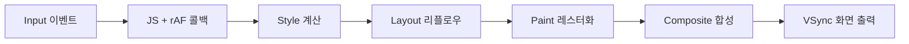
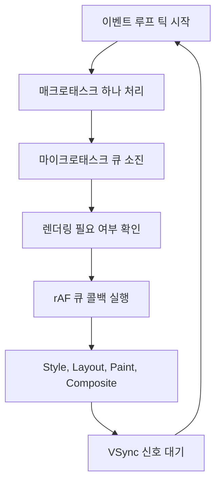

## 정의

**`requestAnimationFrame` (rAF)** 은 브라우저에게 다음 리페인트 직전에 콜백을 실행해달라고 요청합니다. 60Hz 모니터 기준 약 16.67ms 주기.

## 브라우저 렌더 파이프라인

브라우저는 한 프레임을 아래 순서로 처리합니다. rAF 콜백은 Style/Layout 계산 **직전** JavaScript 실행 단계에 위치합니다.



이 위치 덕분에 rAF 콜백에서 DOM 을 조작하면 **같은 프레임 안에서** 렌더링 결과에 반영됩니다.

> [!IMPORTANT]
> rAF 콜백 안에서 DOM 레이아웃을 **읽은 뒤 쓰기** 를 반복하면 강제 리플로우 (Forced Reflow) 가 발생합니다. 읽기를 먼저 모두 완료한 뒤 쓰기를 일괄 처리하세요.

## VSync 와 주사율

VSync (수직 동기화) 신호에 맞춰 콜백이 호출됩니다. `setTimeout(fn, 16)` 은 고주사율 이점을 살리지 못하지만 rAF 는 모니터 주사율에 자동으로 맞춰집니다.

| 주사율 | 프레임 주기 | 용도 |
|:---|:---|:---|
| 60Hz | ~16.67ms | 일반 모니터 |
| 90Hz | ~11.11ms | VR 헤드셋 |
| 120Hz | ~8.33ms | 고급 폰, 모니터 |
| 144Hz | ~6.94ms | 게이밍 모니터 |

경과 시간 기반으로 계산해야 주사율이 달라져도 같은 속도를 유지합니다.

```javascript
let prevTime = 0;

function animate(timestamp) {
    const delta = timestamp - prevTime; // ms 단위 경과
    prevTime = timestamp;

    position += speed * (delta / 1000); // px/s 단위로 계산
    el.style.transform = `translateX(${position}px)`;

    requestAnimationFrame(animate);
}

requestAnimationFrame(animate);
```

## 이벤트 루프 내 위치

`setTimeout` 콜백은 매크로태스크 큐로 들어가지만 rAF 콜백은 렌더링 단계 직전 별도 큐에서 처리됩니다.



## 왜 setTimeout 이 아닌가

- **주사율에 자동 맞춤**: 120Hz 화면에서는 8ms 주기, 절전 모드에서는 늦춰짐
- **탭 비활성 시 정지**: 백그라운드 탭에서 안 돎, CPU 절약
- **동기화**: 브라우저 렌더링 파이프라인과 정렬됨

`setTimeout(fn, 16)` 을 쓰면 렌더 사이클과 정렬이 안 되어 프레임 드랍이 생기고, 백그라운드 탭에서도 계속 실행됩니다.

## 기본 사용

```javascript
let start;

function animate(timestamp) {
    if (!start) start = timestamp;
    const elapsed = timestamp - start;

    ball.style.left = elapsed * 0.1 + 'px';

    if (elapsed < 3000) requestAnimationFrame(animate);
}

requestAnimationFrame(animate);
```

콜백에 전달되는 `timestamp` 는 `performance.now()` 와 동일한 고해상도 타임스탬프 (ms, 소수점 포함).

## 취소

```javascript
const handle = requestAnimationFrame(animate);
cancelAnimationFrame(handle);
```

컴포넌트 언마운트 시 또는 애니메이션 조건이 해제될 때 반드시 취소해야 합니다. 누락 시 메모리 누수와 불필요한 계산이 지속됩니다.

```javascript
// React 예시
useEffect(() => {
    let rafId;
    const loop = (ts) => {
        update(ts);
        rafId = requestAnimationFrame(loop);
    };
    rafId = requestAnimationFrame(loop);

    return () => cancelAnimationFrame(rafId); // cleanup 필수
}, []);
```

## 실전 예시

### Spring 애니메이션

물리 기반 스프링 효과. `delta` 기반으로 계산해 주사율 독립.

```javascript
function createSpring({ stiffness = 0.1, damping = 0.8 } = {}) {
    let pos = 0, vel = 0, target = 0;
    let rafId, prevTime = performance.now();

    const tick = (now) => {
        const dt = Math.min((now - prevTime) / 1000, 0.05);
        prevTime = now;

        vel += (target - pos) * stiffness;
        vel *= damping;
        pos += vel;
        return pos;
    };

    return {
        setTarget(t) { target = t; },
        start(onUpdate) {
            const loop = (ts) => {
                onUpdate(tick(ts));
                rafId = requestAnimationFrame(loop);
            };
            rafId = requestAnimationFrame(loop);
        },
        stop() { cancelAnimationFrame(rafId); },
    };
}
```

### 게임 루프 (fixed timestep)

물리 업데이트는 고정 시간 단위, 렌더링은 매 프레임.

```javascript
const FIXED_DT = 1000 / 60;
let accumulator = 0, lastTime = performance.now();

function gameLoop(timestamp) {
    const elapsed = Math.min(timestamp - lastTime, 100); // 스파이크 방지
    lastTime = timestamp;
    accumulator += elapsed;

    while (accumulator >= FIXED_DT) {
        updatePhysics(FIXED_DT / 1000); // 초 단위로 변환
        accumulator -= FIXED_DT;
    }

    const alpha = accumulator / FIXED_DT; // 보간 비율
    render(alpha);
    requestAnimationFrame(gameLoop);
}

requestAnimationFrame(gameLoop);
```

### 부드러운 스크롤

```javascript
function smoothScrollTo(target) {
    const start = window.scrollY;
    const dist = target - start;
    let startTime = null;
    const duration = 600;

    function step(timestamp) {
        if (!startTime) startTime = timestamp;
        const progress = Math.min((timestamp - startTime) / duration, 1);
        const ease = 1 - Math.pow(1 - progress, 3); // ease-out cubic

        window.scrollTo(0, start + dist * ease);
        if (progress < 1) requestAnimationFrame(step);
    }

    requestAnimationFrame(step);
}
```

## requestIdleCallback 비교

| API | 실행 시점 | 용도 |
|:---|:---|:---|
| `requestAnimationFrame` | 다음 리페인트 직전 | 시각적 업데이트, 애니메이션 |
| `requestIdleCallback` | 브라우저 유휴 시간 | 낮은 우선순위 백그라운드 작업 |

```javascript
// rAF: 매 프레임 시각적 업데이트
requestAnimationFrame(() => {
    el.style.opacity = '1';
});

// rIC: 여유 시간에 분석, 캐싱 등
requestIdleCallback((deadline) => {
    while (deadline.timeRemaining() > 0 && tasks.length) {
        tasks.shift()();
    }
}, { timeout: 2000 });
```

## 성능 / 함정

### 강제 리플로우 (Layout Thrashing)

```javascript
// ❌ 읽기/쓰기 교대 → 매번 Layout 재계산
elements.forEach(el => {
    const h = el.offsetHeight;        // Layout 유발
    el.style.height = h * 2 + 'px';  // 무효화, 다음 읽기에 재계산
});

// ✅ 읽기 먼저, 쓰기 나중에 일괄 처리
const heights = elements.map(el => el.offsetHeight); // 한 번만 Layout
elements.forEach((el, i) => {
    el.style.height = heights[i] * 2 + 'px';
});
```

### CSS 애니메이션 vs rAF 선택 기준

`transform`, `opacity` 만 변경하는 경우: CSS 트랜지션이 **Compositor Thread** 에서 실행되어 메인 스레드 없이 60fps 보장.

```css
.card {
    transition: transform 0.3s ease, opacity 0.3s ease;
    will-change: transform; /* GPU 레이어 미리 생성 */
}
```

rAF 는 물리 시뮬레이션, 값 보간처럼 프레임마다 동적으로 계산이 필요한 경우에 적합합니다.

### 함정 목록

- **콜백 내 무거운 연산 금지**: 16ms 초과 시 프레임 드랍
- **첫 프레임 지연**: 첫 rAF 콜백은 다음 프레임까지 대기 (수 ms)
- **탭 재활성 시 큰 delta**: 탭이 돌아올 때 시간이 크게 튀므로 `Math.min` 으로 cap 필요
- **취소 누락**: React/Vue 환경에서 cleanup 에서 `cancelAnimationFrame` 반드시 호출
- **CSS 애니메이션이 더 효율적**: 순수 `transform`/`opacity` 는 CSS 로
- **setTimeout 이 필요한 경우**: 정확한 인터벌이 필요할 때 (게임 서버 sync 등)

## 관련 위키

- [[settimeout-macrotask|setTimeout]]
- [[js-event-loop|이벤트 루프]]
- [[js-microtask-queue|Microtask Queue]]
- [[js-setinterval|setInterval]]
