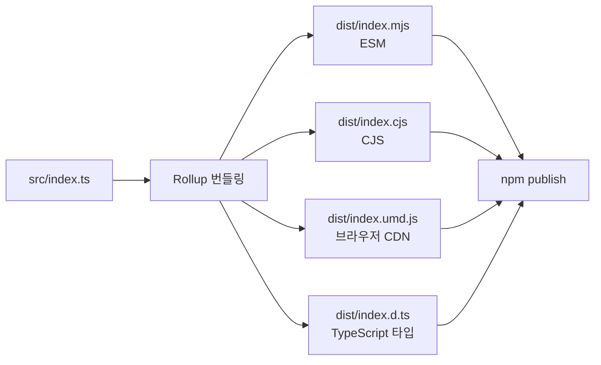

## 정의

**Rollup** 은 Rich Harris (Svelte 창시자) 가 2015년 만든 JavaScript 번들러. **라이브러리 배포** 에 특화되어 tree shaking 을 처음으로 제대로 구현했고, Vue/React/D3 등 수많은 라이브러리가 Rollup 으로 배포됩니다.

**2024+**: Rust 재구현 **Rolldown** 이 시작되어 Vite 6+ 프로덕션 백엔드로 이관 진행.

## 왜 라이브러리에 Rollup 인가

라이브러리 요구사항:
- **여러 포맷 출력**: ESM, CJS, UMD, IIFE (앱마다 다른 소비)
- **작은 결과물**: 사용자 앱에 포함되므로
- **완벽한 tree shaking**
- **깨끗한 output**: 웹팩의 runtime wrapper 없음
- **Source map 정확성**

Webpack 은 앱 특화, Rollup 은 라이브러리 특화.

## 기본 설정

```javascript
// rollup.config.js
import typescript from '@rollup/plugin-typescript';
import { nodeResolve } from '@rollup/plugin-node-resolve';
import commonjs from '@rollup/plugin-commonjs';
import terser from '@rollup/plugin-terser';

export default {
  input: 'src/index.ts',
  output: [
    {
      file: 'dist/index.mjs',
      format: 'esm',
      sourcemap: true,
    },
    {
      file: 'dist/index.cjs',
      format: 'cjs',
      sourcemap: true,
    },
    {
      file: 'dist/index.umd.js',
      format: 'umd',
      name: 'MyLib',
      globals: { react: 'React' },
    },
  ],
  external: ['react', 'react-dom'],
  plugins: [
    typescript(),
    nodeResolve(),
    commonjs(),
    terser(),
  ],
};
```

## 출력 포맷

| Format | 용도 |
|:---|:---|
| **esm** | 모던 번들러/브라우저 (import/export) |
| **cjs** | Node.js CommonJS |
| **umd** | 브라우저 script tag + AMD + CJS (범용) |
| **iife** | 브라우저 script tag (즉시 실행) |
| **amd** | RequireJS (legacy) |
| **system** | SystemJS |

라이브러리는 대개 **esm + cjs** dual, 브라우저 CDN 용 **umd** 추가.

## External

라이브러리는 dependencies 를 번들에 포함 안 함:

```javascript
external: ['react', 'react-dom', 'lodash']
```

`react` 는 앱 쪽에서 제공. 이 정보를 dependencies (or peerDependencies) 와 동기화.

## Tree Shaking

Rollup 이 **처음으로 대중화** 한 개념. ESM 정적 분석 기반:

```javascript
// utils.js
export function used() {}
export function unused() {}

// main.js
import { used } from './utils';
used();

// rollup 결과: unused() 완전 제거
```

Webpack 은 뒤늦게 지원, esbuild/Rolldown 도 지원.

**Pure annotation**: 함수 호출에 side effect 없다는 힌트

```javascript
const x = /*#__PURE__*/ computeValue();
```

`x` 미사용 시 컴파일러가 `computeValue()` 호출도 제거.

## Plugin 생태계

- `@rollup/plugin-typescript`: TS
- `@rollup/plugin-node-resolve`: `node_modules` 해석
- `@rollup/plugin-commonjs`: CJS interop
- `@rollup/plugin-json`
- `@rollup/plugin-babel`
- `@rollup/plugin-terser`: 압축
- `rollup-plugin-visualizer`: 번들 분석
- `rollup-plugin-dts`: `.d.ts` bundling

Vite 는 Rollup plugin 호환 (Vite 6 부터는 Rolldown plugin, 상당 부분 호환).

## Rolldown (2024+)

**Rollup 의 Rust 재구현**. VoidZero (Vue/Vite 팀) 주도.

- **Rollup 호환 API + plugin**
- **Rust 성능** (esbuild/Turbopack 급)
- **Vite 6+ 프로덕션 백엔드** 로 이관 예정
- **Beta 진행 중** (2025)

목표: Vite 의 개발 즉시성 + 프로덕션 빌드 속도. `rolldown-vite` 로 얼리 어답터 사용 가능.

## Rollup vs Webpack (라이브러리 관점)

| 축 | Rollup | Webpack |
|:---|:---|:---|
| **Output 크기** | 작음 (wrapper 최소) | 큼 (runtime 포함) |
| **여러 포맷** | 자연스러움 | 복잡한 설정 |
| **Tree shaking** | 최상 | 좋음 |
| **CSS 처리** | Plugin 필요 | Loader 광범위 |
| **Code splitting** | 지원 | 매우 강력 |
| **HMR** | X (Vite 가 얹음) | O |
| **SPA 개발** | Vite 로 대체 | 자체 완결 |

**결정**: 라이브러리 = Rollup / tsup, SPA = Vite / Turbopack.

## tsup (Rollup 대안)

tsup 은 esbuild 기반이지만 라이브러리 특화. Rollup 보다 훨씬 빠름:

```json
{
  "scripts": {
    "build": "tsup src/index.ts --format esm,cjs --dts --clean"
  }
}
```

- 자동 CJS/ESM dual
- `.d.ts` 자동 생성
- Zero-config

**결정**:
- 세밀한 제어 필요 → Rollup
- 표준 라이브러리 빠르게 → tsup

## 함정

> [!WARNING]
> **`external` 안 지정** 하면 모든 의존성이 번들에 들어감. 크기 폭발.

> [!CAUTION]
> **CJS 라이브러리 소비 시 interop 이슈**. `commonjs()` plugin + `esModuleInterop`.

> [!WARNING]
> **UMD 는 globals 매핑 필수**. React 라이브러리면 `globals: { react: 'React' }`.

> [!IMPORTANT]
> **`.d.ts` 자동 아님**. `rollup-plugin-dts` 나 `tsc --emitDeclarationOnly` 병행.

> [!CAUTION]
> **Rolldown 은 beta**. 프로덕션 라이브러리는 안정된 Rollup 유지, 실험용부터 Rolldown.

## 라이브러리 배포 워크플로우



## package.json exports 필드 (최신 방식)

Node.js 12+ 와 모던 번들러가 인식하는 조건부 진입점.

```json
{
  "name": "my-library",
  "main": "./dist/index.cjs",
  "module": "./dist/index.mjs",
  "types": "./dist/index.d.ts",
  "sideEffects": false,
  "exports": {
    ".": {
      "import": "./dist/index.mjs",
      "require": "./dist/index.cjs",
      "types": "./dist/index.d.ts"
    },
    "./utils": {
      "import": "./dist/utils.mjs",
      "require": "./dist/utils.cjs"
    }
  }
}
```

- `"sideEffects": false`: 번들러에게 tree-shaking 허용 신호
- `exports` 맵: 서브패스 진입점 명시
- 구버전 지원용 `main` + `module` 병행 유지

## 빌드 성능 최적화

### watch 모드

```bash
rollup -c --watch
```

파일 변경 감지 후 자동 재빌드. Vite 는 Rollup watch 위에 HMR 을 얹은 구조.

### 병렬 빌드

```javascript
// rollup.config.js: 배열로 여러 설정 동시 처리
export default [
  { input: 'src/index.ts', output: { format: 'esm', file: 'dist/index.mjs' } },
  { input: 'src/index.ts', output: { format: 'cjs', file: 'dist/index.cjs' } },
];
```

### Cache 재사용

```javascript
let cache;
const bundle = await rollup({ input: 'src/index.ts', cache });
cache = bundle.cache; // 다음 빌드에 재사용 (CI 에서 특히 효과적)
await bundle.write({ format: 'esm', file: 'dist/index.mjs' });
```

## Rolldown 마이그레이션 현황 (2025)

| 항목 | 상태 |
|:---|:---|
| **Rollup plugin 호환** | 대부분 지원, 일부 차이 있음 |
| **Vite 6.x 기본 번들러** | 점진적 전환 중 |
| **API 안정성** | Beta, breaking change 가능 |
| **성능** | Rollup 대비 10x 이상 빠름 |
| **프로덕션 추천** | 안정된 Rollup 유지 권장 |

```bash
# rolldown-vite 얼리 어답터 시도
npm install rolldown-vite
```

## 관련 위키

- [[js-bundling|JS 번들링 개요]]
- [[js-vite|Vite]]
- [[js-webpack|Webpack]]
- [[js-esbuild|esbuild]]
- [[js-turbopack-rspack|Turbopack & Rspack]]
- [[js-cjs-vs-esm|CJS vs ESM]]
- [[js-es-modules|ES Modules]]
- [[js-bun-bundler|Bun Bundler]]
