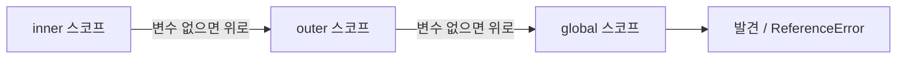

## 정의

**스코프 체인 (Scope Chain)** 은 변수 식별자를 해결할 때 따라가는 **중첩된 [[Lexical Environment]] 의 연결 구조**. 안쪽 스코프에서 찾지 못한 변수를 바깥 스코프로 차례로 검색.

## 시각화



```text
global scope
└─ outer function scope
    └─ inner function scope
        └─ block scope { let x = 1 }
```

변수 lookup 은 **inner → outer → global** 순서. 가장 가까운 스코프에서 발견하면 즉시 반환.

## 기본 예

```javascript
const a = 'global';

function outer() {
    const b = 'outer';

    function inner() {
        const c = 'inner';
        console.log(a, b, c);   // 'global outer inner'
    }
    inner();
}
outer();
```

`inner` 에서 `a` 를 찾을 때:
1. `inner` 스코프 → 없음
2. `outer` 스코프 → 없음
3. `global` 스코프 → 'global' 발견

## 정적 (Lexical) 스코프

JavaScript 는 **lexical scope**, 즉 **함수가 정의된 위치** 가 스코프를 결정. 호출 위치는 무관.

```javascript
const x = 'global';

function foo() {
    console.log(x);    // 'global' (정의 위치 기준)
}

function bar() {
    const x = 'local';
    foo();             // 'global' (호출 위치 무관)
}
bar();
```

자세히는 [[Lexical Environment]] 참고.

## 블록 스코프 (ES6)

```javascript
function foo() {
    const x = 1;
    if (true) {
        const x = 2;    // 새 블록 스코프
        console.log(x); // 2
    }
    console.log(x);     // 1
}
```

`let`/`const` 는 블록 단위, `var` 는 함수 단위.

## 클로저와의 관계

함수가 자기 정의 위치의 [[Lexical Environment]] 를 들고 다니는 것이 [[클로저]].

```javascript
function makeCounter() {
    let count = 0;
    return () => ++count;
}

const counter = makeCounter();
counter();    // 1
counter();    // 2
counter();    // 3
```

내부 화살표 함수가 `makeCounter` 의 LE 를 참조 → `count` 살아있음.

## scope chain 의 lookup 순서

```javascript
let x = 1;
function foo() {
    let x = 2;
    function bar() {
        let x = 3;
        console.log(x);     // 3 (가장 가까운 정의)
    }
    bar();
}
foo();
```

가장 가까운 스코프부터 검색, 발견하면 즉시 사용 (shadowing).

## global vs module 스코프

| 환경 | 최상위 스코프 |
|:---|:---|
| 브라우저 ES module | module 스코프 |
| 브라우저 일반 script | global 스코프 |
| Node.js CommonJS | module 스코프 |
| Node.js ES module | module 스코프 |

```javascript
// ES module
const x = 1;     // module 스코프
// window.x → undefined (global 에 attach 안 됨)
```

## IIFE 패턴

*즉시 실행 함수 표현식*. 새 스코프를 만들어 전역 오염을 방지.

```javascript
(function () {
  const privateVar = 'inside';
  // privateVar 는 이 스코프 안에만 존재
})();
// privateVar → ReferenceError (바깥 접근 불가)
```

ES Modules 이전, 전역 네임스페이스 오염 방지의 표준 패턴. 현재는 ES module 로 대체됨.

```javascript
// IIFE 로 private 상태 만들기
const counter = (function () {
  let count = 0;
  return {
    inc: () => ++count,
    get: () => count,
  };
})();
```

## TDZ (Temporal Dead Zone) 와 스코프 체인

`let`/`const` 는 선언 전에 접근하면 `ReferenceError` (TDZ).  
스코프 체인 탐색 결과 안쪽 스코프에서 선언이 있으면 바깥 값이 아니라 TDZ 에 걸린다.

```javascript
let x = 1;
function foo() {
    console.log(x);   // ReferenceError (TDZ, 바깥 x 무시)
    let x = 2;
}
foo();
```

> 안쪽 `let x` 가 호이스팅으로 foo 스코프 상단으로 끌어올려지고, 초기화 전 접근 → TDZ.  
> 바깥 `x = 1` 을 *가려버리고* (shadow) TDZ 에 진입.

## 스코프 체인 vs 프로토타입 체인

| | 스코프 체인 | 프로토타입 체인 |
|:---|:---|:---|
| 탐색 대상 | 변수 / 식별자 | 객체의 프로퍼티 |
| 방향 | 정의 위치 기반 (정적) | 객체의 `__proto__` 링크 (동적) |
| 언어 메커니즘 | Lexical Environment | 객체 상속 |
| 끝 | global scope → undefined | `Object.prototype` → null |

```javascript
// 프로토타입 체인 예
const parent = { greet() { return 'hello'; } };
const child = Object.create(parent);
child.greet(); // 'hello' (child 에 없어서 parent 에서 찾음)
```

## with 와 eval (피해야 할 것들)

```javascript
with (obj) { ... }    // 스코프 체인에 동적으로 obj 삽입
eval('var x = 1;')    // 호출 스코프에 변수 삽입 (strict 모드 외)
```

둘 다 스코프 체인을 예측 불가능하게 만들어 최적화 방해. **사용 금지**.

## 함정

### 1. 변수 호이스팅 + 스코프

```javascript
let x = 1;
function foo() {
    console.log(x);   // ReferenceError (x 의 호이스팅된 TDZ)
    let x = 2;
}
foo();
```

안쪽 `let x` 가 호이스팅되어 바깥 `x` 를 가림.

### 2. 클로저의 성능

모든 함수가 자기 LE 를 참조. 너무 많은 변수를 closure 로 가두면 메모리 압박. 진짜 불필요한 변수는 외부로.

### 3. global 오염

```javascript
// 실수로 var 빼먹기 (sloppy 모드)
function foo() {
    x = 1;   // var/let/const 없이 → global 에 추가됨!
}
```

strict 모드에서는 ReferenceError. 항상 `'use strict'` 또는 ES module 사용.

### 4. 동적 스코프와 혼동

JavaScript 는 **동적 스코프가 아님**. `this` 는 동적으로 결정되지만, 변수 참조는 정적 (lexical).

```javascript
function f() {
  console.log(msg); // 정의 위치 기준 탐색
}
// f 를 어디서 호출하든 msg 참조 위치는 f 정의 당시 스코프
```

## 참고

- [[Lexical Environment]]
- [[클로저]]
- [[JS var / let / const]]
- [[JS 호이스팅]]
- [[js-prototype-chain]]
