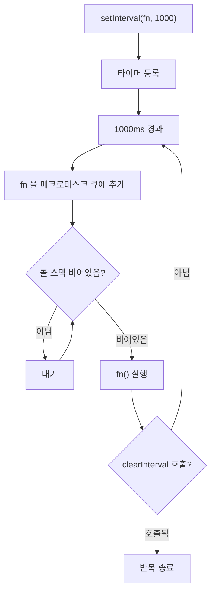

## 정의

**`setInterval(callback, delay, ...args)`** 은 호스트 환경이 제공하는 반복 타이머 API. 매 `delay` 밀리초마다 `callback` 을 매크로태스크 큐에 등록한다.

전체 메커니즘은 [[이벤트 루프]] 와 [[비동기와 타이밍, 콜백부터 async/await까지의 발전사]] 참고.

## 사용 상황

| 상황 | setInterval | 대안 |
|:---|:---:|:---|
| 고정 간격 UI 업데이트 (시계 등) | ✅ | - |
| WebSocket heartbeat / keep-alive | ✅ | - |
| 애니메이션 프레임 갱신 | ❌ | [[requestAnimationFrame]] |
| 비동기 작업 반복 (fetch polling) | 주의 | setTimeout 재호출 패턴 |
| 단발 지연 실행 | ❌ | [[setTimeout]] |

## 이벤트 루프 내 동작



`delay` 는 **최소** 간격. 콜 스택이 바쁘면 큐에서 대기하고 지연 실행된다.

## 문법

```javascript
const id = setInterval(callback, delay, arg1, arg2, ...);
clearInterval(id); // 중지
```

| 인자 | 의미 |
|:---|:---|
| `callback` | 매 주기마다 호출될 함수 |
| `delay` | **최소** 반복 간격 (밀리초). 기본 0 (브라우저는 보통 4~10ms 로 강제) |
| `arg1, arg2, ...` | `callback` 에 전달할 추가 인자 |

`clearInterval(id)` 로 중지.

## 기본 사용

```javascript
let count = 0;
const id = setInterval(() => {
  console.log(`tick ${++count}`);
  if (count === 3) clearInterval(id);
}, 1000);
// 1초마다 tick 1, tick 2, tick 3 출력 후 중지
```

## 핵심 함정

### 1. 콜백 실행 시간이 interval 보다 길어지면 큐가 쌓인다

가장 흔한 버그.

```javascript
setInterval(() => {
  // 1.5초 걸리는 작업
  const start = Date.now();
  while (Date.now() - start < 1500) {}
  console.log('done');
}, 1000);
// 1초마다 큐에 등록되는데 한 번 실행에 1.5초
// 큐가 무한히 쌓이거나, 브라우저가 자동으로 누락
```

> [!CAUTION]
> 비동기 작업 (예: `setInterval(async () => await fetch(...), 1000)`) 도 같은 문제. 응답이 1초보다 늦으면 요청이 중첩된다.

### 2. 정확한 주기가 보장되지 않는다

`setTimeout` 과 마찬가지로 **최소** 간격. 콜 스택이 비지 않으면 늦게 실행되고, 늦은 만큼 다음 호출이 당겨지지 않는다 (만회하지 않음).

### 3. 백그라운드 탭에서 throttle

브라우저는 백그라운드 탭의 setInterval 을 1Hz 로 강제 (Chrome, Firefox). 시계 같은 UI 는 다른 방법 필요.

### 4. React useEffect 에서 cleanup 누락

```javascript
// 잘못된 예: interval 이 누적됨
useEffect(() => {
  setInterval(() => setCount(c => c + 1), 1000);
}, []);

// 올바른 예
useEffect(() => {
  const id = setInterval(() => setCount(c => c + 1), 1000);
  return () => clearInterval(id);  // cleanup
}, []);
```

> [!WARNING]
> React 의 `StrictMode` 는 개발 환경에서 Effect 를 두 번 실행한다. cleanup 이 없으면 interval 이 두 개 등록된다.

### 5. this 바인딩 문제

```javascript
class Timer {
  constructor() {
    this.count = 0;
  }

  start() {
    // 잘못: this 가 undefined (strict) 또는 window
    setInterval(function() {
      console.log(this.count);
    }, 1000);

    // 올바름: arrow function 은 외부 this 캡처
    setInterval(() => {
      console.log(this.count);
    }, 1000);
  }
}
```

## 더 안전한 대안, setTimeout 재호출

콜백 실행이 끝난 뒤 다음 호출을 예약하면 적체가 없다.

```javascript
function poll() {
  doWork();
  setTimeout(poll, 1000); // 작업 끝난 뒤 1초
}
poll();
```

또는 `async/await` 와 함께:

```javascript
async function poll() {
  while (true) {
    await doWork();
    await new Promise(r => setTimeout(r, 1000));
  }
}
poll();
```

> [!TIP]
> 실무에서 `setInterval` 보다 **`setTimeout` 재호출 패턴이 안전**. 비동기 작업이나 가변 길이 작업을 반복할 때 특히.

## requestAnimationFrame 과의 비교 (애니메이션)

화면을 매 프레임마다 갱신해야 한다면 `setInterval` 대신 [[requestAnimationFrame]] 사용.

| 항목 | `setInterval(fn, 16)` | `requestAnimationFrame(fn)` |
|:---|:---|:---|
| 호출 시점 | 16ms 마다 (큐가 비어있을 때) | 다음 paint 직전 |
| 백그라운드 탭 | 1Hz 로 throttle | 호출 안 됨 (배터리 절약) |
| 모니터 주사율 | 무시 | 적응 (60Hz, 120Hz 등) |
| 프레임 누락 | 자주 | 드묾 |

## clearInterval

```javascript
const id = setInterval(tick, 1000);
clearInterval(id);
// 다음 tick 부터 실행 안 됨
```

이미 큐에 들어간 콜백은 취소되지 않는다.

## Node.js 에서의 차이

Node.js 에서는 브라우저보다 delay 가 정확하고 최소값 강제가 없다. 그러나 블로킹 코드가 있으면 마찬가지로 delay 가 발생한다.

```javascript
// Node.js 전용: setInterval 반환값이 Timeout 객체
const timer = setInterval(fn, 1000);
timer.unref();   // 이 타이머만 남았을 때 프로세스 종료 허용
timer.ref();     // 다시 프로세스 유지
```

## 자주 쓰이는 패턴

### 타이머 / 카운트다운

```javascript
function countdown(seconds, onTick, onDone) {
  let remaining = seconds;
  const id = setInterval(() => {
    onTick(remaining);
    if (--remaining < 0) {
      clearInterval(id);
      onDone();
    }
  }, 1000);
  return id;
}
```

### Heartbeat / Keep-alive

WebSocket 같은 연결에서 ping 전송.

```javascript
const id = setInterval(() => {
  if (ws.readyState === WebSocket.OPEN) ws.send('ping');
}, 30000);
```

### AbortController 연계 (취소 가능 폴링)

```javascript
function startPolling(url, interval, signal) {
  const id = setInterval(async () => {
    if (signal.aborted) {
      clearInterval(id);
      return;
    }
    const res = await fetch(url, { signal });
    console.log(await res.json());
  }, interval);

  signal.addEventListener('abort', () => clearInterval(id));
  return id;
}

const controller = new AbortController();
startPolling('/api/status', 5000, controller.signal);
// 취소
controller.abort();
```

## 관련 위키

- [[setTimeout]]
- [[이벤트 루프]]
- [[requestAnimationFrame]]
- [[js-microtask-queue|마이크로태스크 큐]]
- [[js-abort-controller|AbortController]]
- [[비동기와 타이밍, 콜백부터 async/await까지의 발전사]]
