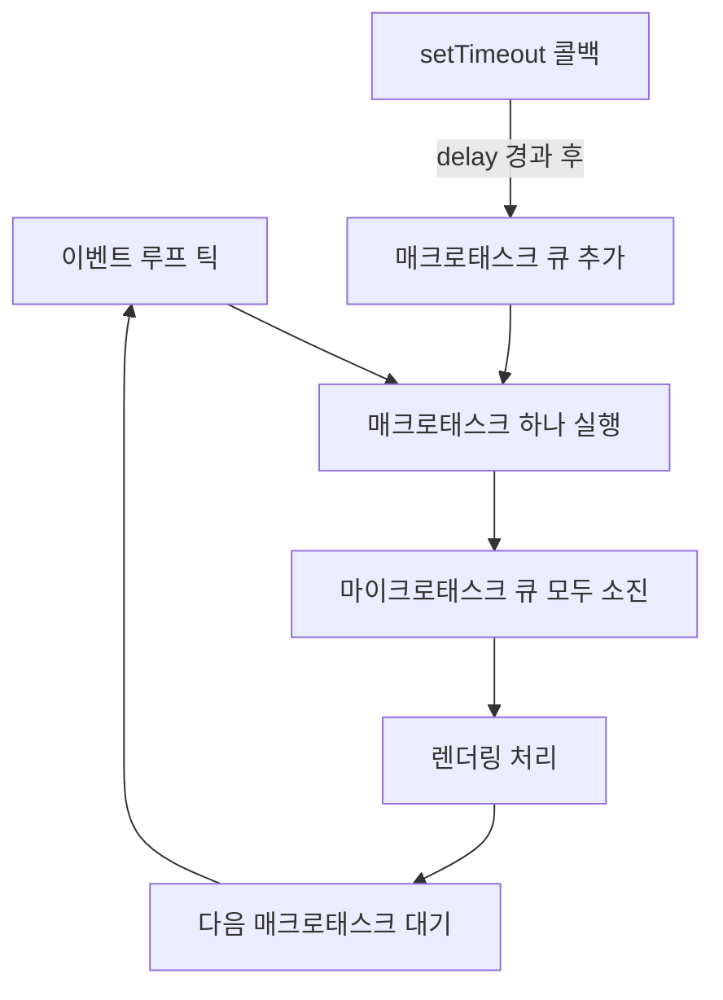
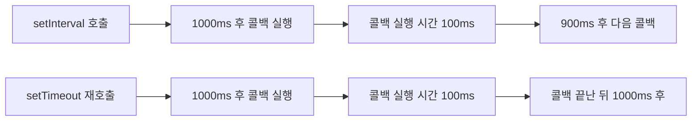

## 정의

**`setTimeout(callback, delay, ...args)`** 은 호스트 환경 (브라우저 또는 Node.js) 이 제공하는 타이머 API. 지정한 `delay` 밀리초가 지난 뒤 `callback` 을 [[이벤트 루프]] 의 매크로태스크 큐에 등록한다.

자세한 흐름과 함정은 [[비동기와 타이밍, 콜백부터 async/await까지의 발전사]] 글 참고.

## 이벤트 루프 내 위치

`setTimeout` 콜백은 매크로태스크 큐로 들어갑니다. 마이크로태스크보다 우선순위가 낮습니다.



```javascript
console.log('1');
setTimeout(() => console.log('2'), 0);
Promise.resolve().then(() => console.log('3'));
console.log('4');
// 출력 순서: 1, 4, 3, 2
// 이유: 동기 → 마이크로태스크 → 매크로태스크
```

## 문법

```javascript
const id = setTimeout(callback, delay, arg1, arg2, ...);
clearTimeout(id); // 취소
```

| 인자 | 의미 |
|:---|:---|
| `callback` | 시간이 지나면 호출될 함수 |
| `delay` | **최소** 지연 시간 (밀리초). 기본 0 |
| `arg1, arg2, ...` | `callback` 에 전달할 추가 인자 |

반환값은 **타이머 ID** (브라우저는 정수, Node.js 는 객체). `clearTimeout(id)` 로 취소.

## 기본 사용

```javascript
console.log('A');
setTimeout(() => {
  console.log('B');
}, 1000);
console.log('C');
// 출력: A, C, (1초 뒤) B
```

`setTimeout` 호출은 즉시 반환되고 다음 줄로 진행한다. 콜백은 1초 후 큐에 등록되고, 콜 스택이 비어있을 때 실행된다.

## 핵심 함정

### "최소" 지연이라는 의미

`delay` 는 정확한 시각이 아니라 **최소** 시간. 콜 스택이 무거우면 더 늦게 실행된다.

```javascript
setTimeout(() => console.log('B'), 100);

const start = Date.now();
while (Date.now() - start < 500) {} // 0.5초 동안 콜 스택 점유

// → 100ms 가 지났어도 콜 스택이 비어야 B 가 실행된다 (>=500ms)
```

### setTimeout(fn, 0) 은 즉시가 아니다

`0` 을 줘도 **즉시 실행되지 않는다.** 동기 코드와 마이크로태스크 큐가 먼저 비워진 뒤에야 실행된다.

```javascript
console.log('1');
setTimeout(() => console.log('2'), 0);
Promise.resolve().then(() => console.log('3'));
console.log('4');
// 출력: 1, 4, 3, 2
```

이유: setTimeout 콜백은 [[이벤트 루프]] 의 매크로태스크 큐로, Promise.then 콜백은 [[Microtask Queue]] 로 들어간다. 마이크로 큐가 먼저 비워진다.

### 4ms 최소 지연 (중첩 5회 이상)

HTML 명세 ([§8.1.7.4](https://html.spec.whatwg.org/multipage/timers-and-user-prompts.html#timers)) 는 **중첩 5회 이상** 의 `setTimeout` 에 대해 **최소 4ms** 지연을 강제한다. 모든 주류 브라우저가 따른다.

```javascript
setTimeout(() => {
  setTimeout(() => {
    setTimeout(() => {
      setTimeout(() => {
        setTimeout(() => {
          // 이 콜백부터 최소 4ms 지연이 자동으로 깔린다
        }, 0);
      }, 0);
    }, 0);
  }, 0);
}, 0);
```

브라우저 탭이 백그라운드면 보통 최소 1초로 throttle.

## 드리프트와 setInterval 비교



`setInterval` 은 콜백 실행 시간에 관계없이 고정 인터벌로 큐에 추가합니다. 콜백이 인터벌보다 오래 걸리면 드리프트가 발생합니다.

```javascript
// setInterval 드리프트 발생
setInterval(() => {
    doHeavyWork(); // 인터벌보다 오래 걸리면 큐가 쌓임
}, 1000);

// setTimeout 재호출: 드리프트 없음
function poll() {
    doHeavyWork();
    setTimeout(poll, 1000); // 작업 끝난 뒤 다음 호출 예약
}
poll();
```

> [!WARNING]
> `setInterval` 콜백이 인터벌보다 오래 걸리면 콜백이 큐에 누적됩니다. 긴 작업에는 `setTimeout` 재귀 호출이 안전합니다.

## requestAnimationFrame 과 비교

| 특성 | `setTimeout` | `requestAnimationFrame` |
|:---|:---|:---|
| 실행 시점 | 매크로태스크 큐 | 렌더 직전 |
| 주사율 맞춤 | 없음 | 자동 |
| 탭 비활성 시 | 계속 실행 (throttle 됨) | 정지 |
| 용도 | 타이머, 지연 실행 | 애니메이션 |

```javascript
// 애니메이션에 setTimeout 쓰면 안 되는 이유
let pos = 0;
setInterval(() => {
    pos += 5;
    el.style.left = pos + 'px';
}, 16); // 렌더와 동기화 안 됨 → 티어링

// rAF 로 렌더와 동기화
function animate(ts) {
    pos += 5;
    el.style.left = pos + 'px';
    requestAnimationFrame(animate);
}
requestAnimationFrame(animate);
```

## 자주 쓰이는 패턴

### 1. UI 양보 (yielding)

무거운 동기 작업을 잘게 쪼개 렌더링과 사용자 입력에 양보.

```javascript
function processInChunks(items, processor) {
  let i = 0;
  function next() {
    const start = Date.now();
    while (i < items.length && Date.now() - start < 50) {
      processor(items[i++]);
    }
    if (i < items.length) {
      setTimeout(next, 0); // 50ms 마다 양보
    }
  }
  next();
}
```

### 2. 디바운스

마지막 호출 후 일정 시간이 지나야 실행.

```javascript
function debounce(fn, ms) {
  let id;
  return (...args) => {
    clearTimeout(id);
    id = setTimeout(() => fn(...args), ms);
  };
}

const onResize = debounce(() => render(), 200);
window.addEventListener('resize', onResize);
```

### 3. 폴링 (Polling)

`setInterval` 대신 `setTimeout` 재호출로 큐 적체 방지.

```javascript
function poll() {
  doWork();
  setTimeout(poll, 1000); // 작업 끝난 뒤 다음 호출 예약
}
poll();
```

### 4. Node.js 의 Promise 기반 setTimeout

Node 16+ 부터 `node:timers/promises` 모듈로 `await` 가능.

```javascript
import { setTimeout } from 'node:timers/promises';

await setTimeout(1000);
console.log('1초 뒤');

// AbortController 로 취소 가능
const controller = new AbortController();
setTimeout(5000, undefined, { signal: controller.signal });
```

### 5. 쓰로틀 (Throttle)

지정한 시간 동안 최대 한 번만 실행.

```javascript
function throttle(fn, ms) {
    let pending = false;
    return (...args) => {
        if (pending) return;
        pending = true;
        fn(...args);
        setTimeout(() => { pending = false; }, ms);
    };
}

const onScroll = throttle(() => updateHeader(), 100);
window.addEventListener('scroll', onScroll);
```

## clearTimeout

타이머가 만료되기 전에 취소.

```javascript
const id = setTimeout(() => console.log('실행 안 됨'), 1000);
clearTimeout(id);
// → 콜백이 큐에 들어가지 않는다
```

이미 큐에 들어간 콜백은 취소되지 않는다 (브라우저 구현에 따라 다름).

## 성능 주의사항

```javascript
// ❌ 클로저로 인한 메모리 누수
function leaky() {
    const bigData = new Array(1e6).fill('x');
    setTimeout(() => {
        console.log(bigData.length); // bigData 가 1초간 살아있음
    }, 1000);
}

// ✅ 필요한 값만 추출
function clean() {
    const bigData = new Array(1e6).fill('x');
    const len = bigData.length;
    setTimeout(() => console.log(len), 1000); // bigData 가비지 컬렉션 가능
}
```

## 참고

- [[setInterval]]
- [[이벤트 루프]]
- [[Microtask Queue]]
- [[js-request-animation-frame|requestAnimationFrame]]
- [[비동기와 타이밍, 콜백부터 async/await까지의 발전사]]
