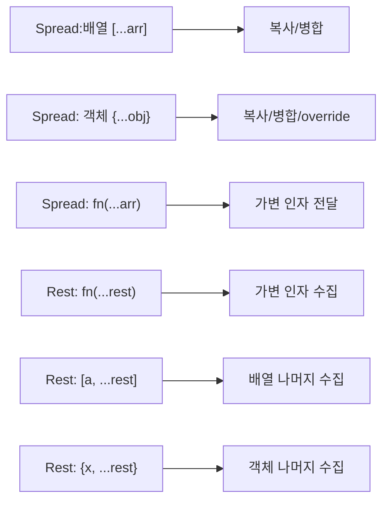

## 정의

같은 문법 `...` 가 두 가지 의미.

- **Spread** : iterable 을 펼침 (right-hand)
- **Rest** : 나머지를 모음 (left-hand 또는 함수 매개변수)

## Spread (펼침)

### 배열

```javascript
const a = [1, 2];
const b = [...a, 3, 4];        // [1, 2, 3, 4]
const c = [0, ...a, ...a];     // [0, 1, 2, 1, 2]
const copy = [...a];            // 얕은 복사

// 함수 인자
Math.max(...[1, 2, 3]);         // 3
console.log(...['a', 'b']);     // a b

// string 도 iterable
[...'abc']                       // ['a', 'b', 'c']
```

### 객체 (ES2018+)

```javascript
const a = { x: 1, y: 2 };
const b = { ...a, z: 3 };       // { x: 1, y: 2, z: 3 }
const copy = { ...a };           // 얕은 복사

// 병합 + override
const merged = { ...defaults, ...userInput };
// userInput 이 defaults 를 덮어씀
```

## Rest (모음)

### 함수 매개변수

```javascript
function sum(...nums) {
    return nums.reduce((a, b) => a + b, 0);
}
sum(1, 2, 3, 4);            // 10

// 일부 인자 + rest
function logger(level, ...messages) {
    console.log(`[${level}]`, messages.join(' '));
}
logger('INFO', 'a', 'b', 'c');
```

### 배열 destructuring

```javascript
const [first, ...others] = [1, 2, 3, 4];
// first = 1, others = [2, 3, 4]

const [a, b, ...rest] = arr;
```

### 객체 destructuring

```javascript
const { name, ...rest } = user;
// name = user.name, rest = 나머지 모든 속성
```

## arguments vs rest

```javascript
// 옛 스타일
function foo() {
    console.log(arguments);    // 유사 배열 (array-like)
    Array.from(arguments).map(...);   // 변환 필요
}

// 모던
function foo(...args) {
    console.log(args);          // 진짜 배열
    args.map(...);              // 바로 메서드
}
```

`arguments` 는 화살표 함수에서 안 됨, rest 는 됨.

## 자주 쓰는 패턴

### 배열 복사

```javascript
const original = [1, 2, 3];
const copy = [...original];     // 얕은 복사
// 또는: Array.from(original), original.slice()
```

### 객체 복사

```javascript
const copy = { ...original };   // 얕은 복사
// 깊은 복사는 structuredClone(original)
```

### 객체 병합

```javascript
const config = { ...defaults, ...userOptions };
```

### 객체에서 특정 키 제외

```javascript
const { password, ...safe } = user;     // safe 는 password 없는 user
```

### 배열 끝/처음 추가

```javascript
const newArr = [...arr, newItem];        // 끝
const newArr2 = [newItem, ...arr];       // 처음
```

immutable 갱신.

### Math 함수 + 배열

```javascript
const max = Math.max(...arr);
const min = Math.min(...arr);
```

## 함정

### 1. 얕은 복사

```javascript
const a = [{ x: 1 }];
const b = [...a];
b[0].x = 99;
a[0].x      // 99 (참조 공유)
```

깊은 복사는 `structuredClone(obj)` (ES2022+) 또는 `JSON.parse(JSON.stringify(obj))` (제한적).

### 2. 객체 spread 의 순서

```javascript
const a = { x: 1 };
const b = { x: 99, ...a };       // { x: 1 }  (뒤가 우선)
const c = { ...a, x: 99 };       // { x: 99 } (뒤가 우선)
```

같은 키는 **뒤에 오는 값이 우선**.

### 3. iterable 만 spread

```javascript
[...{ a: 1 }]      // ❌ TypeError (객체는 iterable 아님)
{ ...[1, 2, 3] }   // { 0: 1, 1: 2, 2: 3 } (배열을 객체로)
```

### 4. rest 의 위치

```javascript
function foo(...args, last) {}    // ❌ SyntaxError (rest 는 마지막)
function foo(first, ...rest) {}    // ✓
```

### 5. Symbol.iterator 가 없으면

```javascript
const obj = { length: 3 };
[...obj]    // ❌ TypeError
```

`Symbol.iterator` 가 있는 객체만 array spread 가능.

## Object.assign 과의 비교

```javascript
const a = { x: 1, y: 2 };
const b = { z: 3 };

// Object.assign: target 을 직접 변경
Object.assign(a, b);              // a = { x: 1, y: 2, z: 3 }  (a 변경됨)
const m1 = Object.assign({}, a, b);  // 새 객체

// Spread: 항상 새 객체
const m2 = { ...a, ...b };       // a 변경 안 됨
```

주요 차이:

| 특성 | `Object.assign` | Spread `{...}` |
|:---|:---|:---|
| target 변경 | 첫 인자 변경 | 항상 새 객체 |
| getter 처리 | getter 호출 후 값 복사 | 동일 |
| prototype | 복사 안 함 | 복사 안 함 |
| 성능 | 유사 | 유사 |
| 가독성 | 낮음 | 높음 |

React / Redux 에서는 immutable 갱신 때문에 spread 가 표준.

## Array.concat 과의 비교

```javascript
const a = [1, 2];
const b = [3, 4];

// concat
const c1 = a.concat(b);           // [1, 2, 3, 4]
const c2 = a.concat(5, 6);        // [1, 2, 5, 6]

// Spread (더 유연, 중간 삽입 가능)
const c3 = [...a, ...b];           // [1, 2, 3, 4]
const c4 = [0, ...a, 99, ...b];    // [0, 1, 2, 99, 3, 4]
```

## TypeScript 와의 타입 추론

```typescript
const a = { x: 1, y: 2 } as const;
const b = { z: 3 };
const merged = { ...a, ...b };
// type: { readonly x: 1; readonly y: 2; z: number }

// 가변 인자 rest 타입
function sum(...nums: number[]): number {
    return nums.reduce((acc, n) => acc + n, 0);
}

// 튜플 rest
function head<T>([first, ..._rest]: T[]): T {
    return first;
}

// 객체 rest 로 타입 제외
function withoutId<T extends { id: unknown }>({ id: _id, ...rest }: T) {
    return rest;
}
```

## 사용 맥락 시각화



## 성능

- **Spread 복사** = 얕은 복사, O(n). 중첩 객체는 참조만 복사.
- **대용량 배열 spread** 를 함수 인자로 넘길 때 배열 원소 수십만 개면 콜 스택 초과 가능.

```javascript
const arr = new Array(200_000).fill(1);

// 위험
Math.max(...arr);    // RangeError 가능

// 안전
arr.reduce((a, b) => Math.max(a, b), -Infinity);
```

- **객체 spread** = `Object.assign({}, ...)` 과 성능 거의 동일.
- **Immutable 갱신 패턴** 을 반복적으로 중첩하면 GC 압박. 깊은 중첩은 `immer` 검토.

## 참고

- [[JS Destructuring]]
- [[JS Array]]
- [[JS Object]]
- [[JS 타입 변환]]
- [[JS Map / Set]]
