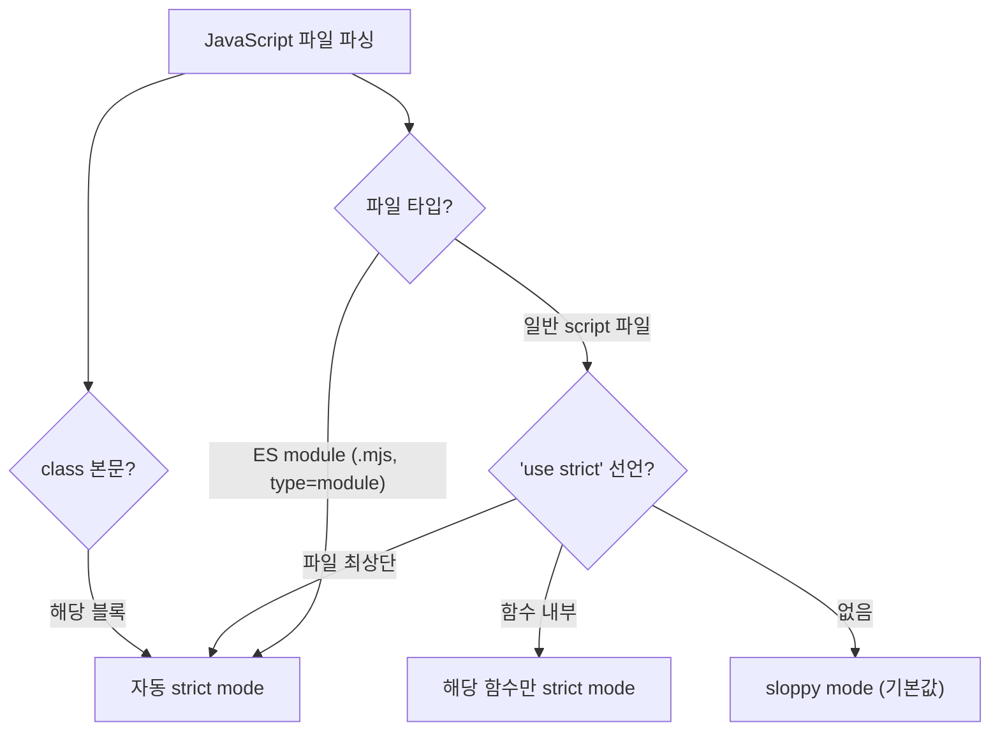
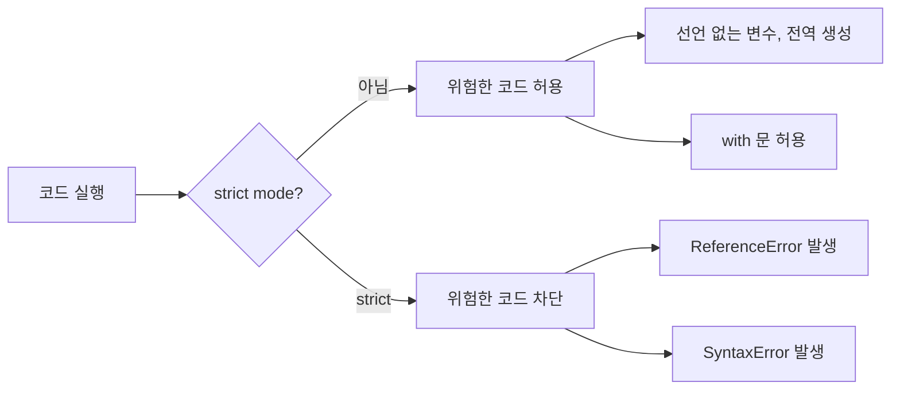

## 정의

**`'use strict'`** 디렉티브로 활성화되는 엄격 실행 모드. ES5 도입. 위험한 문법을 에러로 만들어 코드 안전성 향상.

ES module 과 `class` 본문은 **자동으로 strict mode**.

## 사용 상황

| 상황 | strict 관련 |
|:---|:---|
| ES module (Vite, webpack, bundler) | 자동 strict |
| `class` 내부 | 자동 strict |
| Node.js `.mjs` 파일 | 자동 strict |
| 레거시 `<script>` 태그 | 명시적 `'use strict'` 필요 |
| 라이브러리 배포 코드 | 반드시 strict |

현대 개발 환경에서는 번들러가 ES module 을 사용하므로 별도 선언 없이도 strict mode 가 적용된다.

## strict mode 활성화 흐름



## 사용

```javascript
// 파일 최상단
'use strict';

// 또는 함수 내부
function foo() {
    'use strict';
    // ...
}
```

## strict mode 의 효과

### 1. 선언 안 한 변수에 할당 시 ReferenceError

```javascript
// sloppy
function foo() {
    x = 1;     // 실수로 var 빼먹음 → global 변수 생성!
}

// strict
function foo() {
    'use strict';
    x = 1;     // ❌ ReferenceError
}
```

global 오염 방지.

### 2. 중복 매개변수 금지

```javascript
function foo(a, a) { }      // sloppy 에서는 동작
// 'use strict'; → SyntaxError
```

### 3. 8 진수 리터럴 금지

```javascript
const x = 010;          // sloppy: 8 (8진수 8)
'use strict';
const x = 010;          // ❌ SyntaxError
const y = 0o10;         // ES6 표준 8진수 표기
```

### 4. delete 의 제한

```javascript
'use strict';
delete Object.prototype;     // ❌ TypeError (변경 불가)

var x = 1;
delete x;                     // ❌ SyntaxError (변수 삭제 불가)
```

### 5. this 의 변화

```javascript
function foo() {
    console.log(this);
}

foo();                  // sloppy: window/global
'use strict';
foo();                  // strict: undefined
```

명시적으로 `this` 를 지정하지 않은 호출에서 더 안전.

### 6. with 금지

```javascript
'use strict';
with (obj) { }     // ❌ SyntaxError
```

### 7. arguments 의 immutable

```javascript
function foo(a) {
    'use strict';
    a = 99;
    console.log(arguments[0]);    // 호출 시 전달된 원본 값
}
```

sloppy 모드에서는 `a` 변경이 `arguments[0]` 에 반영. strict 는 분리.

### 8. eval 의 격리

```javascript
'use strict';
eval('var x = 1;');
console.log(x);     // ❌ ReferenceError (eval 내부 스코프)
```

sloppy 모드에서는 eval 안의 변수가 호출 스코프에 누설.

### 9. 미래 예약어 보호

`implements`, `interface`, `let`, `package`, `private`, `protected`, `public`, `static`, `yield` 가 식별자 금지.

## 전체 제한 목록

| 제한 | sloppy | strict |
|:---|:---:|:---:|
| 선언 없는 변수 할당 | 전역 생성 | ReferenceError |
| 중복 파라미터 | 허용 | SyntaxError |
| 8진수 리터럴 `0NNN` | 허용 | SyntaxError |
| `with` 문 | 허용 | SyntaxError |
| `delete` 변수/함수 | 무시 | SyntaxError |
| `delete` non-configurable | 무시 | TypeError |
| `this` (일반 함수 호출) | window/global | undefined |
| `arguments` 와 파라미터 동기화 | 동기화 됨 | 분리 |
| `eval` 변수 누설 | 누설 됨 | 격리 |
| 미래 예약어 사용 | 허용 | SyntaxError |

## 언제 자동으로 strict 인가



- **ES module** (.mjs, `<script type="module">`, modern build tools)
- **`class` 본문**
- **`export` / `import` 사용 파일**

따라서 현대 코드는 보통 자연스럽게 strict.

## TypeScript 와의 관계

TypeScript 는 항상 strict mode 로 컴파일된다. TS 에서 `'use strict'` 를 명시적으로 쓸 필요 없다.

`tsconfig.json` 의 `"strict": true` 는 TypeScript 타입 엄격 모드로, JS `'use strict'` 와는 별개 개념이지만 함께 동작한다.

## 레거시 코드 마이그레이션 전략

```javascript
// 1단계: 파일 단위로 strict 추가 후 에러 수집
'use strict';
// ... 기존 코드 ...

// 2단계: ReferenceError, TypeError, SyntaxError 목록 확인
// - 미선언 변수 → var/let/const 추가
// - delete 오용 → 로직 수정
// - with 문 → 객체 구조 분해로 교체

// 3단계: 테스트 통과 확인 후 진행
```

> [!IMPORTANT]
> 레거시 스크립트 파일 전체에 한 번에 `'use strict'` 를 추가하면 예상치 못한 에러가 발생할 수 있다. 파일 단위로 점진적으로 적용하고, 테스트를 충분히 작성한 후 진행.

## 모범 사례

1. **항상 `'use strict'`** (또는 ES module 사용)
2. 함수 단위 strict 는 옛 스타일, 파일 단위 권장
3. 라이브러리 코드는 반드시 strict
4. ESLint `'strict': 'error'` 규칙으로 강제

## 호환성

모든 브라우저 + Node.js 가 지원. legacy IE5 같은 환경 외에는 문제 없음.

## sloppy mode 의 함정 (왜 strict 가 필요한가)

```javascript
// 1. global 오염
foo = 1;
function setup() {
    foo = 99;     // 의도와 다르게 global foo 변경
}

// 2. NaN 비교
NaN === NaN;     // false (이건 strict 무관)

// 3. with 의 스코프 폭주
with (obj) {
    a = 1;        // obj.a 인지 외부 a 인지 모호
}
```

strict 가 이런 함정의 상당수를 컴파일 / 런타임 에러로 잡아준다.

## Node.js 에서의 strict mode

Node.js 의 `.mjs` 파일과 `type: "module"` 을 설정한 `.js` 파일은 자동 strict. CommonJS (`.cjs` 또는 기본 `.js`) 는 명시적으로 선언 필요.

```javascript
// CommonJS: 명시 필요
'use strict';
const x = 1;

// ES module (.mjs 또는 package.json type: module): 자동 strict
export const x = 1;
```

Node.js 18+ 에서는 최상위 `await` 를 위해서도 ES module 이 필요하고, 이때 strict 도 함께 자동 적용된다.

## 관련 위키

- [[JS var / let / const]]
- [[JS 호이스팅]]
- [[JS 스코프 체인]]
- [[js-this-binding|this 바인딩]]
- [[js-es-modules|ES Modules]]
