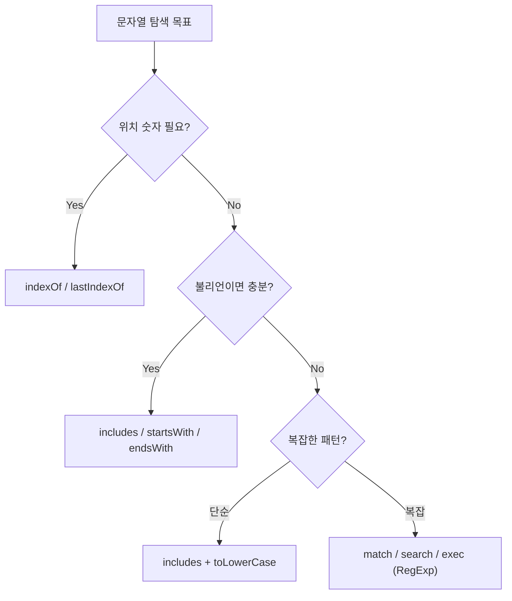

## 정의

JavaScript 문자열은 **불변 (immutable) UTF-16 시퀀스**. 메서드는 항상 새 문자열을 반환하며, 원본을 수정하지 않는다. 문자열에서 원하는 위치/패턴을 찾거나, 교체하거나, 추출하는 작업이 프론트엔드와 백엔드 모두에서 빈번하다.

## 언제 쓰나

| 상황 | 권장 도구 |
|:---|:---|
| 단순 포함 여부 | `includes` / `startsWith` / `endsWith` |
| 위치 숫자 반환 | `indexOf` / `lastIndexOf` |
| 복잡한 패턴 매칭 | 정규식 (RegExp) |
| 교체 | `replace` / `replaceAll` |
| 분리 | `split` |
| 추출 | `slice` / `at` |

## 탐색 메서드 분류



## 기본 탐색 메서드

### includes / startsWith / endsWith

ES2015+. 존재 여부만 알면 될 때 가장 의도가 명확하다.

```js
const s = 'Hello, World!';

s.includes('World');          // true
s.includes('world');          // false (대소문자 구분)
s.startsWith('Hello');        // true
s.startsWith('World', 7);     // true (7번 인덱스부터 검사)
s.endsWith('!');              // true
s.endsWith('World', 12);      // true (처음 12자 안에서)
```

### indexOf / lastIndexOf

위치(숫자)가 필요하거나, 같은 패턴이 여러 개 있을 때.

```js
const s = 'abcabc';

s.indexOf('b');               // 1
s.lastIndexOf('b');           // 4
s.indexOf('b', 2);            // 4 (인덱스 2 이후 탐색)
s.indexOf('z');               // -1 (없으면 -1)

// 존재 여부 확인 (includes 가 더 가독성 높음)
s.indexOf('a') !== -1;        // true (구식)
s.includes('a');              // true (ES2015, 권장)
```

## 추출 메서드

```js
const s = 'Hello, World!';

s.slice(7, 12);               // 'World'
s.slice(-6);                  // 'orld!'   (음수: 끝에서부터)
s.slice(-6, -1);              // 'orld'
s.substring(7, 12);           // 'World'   (음수 지원 안 함, 0으로 처리)
s.at(0);                      // 'H'
s.at(-1);                     // '!'       (ES2022, 음수 인덱스)
```

> [!TIP]
> `slice` 는 음수 인덱스를 지원하고, `substring` 은 지원하지 않는다. 현대 코드에서는 `slice` 와 `at` 을 사용하자.

## 변환/조작 메서드

```js
const s = '  Hello, World!  ';

s.trim();                     // 'Hello, World!'
s.trimStart();                // 'Hello, World!  '
s.trimEnd();                  // '  Hello, World!'
s.toLowerCase();              // '  hello, world!  '
s.toUpperCase();              // '  HELLO, WORLD!  '

'abc'.repeat(3);              // 'abcabcabc'
'5'.padStart(4, '0');         // '0005'
'5'.padEnd(4, '0');           // '5000'
'a,b,c'.split(',');           // ['a', 'b', 'c']
['a', 'b', 'c'].join('-');    // 'a-b-c'
```

## replace / replaceAll

```js
const s = 'Hello World World';

// 첫 번째만 교체
s.replace('World', 'JS');           // 'Hello JS World'

// 전체 교체
s.replaceAll('World', 'JS');        // 'Hello JS JS'

// 정규식 g 플래그로 전체 교체
s.replace(/World/g, 'JS');          // 'Hello JS JS'

// 교체 함수 (동적 치환)
'abc123'.replace(/\d+/, (match) => `[${match}]`);   // 'abc[123]'

// 캡처 그룹 참조 (역참조)
'2026-07-16'.replace(/(\d{4})-(\d{2})-(\d{2})/, '$3/$2/$1');  // '16/07/2026'

// 이름 캡처 그룹 참조
'2026-07-16'.replace(
    /(?<y>\d{4})-(?<m>\d{2})-(?<d>\d{2})/,
    '$<d>/$<m>/$<y>'
);  // '16/07/2026'
```

> [!IMPORTANT]
> `replace` 에 문자열 패턴을 넘기면 **첫 번째 매칭만** 교체한다. 전체 교체는 `replaceAll` 또는 정규식 `/pattern/g`.

## 정규식 (RegExp)

### 생성 방법

```js
// 리터럴: 컴파일 타임, 패턴 고정
const re1 = /hello/i;

// 생성자: 런타임, 동적 패턴 구성 가능
const keyword = 'hello';
const re2 = new RegExp(keyword, 'i');

// 생성자에서 특수문자 이스케이프 주의
const dot = '.';
const escaped = new RegExp(dot.replace(/[.*+?^${}()|[\]\\]/g, '\\$&'));
```

### 자주 쓰는 패턴

```js
// 이메일 추출
const emailRe = /[\w.-]+@[\w.-]+\.\w{2,}/g;
'foo@bar.com, baz@qux.org'.match(emailRe);
// ['foo@bar.com', 'baz@qux.org']

// 숫자만 추출
'abc123def456'.match(/\d+/g);   // ['123', '456']

// 이름 캡처 그룹
const m = '2026-07-16'.match(/(?<year>\d{4})-(?<month>\d{2})-(?<day>\d{2})/);
m.groups;   // { year: '2026', month: '07', day: '16' }

// 선행 단언 (lookbehind)
'$100 €200'.match(/(?<=\$)\d+/g);   // ['100']
```

### exec 반복 탐색

```js
const re = /(\w+)=(\w+)/g;
const s = 'a=1 b=2 c=3';
let m;
while ((m = re.exec(s)) !== null) {
    console.log(`key=${m[1]}, val=${m[2]}`);
}
// key=a, val=1
// key=b, val=2
// key=c, val=3
```

### matchAll (ES2020)

`exec` 반복 대신 더 깔끔한 방법.

```js
const matches = [...'a=1 b=2'.matchAll(/(\w+)=(\w+)/g)];
matches.map(m => ({ key: m[1], val: m[2] }));
// [{ key: 'a', val: '1' }, { key: 'b', val: '2' }]
```

### String 메서드 vs RegExp 메서드

| 메서드 | 소속 | 반환 |
|:---|:---|:---|
| `str.match(re)` | String | 배열 또는 null |
| `str.matchAll(re)` | String | RegExpStringIterator |
| `str.search(re)` | String | 첫 매칭 인덱스 (없으면 -1) |
| `str.replace(re, fn)` | String | 새 문자열 |
| `re.test(str)` | RegExp | boolean |
| `re.exec(str)` | RegExp | 배열 또는 null |

## 템플릿 리터럴

### 기본 보간

```js
const name = 'World';
const n = 42;

`Hello, ${name}!`;                        // 'Hello, World!'
`result: ${n * 2}`;                       // 'result: 84'
`3 > 2 is ${3 > 2}`;                     // '3 > 2 is true'

// 여러 줄 (개행 그대로)
const multi = `line 1
line 2`;

// 중첩 표현식
const items = [1, 2, 3];
`total: ${items.reduce((a, b) => a + b, 0)}`;   // 'total: 6'
```

### 태그드 템플릿 리터럴

함수가 템플릿을 직접 가공하는 고급 문법. `styled-components`, `gql`, `sql` 태그 등 라이브러리에서 활발히 사용한다.

```js
function highlight(strings, ...values) {
    return strings.raw.reduce((result, str, i) => {
        const val = values[i - 1];
        return result + (val !== undefined ? `<em>${val}</em>` : '') + str;
    });
}

const name = 'Alice';
const age = 30;
highlight`이름: ${name}, 나이: ${age}`;
// '이름: <em>Alice</em>, 나이: <em>30</em>'
```

`strings.raw` 를 쓰면 이스케이프 시퀀스(`\n`, `\t`)를 처리하지 않은 원본 문자열을 받는다.

## 실전 예시

### URL 슬러그 생성

```js
function toSlug(text) {
    return text
        .toLowerCase()
        .trim()
        .replace(/[\s_]+/g, '-')
        .replace(/[^\w-]/g, '')
        .replace(/--+/g, '-');
}

toSlug('Hello  World!!');    // 'hello-world'
toSlug('Café au Lait');      // 'caf-au-lait'
```

### 민감 정보 마스킹

```js
function maskEmail(email) {
    return email.replace(
        /^(.)(.*)(@.*)$/,
        (_, first, middle, domain) => first + '*'.repeat(middle.length) + domain
    );
}

maskEmail('alice@example.com');    // 'a****@example.com'
```

### 파일 확장자 추출

```js
function getExt(filename) {
    return filename.match(/\.([^.]+)$/)?.[1] ?? '';
}

getExt('photo.jpg');       // 'jpg'
getExt('archive.tar.gz'); // 'gz'
getExt('noext');          // ''
```

### 한국어 포함 여부 확인

```js
function hasKorean(text) {
    return /[\uAC00-\uD7A3\u1100-\u11FF\u3130-\u318F]/.test(text);
}

hasKorean('Hello 안녕');   // true
hasKorean('Hello World');  // false
```

## 함정

### 대소문자 구분

`includes` / `indexOf` 는 대소문자를 구분한다. 대소문자 무관 탐색은 `toLowerCase()` 후 비교하거나 `/pattern/i` 플래그.

```js
const s = 'Hello World';

s.includes('hello');             // false
s.toLowerCase().includes('hello'); // true
/hello/i.test(s);                // true
```

### replaceAll 에 정규식 쓸 때 g 플래그 필수

```js
// ❌ g 플래그 없으면 TypeError
'aaa'.replaceAll(/a/, 'b');

// ✅ g 플래그 필수
'aaa'.replaceAll(/a/g, 'b');    // 'bbb'
```

> [!WARNING]
> `replaceAll` 에 정규식을 넘길 때 `g` 플래그가 없으면 `TypeError`. 문자열 패턴이면 문제없다.

### 이모지/유니코드와 length

```js
const s = '🎉';
s.length;              // 2 (UTF-16 surrogate pair)
[...s].length;         // 1 (코드 포인트 기준)

// 이모지 포함 문자열 반전
s.split('').reverse().join('');   // ❌ 깨짐
[...s].reverse().join('');        // ✅ 스프레드 활용
```

### RegExp 인스턴스의 lastIndex 공유

```js
const re = /\d+/g;

'abc123'.test(re);    // true  (lastIndex = 6)
'def456'.test(re);    // false (lastIndex 가 6 에서 계속 탐색, 즉시 실패)
re.lastIndex = 0;     // 수동 초기화 필요
'def456'.test(re);    // true
```

`g` 또는 `y` 플래그가 있는 정규식 인스턴스를 재사용하면 `lastIndex` 가 누적된다.

## 관련 위키

- [[js-regex]] - 정규식 심화
- [[js-string]] - 문자열 기초 및 UTF-16 내부
- [[js-type-coercion]] - 타입 변환, 암묵적 문자열 변환
- [[js-array]] - split/join 연계, 배열 메서드
- [[js-prototype-chain]] - String.prototype 메서드 동작 원리
