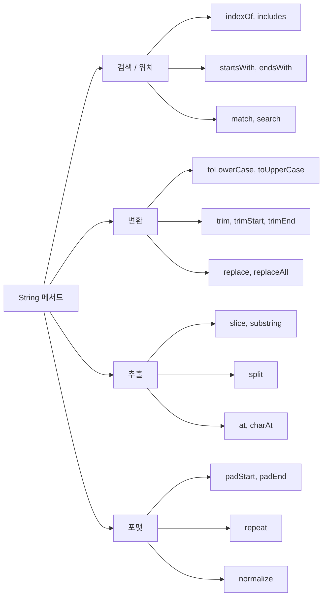

## 정의

JavaScript 의 `string` 은 **UTF-16 코드 유닛의 불변 시퀀스**. 작은따옴표, 큰따옴표, 백틱 (template literal) 으로 작성.

```javascript
const a = 'single';
const b = "double";
const c = `template`;
typeof a   // 'string'
```

## 사용 상황

| 상황 | 권장 패턴 |
|:---|:---|
| 변수 삽입, 멀티라인 | template literal (백틱) |
| 단순 고정 문자열 | 작은따옴표 또는 큰따옴표 |
| SQL, HTML, GraphQL 빌더 | tagged template |
| 정규식 매칭/치환 | `.match()`, `.replace()`, `.replaceAll()` |
| 국제화, 로케일 정렬 | `Intl.Collator`, `.localeCompare()` |
| 이모지/다국어 글자 수 | `Intl.Segmenter` |

## Template Literal

```javascript
const name = 'Alice';
const age = 30;
const s = `My name is ${name} and I am ${age}`;

// 멀티라인
const multi = `line 1
line 2
line 3`;

// 표현식
const result = `2 + 2 = ${2 + 2}`;
```

## tagged template

```javascript
function tag(strings, ...values) {
    return strings.reduce((acc, str, i) =>
        acc + str + (values[i] ?? ''), '');
}

const x = tag`Hello, ${name}!`;
```

SQL, GraphQL, HTML 라이브러리에서 자주 사용 (예: `sql` 태그 함수로 안전한 쿼리 빌더).

## 자주 쓰는 메서드

| 메서드 | 의미 |
|:---|:---|
| `.length` | 글자 수 (UTF-16 단위) |
| `.charAt(i)`, `s[i]` | i 번째 글자 |
| `.indexOf(s)`, `.lastIndexOf(s)` | 위치 |
| `.includes(s)` | 포함 여부 |
| `.startsWith(s)`, `.endsWith(s)` | 시작/끝 검사 |
| `.slice(start, end)`, `.substring(start, end)` | 부분 |
| `.split(sep)` | 분할 |
| `.replace(pat, repl)`, `.replaceAll(pat, repl)` | 치환 |
| `.match(regex)`, `.matchAll(regex)` | 정규식 매칭 |
| `.search(regex)` | 정규식 위치 |
| `.toLowerCase()`, `.toUpperCase()` | 대소문자 |
| `.trim()`, `.trimStart()`, `.trimEnd()` | 공백 제거 |
| `.padStart(n, ch)`, `.padEnd(n, ch)` | 패딩 |
| `.repeat(n)` | 반복 |
| `.normalize('NFC')` | 유니코드 정규화 |
| `.at(i)` | i 번째 (음수 인덱스) |

```javascript
'Hello'.length              // 5
'Hello'[0]                   // 'H'
'Hello'.slice(1, 4)          // 'ell'
'Hello'.split('l')           // ['He', '', 'o']
'a-b-c'.split('-')           // ['a', 'b', 'c']
'aaa'.replace('a', 'b')      // 'baa' (첫 번째만)
'aaa'.replaceAll('a', 'b')   // 'bbb'
'   hi   '.trim()            // 'hi'
'5'.padStart(3, '0')         // '005'
'-'.repeat(5)                 // '-----'
```

## 메서드 분류 시각화



## immutable

```javascript
const s = 'hello';
s[0] = 'H';            // 무시 (sloppy) 또는 TypeError (strict)
console.log(s);         // 'hello'

s = s.toUpperCase();    // 새 문자열 할당 (s 가 const 면 ❌)
let t = s.toUpperCase();  // ✓
```

모든 변환 메서드는 **새 문자열 반환**.

## 유니코드 함정

```javascript
'😀'.length              // 2 (surrogate pair)
'😀'.charAt(0)            // '\uD83D' (의미 없음)
[...'😀']                 // ['😀'] (iterator 가 코드 포인트 단위)

'😀'.codePointAt(0)        // 128512 (정확한 코드 포인트)
String.fromCodePoint(128512)   // '😀'
```

이모지, 한자 일부, 글자 결합 (다이크리틱) 등이 1 글자가 아닐 수 있다. 정확한 grapheme 카운트는 `Intl.Segmenter` 또는 외부 라이브러리.

## String vs string

```javascript
'hello'                  // primitive
new String('hello')      // String 객체 (사용 X)

typeof 'hello'           // 'string'
typeof new String('hi')  // 'object'

'hello'.length           // 5 (자동 boxing)
```

primitive 가 표준. `new String` 은 사용하지 말 것.

## 정규식과 함께

```javascript
const str = 'foo bar baz';

// 매칭
str.match(/\w+/g);           // ['foo', 'bar', 'baz']
str.matchAll(/(\w+)/g);      // Iterator (각 매치 + 캡처 그룹)

// 치환
str.replace(/\s+/g, '-');    // 'foo-bar-baz'
str.replaceAll('a', 'A');    // 'foo bAr bAz'

// 검색
str.search(/bar/);           // 4 (인덱스)

// 분할
'a1b2c3'.split(/\d/);        // ['a', 'b', 'c', '']
```

[[js-regex|정규식]] 참고.

## 비교

```javascript
'apple' < 'banana'       // true (사전순, char code)
'B' < 'a'                 // true ('B' = 66, 'a' = 97)
'한' < '글'                // 유니코드 코드 포인트 비교
'한'.localeCompare('글', 'ko-KR')  // 로케일 기반 (음수/0/양수)
```

한글, 다른 언어 정렬은 `localeCompare` 또는 `Intl.Collator` 권장.

## 국제화와 로케일

```javascript
// 로케일 기반 정렬
const words = ['바나나', '사과', '딸기'];
words.sort((a, b) => a.localeCompare(b, 'ko-KR'));

// Intl.Collator (반복 정렬 시 성능 우수)
const collator = new Intl.Collator('ko-KR');
words.sort(collator.compare);

// 정확한 grapheme 수 (이모지 포함)
const segmenter = new Intl.Segmenter('ko-KR', { granularity: 'grapheme' });
const graphemes = [...segmenter.segment('안녕😀')];
graphemes.length;  // 3 (안, 녕, 😀)

// 대소문자 변환 (로케일 의존)
'istanbul'.toLocaleUpperCase('tr-TR');  // 'İSTANBUL' (터키어 i)
```

## 함정

### 1. 숫자 + 문자열

```javascript
'5' + 3        // '53' (string concatenation)
'5' - 3        // 2 (number)
'5' * 3        // 15
+'5'           // 5 (string → number)
```

### 2. == 의 형변환

```javascript
'5' == 5       // true (강제 변환)
'5' === 5      // false
```

항상 `===` 권장.

### 3. 정규식 replace 의 special $

```javascript
'abc'.replace('b', '$&')         // 'abbc' ($& = matched)
'abc'.replaceAll('b', '$$')      // 'a$c' ($$ = literal $)
```

literal `$` 를 넣으려면 escape.

### 4. slice vs substring 의 음수 인덱스

```javascript
'hello'.slice(-3)        // 'llo' (뒤에서 3번째부터)
'hello'.substring(-3)    // 'hello' (음수 → 0 으로 처리)
```

음수 인덱스가 필요하면 `slice` 또는 `.at()` 사용.

### 5. split 의 빈 문자열

```javascript
'abc'.split('')    // ['a', 'b', 'c']
'😀'.split('')     // ['\uD83D', '\uDE00'] (surrogate pair 분리!)
[...'😀']          // ['😀'] (코드 포인트 단위, 안전)
```

## 관련 위키

- [[js-number|JS Number]]
- [[js-type-coercion|JS 타입 변환]]
- [[js-regex|JS 정규식]]
- [[js-array|JS Array]]
- [[js-json|JS JSON]]
