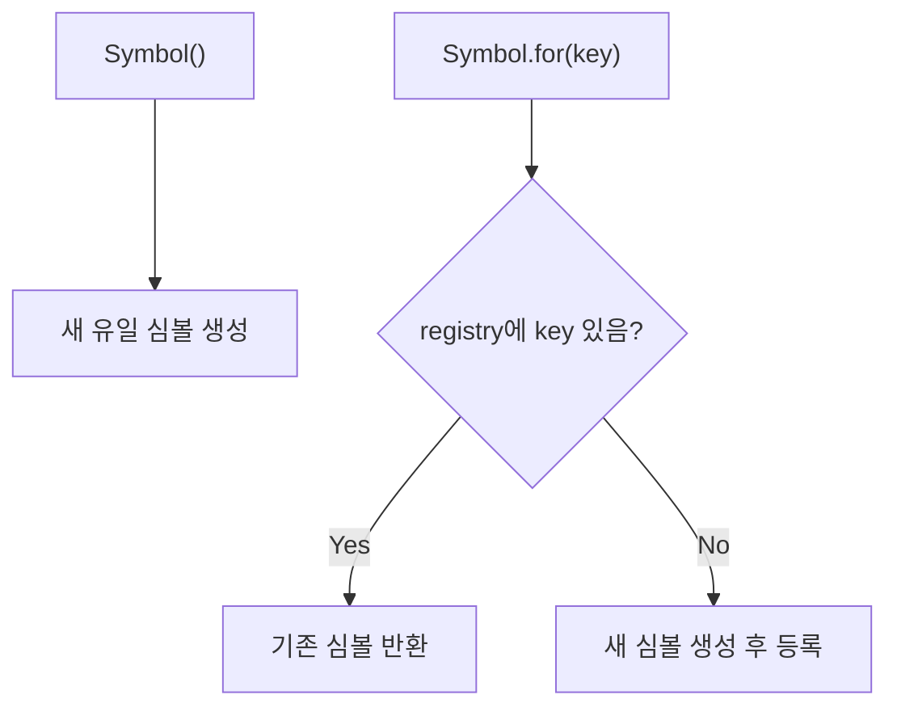

## 정의

**`Symbol`** 은 ES6 도입의 7번째 primitive 타입. **유일성** 을 보장하는 식별자.

```javascript
const s1 = Symbol('description');
const s2 = Symbol('description');
s1 === s2          // false (같은 description 이어도 다름)
typeof s1          // 'symbol'
```

## 왜 필요한가

객체의 **충돌 없는 키** 로 사용. private property 흉내, well-known symbol 로 객체 동작 커스터마이즈.

```javascript
const KEY = Symbol('myLib_internal');
obj[KEY] = 'data';        // 다른 라이브러리와 충돌 없음
```

## 생성

```javascript
const s = Symbol();
const s = Symbol('foo');            // description (디버깅용)
const s = Symbol.for('shared');     // global symbol registry
```

### Symbol.for

```javascript
const a = Symbol.for('shared');
const b = Symbol.for('shared');
a === b                              // true (같은 키)
Symbol.keyFor(a)                     // 'shared'
```

`Symbol()` 은 매번 새 심볼, `Symbol.for()` 는 같은 키면 같은 심볼.

## 객체 키로 사용

```javascript
const id = Symbol('id');
const user = {
    name: 'Alice',
    [id]: 12345,                     // computed key
};

user[id]                              // 12345
user.id                               // undefined (다른 키)
Object.keys(user)                     // ['name']  (Symbol 제외)
Object.getOwnPropertySymbols(user)    // [Symbol(id)]
```

심볼 키는 **`for...in`, `Object.keys`, `JSON.stringify` 에서 제외**. 의도된 hidden property.

## Well-known Symbol

엔진이 정의한 특수 심볼. 객체의 내장 동작을 커스터마이즈.

```javascript
Symbol.iterator         // for...of 의 동작
Symbol.asyncIterator    // for await...of
Symbol.toPrimitive      // 타입 변환
Symbol.toStringTag      // Object.prototype.toString
Symbol.hasInstance      // instanceof
Symbol.isConcatSpreadable
Symbol.match, Symbol.replace, Symbol.search, Symbol.split    // regex
Symbol.species          // 파생 객체 생성자
```

### Symbol.iterator

```javascript
const obj = {
    *[Symbol.iterator]() {
        yield 1;
        yield 2;
        yield 3;
    }
};

for (const x of obj) console.log(x);   // 1, 2, 3
[...obj]                                // [1, 2, 3]
```

### Symbol.toPrimitive

```javascript
const obj = {
    [Symbol.toPrimitive](hint) {
        if (hint === 'number') return 42;
        if (hint === 'string') return 'forty-two';
        return 'default';
    }
};

+obj                  // 42
`${obj}`               // 'forty-two'
obj + ''               // 'default'
```

### Symbol.toStringTag

```javascript
class Foo {
    get [Symbol.toStringTag]() { return 'Foo'; }
}
Object.prototype.toString.call(new Foo())   // '[object Foo]'
```

## 자주 쓰는 패턴

### private property 흉내

```javascript
const _data = Symbol('data');
class Box {
    constructor(x) {
        this[_data] = x;
    }
    get value() { return this[_data]; }
}
```

진짜 private 은 `#private` 필드 (ES2022). 심볼은 reflection 으로 접근 가능.

### 충돌 없는 메서드 추가

```javascript
const myMethod = Symbol('myMethod');
Array.prototype[myMethod] = function() { return 'custom'; };
[].myMethod              // undefined
[][myMethod]              // 'custom'
```

### 고유 식별자

```javascript
const STATUS_ACTIVE = Symbol('active');
const STATUS_INACTIVE = Symbol('inactive');

switch (status) {
    case STATUS_ACTIVE: ...
    case STATUS_INACTIVE: ...
}
```

문자열 enum 보다 충돌 안전.

## 함정

### 1. 자동 변환 없음

```javascript
const s = Symbol('foo');
String(s)         // 'Symbol(foo)' (명시적)
s + ''            // ❌ TypeError
`${s}`             // ❌ TypeError
```

심볼은 자동 변환되지 않는다 (실수 방지).

### 2. JSON 미지원

```javascript
JSON.stringify({ [Symbol()]: 1 })   // '{}' (심볼 키 제외)
JSON.stringify({ a: Symbol() })     // '{}' (심볼 값 제외)
```

### 3. instanceof Symbol

```javascript
Symbol() instanceof Symbol   // false (primitive)
typeof Symbol() === 'symbol' // true
```

## Symbol 생성 흐름



`Symbol()` 은 매번 새 심볼, `Symbol.for()` 는 같은 키면 같은 심볼.

## Well-known Symbol 상세

### Symbol.species

파생 클래스 생성 시 사용할 생성자를 지정.

```javascript
class MyArray extends Array {
    static get [Symbol.species]() { return Array; }
}

const a = new MyArray(1, 2, 3);
const mapped = a.map(x => x * 2);

mapped instanceof MyArray   // false (Array 사용)
mapped instanceof Array     // true
```

`map`, `filter`, `slice` 등이 반환하는 인스턴스 타입을 제어.

### Symbol.hasInstance

`instanceof` 동작 커스터마이즈.

```javascript
class EvenNumber {
    static [Symbol.hasInstance](num) {
        return Number.isInteger(num) && num % 2 === 0;
    }
}

2 instanceof EvenNumber    // true
3 instanceof EvenNumber    // false
```

### Symbol.isConcatSpreadable

```javascript
const arr = [1, 2, 3];
arr[Symbol.isConcatSpreadable] = false;
[0].concat(arr)   // [0, [1, 2, 3]] (펼치지 않음)

const obj = { 0: 'a', 1: 'b', length: 2 };
obj[Symbol.isConcatSpreadable] = true;
[].concat(obj)    // ['a', 'b'] (펼침)
```

## Symbol vs 다른 고유 식별자

| 방법 | 유일성 | 직렬화 | 가시성 | 용도 |
|:---|:---:|:---:|:---:|:---|
| `Symbol()` | 전역 유일 | 불가 | 숨김 | 내부 키, 메타데이터 |
| `Symbol.for()` | 키 기반 공유 | 불가 | 숨김 | 라이브러리 간 공유 |
| `#private` | 클래스 내 | 불가 | 완전 숨김 | 진짜 private |
| `string` | 아님 | 가능 | 노출 | 일반 프로퍼티 |
| `uuid` | 실질적 유일 | 가능 | 노출 | DB ID, 외부 식별자 |

## 라이브러리 간 Symbol 공유

```javascript
// lib-a.js
const PLUGIN_KEY = Symbol.for('myApp.plugin');
export { PLUGIN_KEY };

// lib-b.js (별도 번들)
const PLUGIN_KEY = Symbol.for('myApp.plugin');
// lib-a 와 같은 심볼 (global registry 공유)
```

`Symbol.for` 는 전역 레지스트리를 사용하므로 다른 번들, iframe, 다른 realm 에서도 같은 키면 같은 심볼.

## 디버깅 팁

```javascript
const s = Symbol('user.id');
s.toString()          // 'Symbol(user.id)'
s.description         // 'user.id' (ES2019+)

// 모든 심볼 키 조회
const obj = { [Symbol('a')]: 1, b: 2 };
Reflect.ownKeys(obj)  // ['b', Symbol(a)]
```

`Reflect.ownKeys` 는 문자열 키와 심볼 키를 모두 반환. `Object.keys` 는 심볼 제외.

## 참고

- [[js-iterator-generator]]
- [[js-object]]
- [[js-type-coercion]]
- [[js-proxy-reflect]]
- [[js-class]]
