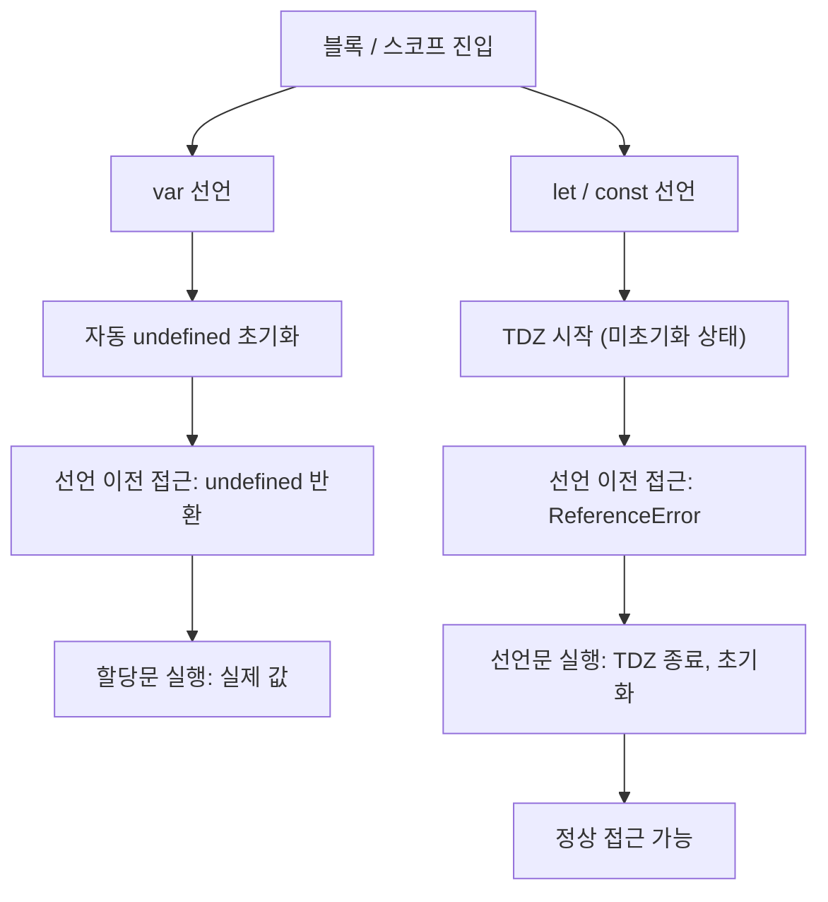

## 정의

**TDZ (Temporal Dead Zone, 일시적 사각지대)** 는 `let` / `const` / `class` 선언이 **호이스팅된 시점부터 선언문이 실행되기 직전까지** 의 구간으로, 이 구간에서 해당 변수에 접근하면 `ReferenceError` 가 발생한다.

```javascript
{
    // ↓ 블록 진입: TDZ 시작 (x 호이스팅됐지만 미초기화)
    console.log(x);     // ❌ ReferenceError: Cannot access 'x' before initialization
    let x = 1;          // ← TDZ 종료, 초기화
    console.log(x);     // ✓ 1
}
```

이름이 **Temporal (시간적)** 인 이유: 코드 위치가 아닌 **실행 시점** 기준이기 때문이다. 물리적으로 선언 아래에 있는 코드라도 실행 순서가 선언 전이면 TDZ 에 걸린다.

## 언제 발생하나

| 선언 종류 | 호이스팅 | TDZ | 접근 시 |
|:---|:---|:---|:---|
| `var` | 선언 + `undefined` 초기화 | 없음 | `undefined` |
| `let` | 선언만 (미초기화) | 있음 | `ReferenceError` |
| `const` | 선언만 (미초기화) | 있음 | `ReferenceError` |
| `function` 선언 | 선언 + 정의 전체 | 없음 | 정상 호출 |
| `class` | 선언만 (미초기화) | 있음 | `ReferenceError` |

## var 와의 비교



코드로 비교:

```javascript
console.log(a);      // undefined (var 는 TDZ 없음)
var a = 1;

console.log(b);      // ❌ ReferenceError
let b = 1;
```

엔진 내부에서 `var a;` 는 스코프 생성 시점에 `undefined` 로 초기화된다. 반면 `let b` 는 "선언 등록" 은 되지만 초기화는 선언문 실행 때까지 미뤄진다.

## TDZ 의 시간적 특성

TDZ 는 코드 위치가 아닌 **실행 순서** 기준이다.

```javascript
function foo() {
    return x;   // 이 시점에 x 가 TDZ 에 있는지가 결정적
}

// 아직 x 선언 전: foo() 가 x 의 TDZ 안에서 실행됨
foo();      // ❌ ReferenceError

let x = 1;

// 이제 x 초기화됨: foo() 실행 시점에 TDZ 아님
foo();      // ✓ 1
```

함수 `foo` 의 코드 위치가 `let x` 보다 위에 있어도, 호출 시점이 선언 이후라면 문제없다.

## class 도 TDZ

`class` 선언도 `let`/`const` 와 동일한 TDZ 를 가진다.

```javascript
new Foo();          // ❌ ReferenceError: Cannot access 'Foo' before initialization
class Foo {}

// 선언 이후에는 정상
const f = new Foo();   // ✓
```

`class Foo {}` 는 사실 `let Foo = class Foo {}` 와 거의 동일하게 동작한다.

## 함수 매개변수 default 의 TDZ

매개변수 기본값은 **왼쪽부터 오른쪽으로 평가** 된다. 뒤에 있는 매개변수는 앞 매개변수의 기본값 표현식 안에서 TDZ 에 있다.

```javascript
function foo(a = b, b = 1) {
    return a + b;
}
foo();   // ❌ ReferenceError: b가 a의 default 평가 시점에 TDZ

// 순서를 바꾸면 OK
function bar(b = 1, a = b) {
    return a + b;
}
bar();   // ✓ 2
```

## 실전 예시

### 조건부 초기화 패턴

```javascript
// ❌ var 의 함정: if(false) 안의 선언도 호이스팅됨
function withVar() {
    if (false) {
        var config = { debug: true };
    }
    console.log(config);   // undefined (ReferenceError 아님)
}

// ✅ let/const: 블록 스코프 + TDZ로 의도하지 않은 접근 차단
function withLet() {
    if (false) {
        let config = { debug: true };
    }
    console.log(config);   // ❌ ReferenceError (더 명확한 에러)
}
```

### 클로저와 TDZ

```javascript
// var: 모든 클로저가 같은 변수 공유 (루프 함정)
const fns1 = [];
for (var i = 0; i < 3; i++) {
    fns1.push(() => i);
}
fns1.map(f => f());   // [3, 3, 3]

// let: 매 반복마다 새 바인딩, TDZ 안전
const fns2 = [];
for (let i = 0; i < 3; i++) {
    fns2.push(() => i);
}
fns2.map(f => f());   // [0, 1, 2]
```

### import 문과 TDZ

```javascript
// ES 모듈의 import 는 호이스팅되어 최상단에서 바인딩 등록
// 단, 순환 참조가 있을 때 상대 모듈의 export 가 TDZ 에 있을 수 있음

// a.mjs
import { b } from './b.mjs';
export const a = b + 1;   // 순환 참조 시 b 가 TDZ

// b.mjs
import { a } from './a.mjs';
export const b = a + 1;   // 순환 참조 시 a 가 TDZ
```

## 함정

### 1. typeof 가 TDZ 에서도 에러

`typeof` 는 일반적으로 선언 안 된 변수에 `'undefined'` 를 반환한다. 그러나 **TDZ 안의 변수에는 예외적으로 `ReferenceError`** 를 던진다.

```javascript
console.log(typeof undeclared);    // 'undefined' (선언 자체가 없는 경우, 안전)
console.log(typeof x);             // ❌ ReferenceError (TDZ 안의 let)
let x = 1;
```

> [!WARNING]
> TDZ 안에서는 `typeof` 도 `ReferenceError` 를 던진다. 변수 존재 여부 확인에 `typeof` 가 항상 안전하다는 가정이 TDZ 에서는 성립하지 않는다.

### 2. 같은 스코프에서 내부 let 이 외부 변수를 가림

```javascript
let x = 1;

{
    console.log(x);    // ❌ ReferenceError
    // 내부의 let x 가 호이스팅되어 외부 x 를 가림
    // 그 결과 내부 x 의 TDZ 가 적용됨
    let x = 2;
    console.log(x);    // ✓ 2
}
```

내부 블록에서 `let x` 가 호이스팅되면 **외부의 `x = 1` 이 아닌 내부의 TDZ `x`** 가 바인딩된다.

### 3. 선언을 스코프 하단에 놓는 패턴

```javascript
// ❌ 읽기 어렵고 TDZ 실수 가능성
function setup() {
    init(config);   // config 가 TDZ 에 있음

    const config = { debug: true };   // 실제 선언은 하단
}

// ✅ 사용 직전 또는 최상단에 선언
function setup() {
    const config = { debug: true };
    init(config);   // 안전
}
```

> [!CAUTION]
> TDZ 에러는 런타임에만 발생하므로 정적 분석 도구 없이는 놓치기 쉽다. 선언을 사용 직전에 두는 습관이 가장 확실한 예방책이다.

### 4. 구조 분해와 TDZ

```javascript
// ❌ 구조 분해 default 에서 같은 패턴 변수 참조
const { a = b, b = 1 } = {};   // ReferenceError: b is not defined
// (정확히는 객체 프로퍼티 기본값 평가 순서 문제)

// ✅ 독립적인 default 값 사용
const { a = 1, b = 1 } = {};
```

## 모범 사례

1. **선언을 사용 직전에 배치** (TDZ 구간 최소화)
2. **`const` 우선, `let` 필요 시**, `var` 지양
3. **ESLint `no-use-before-define` 규칙** 활성화해 정적 감지
4. **순환 의존 주의**: ES 모듈 순환 참조 시 TDZ 에러 발생 가능

## 관련 위키

- [[js-var-let-const]] - var / let / const 선언 차이 전체
- [[js-hoisting]] - 호이스팅 전반
- [[js-scope-chain]] - 스코프 체인, 블록 스코프
- [[js-closure]] - 클로저와 바인딩
- [[js-class]] - class 선언과 TDZ
