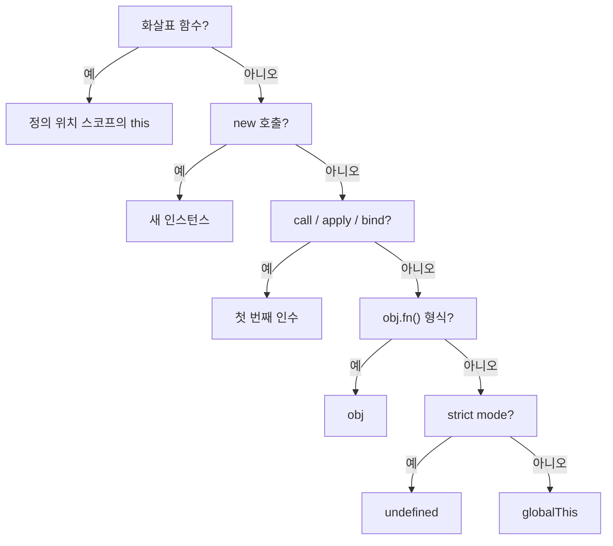

## 정의

JavaScript 의 `this` 는 **호출 방식에 따라 결정** 되는 동적 바인딩. 4 가지 호출 방식 + arrow function (lexical) 규칙.

## 5 가지 규칙

| # | 규칙 | 예 | this 값 |
|:---|:---|:---|:---|
| 1 | 일반 호출 | `fn()` | `undefined` (strict) / `globalThis` |
| 2 | 메서드 호출 | `obj.fn()` | `obj` |
| 3 | 명시적 | `fn.call(x)`, `fn.apply(x)` | `x` |
| 4 | 생성자 | `new Fn()` | 새 인스턴스 |
| 5 | 화살표 | `() => {}` | **lexical** (정의 위치) |

## 메서드 vs 일반 호출

```javascript
const obj = {
    name: 'Alice',
    greet() { return this.name; }
};

obj.greet();             // 'Alice' (메서드 호출)
const fn = obj.greet;
fn();                     // undefined (일반 호출, strict)
```

함수를 변수에 담는 순간 컨텍스트 손실.

## call / apply / bind

```javascript
fn.call(thisArg, arg1, arg2);
fn.apply(thisArg, [arg1, arg2]);
const bound = fn.bind(thisArg, arg1);
```

- **call**: 즉시 호출, 인자 쉼표
- **apply**: 즉시 호출, 인자 배열
- **bind**: 새 함수 반환 (this 영구 바인딩)

```javascript
function greet(prefix, suffix) {
    return `${prefix} ${this.name} ${suffix}`;
}
greet.call({name: 'A'}, 'Hi', '!');     // 'Hi A !'
greet.apply({name: 'A'}, ['Hi', '!']);  // 'Hi A !'
const bound = greet.bind({name: 'A'}, 'Hi');
bound('!');                              // 'Hi A !'
```

## 화살표 함수의 lexical this

```javascript
class Counter {
    constructor() {
        this.count = 0;
        setInterval(() => {
            this.count++;        // ✓ Counter 인스턴스의 this
        }, 1000);
    }
}
```

화살표 함수는 자체 `this` 가 없다. **정의 위치의 `this`** 를 사용. [[arrow function]] 참고.

### 일반 함수였다면

```javascript
setInterval(function() {
    this.count++;        // ❌ this 는 globalThis 또는 undefined
}, 1000);

// 옛 해결책
const self = this;
setInterval(function() {
    self.count++;
}, 1000);
```

## new 호출

```javascript
function Person(name) {
    this.name = name;     // 새 객체에 할당
}
const p = new Person('Alice');
p.name;                    // 'Alice'
```

`new` 호출 시:
1. 새 빈 객체 생성
2. `[[Prototype]] = Person.prototype`
3. `this = 새 객체`
4. 함수 실행
5. 명시적 return 객체 없으면 새 객체 반환

## 이벤트 핸들러

```javascript
button.addEventListener('click', function() {
    console.log(this);    // button (DOM element)
});

button.addEventListener('click', () => {
    console.log(this);    // 외부 스코프의 this (window 등)
});
```

DOM 이벤트는 일반 함수면 `this = 이벤트 타겟`. 화살표 함수면 외부 `this`.

## class 메서드의 this

```javascript
class Btn {
    constructor() { this.clicks = 0; }
    onClick() { this.clicks++; }      // this 손실 위험
}

const b = new Btn();
button.addEventListener('click', b.onClick);   // ❌ this 가 button
button.addEventListener('click', b.onClick.bind(b));   // ✓
button.addEventListener('click', () => b.onClick());   // ✓

class Btn2 {
    clicks = 0;
    onClick = () => this.clicks++;    // ✓ class field arrow, auto bound
}
```

## 우선순위

```text
1. new 바인딩 (가장 강함)
2. 명시적 (call/apply/bind)
3. 메서드 호출
4. 일반 호출 (가장 약함)
```

```javascript
const a = { name: 'a' };
const b = { name: 'b' };

function greet() { return this.name; }
const bound = greet.bind(a);
bound.call(b);    // 'a' (bind 가 call 보다 우선)
```

## 함정

### 1. arrow 함수에 call 무의미

```javascript
const fn = () => this;
fn.call({ x: 1 });        // 외부 this 그대로 반환
```

### 2. 메서드 분리

```javascript
const obj = { greet() { return this; } };
const m = obj.greet;
m();    // undefined (강제 변환 없는 strict 모드)
```

### 3. nested 함수

```javascript
const obj = {
    name: 'A',
    outer() {
        function inner() {
            return this.name;     // undefined!
        }
        return inner();
    }
};
```

해결: 화살표 함수 또는 변수 보존.

## this 결정 순서도



## strict mode 와 this

```javascript
function strict() {
    'use strict';
    return this;
}
function nonStrict() {
    return this;
}

strict();        // undefined
nonStrict();     // globalThis (브라우저: window)
```

ES 모듈 (`type="module"`) 은 자동으로 strict. 최신 번들러 환경에서 일반 함수의 `this` 는 `undefined` 가 기본. 자세히: [[js-strict-mode|strict mode]]

## globalThis

환경별 전역 객체 통일:

| 환경 | 전역 객체 |
|:---|:---|
| 브라우저 | `window` |
| Node.js | `global` |
| Web Worker | `self` |
| Deno | `globalThis` |
| **공통** | `globalThis` |

```javascript
globalThis.setTimeout === setTimeout    // true (어디서나 동작)
typeof globalThis                       // 'object'
```

## React 에서 this 패턴 비교

```javascript
// 1. 클래스: 생성자에서 bind
class MyComp extends React.Component {
    constructor(props) {
        super(props);
        this.handleClick = this.handleClick.bind(this);
    }
    handleClick() { /* this = 인스턴스 */ }
}

// 2. 클래스 필드 (자동 bind, 권장)
class MyComp extends React.Component {
    handleClick = () => { /* this = 인스턴스 */ };
}

// 3. 함수형 컴포넌트: this 없음, Hook 사용
function MyComp() {
    const handleClick = () => { /* this 없음, 클로저로 상태 접근 */ };
    return <button onClick={handleClick}>클릭</button>;
}
```

> 함수형 컴포넌트 + Hooks 환경에서는 `this` 가 필요 없음. 클래스 컴포넌트 유지보수 시에만 this 규칙이 중요.

## setTimeout 안에서의 this

```javascript
class Timer {
    constructor() {
        this.seconds = 0;

        setTimeout(function() {
            this.seconds++;    // undefined.seconds: TypeError (strict mode)
        }, 1000);

        setTimeout(() => {
            this.seconds++;    // ✓ Timer 인스턴스의 this
        }, 1000);
    }
}
```

클래스 내부라도 `setTimeout` 의 일반 함수 콜백은 `this` 를 잃음. 화살표 함수로 lexical 캡처.

## 참고

- [[arrow function]]
- [[function]]
- [[JS Class]]
- [[Lexical Environment]]
