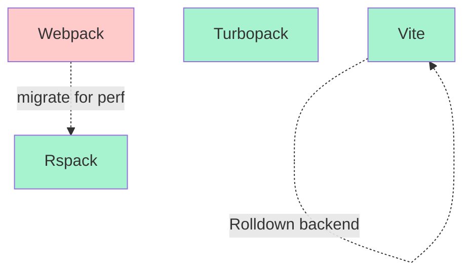
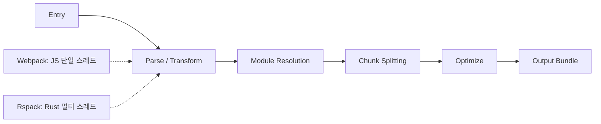
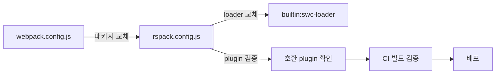

## 정의

2022-2023년 등장한 **Rust 로 재구현된 Webpack 계열 번들러** 두 개:

- **Turbopack**: Vercel (Next.js) 개발. Next.js dev/build 전용.
- **Rspack**: ByteDance (TikTok) 개발. Webpack 호환 API + Rust.

두 도구 모두 **Webpack 을 Rust 로 대체** 하는 목표. Vite 가 esbuild+Rollup 조합인 것과 대비되게, 이들은 **자체 완결 Webpack 대체**.

## 왜 Rust 인가

- **병렬성**: Rust 는 fearless concurrency
- **성능**: Go 보다 조금 빠름, JS 보다 10-100배
- **wasm 배포 가능**: Node 없이 실행
- **메모리 안전**: 크래시/누출 낮음

esbuild (Go) 이후 Rust 가 번들러 언어의 사실상 표준으로 자리매김.

## Turbopack

### 개요

- **Vercel** 개발, Tobias Koppers (Webpack 창시자) 가 리드
- **Next.js 특화**: 다른 프레임워크에서 사용 어려움
- **Incremental compilation**: 파일 하나 변경 시 관련 부분만 재계산
- **Function-level caching**: 함수 단위 결과 캐시

### 성능 (Vercel 벤치마크)

- **HMR**: 대규모 앱에서 Webpack 대비 10x 빠름
- **Cold start**: 5-10x 빠름
- 특히 대규모 앱 (수천 컴포넌트) 에서 격차 벌어짐

### 채택 상태 (2026 기준)

- **Next.js 15**: `next dev --turbo` 안정 (기본 옵션으로 이관 진행 중)
- **Next.js 프로덕션 빌드**: Turbopack 이관 진행 (`next build --turbo` 실험적 → 안정)
- **전용**: 아직 다른 프레임워크에서 직접 쓰기 어려움

### 사용

```json
{
  "scripts": {
    "dev": "next dev --turbo",
    "build": "next build"
  }
}
```

Next.js 안에서만 자연스러움.

## Rspack

### 개요

- **ByteDance** 개발 (TikTok, Douyin 등 대규모 앱)
- **Webpack 호환 API**: `webpack.config.js` 를 거의 그대로 사용
- **Loader 호환**: 인기 loader 다수 호환
- **Plugin 호환**: 상당 부분 (완전 아님)
- **오픈소스**, 프레임워크 무관

### 왜 Webpack 호환인가

기업 앱은 이미 Webpack 설정이 방대. **이관 비용 최소화** 가 목표.

```javascript
// rspack.config.js (Webpack config 와 거의 동일)
module.exports = {
  entry: './src/main.ts',
  module: {
    rules: [
      { test: /\.tsx?$/, loader: 'builtin:swc-loader', options: { /* SWC 옵션 */ } },
    ],
  },
  plugins: [
    new HtmlRspackPlugin({ template: './public/index.html' }),
  ],
};
```

- `builtin:swc-loader`: babel-loader 대신 SWC (Rust) 내장 loader
- `HtmlRspackPlugin`: HtmlWebpackPlugin 의 Rust 재구현

### 성능 (Rspack 벤치마크)

- **Cold start**: Webpack 대비 5-10x
- **HMR**: 5-10x
- **Prod build**: 5-20x

### 채택 상태

- **Storybook 8+**: Rspack 지원
- **Nx**: Rspack executor
- **Modern.js**: 기본
- **여러 대규모 기업**: TikTok, Alibaba, ByteDance 내부

## Rsbuild

Rspack 위 zero-config layer. Rspack 이 Webpack 이라면 Rsbuild 는 CRA/Vite 급 사용자 경험:

```bash
npm create rsbuild@latest
```

- React, Vue, Svelte 템플릿
- 기본 최적화 자동
- Vite 대안으로 부상

## 세 도구 위치



- **Webpack → Rspack**: 저비용 마이그레이션 (설정 그대로)
- **Webpack → Vite**: 재작성 필요하지만 DX 최상
- **Next.js**: Turbopack (프레임워크 잠금 대신 최적화)

## 비교 표

| 축 | Turbopack | Rspack | Vite | Webpack |
|:---|:---|:---|:---|:---|
| **언어** | Rust | Rust | JS + Go/Rust | JS |
| **Webpack 호환** | X | ~90% | X | (본체) |
| **프레임워크** | Next.js 전용 | 범용 | 범용 | 범용 |
| **Dev 속도** | 최상 (대규모) | 매우 빠름 | 즉시 (native ESM) | 느림 |
| **Prod 속도** | 매우 빠름 | 매우 빠름 | Rollup 속도 | 느림 |
| **HMR** | 최상 | 매우 빠름 | 매우 빠름 | 표준 |
| **성숙도** | Beta → GA | GA | GA | GA |

## Turbopack 아키텍처의 혁신

**Turbo Engine**: Turbopack 의 근간. 이론적 기여:

- **Function-level memoization**: 함수 결과를 dependency 그래프와 함께 캐시
- **Precise invalidation**: 파일 변경 시 정확한 재계산 범위 결정
- **Persistent cache**: 재시작해도 캐시 유지 (예정)

Nx, Bazel 등 build system 의 아이디어를 번들러에 적용.

## 함정

> [!WARNING]
> **Turbopack 은 Next.js 전용**. 다른 프레임워크에서 쓰려면 Vite/Rspack.

> [!CAUTION]
> **Rspack Webpack 호환 100% 아님**. 특수 plugin 은 미지원. 프로덕션 이관 전 검증.

> [!WARNING]
> **`builtin:swc-loader` 옵션은 SWC 문법** (Babel 아님). 커스텀 Babel plugin 은 못 씀.

> [!IMPORTANT]
> **Rsbuild 는 Vite 대안 부상 중**. React/Vue 앱은 두 도구 벤치마크 후 결정.

> [!CAUTION]
> **Turbopack production build 는 아직 이관 중**. Next.js 15+ 도 dev 만 turbo 기본, build 는 여전히 Webpack (2026 초 기준). 상태 확인.

## 빌드 파이프라인 단계



두 번들러 모두 **같은 파이프라인 단계** 를 거치지만, Rspack 은 각 단계가 Rust 로 구현되어 CPU 병렬성을 최대화.

## Rspack Module Federation

Rspack 은 **Webpack Module Federation v1.5** 를 지원. 마이크로 프론트엔드 구성 가능:

```javascript
// rspack.config.js
const { ModuleFederationPlugin } = require('@module-federation/enhanced/rspack');

module.exports = {
    plugins: [
        new ModuleFederationPlugin({
            name: 'host',
            remotes: {
                app2: 'app2@http://localhost:3002/remoteEntry.js',
            },
            shared: ['react', 'react-dom'],
        }),
    ],
};
```

Webpack Module Federation 설정과 구조가 거의 동일해 이관 비용이 낮음.

## Webpack → Rspack 마이그레이션 체크리스트



| 단계 | 작업 |
|:---|:---|
| 1 | `webpack` → `@rspack/core` 패키지 교체 |
| 2 | `babel-loader` → `builtin:swc-loader` |
| 3 | `HtmlWebpackPlugin` → `HtmlRspackPlugin` |
| 4 | 커스텀 Babel plugin: SWC 동등 기능 확인 |
| 5 | 미지원 plugin 검색: `rspack-plugin-*` 혹은 자체 구현 |
| 6 | CI 에서 빌드 아웃풋 diff (chunk 이름, 파일 크기) |

## Tree Shaking / Code Splitting

- **Rspack**: `optimization.usedExports: true` (Webpack 설정과 동일)
- **Turbopack**: 자동 (Next.js 가 제어)
- **주의**: CommonJS (`require`) 는 정적 분석 불가. ESM (`import`) 으로 전환 필수.

```javascript
// rspack.config.js
module.exports = {
    optimization: {
        usedExports: true,        // tree shaking
        splitChunks: {
            chunks: 'all',        // vendor chunk 자동 분리
        },
    },
};
```

## 관련 위키

- [[js-bundling|JS 번들링 개요]]
- [[js-webpack|Webpack]]
- [[js-vite|Vite]]
- [[js-esbuild|esbuild]]
- [[js-rollup|Rollup]]
- [[js-cjs-vs-esm|CJS vs ESM]]
