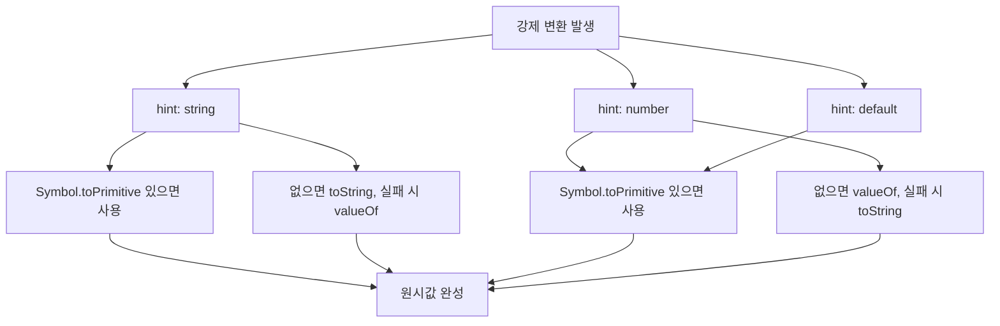
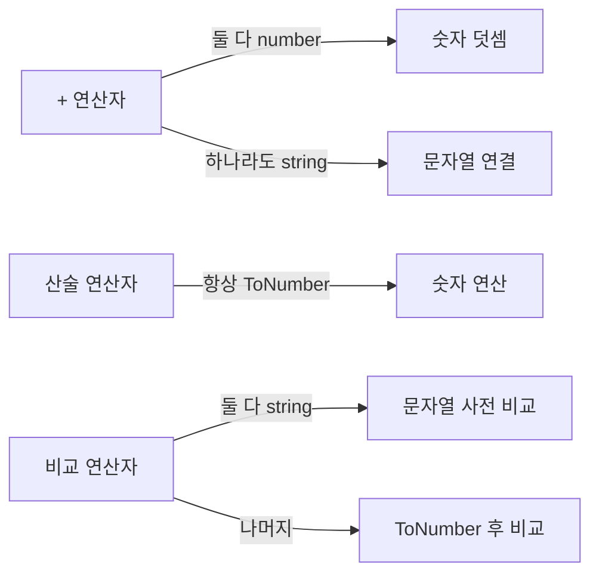

## 정의

JavaScript 의 **암묵적 형변환 (coercion)**. 연산자가 양쪽 피연산자의 타입을 자동으로 맞춘다. 명시적 변환과 구분.

```javascript
1 + '2'          // '12' (implicit, number → string)
'5' * 2          // 10 (implicit, string → number)
Number('5')      // 5 (explicit)
```

## 3 가지 강제 변환

### 1. ToString

```javascript
String(123)              // '123'
String(true)             // 'true'
String(null)             // 'null'
String(undefined)        // 'undefined'
String([1,2,3])          // '1,2,3'
String({})               // '[object Object]'
String({a: 1})           // '[object Object]'
String(Symbol('x'))      // 'Symbol(x)'

// 암묵적
123 + ''                 // '123'
`${123}`                  // '123'
```

### 2. ToNumber

```javascript
Number('42')             // 42
Number('42px')           // NaN (엄격)
Number('')               // 0 ⚠️
Number(' ')              // 0 ⚠️
Number(true)             // 1
Number(false)            // 0
Number(null)             // 0 ⚠️
Number(undefined)        // NaN
Number([])               // 0 ⚠️
Number([1])              // 1 ⚠️
Number([1, 2])           // NaN
Number({})               // NaN

// 암묵적
+'42'                    // 42
'42' * 1                 // 42
'42' - 0                 // 42
```

`parseInt` / `parseFloat` 는 관대 (앞쪽 숫자만 추출).

```javascript
parseInt('42px')         // 42
Number('42px')           // NaN
```

### 3. ToBoolean

```javascript
Boolean(0)               // false
Boolean('')              // false
Boolean(null)            // false
Boolean(undefined)       // false
Boolean(NaN)             // false
Boolean(0n)              // false
// 나머지 truthy

// 암묵적
if (x) { ... }
!!x
x && y
```

## == 의 강제 변환 규칙

```javascript
'5' == 5                 // true
null == undefined        // true
null == 0                // false (특수)
'' == 0                  // true
'' == false              // true
0 == false               // true
[] == false              // true (배열 → 빈 문자열 → 0)
[] == 0                  // true
[0] == false             // true
[1] == true              // true
[1] == 1                 // true
[1, 2] == '1,2'          // true
```

규칙이 너무 복잡 → **항상 `===` 사용** 이 정답.

## + 연산자의 양면성

```javascript
1 + 2                    // 3 (둘 다 number)
1 + '2'                  // '12' (하나라도 string → string)
'1' + 2                  // '12'
{} + []                  // 0 (parser 가 {} 를 block 으로 해석) 또는 '[object Object]'
[] + {}                  // '[object Object]'
[] + []                  // '' (둘 다 toString → '')
```

`+` 는 양쪽 중 하나가 문자열이면 concat, 둘 다 number 면 합.

## 다른 연산자

```javascript
'5' - 3                  // 2 (둘 다 number 로 변환)
'5' * 3                  // 15
'5' / 0                  // Infinity
'a' - 1                  // NaN

'5' > 3                  // true (둘 다 number)
'5' > '3'                // true (둘 다 string, 사전순)
'10' > '9'               // false ('1' < '9' 사전순)
```

## 객체의 변환

```javascript
const obj = {
    valueOf() { return 42; },
    toString() { return 'forty-two'; }
};

obj + 1                  // 43 (valueOf 우선)
`${obj}`                  // 'forty-two' (toString 우선, template)
String(obj)              // 'forty-two'
Number(obj)              // 42
```

`Symbol.toPrimitive` 로 명시적 제어 가능.

```javascript
const obj = {
    [Symbol.toPrimitive](hint) {
        if (hint === 'number') return 42;
        if (hint === 'string') return 'forty-two';
        return 'default';
    }
};
```

## 함정

### 1. 빈 배열의 변환

```javascript
[] == false      // true (헷갈림)
![] == false     // true (헷갈림 × 2)
```

### 2. null 의 비교

```javascript
null > 0         // false
null < 1         // true
null == 0        // false  (모순)
null >= 0        // true
```

`null == undefined` 만 true, 다른 비교는 모두 number 변환 후 비교.

### 3. NaN

```javascript
NaN == NaN       // false (유일하게 자기 자신과 다름)
[NaN].includes(NaN)   // true (특수)
Number.isNaN(x)  // 명시적 검사
```

### 4. JSON 의 변환

```javascript
JSON.stringify({ a: undefined })    // '{}'  (undefined 제거)
JSON.stringify({ a: null })          // '{"a":null}'
JSON.stringify({ a: NaN })           // '{"a":null}'  (NaN → null)
JSON.stringify({ a: Infinity })      // '{"a":null}'
```

## 모범 사례

1. **항상 `===` / `!==`**
2. **명시적 변환**: `Number()`, `String()`, `Boolean()`
3. **`x == null`** 만 예외적 허용 (null 또는 undefined 검사)
4. **`??` (nullish coalescing)** 활용

## 타입 변환 흐름도

hint 에 따라 `Symbol.toPrimitive` → `toString` / `valueOf` 순서가 결정됩니다.



## 연산자별 변환 요약



## Object.is 비교

`===` 의 두 가지 예외를 올바르게 처리합니다.

| 비교 | `==` | `===` | `Object.is` |
|:---|:---:|:---:|:---:|
| `1 == '1'` | true | false | false |
| `null == undefined` | true | false | false |
| `NaN` 자기 비교 | false | false | **true** |
| `+0 vs -0` | true | true | **false** |

```javascript
Object.is(NaN, NaN)    // true  (NaN 검사에 사용)
Object.is(+0, -0)      // false (부호 0 구분 필요 시)

// React useState 내부도 Object.is 사용
// Redux 는 Object.is 기반 얕은 비교
```

`Object.is(NaN, NaN)` 이 `true` 이므로 `Number.isNaN` 대신 사용 가능.

## TypeScript 에서의 암묵적 변환

TypeScript 타입 시스템은 컴파일 타임에 강제 변환 오류를 잡아 주지만, `as` 단언은 런타임 변환이 아닙니다.

```typescript
// 잘못된 as 사용
const raw = '5' as unknown as number;
const result = raw + 1;
// 런타임: '51' (string concat!) - TypeScript 는 number 로 보지만 값은 여전히 string

// 올바른 명시적 변환
function toNumber(v: unknown): number {
    const n = Number(v);
    if (Number.isNaN(n)) throw new TypeError(`변환 불가: ${String(v)}`);
    return n;
}

// 타입 가드 + 변환 조합
function coerceToString(v: string | null | undefined): string {
    return v ?? '';   // null / undefined 만 빈 문자열로
}
```

> [!WARNING]
> `as unknown as T` 는 TypeScript 타입 검사기를 우회합니다. 런타임 값이 실제로 `T` 임을 보장하지 않습니다.

## 실전 패턴

```javascript
// 1. 숫자 변환 3가지 방법
+'42'                          // 42, unary +
Number('42')                   // 42, 명시적
parseInt('42px', 10)           // 42, 관대 파싱 (기수 반드시 명시)

// 2. nullish vs falsy 구분
const a = userInput ?? 'default';   // null / undefined 만 처리
const b = userInput || 'default';   // falsy 전체 (빈 문자열도 대체!)

// 3. 안전한 숫자 변환
const n = Number(raw);
const safe = Number.isFinite(n) ? n : 0;

// 4. 배열의 암묵적 변환 방지
const display = Array.isArray(v) ? v.join(', ') : String(v);

// 5. 불리언 변환: !! vs Boolean()
!!0            // false
Boolean(0)     // false (동일, Boolean() 가 더 명시적)
!!'0'          // true (문자열 '0' 은 truthy!)
!![]           // true (빈 배열도 truthy!)
```

## 참고

- [[js-number|JS Number]]
- [[js-string|JS String]]
- [[js-boolean-null-undefined|JS boolean / null / undefined]]
- [[js-nan-infinity|JS NaN / Infinity]]
- [[js-symbol|JS Symbol]]
- [[js-json|JS JSON]]
