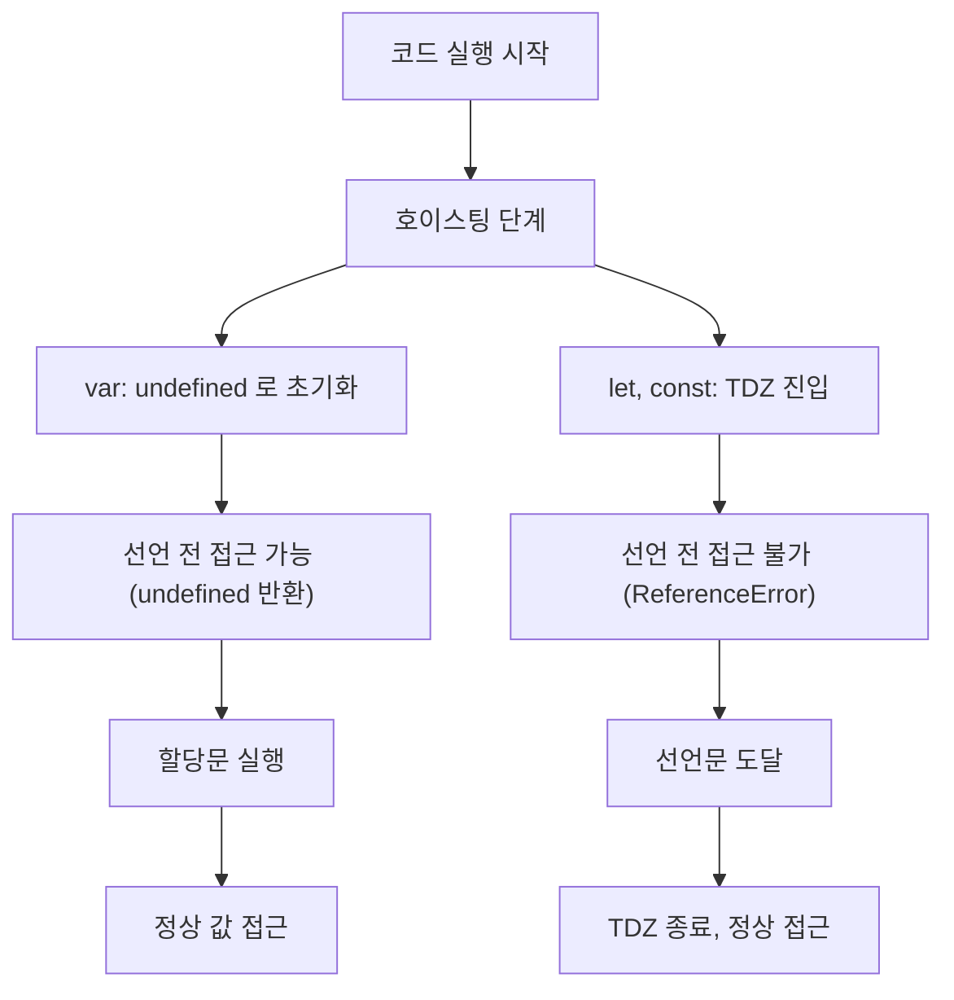
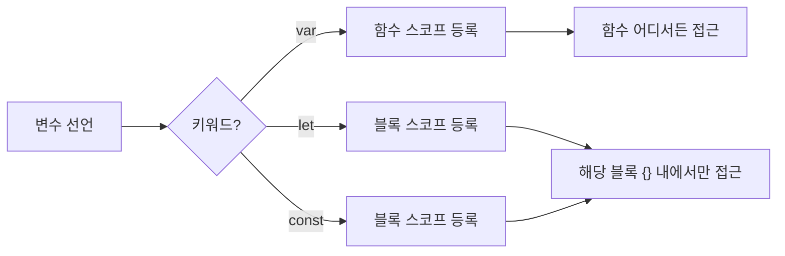

## 정의

JavaScript 의 3 가지 변수 선언 키워드.

| 키워드 | 스코프 | 재할당 | 재선언 | 호이스팅 |
|:---|:---|:---:|:---:|:---|
| **`var`** | function | ✓ | ✓ | undefined 로 초기화 |
| **`let`** | block | ✓ | ✗ | TDZ |
| **`const`** | block | ✗ | ✗ | TDZ |

ES6 이후 **`let`/`const` 가 표준**. `var` 는 레거시 / 특수 케이스만.

## 사용 상황

| 상황 | 권장 키워드 |
|:---|:---|
| 값이 변하지 않는 변수 | `const` |
| 반복문 카운터, 누산 등 재할당 필요 | `let` |
| 레거시 코드 / 함수 스코프가 명시적으로 필요한 경우 | `var` (드묾) |

실무 규칙: **기본 `const`, 재할당 필요하면 `let`, `var` 는 사용 안 함**.

## 스코프와 호이스팅 비교





## var 의 문제

```javascript
function foo() {
    if (true) {
        var x = 1;
    }
    console.log(x);   // 1 (블록 밖에서도 접근)
}

for (var i = 0; i < 3; i++) {
    setTimeout(() => console.log(i), 0);
}
// 3, 3, 3 (var 가 함수 스코프라 클로저가 같은 i 공유)
```

### 전역 오염

브라우저 환경에서 `var` 는 전역 스코프에서 선언되면 `window` 객체에 추가된다.

```javascript
var x = 1;
window.x;       // 1 (전역 객체에 attach)

let y = 1;
window.y;       // undefined
```

## let / const 의 해결

```javascript
function foo() {
    if (true) {
        let x = 1;
    }
    console.log(x);   // ReferenceError (블록 스코프)
}

for (let i = 0; i < 3; i++) {
    setTimeout(() => console.log(i), 0);
}
// 0, 1, 2 (let 이 매 반복마다 새 binding)
```

`let` 은 [[JS 호이스팅|호이스팅]] 되지만 초기화 전에는 [[JS TDZ|TDZ]] 에 있어 접근 불가.

## const 의 의미

`const` 는 **재할당 금지**, 객체 내부 변경은 허용.

```javascript
const arr = [1, 2, 3];
arr.push(4);              // ✓ 객체 내부는 변경 가능
arr = [];                  // ❌ TypeError (재할당 금지)

const obj = { a: 1 };
obj.a = 2;                 // ✓
obj = {};                  // ❌
```

객체를 진짜 불변으로 하려면 `Object.freeze()` 또는 immutable library 사용.

```javascript
const config = Object.freeze({ host: "localhost", port: 3000 });
config.host = "remote";   // 무시됨 (strict mode 에서는 TypeError)
```

## 호이스팅 차이

```javascript
console.log(x);       // undefined (var 는 선언이 끌어올려짐)
var x = 1;

console.log(y);       // ReferenceError (TDZ)
let y = 1;
```

자세히는 [[JS 호이스팅]], [[JS TDZ]] 참고.

## TDZ 상세

`let` / `const` 는 선언문에 도달하기 전까지 **Temporal Dead Zone** 에 있다. 블록 진입 시점부터 선언문 실행 시점 사이.

```javascript
{
    // TDZ 시작 (블록 진입)
    console.log(x);   // ReferenceError: Cannot access 'x' before initialization
    let x = 10;       // TDZ 종료
    console.log(x);   // 10
}
```

`typeof` 도 TDZ 에서는 예외를 던진다.

```javascript
typeof x;     // ReferenceError (TDZ)
let x;

typeof y;     // "undefined" (선언 없는 변수는 undefined)
```

자세히는 [[JS TDZ]] 참고.

## 모범 사례

1. **기본은 `const`**. 재할당 필요하면 `let`.
2. **`var` 는 사용 안 함**. 레거시 코드 마이그레이션 외.
3. **반복문은 `let`**. 클로저 안전.
4. **사용 직전 선언**. 함수 상위에 한 번에 선언하는 구식 스타일 지양.

## 자주 만나는 함정

### 1. for-loop 클로저

```javascript
const funcs = [];
for (var i = 0; i < 3; i++) {
    funcs.push(() => i);
}
funcs.map(f => f());     // [3, 3, 3]

// let 사용
const funcs2 = [];
for (let i = 0; i < 3; i++) {
    funcs2.push(() => i);
}
funcs2.map(f => f());    // [0, 1, 2]
```

`var` 는 루프 전체에 단 하나의 binding. `let` 은 매 iteration 마다 새 binding 생성.

### 2. const 객체의 immutability 오해

```javascript
const arr = [1];
arr.push(2);     // 동작함 → const 가 immutable 아닌가?
// const 는 binding 만 immutable, 내용은 mutable
```

### 3. var 의 전역 오염

```javascript
// 브라우저 콘솔
var x = 1;
window.x;       // 1 (전역 객체에 attach)

let y = 1;
window.y;       // undefined
```

### 4. switch 문의 블록 스코프

```javascript
switch (action) {
    case 'A':
        let result = 1;   // SyntaxError: Identifier 'result' has already been declared
        break;
    case 'B':
        let result = 2;   // 동일 블록에서 재선언
        break;
}

// 해결: 각 case 를 {} 로 감싸기
switch (action) {
    case 'A': {
        let result = 1;
        break;
    }
    case 'B': {
        let result = 2;
        break;
    }
}
```

## TypeScript 관점

TypeScript 에서는 `var` 사용을 ESLint (`no-var` 규칙) 또는 tslint 로 막는다. `const` / `let` 만 허용하는 것이 관례.

```typescript
// tsconfig.json 기반 타입 추론도 const 에서 더 정밀
const x = 1;          // 타입: 1 (literal type)
let y = 1;             // 타입: number
var z = 1;             // 타입: number
```

`const` 선언된 primitive 는 literal type 으로 좁혀지므로 타입 안전성도 높아진다.

## 관련 위키

- [[JS 호이스팅]]
- [[JS TDZ]]
- [[JS 스코프 체인]]
- [[JS Lexical Environment|Lexical Environment]]
- [[js-closure|클로저]]
