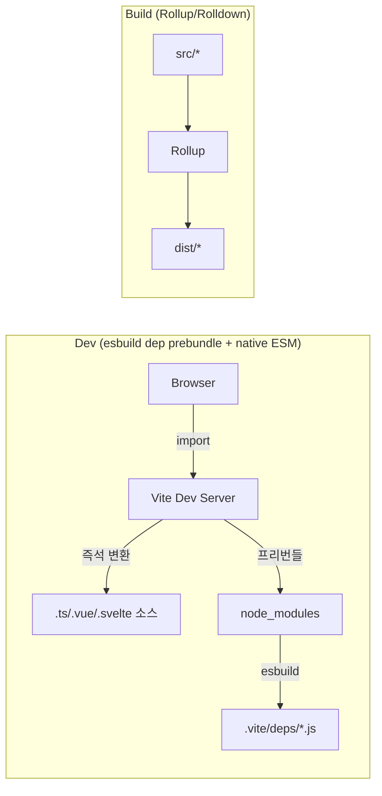

## 정의

**Vite** (프랑스어 "빠르다") 는 Evan You (Vue 창시자) 가 2020년 시작한 **모던 프런트엔드 빌드 도구**. 두 부분:

- **Dev Server**: Native ESM 을 브라우저에 직접 서빙 (번들 없음)
- **Production Build**: 현재 Rollup, 미래 Rolldown (Rust)

**한 줄 요약**: "개발은 번들 안 함, 프로덕션은 번들". 이 이중 전략으로 대규모 앱도 즉시 시작.

## 왜 Vite 인가

### Webpack 의 문제

**Dev cold start**: Webpack 은 개발 시에도 전체 앱을 번들해 브라우저에 서빙. 파일 수천 개 앱은 시작에 수 분.

### Vite 의 통찰

브라우저는 이미 ESM 지원 (2020+ 모든 evergreen). **개발 시 번들 안 하고** 브라우저에게 native ESM 직접 서빙 → 즉시 시작.

```html
<!-- 브라우저가 파싱 -->
<script type="module" src="/src/main.ts"></script>

<!-- main.ts 안 -->
<script type="module">
  import { createApp } from '/node_modules/.vite/deps/vue.js'
  import App from '/src/App.vue?t=1234'
</script>
```

파일 요청 시 Vite 가 즉석 변환 (TS → JS, Vue SFC → JS/CSS).

## 아키텍처



## 개발 서버

### Native ESM 서빙

`.ts`, `.vue`, `.svelte` 요청 시 즉석 컴파일 (esbuild + framework plugin).

### Dependency Pre-Bundling

`node_modules` 는 esbuild 로 미리 번들 후 캐시 (`.vite/deps/`). 이유:
- CJS-only 라이브러리를 ESM 으로 변환
- 수백 개 파일 요청을 하나로 통합

### HMR

파일 저장 시 해당 모듈만 교체. React Fast Refresh, Vue HMR 통합.

**속도**: 대규모 앱도 밀리초.

## 프로덕션 빌드

**현재 (Vite 6-7)**: Rollup 백엔드. Tree shaking, minification, code splitting.

**미래 (Rolldown-Vite)**: Rollup 호환 API + Rust 성능. 2025 년 프리뷰, 2026+ 안정화 목표.

```bash
vite build     # Rollup 기반 (기본)
```

```json
// package.json (프리뷰)
{
  "dependencies": {
    "rolldown-vite": "^1.0.0"
  }
}
```

## 설정

```javascript
// vite.config.ts
import { defineConfig } from 'vite';
import react from '@vitejs/plugin-react';

export default defineConfig({
  plugins: [react()],
  build: {
    outDir: 'dist',
    sourcemap: true,
    rollupOptions: {
      output: {
        manualChunks: {
          vendor: ['react', 'react-dom'],
        },
      },
    },
  },
  server: {
    port: 3000,
    proxy: {
      '/api': 'http://localhost:8000',
    },
  },
  resolve: {
    alias: {
      '@': '/src',
    },
  },
});
```

Webpack 대비 압도적으로 단순.

## 프레임워크 통합

**공식 템플릿**:
```bash
npm create vite@latest my-app
# 선택: Vanilla, Vue, React, Preact, Lit, Svelte, Solid, Qwik
```

**주요 채택**:
- **Vue 3**: 공식
- **Svelte / SvelteKit**: 공식
- **Nuxt 3+**: Vite 내장
- **Astro**: Vite 내장
- **Solid**: 공식
- **Remix**: Vite 이관 (v2+)
- **Qwik**: Vite 내장

**Next.js 는 자체 Turbopack** (Vite 아님).

## Plugin 시스템

Rollup plugin 호환 + Vite 특화 hook (`configureServer`, `transformIndexHtml`).

```javascript
export default {
  plugins: [
    {
      name: 'custom-plugin',
      transform(code, id) {
        if (id.endsWith('.custom')) {
          return { code: transformCustom(code) };
        }
      },
    },
  ],
};
```

수천 개 커뮤니티 plugin.

## SSR 지원

Vite 는 SSR 도 지원 (`vite-plugin-ssr`, SvelteKit, Nuxt 등이 활용):

```javascript
import { createServer } from 'vite';

const vite = await createServer({
  server: { middlewareMode: true },
  appType: 'custom',
});

// Express 등에서
app.use(vite.middlewares);
```

## Environment API (Vite 6+)

Vite 6 도입. Client / SSR / Edge 등 여러 환경을 동시 지원.

```javascript
export default {
  environments: {
    client: { /* browser bundle */ },
    ssr: { /* Node bundle */ },
    edge: { /* Cloudflare Workers */ },
  },
};
```

Framework 개발자 대상 (Nuxt, SvelteKit 활용).

## 관용 스택

- **Vitest**: Vite 위 테스트 프레임워크 (Jest 대체)
- **@vitejs/plugin-react**, **-vue**, **-svelte**
- **vite-plugin-pwa**
- **unplugin-auto-import**, **unplugin-vue-components**
- **rollup-plugin-visualizer**: 번들 분석

## 성능

- **Cold start**: 즉시 (대규모 앱도 초 미만)
- **HMR**: 밀리초
- **Production build**: Rollup 기반이라 esbuild/Turbopack 보다 느림, Rolldown 이관 후 개선 예상

## 함정

> [!WARNING]
> **CJS-only 라이브러리** 는 pre-bundle 필요. 처음 dev 시작 시 지연.

> [!CAUTION]
> **`optimizeDeps.include`** 로 명시 필요한 경우 (동적 import 로 발견 못 하는 dep).

> [!WARNING]
> **Prod 빌드는 여전히 Rollup 속도**. 큰 앱은 esbuild 나 Rspack 대비 느림.

> [!IMPORTANT]
> **Env variable prefix**. `.env` 파일의 변수 중 `VITE_` prefix 만 클라이언트 노출.

## 관련 위키

- [[js-bundling|JS 번들링 개요]]
- [[js-webpack|Webpack]]
- [[js-esbuild|esbuild]]
- [[js-rollup|Rollup]]
- [[js-turbopack-rspack|Turbopack & Rspack]]
- [[js-cjs-vs-esm|CJS vs ESM]]
- [[js-es-modules|ES Modules]]
