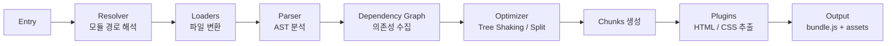

## 정의

**Webpack** 은 2014년 Tobias Koppers 가 만든 JavaScript 모듈 번들러입니다. 오랫동안 **사실상의 표준** 이었고, 방대한 loader/plugin 생태계, code splitting, HMR 등 대부분 번들 개념의 원조. React (`create-react-app`), Vue CLI, Angular CLI 등이 채택.

**2026 현황**: 여전히 광범위 사용 중이나 **성능 이유로 Vite/Rspack/Turbopack 으로 이관** 진행 중. Webpack 5 가 마지막 major 로 안정 유지.

## 핵심 개념

### Entry, Output, Loader, Plugin

```javascript
// webpack.config.js
module.exports = {
  entry: './src/index.js',
  output: {
    path: __dirname + '/dist',
    filename: 'bundle.[contenthash].js',
    clean: true,
  },
  module: {
    rules: [
      { test: /\.tsx?$/, use: 'ts-loader' },
      { test: /\.css$/, use: ['style-loader', 'css-loader'] },
      { test: /\.(png|svg|jpg)$/, type: 'asset/resource' },
    ],
  },
  plugins: [
    new HtmlWebpackPlugin({ template: './public/index.html' }),
    new MiniCssExtractPlugin(),
  ],
  optimization: {
    splitChunks: { chunks: 'all' },
    runtimeChunk: 'single',
  },
  mode: 'production',
};
```

- **Entry**: 시작 파일
- **Output**: 결과물 (경로/파일명 템플릿)
- **Loader**: 개별 파일 변환 (test 정규식 매칭)
- **Plugin**: 빌드 전체 lifecycle hook (HTML 생성, CSS 추출 등)

## 빌드 파이프라인 시각화



## Loader vs Plugin

**Loader**: 파일 하나를 다른 형태로 변환 (`.ts` → `.js`, `.css` → JS 모듈).

**Plugin**: 빌드 전 과정에 개입 (파일 목록 조작, 에셋 최적화, 통계 출력).

## Code Splitting

### Entry Points

```javascript
entry: {
  app: './src/app.js',
  admin: './src/admin.js',
}
```

각 entry 별 chunk.

### Dynamic Import

```javascript
const Heavy = await import(/* webpackChunkName: "heavy" */ './heavy');
```

Webpack 이 자동으로 별도 chunk 로 분리 → lazy load.

### SplitChunksPlugin

```javascript
optimization: {
  splitChunks: {
    chunks: 'all',
    cacheGroups: {
      vendors: {
        test: /[\\/]node_modules[\\/]/,
        name: 'vendors',
        priority: 10,
      },
    },
  },
},
```

`node_modules` 를 `vendors.js` 로 분리 → 브라우저 캐시 효율.

## HMR (Hot Module Replacement)

`webpack-dev-server` 로 개발 시 상태 유지하며 변경 반영.

```javascript
if (module.hot) {
  module.hot.accept('./component', () => {
    // 재렌더링
  });
}
```

React Fast Refresh, Vue HMR 등이 이 위에 구축.

## Module Federation

Webpack 5 신기능. **런타임 마이크로 프론트엔드**.

```javascript
new ModuleFederationPlugin({
  name: 'app1',
  filename: 'remoteEntry.js',
  exposes: {
    './Button': './src/Button',
  },
  remotes: {
    app2: 'app2@http://localhost:3002/remoteEntry.js',
  },
})
```

다른 앱의 컴포넌트를 런타임에 로드. Micro-frontends 아키텍처의 근간.

## Tree Shaking

Webpack 5는 자동:

```json
{
  "sideEffects": false
}
```

`package.json` 의 이 필드로 힌트. 실제 side-effect 있는 파일은 배열로 명시.

## 성능 최적화

- **`cache: 'filesystem'`**: 재빌드 캐시
- **thread-loader**: 병렬 처리
- **swc-loader**, **esbuild-loader**: babel-loader 보다 빠름
- **`experiments.lazyCompilation`**: 미방문 페이지는 지연 컴파일

**하지만** 근본적으로 JS 로 짜여 병렬성 한계. **Rspack** 이 Webpack 호환 API + Rust 로 이 문제 해결.

## Webpack 의 장단점

**장점**:
- 가장 방대한 생태계 (loader/plugin)
- 성숙한 프로덕션 검증
- Module Federation (마이크로프론트엔드)
- 세밀한 제어

**단점**:
- 큰 앱에서 매우 느림 (수 분)
- 설정 복잡 (webpack.config.js 지옥)
- CJS 시대 유산이라 ESM 최적화 부족
- 초기 개발자 경험 부족

## 마이그레이션 트렌드

- **CRA → Vite** (React)
- **Vue CLI → Vite**
- **Angular CLI**: 자체 esbuild 통합 (2023+)
- **Next.js**: Turbopack (dev), 프로덕션 이관 중

**Rspack**: Webpack API 그대로 유지하면서 Rust 로 재구현. 이관 비용 최소.

## DevServer 설정

```javascript
// webpack.config.js devServer 섹션
devServer: {
  port: 3000,
  open: true,
  hot: true,                          // HMR 활성화
  historyApiFallback: true,           // SPA 라우팅 지원
  proxy: {
    '/api': {
      target: 'http://localhost:8080',
      changeOrigin: true,
    },
  },
  static: {
    directory: path.join(__dirname, 'public'),
  },
},
```

개발 서버의 주요 옵션:
- **`hot`**: HMR 활성화. 상태 유지하며 변경 반영.
- **`historyApiFallback`**: SPA 에서 404 대신 index.html 반환.
- **`proxy`**: API 서버 프록시. CORS 우회에 유용.

## 번들 분석 도구

번들 크기 최적화 전에 반드시 분석부터:

```javascript
// webpack.config.js - 번들 분석기 추가
const { BundleAnalyzerPlugin } = require('webpack-bundle-analyzer');
module.exports = {
  plugins: [
    new BundleAnalyzerPlugin({
      analyzerMode: 'static',        // 'server' | 'static' | 'json'
      openAnalyzer: false,
      reportFilename: 'bundle-report.html',
    }),
  ],
};
```

분석 후 흔히 발견되는 문제:

| 문제 | 원인 | 해결책 |
|:---|:---|:---|
| **lodash 전체 번들** | `import _ from 'lodash'` | `import get from 'lodash/get'` |
| **moment.js 언어팩** | 전체 locale 포함 | IgnorePlugin 으로 제외 |
| **중복 라이브러리** | 버전 불일치 | `resolve.alias` 로 단일화 |
| **이미지/폰트 대용량** | asset 미처리 | `asset/resource` 로 외부화 |

```javascript
// moment.js 언어팩 제외 예시
plugins: [
  new webpack.IgnorePlugin({
    resourceRegExp: /^\.\/locale$/,
    contextRegExp: /moment$/,
  }),
],
```

## 번들러 비교

| 항목 | Webpack 5 | Vite | Rspack | Turbopack |
|:---|:---|:---|:---|:---|
| **기반 언어** | JS | JS/Go | Rust | Rust |
| **Dev 속도** | 느림 | 빠름 | 매우 빠름 | 매우 빠름 |
| **설정 복잡도** | 높음 | 낮음 | 중간 | 낮음 |
| **생태계** | 가장 넓음 | 넓음 | Webpack 호환 | Next.js 전용 |
| **Module Federation** | 지원 | 미지원 | 지원 | 미지원 |
| **ESM 최적화** | 부족 | 우수 | 우수 | 우수 |

Webpack 이 여전히 선호되는 경우:
- 방대한 기존 Webpack 설정이 있는 레거시 프로젝트
- Module Federation 이 필요한 마이크로프론트엔드
- 세밀한 chunk splitting 제어가 필요한 경우

## 함정

> [!WARNING]
> **큰 앱에서 dev server cold start 수 분**. 개발자 이탈 원인. Vite/Turbopack 검토.

> [!CAUTION]
> **설정 복잡도**. 프로덕션 급 웹팩 설정은 수백 줄. 잘 아는 팀 아니면 preset (Next.js, CRA) 활용.

> [!WARNING]
> **Webpack 4 는 EOL**. 취약점 대응 없음. Webpack 5 로.

> [!IMPORTANT]
> **Module Federation 은 강력하지만 복잡**. 버전 관리, 공유 dependency 등 세밀한 조율 필요.

## 관련 위키

- [[js-bundling|JS 번들링 개요]]
- [[js-vite|Vite]]
- [[js-esbuild|esbuild]]
- [[js-rollup|Rollup]]
- [[js-turbopack-rspack|Turbopack & Rspack]]
- [[js-cjs-vs-esm|CJS vs ESM]]
- [[js-es-modules|ES Modules]]
