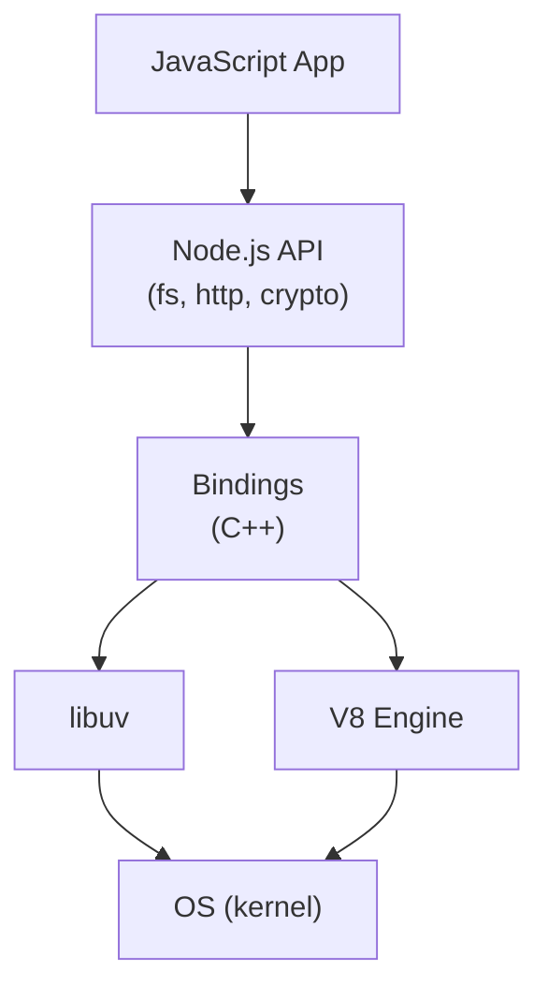
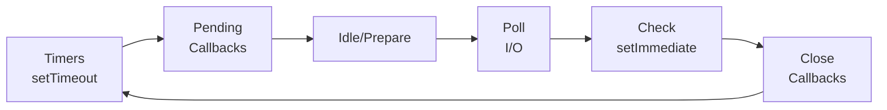

## 정의

**Node.js** 는 Ryan Dahl 이 2009년 발표한 **JavaScript 서버 사이드 런타임** 입니다. V8 엔진 (Chrome) + libuv (비동기 I/O) + 표준 라이브러리 조합으로 브라우저 밖에서 JS 실행.

**한 줄 요약**: "JavaScript 로 서버, CLI, 도구를 만드는 표준 런타임".

## 구성 요소



- **V8**: JS 파싱, 컴파일, 실행 (Ignition, TurboFan, Maglev)
- **libuv**: 이벤트 루프, 비동기 I/O, thread pool
- **표준 라이브러리**: fs, http, crypto, net, dns, path, url, ...

## Event Loop

Node.js 의 심장. **단일 스레드 + 비동기 I/O**.



6 단계 (phases). 각 phase 에 callback queue. 사이사이 **microtask queue** (Promise, `queueMicrotask`) 처리.

**핵심**: I/O (파일, 네트워크) 는 non-blocking. libuv 가 OS 에 위임 후 완료 시 callback.

## 비동기 프로그래밍

### Callback (초기)

```javascript
fs.readFile('file.txt', (err, data) => {
  if (err) throw err;
  console.log(data);
});
```

Callback hell 문제.

### Promise (ES6+)

```javascript
fs.promises.readFile('file.txt')
  .then(data => console.log(data))
  .catch(err => console.error(err));
```

### async/await (ES2017+)

```javascript
try {
  const data = await fs.promises.readFile('file.txt');
  console.log(data);
} catch (err) {
  console.error(err);
}
```

**모던 관용**. 자세한 것은 [[js-async-await|async/await]] 참조.

## 모듈 시스템

두 시스템 병존. 자세한 것은 [[js-cjs-vs-esm|CJS vs ESM]] 참조.

- **CommonJS** (레거시): `require` / `module.exports`
- **ESM** (표준): `import` / `export`

Node 22.12+ 는 `require(esm)` 지원.

## 표준 모듈

### 파일 시스템

```javascript
import { readFile, writeFile } from 'node:fs/promises';

const data = await readFile('/path/to/file', 'utf-8');
await writeFile('/path/out', 'content');
```

### HTTP 서버

```javascript
import { createServer } from 'node:http';

const server = createServer((req, res) => {
  res.writeHead(200, { 'Content-Type': 'text/plain' });
  res.end('Hello\n');
});

server.listen(3000);
```

### Streams

```javascript
import { createReadStream, createWriteStream } from 'node:fs';
import { pipeline } from 'node:stream/promises';

await pipeline(
  createReadStream('input.txt'),
  createWriteStream('output.txt'),
);
```

Streams 는 큰 파일 처리에 필수. Backpressure 자동.

### Crypto

```javascript
import { createHash, randomBytes } from 'node:crypto';

const hash = createHash('sha256').update('data').digest('hex');
const token = randomBytes(32).toString('hex');
```

### Path / URL

```javascript
import { join, dirname } from 'node:path';
import { fileURLToPath } from 'node:url';

const __dirname = dirname(fileURLToPath(import.meta.url));
const configPath = join(__dirname, 'config.json');
```

## Worker Threads

CPU-bound 작업용. Event loop 를 막지 않기 위해:

```javascript
import { Worker } from 'node:worker_threads';

const worker = new Worker('./cpu-heavy.js');
worker.postMessage({ data: [...] });
worker.on('message', result => console.log(result));
```

**주의**: Node 는 기본 단일 스레드. Worker 는 진짜 thread, 무거운 계산 격리.

## Cluster

멀티 프로세스로 CPU 활용 (worker_threads 대안):

```javascript
import cluster from 'node:cluster';
import os from 'node:os';

if (cluster.isPrimary) {
  for (let i = 0; i < os.cpus().length; i++) cluster.fork();
} else {
  // server code
}
```

PM2 가 이 관리를 대신. Kubernetes 는 프로세스 대신 pod.

## npm / package.json

의존성 관리:

```json
{
  "name": "my-app",
  "version": "1.0.0",
  "type": "module",
  "scripts": {
    "start": "node src/index.js",
    "dev": "node --watch src/index.js",
    "test": "node --test"
  },
  "dependencies": {
    "express": "^4.19.0"
  },
  "devDependencies": {
    "@types/node": "^20.0.0",
    "typescript": "^5.3.0"
  }
}
```

패키지 매니저: **npm** (기본), **pnpm** (효율적), **yarn**, **bun**.

## LTS 정책

Node 는 **짝수 버전이 LTS** (Long Term Support). 30개월 유지.

- **Node 20** (2023-04): LTS
- **Node 22** (2024-04): LTS
- **Node 24** (2025-04): LTS (예정)

**홀수 버전** (21, 23): 짧은 실험. 프로덕션 지양.

## 최근 개선 (Node 20-22)

- **Test runner** 내장 (`node --test`)
- **Watch mode** (`node --watch`)
- **Permission model** (`--permission`)
- **`fetch` global** (undici 통합)
- **`require(esm)` stable** (22.12+)
- **`import.meta.dirname`, `.filename`**
- **`--env-file`** (.env 자동 로드)
- **WebSocket client**

Node 가 Deno/Bun 기능을 흡수 중.

## 대안 런타임

- **[[js-bun-bundler|Bun]]**: Zig, 초고속
- **Deno**: TS 네이티브, secure by default
- **WinterJS**, **Netlify Edge**: Edge 특화

Node 는 여전히 지배적, 하지만 압박 받음.

## 실전 최적화

### Native module

크리티컬 성능은 C++/Rust addon (`.node` 파일). N-API.

### Cluster / Worker

CPU 코어 활용.

### Streams

큰 파일/네트워크는 buffer 대신 stream.

### Profile

`--prof`, `--inspect` (Chrome DevTools).

### Memory Leak

Heap snapshot + Chrome DevTools.

## 함정

> [!WARNING]
> **Blocking sync API 금지 (서버)**. `fs.readFileSync` 는 event loop 정지. 항상 async.

> [!CAUTION]
> **CPU-bound 는 worker_threads**. Event loop 안 heavy computation 은 다른 요청 지연.

> [!WARNING]
> **Unhandled Promise rejection**. Node 는 warning → process.exit (v15+). 반드시 catch.

> [!IMPORTANT]
> **LTS 만 프로덕션**. 홀수 버전은 몇 개월 후 EOL.

> [!CAUTION]
> **`__dirname` in ESM**. 없음. `import.meta.dirname` (Node 20.11+).

## 관련 위키

- [[js-cjs-vs-esm|CJS vs ESM]]
- [[js-es-modules|ES Modules]]
- [[js-event-loop|Event Loop]]
- [[js-async-await|async/await]]
- [[js-promise|Promise]]
- [[js-bundling|번들링]]
- [[js-bun-bundler|Bun]] - 대안
- [[typescript|TypeScript]]
- [[nestjs|NestJS]]
- [[koajs|Koa.js]]
- [[fastapi|FastAPI]] - Python 대비
