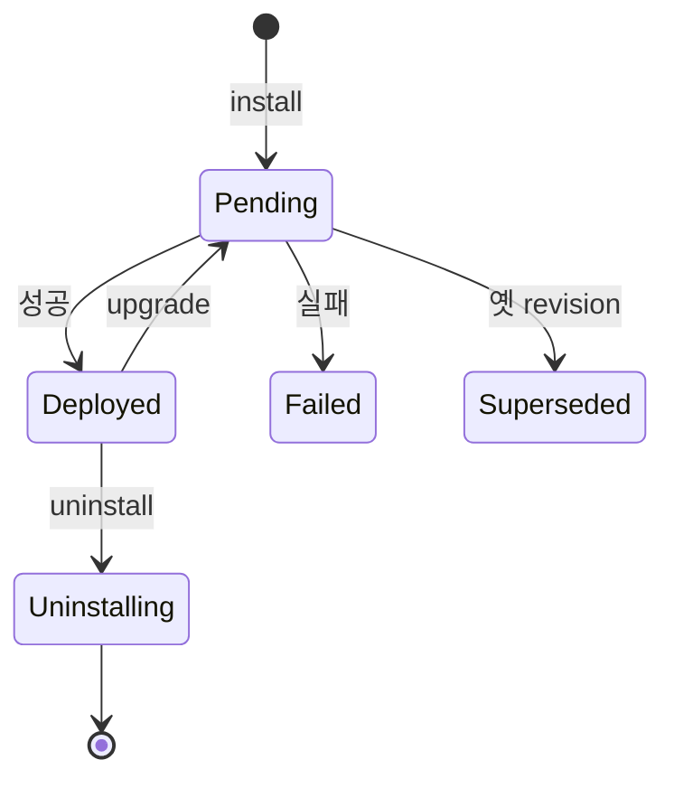
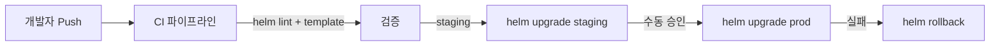

## 정의

**Helm** = *K8s 의 패키지 매니저*. *Chart* (YAML 템플릿 + 메타데이터) → *Release* (cluster 에 배포된 인스턴스).

## 구조

```
my-chart/
├── Chart.yaml        # 메타데이터 (이름, 버전)
├── values.yaml       # 기본 설정값
├── templates/        # Go template YAML
│   ├── deployment.yaml
│   ├── service.yaml
│   ├── ingress.yaml
│   └── _helpers.tpl  # 공통 함수
└── charts/           # 의존 chart
```

## Chart.yaml

```yaml
apiVersion: v2
name: my-app
description: A web application
type: application
version: 0.1.0          # chart 버전
appVersion: "1.27.0"    # 앱 버전
dependencies:
  - name: postgresql
    version: "16.x.x"
    repository: https://charts.bitnami.com/bitnami
```

## values.yaml

```yaml
replicaCount: 3
image:
  repository: nginx
  tag: "1.27"
  pullPolicy: IfNotPresent
service:
  type: ClusterIP
  port: 80
ingress:
  enabled: true
  className: nginx
  hosts:
    - host: my-app.example.com
      paths: [{ path: /, pathType: Prefix }]
resources:
  limits: { cpu: 500m, memory: 512Mi }
  requests: { cpu: 100m, memory: 128Mi }
```

## Template 예시

```yaml
# templates/deployment.yaml
apiVersion: apps/v1
kind: Deployment
metadata:
  name: {{ include "my-app.fullname" . }}
  labels: {{- include "my-app.labels" . | nindent 4 }}
spec:
  replicas: {{ .Values.replicaCount }}
  selector:
    matchLabels: {{- include "my-app.selectorLabels" . | nindent 6 }}
  template:
    metadata:
      labels: {{- include "my-app.selectorLabels" . | nindent 8 }}
    spec:
      containers:
        - name: {{ .Chart.Name }}
          image: "{{ .Values.image.repository }}:{{ .Values.image.tag }}"
          ports:
            - containerPort: {{ .Values.service.port }}
          resources: {{- toYaml .Values.resources | nindent 12 }}
```

## 흔한 명령

```bash
helm install my-release ./my-chart
helm install my-release oci://registry-1.docker.io/bitnamicharts/postgresql
helm upgrade my-release ./my-chart --set image.tag=1.28
helm rollback my-release 2          # 2번 revision 으로
helm uninstall my-release
helm list
helm template ./my-chart            # 렌더만 (apply X)
helm lint ./my-chart
helm package ./my-chart             # tgz 패키지
helm repo add bitnami https://charts.bitnami.com/bitnami
helm search repo postgresql
helm show values bitnami/postgresql
```

## Release 의 lifecycle



```bash
helm history my-release    # 모든 revision
helm rollback my-release 3
```

## Hooks

| Hook | 시점 |
|---|---|
| `pre-install` | install 직전 |
| `post-install` | install 직후 |
| `pre-upgrade` / `post-upgrade` | upgrade |
| `pre-delete` / `post-delete` | uninstall |
| `pre-rollback` / `post-rollback` | rollback |
| `test` | `helm test` 명령 |

```yaml
metadata:
  annotations:
    "helm.sh/hook": pre-install
    "helm.sh/hook-weight": "0"
    "helm.sh/hook-delete-policy": before-hook-creation,hook-succeeded
```

> *DB migration*, *secret pre-creation* 등에 활용.

## Helm vs Kustomize

| 항목 | Helm | Kustomize |
|---|---|---|
| 메커니즘 | Go template + values | overlay (patch) |
| 패키지 관리 | *예* (repo, chart) | 없음 |
| 변수 표현력 | 강 | 약 |
| 학습 곡선 | 높음 | 낮음 |
| 배포 도구 | helm CLI | kubectl 내장 (`kubectl apply -k`) |
| 적합 | 3rd-party 도구 설치 | 자기 앱 환경별 |

> 자주 *Helm chart + Kustomize overlay* 조합.

## Helmfile (multi-release 관리)

```yaml
# helmfile.yaml
releases:
  - name: postgres
    namespace: data
    chart: bitnami/postgresql
    version: 16.x.x
    values:
      - environments/prod/postgres.yaml
  - name: redis
    namespace: data
    chart: bitnami/redis
    values:
      - environments/prod/redis.yaml
```

```bash
helmfile sync
```

## 흔한 함정

> [!WARNING]
> 1. **values.yaml 의 *secret 평문*** = git 에 secret 노출. SOPS / Sealed Secrets.
> 2. **`template` 안 디버깅 어려움** = `helm template . --debug` 로 렌더 결과 확인.
> 3. **chart upgrade 시 의도 외 변경** = `--reset-values` vs `--reuse-values` 명시.
> 4. **hook 의 *cleanup 정책*** = hook resource 가 cluster 에 *영구 남음* 가능. `hook-delete-policy` 명시.

## OCI Registry (Helm 3.8+)

차트를 Docker Hub / ECR / GHCR 에 OCI Artifact 로 저장:

```bash
# Bitnami 공식 OCI 설치 예시
helm install my-release oci://registry-1.docker.io/bitnamicharts/postgresql

# 직접 패키지 + Push
helm package ./my-chart                     # my-app-0.1.0.tgz 생성
helm push my-app-0.1.0.tgz oci://ghcr.io/my-org/charts

# Pull + Install
helm install my-release oci://ghcr.io/my-org/charts/my-app --version 0.1.0
```

> *OCI 는 `helm repo add` 불필요*. 컨테이너 레지스트리가 그대로 차트 저장소.

## 시크릿 관리

### SOPS + Helm Secrets Plugin

```bash
helm plugin install https://github.com/jkroepke/helm-secrets

# SOPS 로 암호화된 values 파일로 배포
helm secrets upgrade my-release ./my-chart \
  -f values.yaml \
  -f secrets.enc.yaml
```

### External Secrets Operator (권장)

```yaml
apiVersion: external-secrets.io/v1beta1
kind: ExternalSecret
metadata:
  name: my-app-secret
spec:
  refreshInterval: 5m
  secretStoreRef:
    name: aws-secrets-manager
    kind: ClusterSecretStore
  target:
    name: my-app-secret
  data:
    - secretKey: db_password
      remoteRef:
        key: prod/my-app
        property: db_password
```

> [!WARNING]
> `values.yaml` 에 평문 시크릿 절대 금지. SOPS 또는 External Secrets Operator 로 분리.

## CI/CD 통합



ArgoCD 를 통한 GitOps 패턴은 [[argocd]] 참조.

## Helm 3 vs Helm 2

| 항목 | Helm 2 | Helm 3 |
|---|---|---|
| Tiller | 클러스터 서버 컴포넌트 | 제거 (클라이언트만) |
| 보안 | Tiller RBAC 복잡 | kubeconfig 권한 직접 사용 |
| Release 저장 | ConfigMap | Secret (기본) |
| 3-way merge | 미지원 | 지원 |
| OCI 지원 | 없음 | 지원 (3.8+) |
| Namespace | 글로벌 릴리스 | release 별 namespace |

> Helm 2 는 2022 년 EOL. 신규 구축은 Helm 3 만 사용.

## 관련 위키

- [[k8s-deployment]]
- [[argocd]] (Helm chart 배포 자동화)
- [[terraform]] (IaC 대조)
