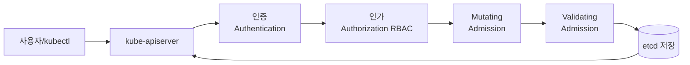

## 정의

**Admission Controller** 는 kube-apiserver 가 인증/인가 후, etcd 저장 전에 요청을 가로채 **검증 (validate)** 하거나 **수정 (mutate)** 하는 계층입니다. 클러스터 정책 강제, 기본값 주입, 보안 검사의 핵심 지점입니다.

## 요청 흐름



**순서**:
1. 인증
2. 인가 (RBAC)
3. **Mutating admission**: 요청 body 수정 (기본값, sidecar 주입, 라벨 추가)
4. **Validating admission**: 검증만 (수정 없음)
5. etcd 저장

Mutating 이 먼저인 이유: Validating 이 최종 상태를 검사할 수 있도록.

## 내장 Admission Controller

kube-apiserver flag `--enable-admission-plugins` 로 활성화. 관용 (v1.29+ 기본):

- **NamespaceLifecycle**: 삭제 중인 namespace 에 리소스 생성 방지
- **LimitRanger**: LimitRange 정책 적용
- **ServiceAccount**: Pod 에 default SA 삽입, secret token mount
- **DefaultStorageClass**: PVC 에 default StorageClass 자동 할당
- **DefaultTolerationSeconds**: NotReady/unreachable taint 에 300s toleration
- **MutatingAdmissionWebhook**: 동적 mutating hook
- **ValidatingAdmissionWebhook**: 동적 validating hook
- **ResourceQuota**: ResourceQuota 정책 적용
- **PodSecurity**: [[k8s-pod|Pod]] 보안 표준 (privileged/baseline/restricted)
- **NodeRestriction**: kubelet 이 자기 노드/pod 만 수정 가능
- **PriorityClass**

## Pod Security Admission (PSA)

v1.25 부터 stable. 3 profile:

- **`privileged`**: 무제한 (system pods)
- **`baseline`**: 알려진 privilege escalation 방지
- **`restricted`**: 강력한 보안 (nonroot, seccomp, capabilities 제한)

Namespace 라벨로 지정:

```yaml
apiVersion: v1
kind: Namespace
metadata:
  name: prod
  labels:
    pod-security.kubernetes.io/enforce: restricted
    pod-security.kubernetes.io/enforce-version: latest
    pod-security.kubernetes.io/audit: restricted
    pod-security.kubernetes.io/warn: restricted
```

**세 모드**:
- **enforce**: 위반 시 거부
- **audit**: 감사 로그만
- **warn**: 사용자에게 warning

**PodSecurityPolicy (PSP)** 는 v1.25 에서 제거되었습니다. PSA + Kyverno / Gatekeeper 로 대체.

## Dynamic Admission Webhook

CRD 나 커스텀 정책은 **webhook** 으로. 사용자가 배포한 HTTP 서버가 admission review 를 처리.

### ValidatingWebhookConfiguration

```yaml
apiVersion: admissionregistration.k8s.io/v1
kind: ValidatingWebhookConfiguration
metadata:
  name: my-policy
webhooks:
  - name: validate.example.com
    clientConfig:
      service:
        namespace: policy
        name: validator
        path: /validate
      caBundle: <base64 CA>
    rules:
      - apiGroups: ["apps"]
        apiVersions: ["v1"]
        operations: ["CREATE", "UPDATE"]
        resources: ["deployments"]
        scope: Namespaced
    admissionReviewVersions: ["v1"]
    sideEffects: None
    failurePolicy: Fail          # 또는 Ignore
    timeoutSeconds: 5
    namespaceSelector:
      matchLabels:
        policy-enforced: "true"
```

Webhook 은 다음과 같은 요청/응답:

```json
// Request
{
  "kind": "AdmissionReview",
  "apiVersion": "admission.k8s.io/v1",
  "request": {
    "uid": "abc123",
    "kind": {"group": "apps", "version": "v1", "kind": "Deployment"},
    "operation": "CREATE",
    "object": {...}
  }
}

// Response
{
  "kind": "AdmissionReview",
  "apiVersion": "admission.k8s.io/v1",
  "response": {
    "uid": "abc123",
    "allowed": false,
    "status": {
      "message": "must set resources.limits"
    }
  }
}
```

### MutatingWebhookConfiguration

응답에 JSON Patch 로 수정:

```json
{
  "response": {
    "allowed": true,
    "patchType": "JSONPatch",
    "patch": "<base64 [{'op':'add','path':'/spec/foo','value':'bar'}]>"
  }
}
```

**대표 사용 사례**:
- Sidecar 자동 주입 (Istio, Linkerd, Fluent Bit operator)
- 이미지 이름 registry prefix 추가
- 라벨/annotation 자동 삽입

## ValidatingAdmissionPolicy (K8s 1.30 GA)

Webhook 없이 CEL (Common Expression Language) 로 policy:

```yaml
apiVersion: admissionregistration.k8s.io/v1
kind: ValidatingAdmissionPolicy
metadata:
  name: require-image-registry
spec:
  failurePolicy: Fail
  matchConstraints:
    resourceRules:
      - apiGroups:   ["apps"]
        apiVersions: ["v1"]
        operations:  ["CREATE", "UPDATE"]
        resources:   ["deployments"]
  validations:
    - expression: |
        object.spec.template.spec.containers.all(c,
          c.image.startsWith("registry.example.com/"))
      message: "images must come from registry.example.com"
---
apiVersion: admissionregistration.k8s.io/v1
kind: ValidatingAdmissionPolicyBinding
metadata:
  name: require-image-registry-binding
spec:
  policyName: require-image-registry
  validationActions: [Deny]
  matchResources:
    namespaceSelector:
      matchLabels:
        policy-enforced: "true"
```

**장점**:
- 웹훅 서버 배포 불필요 (성능/가용성 이점)
- YAML 만으로 정책 표현
- 서버 죽어도 정책 유효 (webhook 은 서버 죽으면 정책 무력)

**단점**:
- CEL 만 사용 (복잡한 로직 제한)
- Mutating 지원 X (Mutating은 v1.32+ alpha)

## OPA Gatekeeper

CNCF 프로젝트. Rego 언어로 정책 정의.

```yaml
apiVersion: constraints.gatekeeper.sh/v1beta1
kind: K8sRequiredLabels
metadata:
  name: ns-must-have-owner
spec:
  match:
    kinds:
      - apiGroups: [""]
        kinds: [Namespace]
  parameters:
    labels: [owner]
```

Constraint Template (Rego):

```rego
package k8srequiredlabels

violation[{"msg": msg}] {
  required := input.parameters.labels
  provided := input.review.object.metadata.labels
  missing := required[_]
  not provided[missing]
  msg := sprintf("missing label: %v", [missing])
}
```

**강점**: 표현력 강력, 정책 라이브러리 방대
**약점**: Rego 학습 곡선, Gatekeeper 자체 리소스 부담

## Kyverno

Kubernetes-native (YAML 만). Rego 안 배워도 됨.

```yaml
apiVersion: kyverno.io/v1
kind: ClusterPolicy
metadata:
  name: require-labels
spec:
  validationFailureAction: Enforce
  rules:
    - name: check-owner-label
      match:
        any:
          - resources:
              kinds: [Namespace]
      validate:
        message: "namespace must have label 'owner'"
        pattern:
          metadata:
            labels:
              owner: "?*"
```

Mutating, generating, verifying (이미지 서명) 도 지원. Sigstore 통합.

## 정책 도구 선택

| 도구 | 정책 언어 | 장점 | 언제 |
|:---|:---|:---|:---|
| **PSA** | 내장 | 무설정, K8s 표준 | Pod 보안 표준만 |
| **ValidatingAdmissionPolicy** | CEL | 웹훅 불필요, 성능 | Simple validation |
| **OPA Gatekeeper** | Rego | 표현력 최상 | 복잡한 정책, 다양한 리소스 |
| **Kyverno** | YAML | 학습 부담 낮음 | K8s 팀 친숙 언어 |

**관용**: 소규모 클러스터 = PSA + Kyverno. 대규모 = Gatekeeper.

## 실전 정책 예시

### 1. `latest` 이미지 금지

Kyverno:

```yaml
apiVersion: kyverno.io/v1
kind: ClusterPolicy
metadata:
  name: disallow-latest-tag
spec:
  validationFailureAction: Enforce
  rules:
    - name: check-image-tag
      match:
        any:
          - resources:
              kinds: [Pod]
      validate:
        message: "image tag 'latest' is prohibited"
        pattern:
          spec:
            containers:
              - image: "!*:latest"
```

### 2. 리소스 요청 필수

Gatekeeper Constraint Template:

```rego
package k8srequiredresources

violation[{"msg": msg}] {
  container := input.review.object.spec.containers[_]
  not container.resources.requests.cpu
  msg := sprintf("container %v missing cpu request", [container.name])
}
```

### 3. 특정 registry 만

ValidatingAdmissionPolicy (CEL):

```yaml
validations:
  - expression: |
      object.spec.template.spec.containers.all(c,
        c.image.startsWith("ghcr.io/") || c.image.startsWith("registry.example.com/"))
    message: "only ghcr.io and registry.example.com allowed"
```

### 4. 이미지 서명 검증

Kyverno + Sigstore:

```yaml
apiVersion: kyverno.io/v1
kind: ClusterPolicy
metadata:
  name: verify-image-signature
spec:
  rules:
    - name: verify-cosign
      match:
        any:
          - resources:
              kinds: [Pod]
      verifyImages:
        - imageReferences:
            - "ghcr.io/*"
          attestors:
            - entries:
                - keys:
                    publicKeys: |
                      -----BEGIN PUBLIC KEY-----
                      ...
```

## Webhook 배포 시 주의

### 1. Circular dependency

Webhook 이 자기 자신을 관리하는 리소스에 의존하면 chicken-and-egg. `namespaceSelector` 로 kube-system 제외.

### 2. Failure Policy

- **`Fail`**: 웹훅 실패 시 요청 거부 (엄격)
- **`Ignore`**: 웹훅 실패 시 통과 (관대)

**Fail** 로 두었다가 웹훅 서버 죽으면 클러스터 마비. Bootstrap 리소스는 반드시 예외 처리.

### 3. Timeout

기본 30초, 최대 30초. Timeout 은 API 지연 유발. **짧게 (수 초) + 빠른 응답**.

### 4. TLS

Webhook 은 반드시 TLS. `caBundle` 로 CA 신뢰. cert-manager 활용 관용.

## 함정

> [!WARNING]
> **`failurePolicy: Fail` + 웹훅 서버 죽음** = 모든 요청 실패. Bootstrap 순서 및 예외 처리 필수.

> [!CAUTION]
> **Mutating 순서 불확정**. 여러 mutating webhook 이 있으면 서로의 결과에 의존 X.

> [!WARNING]
> **PodSecurityPolicy (PSP) 는 v1.25 에서 제거**. 아직도 사용 중이면 즉시 마이그레이션 (PSA + Kyverno).

> [!IMPORTANT]
> **정책은 dry-run 부터**. 프로덕션 클러스터에 enforce 걸기 전에 audit / warn 모드로 관찰.

> [!CAUTION]
> **Cluster-scoped policy 는 실수 위험 큼**. Namespace 스코프 우선 검토.

## 관련 위키

- [[kubernetes|Kubernetes]] - 상위 개요
- [[k8s-architecture|Architecture]] - apiserver 요청 흐름
- [[k8s-crd-operators|CRDs & Operators]] - 대안적 확장
- [[k8s-rbac|RBAC]] - 인가 계층
- [[k8s-namespace|Namespace]] - Namespace scope
- [[k8s-network-policy|NetworkPolicy]] - 다른 보안 계층
- [[k8s-pod|Pod]] - PSA 대상
