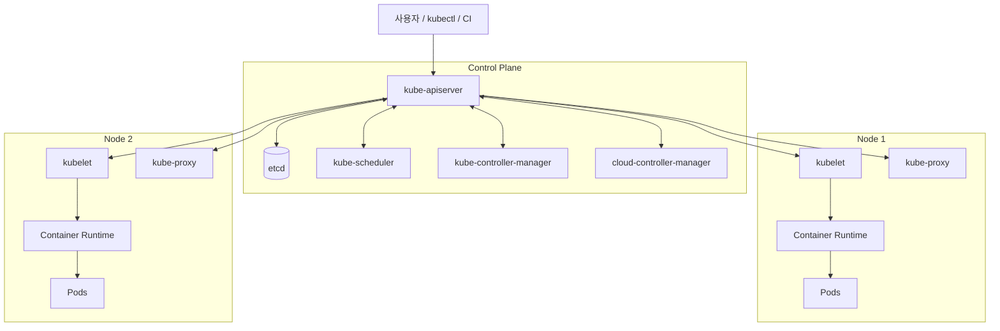

## 정의

**Kubernetes Architecture** 는 **Control Plane** (제어) 과 **Worker Node** (실행) 두 계층으로 구성됩니다. Control Plane 은 원하는 상태를 결정하고, Node 는 그 결정을 실제로 실행합니다. 모든 통신은 **kube-apiserver** 를 통해 이루어집니다.

## 전체 구조



## Control Plane 컴포넌트

### kube-apiserver

- **모든 요청의 진입점**. RESTful API, gRPC (일부).
- **인증 (Authentication)** -> **인가 (Authorization: [[k8s-rbac|RBAC]])** -> **[[k8s-admission-controllers|Admission Controllers]]** -> **etcd 저장** 순.
- **stateless** 라서 여러 replica 로 HA 가능 (LB 앞).
- 클러스터 안의 다른 모든 컴포넌트 (kubelet, controller, scheduler) 는 apiserver 를 통해서만 상태 읽기/쓰기.

**API Group / Version**:
- `/api/v1`: core (Pod, Service, ConfigMap, ...)
- `/apis/apps/v1`: apps (Deployment, StatefulSet, ...)
- `/apis/networking.k8s.io/v1`: (Ingress, NetworkPolicy)
- `/apis/rbac.authorization.k8s.io/v1`
- CRD 는 `/apis/{group}/{version}` 형태로 추가

### etcd

- **분산 key-value store**. Raft 합의 알고리즘.
- 클러스터의 모든 상태 (Pod spec, ConfigMap 값, 이벤트 등) 저장.
- **홀수 개** (3, 5, 7) 노드 권장 (Raft quorum).
- **백업 필수**. `etcdctl snapshot save` 로 정기 백업.
- 성능 요구: SSD, 저지연 네트워크. 큰 클러스터에서 etcd 병목이 흔한 문제.

```bash
# 백업
ETCDCTL_API=3 etcdctl snapshot save backup.db \
  --endpoints=https://127.0.0.1:2379 \
  --cacert=/etc/kubernetes/pki/etcd/ca.crt \
  --cert=/etc/kubernetes/pki/etcd/server.crt \
  --key=/etc/kubernetes/pki/etcd/server.key
```

### kube-scheduler

- **새 Pod 을 어느 노드에 배치할지 결정**.
- 2단계 알고리즘:
  1. **Filtering (predicates)**: 노드 CPU/메모리 여유, taint 매치, PVC affinity, 리소스 제한 등을 기준으로 후보 노드 필터.
  2. **Scoring (priorities)**: 남은 노드에 점수 매기고 최고점 선택 (least-requested, image locality, [[k8s-scheduling|topology spread]] 등).
- 사용자 정의 스케줄러 (`schedulerName`) 로 확장 가능.
- Extensions: Scheduling Framework (필터/스코어 플러그인).

### kube-controller-manager

- 여러 **controller loop** 을 하나의 프로세스로 실행.
- 각 controller 는 "원하는 상태 vs 실제 상태" 를 지속 조정.

주요 controller:
- **Deployment Controller**: ReplicaSet 생성/롤링 업데이트
- **ReplicaSet Controller**: Pod 생성/삭제해 replica 유지
- **Node Controller**: 노드 상태 감지, unresponsive node 처리
- **Service Account Controller**: default SA 생성
- **Endpoint Controller**: Service <-> Pod 매핑 갱신
- **Namespace Controller**: 삭제된 namespace 리소스 정리

### cloud-controller-manager

- **클라우드 API 와의 다리**. AWS, GCP, Azure 등.
- 관리형 클러스터 (EKS/GKE/AKS) 는 클라우드가 관리.

주요 controller:
- **Node Controller**: 클라우드 API 로 노드 lifecycle 관리
- **Route Controller**: 클라우드 VPC 라우팅
- **Service Controller (LB)**: `type: LoadBalancer` Service -> 클라우드 LB 프로비저닝
- **Volume Controller**: 클라우드 볼륨 attach/detach

## Node 컴포넌트

### kubelet

- **노드의 primary agent**. Pod spec (파일 또는 API 로) 을 받아 컨테이너 실행 상태 유지.
- **CRI** (Container Runtime Interface) 로 runtime 과 통신.
- Probes (liveness, readiness, startup) 를 주기적으로 실행.
- Node 상태 (heartbeat, capacity) 를 apiserver 에 보고.
- **정적 Pod** (static Pod): `/etc/kubernetes/manifests/` 의 YAML 을 apiserver 없이 직접 실행 (kube-apiserver, etcd 자체가 이 방식).

### kube-proxy

- **Service 네트워킹** 담당.
- 3가지 모드:
  1. **iptables** (기본): iptables 규칙으로 서비스 IP -> Pod IP DNAT
  2. **IPVS**: 리눅스 커널 IPVS (성능 우수, 큰 클러스터)
  3. **nftables** (신규, 실험적)
- **eBPF 기반 Cilium 은 kube-proxy 완전 대체 가능** (kubeProxyReplacement).

### Container Runtime (CRI)

CRI 호환 runtime:
- **containerd** (기본, CNCF): 경량, 빠름
- **CRI-O**: OCI 표준 지향, OpenShift 기본
- **Kata Containers**: VM 격리 (보안 강화)

Docker 는 v1.24 이후 CRI 지원 종료 (dockershim 제거). Docker 이미지는 여전히 호환 (OCI 표준).

### CNI (Container Network Interface)

Pod 네트워킹. **k8s network model**:
- 모든 Pod 은 고유 IP
- Pod ↔ Pod NAT 없이 통신
- Node ↔ Pod NAT 없이 통신

주요 CNI:
- **Calico**: BGP 기반, NetworkPolicy 강력, 대규모 클러스터
- **Cilium**: eBPF 기반, Service Mesh + observability 통합
- **Flannel**: 단순, 개발/소규모
- **Weave**: 오래됨, 사용 감소
- **AWS VPC CNI**: EKS 기본, Pod 이 VPC IP 획득
- **Azure CNI, GCP CNI**: 각 클라우드 특화

## kube-apiserver 를 통한 상호작용 흐름

**예: Pod 생성**:

```
1. 사용자: kubectl apply -f pod.yaml
2. kubectl -> kube-apiserver (auth, admission)
3. kube-apiserver -> etcd (Pod object 저장)
4. kube-scheduler (watch): 새 unscheduled Pod 발견
5. kube-scheduler: 노드 선택 -> Pod.spec.nodeName 갱신
6. kubelet (해당 노드, watch): 새 Pod 발견
7. kubelet -> CRI -> containerd: 이미지 pull + 컨테이너 실행
8. kubelet -> CNI: Pod 네트워크 설정 (IP 할당)
9. kubelet: 상태 -> kube-apiserver -> etcd
```

모든 컴포넌트가 **watch** 로 apiserver 를 구독. Push 아님 pull.

## High Availability

### Control Plane HA

- **kube-apiserver**: 여러 replica + LB (nginx, HAProxy, 클라우드 LB)
- **etcd**: 홀수 (3, 5) 노드, 분산 배치
- **kube-scheduler / controller-manager**: 여러 replica, leader election (한 번에 하나만 active)

### 관리형 vs 자체 HA

- **관리형** (EKS/GKE/AKS): 클라우드가 Control Plane HA 자동
- **자체 운영**: kubeadm HA 설정, HAProxy + keepalived

### 노드 HA

- 여러 AZ 에 분산 (VPC 여러 subnet)
- [[k8s-scheduling|Topology Spread Constraints]] 로 AZ 균형
- PodDisruptionBudget 으로 한 번에 죽는 Pod 상한

## 확장

- **CRD ([[k8s-crd-operators|Custom Resource Definition]])**: 새 리소스 타입 추가
- **API Aggregation Layer**: 다른 API 서버를 kube-apiserver 뒤에 추가
- **Admission Webhook**: Mutating / Validating hook
- **Scheduler Framework**: 커스텀 스케줄링 로직
- **CSI (Storage), CNI (Network), CRI (Runtime), CPI (Cloud), CCM**

## 함정

> [!WARNING]
> **etcd 성능 저하 = 전체 클러스터 저하**. SSD, 저지연 네트워크 필수. 크기 상한 8 GB 권장.

> [!CAUTION]
> **모든 kubelet 이 apiserver 에 watch 유지**. 큰 클러스터 (수천 노드) 는 apiserver 확장이 병목.

> [!WARNING]
> **cloud-controller-manager 없이 `type: LoadBalancer` 는 pending**. 관리형이 아니면 MetalLB 등 대체.

> [!IMPORTANT]
> **CNI 플러그인 교체는 복잡**. 초기 선택이 장기 결정. Calico / Cilium 이 안전한 선택.

> [!CAUTION]
> **kube-proxy iptables 규칙은 O(n) 조회**. 서비스 수천 개면 IPVS 나 eBPF 로 이전.

## 관련 위키

- [[kubernetes|Kubernetes]] - 상위 개요
- [[k8s-pod|Pod]]
- [[k8s-service|Service]] - kube-proxy 대상
- [[k8s-scheduling|Scheduling]] - kube-scheduler 심화
- [[k8s-admission-controllers|Admission Controllers]] - apiserver 확장
- [[k8s-crd-operators|CRDs & Operators]] - apiserver 확장
- [[k8s-network-policy|NetworkPolicy]] - CNI 구현
- [[k8s-persistent-volumes|PV / PVC]] - CSI
- [[oci-image|OCI Image]] - CRI 실행 대상
- [[container-image-best-practices|Container Image Best Practices]]
- [[docker|Docker]] - 대비되는 단일 노드 runtime
