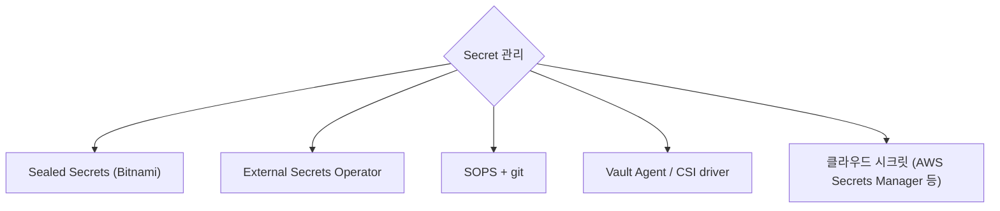

## 정의

| | ConfigMap | Secret |
|---|---|---|
| 데이터 | 평문 | base64 (*암호화 아님*) |
| 크기 | 1MB | 1MB |
| 용도 | 설정 | 비밀 |
| RBAC | 일반 | *더 엄격 권장* |
| 저장 (etcd) | 평문 | *암호화 가능* (EncryptionConfiguration) |

> [!IMPORTANT]
> *Secret = base64* 만으로는 *암호화 아님*. *etcd encryption at rest* + RBAC 으로 보호.

## ConfigMap 예시

```yaml
apiVersion: v1
kind: ConfigMap
metadata: { name: app-config }
data:
  log_level: "info"
  db_host: "db.production"
  feature_flags: |
    new_ui: true
    beta_search: false
```

## Secret 예시

```yaml
apiVersion: v1
kind: Secret
metadata: { name: db-creds }
type: Opaque
data:
  username: a29h           # base64(koa)
  password: cGFzc3dvcmQ=   # base64(password)
```

## Pod 에서 사용

### 1. 환경 변수

```yaml
spec:
  containers:
    - name: app
      image: app:v1
      env:
        - name: LOG_LEVEL
          valueFrom:
            configMapKeyRef: { name: app-config, key: log_level }
        - name: DB_PASSWORD
          valueFrom:
            secretKeyRef: { name: db-creds, key: password }
      envFrom:
        - configMapRef: { name: app-config }    # 전체 import
        - secretRef: { name: db-creds }
```

### 2. Volume mount

```yaml
spec:
  containers:
    - name: app
      volumeMounts:
        - name: config-vol
          mountPath: /etc/config
        - name: secret-vol
          mountPath: /etc/secrets
          readOnly: true
  volumes:
    - name: config-vol
      configMap: { name: app-config }
    - name: secret-vol
      secret: { secretName: db-creds }
```

> [!TIP]
> Volume mount 의 *장점*: ConfigMap 갱신 → *자동 반영* (수십 초). env var 는 *pod 재시작* 필요.

## Secret 관리 패턴 (절대 git 에 평문 금지!)



### 1. Sealed Secrets

```bash
# 일반 secret 작성
kubectl create secret generic db --from-literal=password=xxx --dry-run -o yaml > secret.yaml

# kubeseal 로 암호화 (cluster 의 public key 사용)
kubeseal -f secret.yaml -w sealed-secret.yaml
# sealed-secret.yaml 은 git 에 안전하게 commit 가능
```

### 2. External Secrets Operator

```yaml
apiVersion: external-secrets.io/v1beta1
kind: ExternalSecret
metadata: { name: db-creds }
spec:
  refreshInterval: 1h
  secretStoreRef:
    name: aws-secrets-manager
    kind: ClusterSecretStore
  target: { name: db-creds }
  data:
    - secretKey: password
      remoteRef: { key: prod/db, property: password }
```

> AWS Secrets Manager / GCP Secret Manager / Vault 에서 *동기화*.

### 3. SOPS

git 에 *암호화된 YAML* commit. KMS / age 키로 복호화.

## 흔한 함정

> [!WARNING]
> 1. **`echo secret | base64` 가 *암호화* 라고 오해** = base64 는 인코딩일 뿐. 디코드 1줄.
> 2. **Secret 을 git 에 평문** = *치명적*. SOPS / Sealed Secrets / ExternalSecret 으로.
> 3. **etcd encryption at rest 안 켬** = root 권한자가 etcd 직접 → 모든 secret 노출.
> 4. **너무 큰 ConfigMap (1MB+)** = 거절. 큰 데이터는 *volume* (PVC, S3 mount).
> 5. **env var 갱신 안 됨** = ConfigMap 변경 후 *pod 재시작* 필요. volume mount 는 자동.

## 관련 위키

- [[k8s-pod]]
- [[k8s-deployment]]
- [[aws-secrets-manager]]
- [[aws-kms]]
