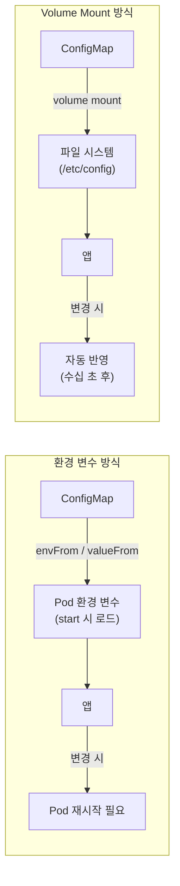
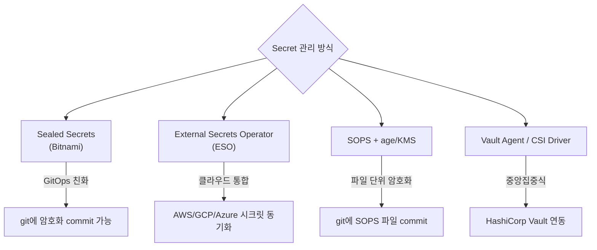

## 정의

**ConfigMap** 과 **Secret** 은 컨테이너 이미지에서 설정/비밀 값을 분리하기 위한 Kubernetes 리소스.

| 항목 | ConfigMap | Secret |
|:---|:---|:---|
| 데이터 | 평문 (UTF-8) | base64 인코딩 |
| 크기 제한 | 1 MiB | 1 MiB |
| 용도 | 비민감 설정 | 비밀 (비밀번호, 토큰, 인증서) |
| etcd 저장 | 평문 | 평문 (EncryptionConfiguration 설정 시 암호화) |
| RBAC 권고 | 일반 | 엄격한 제한 권고 |
| 기본 마운트 | 일반 volume | `tmpfs` (in-memory) |

> [!IMPORTANT]
> **Secret = base64 는 암호화가 아니다.** `echo "password" | base64` 한 줄로 복호화됨. 진짜 보안은 etcd encryption at rest + RBAC + 외부 시크릿 관리(ESO, Vault) 로 달성.

## ConfigMap

### ConfigMap 생성

```yaml
apiVersion: v1
kind: ConfigMap
metadata:
  name: app-config
  namespace: production
data:
  # 단순 키-값
  log_level: "info"
  db_host: "db.production.svc.cluster.local"
  max_connections: "100"

  # 여러 줄 (파일 내용)
  feature_flags: |
    new_ui: true
    beta_search: false
    dark_mode: true

  # nginx.conf 파일 통째로
  nginx.conf: |
    worker_processes auto;
    events { worker_connections 1024; }
    http {
      server {
        listen 80;
        location / { proxy_pass http://backend:8080; }
      }
    }
```

### CLI 생성

```bash
# 파일에서
kubectl create configmap nginx-config --from-file=nginx.conf

# 리터럴에서
kubectl create configmap app-env \
  --from-literal=log_level=info \
  --from-literal=db_host=db.prod

# 여러 파일 디렉토리에서
kubectl create configmap configs --from-file=./configs/
```

## Secret

### Secret 생성 (YAML)

```yaml
apiVersion: v1
kind: Secret
metadata:
  name: db-creds
  namespace: production
type: Opaque
data:
  # base64 인코딩 값 (echo -n "value" | base64)
  username: a29h                # base64("koa")
  password: cGFzc3dvcmQ=        # base64("password")

# stringData: 평문으로 작성 (쿠버네티스가 자동 base64)
stringData:
  api_key: "sk-prod-xxxxxxx"    # 평문 OK (stringData 필드)
```

### Secret 타입

| `type` | 용도 |
|:---|:---|
| `Opaque` (기본) | 임의 비밀 데이터 |
| `kubernetes.io/dockerconfigjson` | 프라이빗 레지스트리 인증 |
| `kubernetes.io/tls` | TLS 인증서 (`tls.crt`, `tls.key`) |
| `kubernetes.io/service-account-token` | 서비스 어카운트 토큰 |
| `kubernetes.io/ssh-auth` | SSH 인증 키 |

```bash
# 프라이빗 레지스트리 secret
kubectl create secret docker-registry regcred \
  --docker-server=registry.example.com \
  --docker-username=admin \
  --docker-password=secret \
  --docker-email=admin@example.com

# TLS secret
kubectl create secret tls tls-secret \
  --cert=server.crt \
  --key=server.key
```

## Pod 에서 사용

### 1. 환경 변수 (개별)

```yaml
spec:
  containers:
    - name: app
      image: app:v1
      env:
        - name: LOG_LEVEL
          valueFrom:
            configMapKeyRef:
              name: app-config
              key: log_level
        - name: DB_PASSWORD
          valueFrom:
            secretKeyRef:
              name: db-creds
              key: password
        - name: DB_HOST
          valueFrom:
            configMapKeyRef:
              name: app-config
              key: db_host
```

### 2. 환경 변수 (전체 import)

```yaml
spec:
  containers:
    - name: app
      envFrom:
        - configMapRef:
            name: app-config     # ConfigMap 의 모든 키가 env 로
        - secretRef:
            name: db-creds       # Secret 의 모든 키가 env 로
```

### 3. Volume mount (파일로 마운트)

```yaml
spec:
  containers:
    - name: app
      volumeMounts:
        - name: config-vol
          mountPath: /etc/config
          readOnly: true
        - name: secret-vol
          mountPath: /etc/secrets
          readOnly: true
        - name: nginx-conf
          mountPath: /etc/nginx/nginx.conf
          subPath: nginx.conf      # 특정 키만 단일 파일로
  volumes:
    - name: config-vol
      configMap:
        name: app-config
        items:                    # 특정 키만 선택 (선택적)
          - key: feature_flags
            path: feature_flags.yaml
    - name: secret-vol
      secret:
        secretName: db-creds
        defaultMode: 0400         # read-only (소유자만)
    - name: nginx-conf
      configMap:
        name: app-config
```

### env vs volume mount 비교



| 항목 | 환경 변수 | Volume Mount |
|:---|:---|:---|
| 로드 시점 | Pod 시작 시 | 실행 중 갱신 가능 |
| ConfigMap 변경 반영 | Pod 재시작 필요 | 자동 반영 (kubelet sync) |
| 접근 방식 | `os.getenv()` | 파일 읽기 |
| 대용량 데이터 | 비권장 | 적합 |
| 민감 데이터 | 프로세스 환경에 노출 | 파일 권한으로 제어 |

> [!TIP]
> **설정 Hot Reload** 가 필요하면 Volume Mount 를 사용하고, 앱이 파일 변경을 감지(inotify)하도록 구현. 환경 변수는 Pod 재시작 없이 변경 불가.

## Immutable ConfigMap / Secret

쿠버네티스 1.21+ 에서 `immutable: true` 지원.

```yaml
apiVersion: v1
kind: ConfigMap
metadata:
  name: app-config-v1
immutable: true    # 이 ConfigMap 은 변경 불가
data:
  version: "1.0.0"
  config: "..."
```

**장점**:
- etcd 의 변경 감시(watch) 부하 제거 (수천 개 ConfigMap 이 있는 클러스터에서 유의미)
- 실수로 설정 변경 방지
- 변경이 필요하면 새 이름으로 새 ConfigMap 생성 후 Pod 업데이트 (GitOps 친화적)

```bash
# immutable ConfigMap 변경 시도 (실패)
kubectl patch configmap app-config-v1 --patch '{"data":{"new_key":"value"}}'
# Error: configmap "app-config-v1" is immutable
```

## Secret 관리: git 에 평문 절대 금지



### 1. Sealed Secrets (Bitnami)

클러스터의 공개키로 Secret 을 암호화. 복호화는 클러스터 안에서만 가능.

```bash
# Sealed Secrets 컨트롤러 설치
helm install sealed-secrets \
  oci://registry-1.docker.io/bitnamicharts/sealed-secrets \
  -n kube-system

# 클러스터 공개키 가져오기
kubeseal --fetch-cert > pub-cert.pem

# Secret 생성 (임시)
kubectl create secret generic db-creds \
  --from-literal=password=MySecret123 \
  --dry-run=client -o yaml > secret.yaml

# SealedSecret 으로 암호화
kubeseal --cert pub-cert.pem -f secret.yaml -w sealed-secret.yaml

# git 에 안전하게 커밋
git add sealed-secret.yaml && git commit -m "add sealed db-creds"
```

SealedSecret 을 git 에 올리면 ArgoCD/Flux 가 자동으로 클러스터에 복호화 적용.

### 2. External Secrets Operator (ESO)

클라우드 시크릿 관리 서비스(AWS Secrets Manager, GCP Secret Manager, Vault 등)와 K8s Secret 을 동기화.

```yaml
# ClusterSecretStore: 시크릿 소스 설정
apiVersion: external-secrets.io/v1beta1
kind: ClusterSecretStore
metadata:
  name: aws-secrets-manager
spec:
  provider:
    aws:
      service: SecretsManager
      region: ap-northeast-2
      auth:
        jwt:
          serviceAccountRef:
            name: external-secrets-sa
            namespace: external-secrets

---
# ExternalSecret: 동기화 규칙
apiVersion: external-secrets.io/v1beta1
kind: ExternalSecret
metadata:
  name: db-creds
  namespace: production
spec:
  refreshInterval: 1h                # 1시간마다 동기화
  secretStoreRef:
    name: aws-secrets-manager
    kind: ClusterSecretStore
  target:
    name: db-creds                   # 생성할 K8s Secret 이름
    creationPolicy: Owner
  data:
    - secretKey: password            # K8s Secret 의 키
      remoteRef:
        key: prod/myapp/db           # AWS Secrets Manager 경로
        property: password           # JSON 필드
    - secretKey: username
      remoteRef:
        key: prod/myapp/db
        property: username
```

### 3. SOPS (Secrets OPerationS)

파일 자체를 암호화해서 git 에 커밋. age 또는 AWS KMS 키로 복호화.

```bash
# Secret YAML 암호화 (age 키 사용)
sops -e -i secrets/db-creds.yaml
# 복호화 후 적용 (CI/CD)
sops -d secrets/db-creds.yaml | kubectl apply -f -
```

### 4. 관리 방식 비교

| 방식 | GitOps 친화성 | 클라우드 의존 | 학습 비용 | 시크릿 로테이션 |
|:---|:---:|:---:|:---:|:---:|
| Sealed Secrets | 높음 | 없음 | 낮음 | 수동 재암호화 |
| ESO | 중간 | 높음 | 중간 | 자동 (refreshInterval) |
| SOPS | 높음 | KMS 선택적 | 중간 | 수동 |
| Vault Agent | 낮음 | 없음 | 높음 | 자동 |

## etcd Encryption at Rest

Secret 이 etcd 에 암호화 저장되도록 kube-apiserver 옵션 설정:

```bash
# kube-apiserver flag
--encryption-provider-config=/etc/kubernetes/encryption-config.yaml

# 기존 Secret 재암호화 (적용 후)
kubectl get secrets --all-namespaces -o json | kubectl replace -f -
```

## 흔한 함정

> [!WARNING]
> 1. **base64 = 암호화** 오해: base64 는 인코딩. `echo "dGVzdA==" | base64 -d` 한 줄이면 복호화. 실제 보안은 etcd encryption + RBAC.
> 2. **Secret 을 git 에 평문 커밋**: 한 번 노출된 비밀은 히스토리에 남음. `git filter-repo` 로 지워야. Sealed Secrets/ESO/SOPS 사용.
> 3. **env var 갱신 안 됨**: ConfigMap 변경 후 환경변수로 주입된 Pod 는 재시작 필요. Volume Mount 로 hot-reload 구현.
> 4. **너무 큰 ConfigMap (1MiB+)**: 거절됨. 큰 데이터(ML 모델, 바이너리)는 PVC, S3 mount, init container 로 처리.
> 5. **etcd encryption 미설정**: 클러스터 관리자가 etcd 직접 접근 시 모든 Secret 평문 노출. 프로덕션에서는 반드시 설정.
> 6. **Secret RBAC 미설정**: default ServiceAccount 에 Secret 읽기 권한 부여되면 모든 Pod 가 Secret 접근 가능. 최소 권한 원칙 적용.
> 7. **immutable 사용 시 변경 방법 혼동**: immutable ConfigMap 수정 불가. 새 이름(v2, hash suffix)으로 생성 후 Pod 롤링 업데이트.

## 관련 위키

- [[k8s-pod]] - ConfigMap/Secret 을 사용하는 Pod 기본
- [[k8s-deployment]] - Secret 포함한 배포 관리
- [[k8s-rbac]] - Secret 접근 제어 (Role, RoleBinding)
- [[k8s-kustomize]] - Kustomize 로 환경별 ConfigMap 관리
- [[k8s-admission-controllers]] - Secret 정책 강제 (OPA Gatekeeper)
- [[aws-secrets-manager]] - ESO 의 백엔드 (AWS)
- [[aws-kms]] - SOPS 또는 etcd 암호화에 사용되는 KMS
