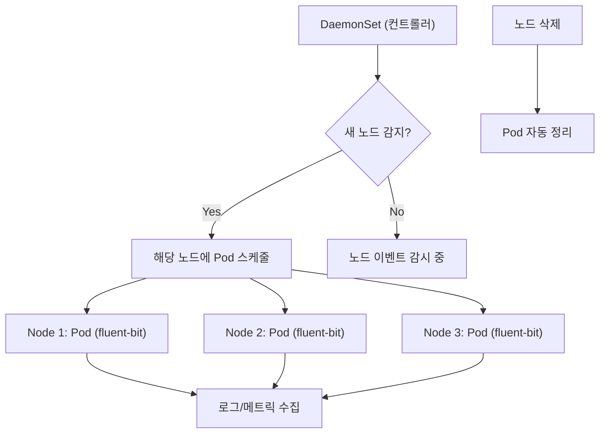
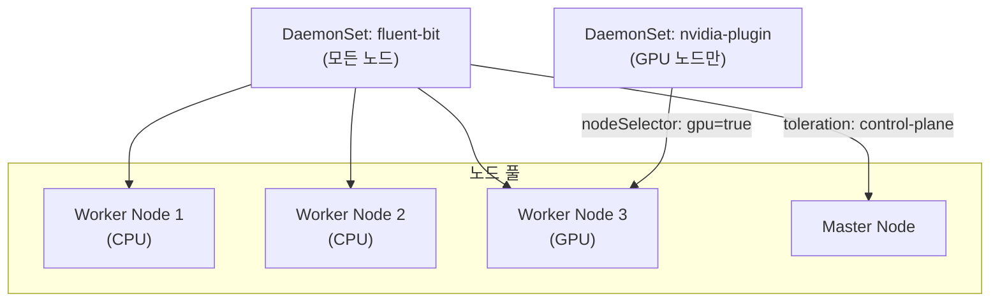
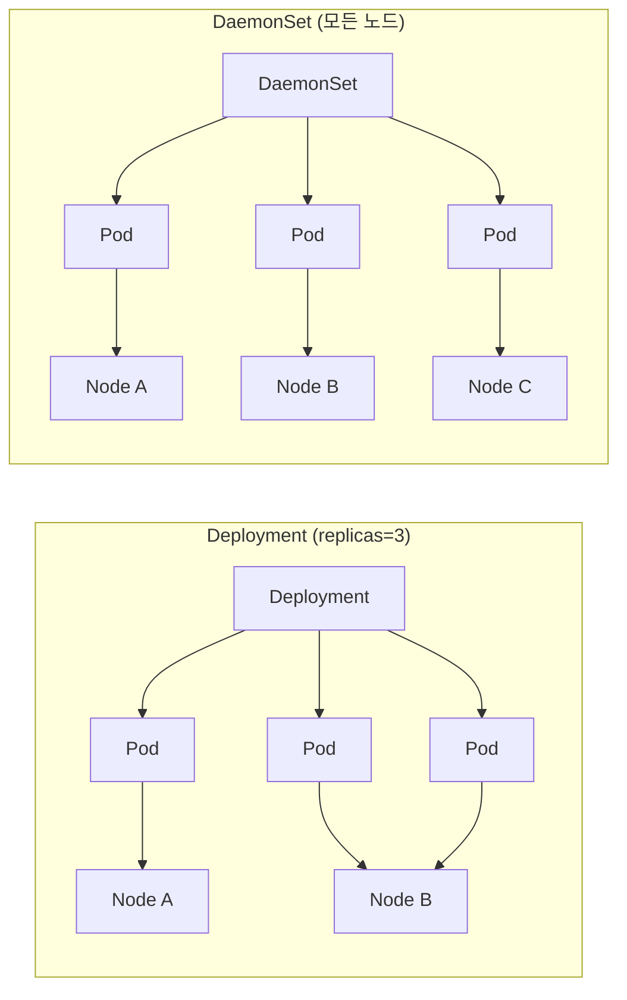

## 정의

**DaemonSet** 은 클러스터의 *각 노드에 정확히 1개의 Pod* 을 보장하는 워크로드 리소스. 노드가 추가되면 자동으로 Pod 가 배포되고, 노드가 제거되면 자동으로 정리된다.

Deployment 가 "N 개의 replicas" 를 어딘가에 배치한다면, DaemonSet 은 "모든 노드마다 1개" 를 보장한다.

## 언제 쓰이나

| 카테고리 | 예시 |
|:---|:---|
| **로그 수집** | fluent-bit, fluentd, vector, filebeat |
| **메트릭 수집** | node-exporter, datadog-agent, dynatrace-oneagent |
| **네트워크 플러그인** | calico-node, cilium, kube-proxy, flannel |
| **스토리지 드라이버** | csi-driver-nfs, longhorn-manager |
| **보안/감사** | falco, sysdig-agent, aqua-enforcer |
| **GPU 드라이버** | nvidia-device-plugin, amd-gpu-plugin |

## 동작 원리



DaemonSet 컨트롤러는 kube-controller-manager 안에 내장. 클러스터 이벤트를 감시하며 노드와 Pod 수를 일치시킨다.

## 기본 YAML: fluent-bit 로그 수집

```yaml
apiVersion: apps/v1
kind: DaemonSet
metadata:
  name: fluent-bit
  namespace: logging
  labels:
    app: fluent-bit
spec:
  selector:
    matchLabels:
      app: fluent-bit
  template:
    metadata:
      labels:
        app: fluent-bit
    spec:
      serviceAccountName: fluent-bit
      tolerations:
        - operator: Exists          # 모든 taint 무시: master/control-plane 포함
      hostNetwork: false
      containers:
        - name: fluent-bit
          image: fluent/fluent-bit:3.0
          resources:
            requests:
              cpu: 50m
              memory: 50Mi
            limits:
              cpu: 200m
              memory: 200Mi
          volumeMounts:
            - name: varlog
              mountPath: /var/log
              readOnly: true
            - name: containers
              mountPath: /var/lib/docker/containers
              readOnly: true
            - name: config
              mountPath: /fluent-bit/etc/
      volumes:
        - name: varlog
          hostPath:
            path: /var/log
        - name: containers
          hostPath:
            path: /var/lib/docker/containers
        - name: config
          configMap:
            name: fluent-bit-config
```

## node-exporter: Prometheus 메트릭 수집

```yaml
apiVersion: apps/v1
kind: DaemonSet
metadata:
  name: node-exporter
  namespace: monitoring
spec:
  selector:
    matchLabels:
      app: node-exporter
  template:
    metadata:
      labels:
        app: node-exporter
    spec:
      tolerations:
        - effect: NoSchedule
          operator: Exists
      hostPID: true              # 노드 프로세스 정보 접근
      hostIPC: true
      hostNetwork: true          # 노드 네트워크 스택 직접 접근
      containers:
        - name: node-exporter
          image: prom/node-exporter:v1.8.0
          ports:
            - containerPort: 9100
              hostPort: 9100     # 노드 포트 직접 바인딩
          args:
            - "--path.procfs=/host/proc"
            - "--path.sysfs=/host/sys"
            - "--path.rootfs=/host/root"
            - "--collector.filesystem.mount-points-exclude=^/(sys|proc|dev)($|/)"
          volumeMounts:
            - name: proc
              mountPath: /host/proc
              readOnly: true
            - name: sys
              mountPath: /host/sys
              readOnly: true
            - name: root
              mountPath: /host/root
              mountPropagation: HostToContainer
              readOnly: true
      volumes:
        - name: proc
          hostPath: { path: /proc }
        - name: sys
          hostPath: { path: /sys }
        - name: root
          hostPath: { path: / }
```

## Tolerations: 특정 노드 포함/제외

DaemonSet 은 기본적으로 `node.kubernetes.io/unschedulable` 등 일부 taint 를 자동으로 tolerate 한다. 하지만 **사용자 정의 taint** 는 명시해야 한다.

```yaml
spec:
  template:
    spec:
      tolerations:
        # 모든 taint 무시 (master 포함, 권장 설정)
        - operator: Exists

        # 특정 taint 만 허용
        - key: "node-role.kubernetes.io/control-plane"
          effect: NoSchedule
          operator: Exists

        # GPU 노드 포함
        - key: "nvidia.com/gpu"
          effect: NoSchedule
          operator: Exists

        # 특정 팀 노드만 (Equal)
        - key: "team"
          value: "infra"
          effect: NoSchedule
          operator: Equal
```

## Node Selector: 특정 노드만 대상

GPU 드라이버, ARM 전용 에이전트 등 특정 노드만 필요할 때:

```yaml
spec:
  template:
    spec:
      nodeSelector:
        kubernetes.io/os: linux
        accelerator: nvidia-tesla-v100

      # 더 유연한 nodeAffinity
      affinity:
        nodeAffinity:
          requiredDuringSchedulingIgnoredDuringExecution:
            nodeSelectorTerms:
              - matchExpressions:
                  - key: node-type
                    operator: In
                    values: ["gpu", "high-memory"]
```

### 노드 토폴로지 예시



## UpdateStrategy: 안전한 업데이트

DaemonSet 업데이트 전략을 설정하지 않으면 기본은 `RollingUpdate`.

```yaml
spec:
  updateStrategy:
    type: RollingUpdate
    rollingUpdate:
      maxUnavailable: 1    # 동시에 최대 1개 노드에서 재시작

  # 또는 OnDelete: kubectl delete pod 시만 업데이트
  # updateStrategy:
  #   type: OnDelete
```

| 전략 | 동작 | 사용 시점 |
|:---|:---|:---|
| `RollingUpdate` (기본) | 순차적으로 pod 교체, maxUnavailable 제어 | 일반적인 업데이트 |
| `OnDelete` | pod 수동 삭제 시에만 새 버전 시작 | 노드별 제어가 필요할 때 |

> [!IMPORTANT]
> `maxUnavailable: 1` 로 설정하면 한 번에 1개 노드에서만 재시작. 로그/메트릭 수집 공백을 최소화. 클러스터가 100+ 노드면 `maxUnavailable: 10%` 처럼 비율로 지정 가능.

## 고급 패턴

### init container 로 노드 초기화

```yaml
spec:
  template:
    spec:
      initContainers:
        - name: install-cni
          image: calico/cni:v3.27.0
          command: ["/install-cni.sh"]
          securityContext:
            privileged: true
          volumeMounts:
            - name: cni-bin
              mountPath: /host/opt/cni/bin
      containers:
        - name: calico-node
          # ...
```

### 환경변수로 노드 정보 주입

```yaml
spec:
  template:
    spec:
      containers:
        - name: agent
          env:
            - name: NODE_NAME
              valueFrom:
                fieldRef:
                  fieldPath: spec.nodeName
            - name: NODE_IP
              valueFrom:
                fieldRef:
                  fieldPath: status.hostIP
            - name: POD_IP
              valueFrom:
                fieldRef:
                  fieldPath: status.podIP
```

이렇게 하면 에이전트가 자신이 어떤 노드에서 실행 중인지 알 수 있다.

## Deployment 와 비교



| 항목 | Deployment | DaemonSet |
|:---|:---|:---|
| Pod 수 | 지정한 replicas 수 | 노드 수와 동일 |
| 스케줄 결정 | kube-scheduler | DaemonSet 컨트롤러 직접 |
| 주 용도 | 앱 서비스 | 인프라 에이전트 |
| 노드 신규 추가 | 재스케줄 없음 | 자동 배포 |
| HPA 연동 | 가능 | 없음 (노드 수가 replica) |

## 흔한 함정

> [!WARNING]
> 1. **Tolerations 누락** = control-plane 노드나 taint 있는 워커 노드에 Pod 가 배치 안 됨. 로그/메트릭 공백 발생. `operator: Exists` 로 전체 허용하거나 명시적 taint 나열.
> 2. **Resource limit 너무 작음** = 트래픽 많은 노드에서 OOM 발생. 노드 크기 비례로 limit 설정. memory: 200Mi 이상 권장.
> 3. **hostNetwork 부주의** = 노드 포트 직접 바인딩 → 포트 충돌 위험. 반드시 `hostPort` 고정 또는 Headless Service 사용.
> 4. **maxUnavailable 기본값** = 기본 maxUnavailable=1. 100개 노드면 업데이트에 수십 분 소요. 비율 지정으로 조정 가능.
> 5. **네임스페이스 간 로그 접근** = fluent-bit 이 `/var/log/containers` 접근 시 모든 네임스페이스 로그가 노출. RBAC + network policy 로 수집 대상 제한.
> 6. **DaemonSet 으로 앱 배포** = 서비스 Pod 를 DaemonSet 으로 배포 금지. 노드 증설마다 자동 복제됨. Deployment 사용.

## 관련 위키

- [[k8s-pod]] - DaemonSet 이 생성하는 Pod 기본
- [[k8s-deployment]] - 복제본 기반 워크로드 비교
- [[k8s-scheduling]] - 노드 선택 메커니즘 (affinity, taint/toleration)
- [[k8s-resource-management]] - requests/limits 설정
- [[k8s-namespace]] - 로그 수집 네임스페이스 분리
- [[prometheus]] - node-exporter 로 수집한 메트릭 처리
- [[opentelemetry]] - 분산 트레이싱 에이전트 DaemonSet 배포
