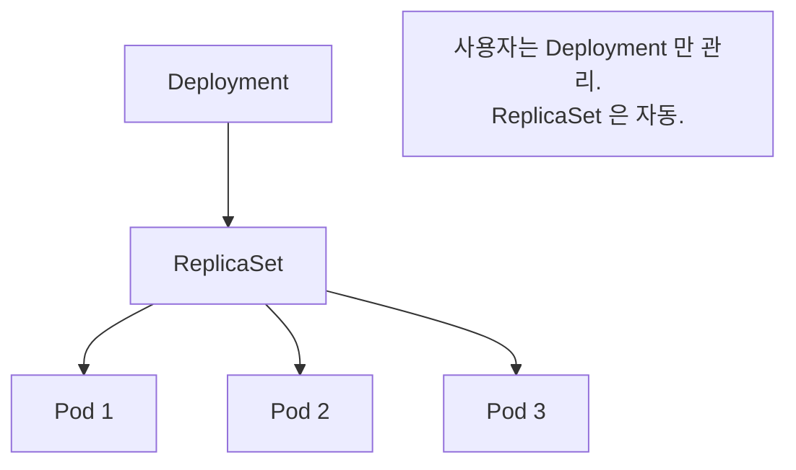
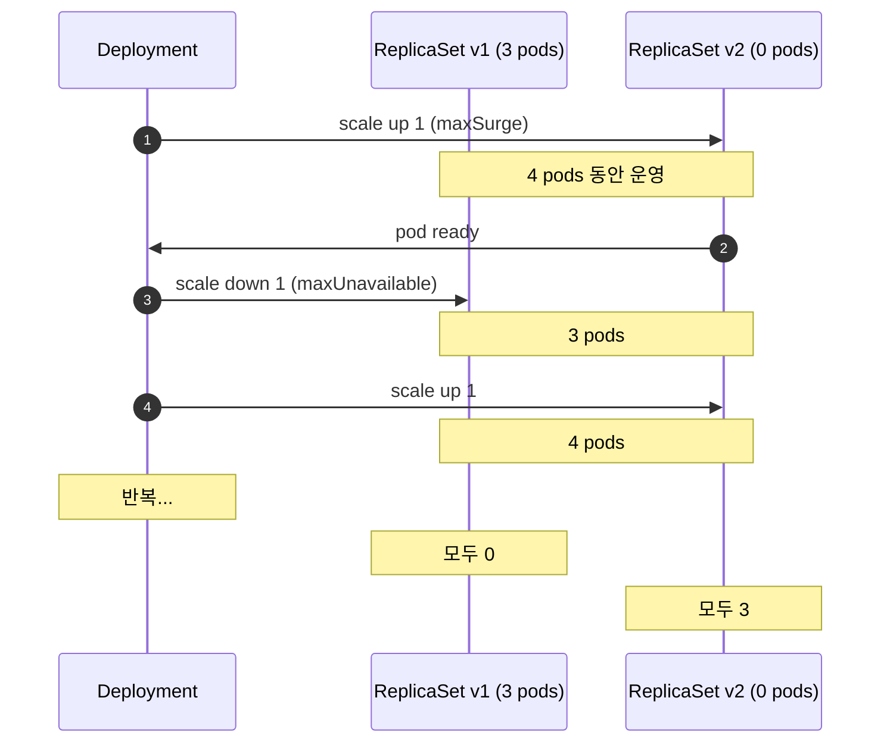
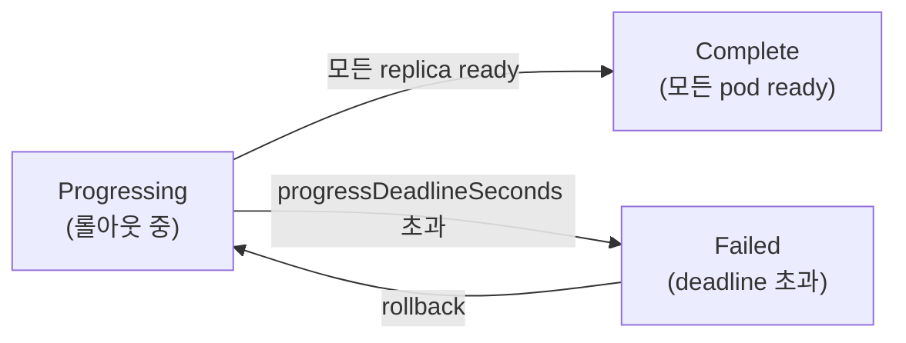

## 정의

**Deployment** = *stateless 워크로드를 위한 컨트롤러*. 내부적으로 *ReplicaSet 관리 + rolling update / rollback*.

## 사용 시나리오

| 상황 | Deployment 역할 |
|---|---|
| Stateless API / Web 배포 | replica 수 보장 + rolling update |
| 이미지 버전 업그레이드 | 무중단 rolling update |
| 배포 실패 시 복구 | revision history 로 rollback |
| 점진적 배포 | maxSurge / maxUnavailable 조절 |

## 계층



| 객체 | 책임 |
|---|---|
| Deployment | 원하는 상태 + rollout 전략 |
| ReplicaSet | replica 수 보장 |
| Pod | 실제 워크로드 |

## YAML

```yaml
apiVersion: apps/v1
kind: Deployment
metadata:
  name: web
spec:
  replicas: 3
  selector:
    matchLabels: { app: web }
  strategy:
    type: RollingUpdate
    rollingUpdate:
      maxUnavailable: 1
      maxSurge: 1
  minReadySeconds: 10           # 새 pod ready 후 추가 10초 대기
  progressDeadlineSeconds: 300  # 5분 내 완료 안 되면 Failed
  revisionHistoryLimit: 10
  template:
    metadata:
      labels: { app: web }
    spec:
      containers:
        - name: nginx
          image: nginx:1.27
          ports:
            - containerPort: 80
          readinessProbe:
            httpGet: { path: /, port: 80 }
            initialDelaySeconds: 5
            periodSeconds: 5
          resources:
            requests:
              cpu: 100m
              memory: 128Mi
            limits:
              cpu: 500m
              memory: 512Mi
```

## Rolling Update



| 옵션 | 의미 | 기본 |
|---|---|---|
| `maxUnavailable` | 동시에 *불가용* 될 수 있는 pod 수 (또는 %) | 25% |
| `maxSurge` | 동시에 *추가* 될 수 있는 pod 수 | 25% |

> [!TIP]
> *짧은 maxUnavailable + 짧은 maxSurge* = 안전 + 느림. *zero-downtime* + readiness probe 필수.

## Recreate Strategy

```yaml
strategy:
  type: Recreate
```

- 옛 pod *모두 종료* → 새 pod 시작.
- *다운타임 발생*.
- *DB schema 마이그레이션* 같이 *두 버전 동시 운영 불가* 한 경우.

## 배포 상태 흐름



- `progressDeadlineSeconds` 기본 600초. 이 시간 내 *진행 없으면 `Failed` 마킹*.
- `minReadySeconds` = 새 pod 가 ready 된 후 *추가 대기 시간*. 실제 트래픽 안정화 확인용.

## ConfigMap / Secret 주입

```yaml
spec:
  containers:
    - name: app
      image: myapp:1.0
      env:
        - name: DB_HOST
          valueFrom:
            configMapKeyRef:
              name: app-config
              key: db_host
        - name: DB_PASSWORD
          valueFrom:
            secretKeyRef:
              name: app-secret
              key: db_password
      envFrom:
        - configMapRef:
            name: app-config    # ConfigMap 의 모든 key → env
```

> ConfigMap/Secret 변경 시 *pod 재시작 필요* (envFrom). 실시간 반영은 *volumeMount + 파일 감시* 패턴.

## Rollout 명령

```bash
kubectl rollout status deployment/web        # 진행 상황
kubectl rollout history deployment/web        # 이전 버전 목록
kubectl rollout undo deployment/web           # 이전 버전으로 롤백
kubectl rollout undo deployment/web --to-revision=3
kubectl rollout restart deployment/web        # 모든 pod 재시작 (rolling)
kubectl rollout pause deployment/web          # rollout 일시 정지 (canary 용)
kubectl rollout resume deployment/web
```

## Canary / Blue-Green (Deployment 만으로는 부족)

Deployment 의 *기본 rolling* 은 *부분 canary*. *진짜 canary / blue-green* 은:

- **Istio / Linkerd**: traffic 분배 5%, 20%, 50%, 100%
- **Argo Rollouts**: 정식 canary / blue-green
- **Flagger**: progressive delivery 자동화

자세한 건 [[Zero Downtime Deployment]] 참고.

## Revision History

```yaml
spec:
  revisionHistoryLimit: 10   # 기본 10. 옛 ReplicaSet 보관 수
```

```bash
kubectl get rs   # 옛 ReplicaSet 들이 있음 (replica=0)
```

## 헬스 체크 3종

```yaml
spec:
  containers:
    - name: app
      livenessProbe:        # 실패 시 pod 재시작
        httpGet: { path: /healthz, port: 8080 }
        initialDelaySeconds: 15
        failureThreshold: 3
      readinessProbe:       # 실패 시 Service 에서 제외
        httpGet: { path: /ready, port: 8080 }
        periodSeconds: 5
      startupProbe:         # 느린 앱 초기화 대기 (1.18+)
        httpGet: { path: /healthz, port: 8080 }
        failureThreshold: 30
        periodSeconds: 10   # 최대 300초 대기
```

| 프로브 | 실패 시 동작 | 용도 |
|---|---|---|
| `livenessProbe` | pod 재시작 | 데드락 / 무한루프 감지 |
| `readinessProbe` | Service 엔드포인트 제거 | 트래픽 차단 (배포 중) |
| `startupProbe` | 초기화 완료 전 다른 프로브 비활성 | 느린 앱 초기화 |

> [!TIP]
> *startupProbe 없이 livenessProbe 만* 쓰면 느린 앱이 *초기화 중 재시작 루프* 에 빠짐.

## PodDisruptionBudget

노드 드레인 / 클러스터 업그레이드 시 *pod 가용성 최소 보장*.

```yaml
apiVersion: policy/v1
kind: PodDisruptionBudget
metadata:
  name: web-pdb
spec:
  minAvailable: 2          # 최소 2개 항상 유지
  # maxUnavailable: 1      # 또는 최대 1개까지 중단 허용
  selector:
    matchLabels: { app: web }
```

> [!TIP]
> PDB 없으면 `kubectl drain` 이 *모든 pod 를 동시에 퇴거* 할 수 있음. *3개 replica + minAvailable: 2* 조합이 안전.

## 흔한 함정

> [!WARNING]
> 1. **`readinessProbe` 없음** = rolling update 가 *준비 안 된 pod 도 ready* 로 인식 → *503 폭증*.
> 2. **`maxSurge=0`** = 새 pod 만들기 전에 옛 pod 죽임 → 일시 *capacity 부족*.
> 3. **이미지 tag `latest`** = `kubectl rollout restart` 안 하면 *새 이미지 안 받음*. 항상 *명시 tag* (sha).
> 4. **Resource limits 없이** = 한 pod 가 *node 자원 독점* → 다른 pod throttle.
> 5. **minReadySeconds 미설정** = 새 pod 가 ready 직후 바로 old 삭제 → *실제 트래픽 오류 가능*.

## 관련 위키

- [[k8s-pod]]
- [[k8s-service]]
- [[k8s-statefulset]]
- [[k8s-hpa-vpa]]
- [[Zero Downtime Deployment]]
