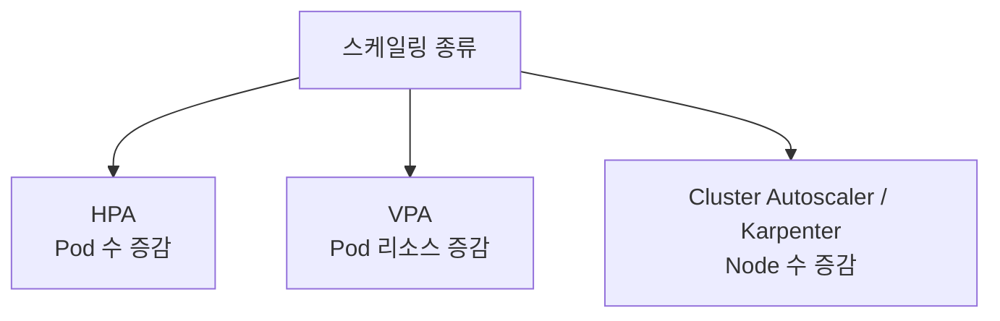
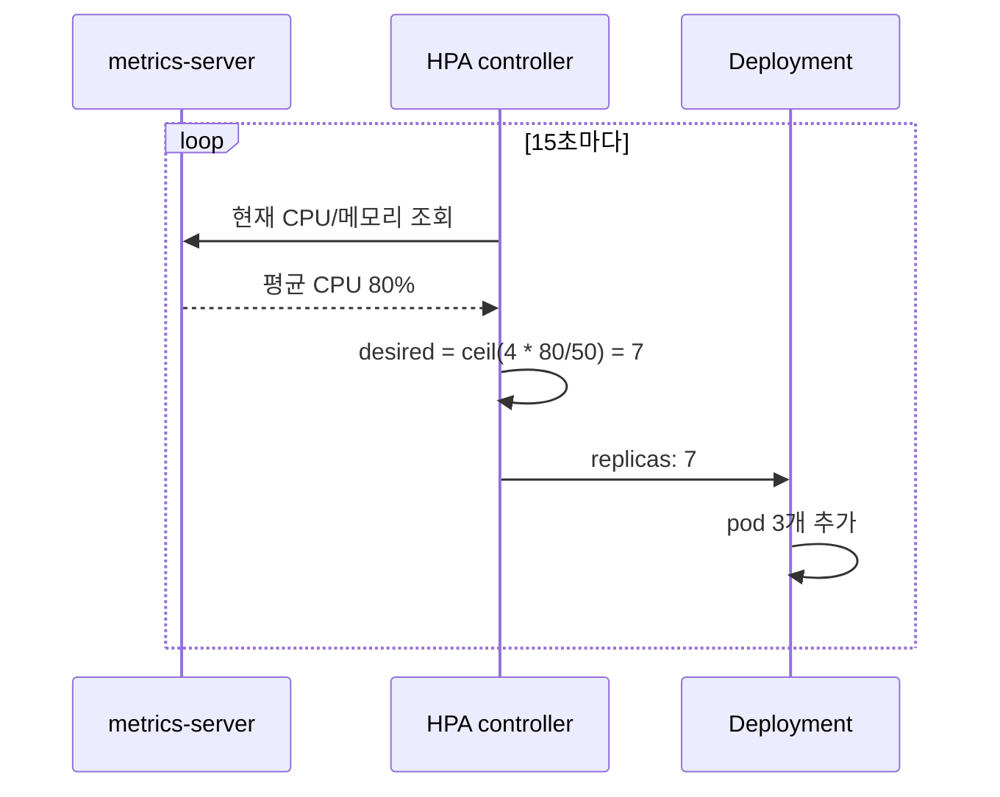
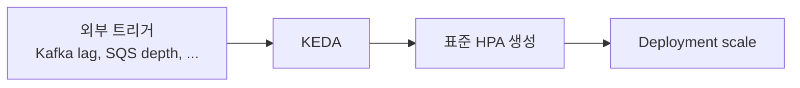
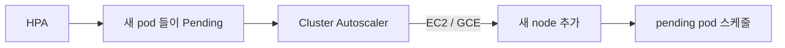

## 정의

*Pod 를 자동으로 확장/축소*하는 K8s 메커니즘. 세 가지 레벨:

| 레벨 | 도구 | 무엇을 확장 |
|---|---|---|
| Pod 수 | HPA / KEDA | 동일 spec pod 추가/삭제 |
| Pod 크기 | VPA | CPU/Memory request/limit 조절 |
| Node 수 | Cluster Autoscaler / Karpenter | node 추가/삭제 |

## 3가지 스케일링



## HPA (Horizontal Pod Autoscaler)

CPU / Memory / custom metric 기반 *pod 수 조정*.

```yaml
apiVersion: autoscaling/v2
kind: HorizontalPodAutoscaler
metadata: { name: web }
spec:
  scaleTargetRef:
    apiVersion: apps/v1
    kind: Deployment
    name: web
  minReplicas: 3
  maxReplicas: 50
  metrics:
    - type: Resource
      resource:
        name: cpu
        target: { type: Utilization, averageUtilization: 70 }
    - type: Pods
      pods:
        metric: { name: http_requests_per_second }
        target: { type: AverageValue, averageValue: "1000" }
  behavior:
    scaleUp:
      stabilizationWindowSeconds: 0
      policies:
        - type: Percent
          value: 100
          periodSeconds: 15
    scaleDown:
      stabilizationWindowSeconds: 300
      policies:
        - type: Percent
          value: 10
          periodSeconds: 60
```

## HPA 알고리즘

```
desired = ceil(currentReplicas × (currentMetric / targetMetric))
```

예: 현재 4 pod, CPU 80%, 목표 50%:
- desired = ceil(4 × (80/50)) = 7 pod

## HPA 제어 루프



- *stabilizationWindowSeconds*: scale down 은 기본 300초 대기 후 결정
- *scaleDown.policies*: 한 번에 10% 씩, 60초 간격으로 축소

## Custom Metrics: Prometheus Adapter

HPA 에서 커스텀 메트릭을 사용하려면 *Prometheus Adapter* 로 메트릭을 K8s Custom Metrics API 에 노출:

```yaml
# prometheus-adapter ConfigMap (간략)
rules:
  - seriesQuery: 'http_requests_total{namespace!="",pod!=""}'
    resources:
      overrides:
        namespace: { resource: "namespace" }
        pod: { resource: "pod" }
    name:
      matches: "^(.*)_total$"
      as: "${1}_per_second"
    metricsQuery: 'rate(<<.Series>>{<<.LabelMatchers>>}[2m])'
```

이후 HPA spec 에서:

```yaml
metrics:
  - type: Pods
    pods:
      metric: { name: http_requests_per_second }
      target: { type: AverageValue, averageValue: "1000" }
```

## VPA (Vertical Pod Autoscaler)

```yaml
apiVersion: autoscaling.k8s.io/v1
kind: VerticalPodAutoscaler
metadata: { name: web }
spec:
  targetRef:
    apiVersion: apps/v1
    kind: Deployment
    name: web
  updatePolicy:
    updateMode: "Auto"   # Off / Initial / Recreate / Auto
  resourcePolicy:
    containerPolicies:
      - containerName: '*'
        minAllowed: { cpu: 50m, memory: 64Mi }
        maxAllowed: { cpu: 2, memory: 2Gi }
```

> [!CAUTION]
> *VPA + HPA on CPU 동시 사용 금지*. 둘이 *같은 메트릭으로 다툼*. HPA 는 custom metric, VPA 는 resource → 분리 가능.

## VPA 모드 비교

| updateMode | 동작 | 재시작 |
|---|---|---|
| `Off` | 권고값만 계산, 실제 변경 없음 | 없음 |
| `Initial` | pod 생성 시 한 번만 적용 | 없음 |
| `Recreate` | 변경 필요 시 pod 삭제 후 재생성 | 있음 |
| `Auto` | 현재는 Recreate 와 동일 (인플레이스 업데이트 개발 중) | 있음 |

VPA `Off` 모드는 *초기 resource request 추천* 용도로 자주 활용.

## KEDA (Kubernetes Event-Driven Autoscaling)



```yaml
apiVersion: keda.sh/v1alpha1
kind: ScaledObject
metadata: { name: kafka-consumer }
spec:
  scaleTargetRef:
    name: consumer
  minReplicaCount: 0
  maxReplicaCount: 30
  triggers:
    - type: kafka
      metadata:
        bootstrapServers: kafka:9092
        topic: events
        consumerGroup: my-group
        lagThreshold: '1000'
```

> [!IMPORTANT]
> KEDA 가 *2026 시점 표준*. 50+ scaler (Kafka, SQS, Prometheus, Redis, DB query, ...) 지원. *scale-to-zero* 가능.

## KEDA: Prometheus 기반 스케일링

```yaml
triggers:
  - type: prometheus
    metadata:
      serverAddress: http://prometheus:9090
      metricName: http_requests_total
      query: sum(rate(http_requests_total{job="web"}[2m]))
      threshold: '1000'
```

Prometheus 가 있는 클러스터에서 *임의의 PromQL 로 스케일링* 가능. metrics-server + Prometheus Adapter 없이 *KEDA 만으로도 커스텀 메트릭 HPA* 구현 가능.

## Cluster Autoscaler / Karpenter



| - | Cluster Autoscaler | Karpenter |
|---|---|---|
| 종류 | 표준 K8s 도구 | AWS 발 (이제 CNCF) |
| Node 선택 | 미리 정의된 *node group* | *동적 instance type 선택* |
| 속도 | 분 단위 | *수십 초* |
| 비용 최적화 | 제한적 | *우수* (spot, right-sizing) |
| 클라우드 | 다양 | AWS, Azure |

## HPA vs KEDA 선택 기준

| 상황 | 추천 |
|---|---|
| CPU/Memory 기반 스케일링만 필요 | HPA 단독 |
| Kafka lag, SQS depth, Prometheus metric | KEDA |
| scale-to-zero 필요 | KEDA |
| 50+ 종류의 외부 트리거 | KEDA |
| 기존 HPA + 일부 custom metric | HPA + Prometheus Adapter |

## 흔한 함정

> [!WARNING]
> 1. **stabilization window 너무 짧음** = 빈번한 scale up/down → 비용 + 안정성 문제.
> 2. **HPA + VPA 동시 (같은 메트릭)** = 충돌. 분리 또는 *VPA off mode + 수동*.
> 3. **`metrics-server` 미설치** = HPA 작동 안 함. cluster 부팅 시 자동 설치 확인.
> 4. **resource request 없음** = HPA CPU 기준 무의미. requests 필수.
> 5. **minReplicas: 0 + 갑작스러운 트래픽** = cold-start latency. KEDA `minReplicaCount: 1` 권장.

## 관련 위키

- [[k8s-deployment]]
- [[k8s-pod]]
- [[prometheus]] (custom metric)
- [[kafka-consumer-group]] (lag-based scaling)
