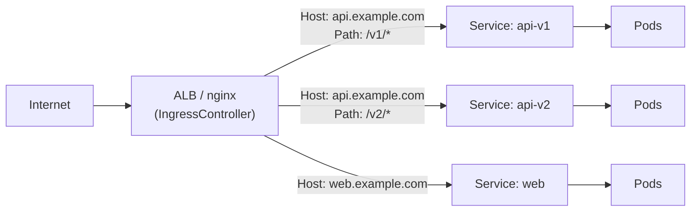
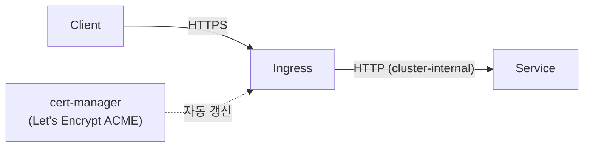

## 정의

**Ingress** = *클러스터 외부 HTTP/HTTPS 트래픽 → 내부 Service* 라우팅. *L7 LB 역할*. Service 의 *LoadBalancer 다수* 대안.

> [!IMPORTANT]
> Ingress *오브젝트는 표준*, *컨트롤러는 별도*. nginx, Traefik, Envoy, AWS Load Balancer Controller 등 *직접 설치 필요*.

## 아키텍처



## YAML 예시

```yaml
apiVersion: networking.k8s.io/v1
kind: Ingress
metadata:
  name: web
  annotations:
    kubernetes.io/ingress.class: nginx
    cert-manager.io/cluster-issuer: letsencrypt-prod
    nginx.ingress.kubernetes.io/rewrite-target: /
spec:
  tls:
    - hosts: [api.example.com]
      secretName: api-tls
  rules:
    - host: api.example.com
      http:
        paths:
          - path: /v1
            pathType: Prefix
            backend:
              service:
                name: api-v1
                port: { number: 80 }
          - path: /v2
            pathType: Prefix
            backend:
              service:
                name: api-v2
                port: { number: 80 }
```

## Path Type

| pathType | 동작 |
|---|---|
| `Exact` | 정확 일치 |
| `Prefix` | prefix 일치 (`/api` matches `/api/...`) |
| `ImplementationSpecific` | 컨트롤러 정의 |

## Ingress Controller 비교

| Controller | 강점 |
|---|---|
| **ingress-nginx** | 표준, 모든 기능, 무거움 |
| **Traefik** | 자동 cert (Let's Encrypt), 동적 |
| **Envoy / Contour** | L7 advanced, gRPC, service mesh 친화 |
| **AWS Load Balancer Controller** | ALB / NLB 직접 |
| **HAProxy Ingress** | 매우 빠름 |
| **Istio Ingress Gateway** | service mesh 통합 |

## TLS Termination



> *cert-manager* 가 *Let's Encrypt 인증서 자동 발급 / 갱신*. 거의 *모든 클러스터 표준*.

## Rewrite / Redirect

`rewrite-target` 으로 *업스트림에 전달되는 경로를 변환*:

```yaml
metadata:
  annotations:
    nginx.ingress.kubernetes.io/rewrite-target: /$2
spec:
  rules:
    - host: example.com
      http:
        paths:
          - path: /api/v1(/|$)(.*)
            pathType: ImplementationSpecific
            backend:
              service: { name: api-v1, port: { number: 80 } }
```

`/api/v1/users` → `/users` 로 upstream 전달. 캡처 그룹 `$1`, `$2` 사용.

영구 / 임시 리다이렉트:

```yaml
annotations:
  nginx.ingress.kubernetes.io/permanent-redirect: "https://new.example.com"
  nginx.ingress.kubernetes.io/permanent-redirect-code: "301"
  # 임시 302: permanent-redirect 없이 app-root 사용
  nginx.ingress.kubernetes.io/app-root: "/app"
```

## Rate Limiting

IP 기준 속도 제한:

```yaml
annotations:
  nginx.ingress.kubernetes.io/limit-rps: "10"            # 초당 요청
  nginx.ingress.kubernetes.io/limit-rpm: "100"            # 분당 요청
  nginx.ingress.kubernetes.io/limit-connections: "20"    # 동시 연결
  nginx.ingress.kubernetes.io/limit-burst-multiplier: "5"
  nginx.ingress.kubernetes.io/limit-whitelist: "10.0.0.0/8"
```

| 어노테이션 | 의미 |
|---|---|
| `limit-rps` | 초당 허용 요청 (IP 기반) |
| `limit-rpm` | 분당 허용 요청 |
| `limit-connections` | 동시 연결 수 제한 |
| `limit-burst-multiplier` | 버스트 배수 (기본 5) |

> [!IMPORTANT]
> Rate limit 은 *IngressController 파드 기준*. 파드 3개면 *실제 한도 = 3 × limit*. 정밀한 제어는 *API Gateway 레이어* (Kong, AWS API Gateway) 로.

## Sticky Session / 세션 어피니티

*stateful 앱* (파일 업로드 진행 상태, 세션 기반 인증 등) 에서 *동일 파드로 고정*:

```yaml
annotations:
  nginx.ingress.kubernetes.io/affinity: "cookie"
  nginx.ingress.kubernetes.io/session-cookie-name: "INGRESSCOOKIE"
  nginx.ingress.kubernetes.io/session-cookie-expires: "172800"
  nginx.ingress.kubernetes.io/session-cookie-max-age: "172800"
  nginx.ingress.kubernetes.io/session-cookie-path: "/"
```

> [!WARNING]
> *Sticky Session + HPA* 조합: 신규 파드는 기존 쿠키가 없어 *트래픽 불균등* 발생. 가능하면 *stateless + Redis 세션 공유* 설계 권장.

## Observability

ingress-nginx Prometheus 메트릭 (Helm values):

```yaml
controller:
  metrics:
    enabled: true
    serviceMonitor:
      enabled: true   # kube-prometheus-stack ServiceMonitor CRD
```

| 메트릭 | 의미 |
|---|---|
| `nginx_ingress_controller_requests` | 요청 수 (status, ingress 별) |
| `nginx_ingress_controller_request_duration_seconds` | 레이턴시 분포 |
| `nginx_ingress_controller_connect_duration_seconds` | upstream 연결 시간 |
| `nginx_ingress_controller_ssl_expire_time_seconds` | TLS 인증서 만료 시각 |

Grafana 에서 `rate(nginx_ingress_controller_requests[5m])` 로 per-ingress 처리량 실시간 모니터링.

## Gateway API (Ingress 의 차세대)

```yaml
apiVersion: gateway.networking.k8s.io/v1
kind: Gateway
metadata:
  name: prod-gateway
spec:
  gatewayClassName: nginx
  listeners:
    - name: https
      port: 443
      protocol: HTTPS
      tls:
        certificateRefs:
          - name: prod-tls
---
apiVersion: gateway.networking.k8s.io/v1
kind: HTTPRoute
metadata:
  name: api
spec:
  parentRefs: [{ name: prod-gateway }]
  hostnames: [api.example.com]
  rules:
    - matches:
        - path: { type: PathPrefix, value: /v1 }
      backendRefs:
        - name: api-v1
          port: 80
```

### Gateway API 리소스 계층

| 리소스 | 관리 주체 | 역할 |
|---|---|---|
| `GatewayClass` | 인프라 팀 | 구현체 선택 (nginx, envoy 등), ClusterScoped |
| `Gateway` | 플랫폼 팀 | 포트 / 프로토콜 / TLS 정책 |
| `HTTPRoute` | 앱 팀 | 호스트 / 경로 / 헤더 기반 매칭, backendRef |
| `GRPCRoute` | 앱 팀 | gRPC method / service 매칭 |
| `TCPRoute` | 플랫폼 팀 | L4 TCP 포워딩 |
| `TLSRoute` | 플랫폼 팀 | TLS SNI 기반 라우팅 |

Ingress 와 달리 *역할별 리소스 분리*로 RBAC 제어가 세밀해짐. 각 팀이 독립적으로 배포 가능.

### Ingress vs Gateway API

| 항목 | Ingress | Gateway API |
|---|---|---|
| 출시 | 2015 | 2021+ |
| 표현력 | 제한적 (annotation 의존) | *풍부* (HTTPRoute, TCPRoute, TLSRoute) |
| 역할 분리 | 단일 | *GatewayClass / Gateway / Route 분리* |
| 트래픽 정책 | annotation | 정식 필드 |
| 상태 | stable | beta → GA (2026 대다수) |

> [!IMPORTANT]
> 2026 시점 *Gateway API 가 점점 표준*. 신규 클러스터는 *Gateway API 추천*.

## 흔한 패턴: Canary

```yaml
metadata:
  annotations:
    nginx.ingress.kubernetes.io/canary: "true"
    nginx.ingress.kubernetes.io/canary-weight: "10"   # 10% 만 새 버전
```

또는 헤더 기반:

```yaml
metadata:
  annotations:
    nginx.ingress.kubernetes.io/canary-by-header: "X-Canary"
    nginx.ingress.kubernetes.io/canary-by-header-value: "always"
```

## 흔한 함정

> [!WARNING]
> 1. **IngressClass 누락** = 다중 컨트롤러 환경에서 *동작 안 함*. `spec.ingressClassName` 명시.
> 2. **TLS secret namespace 다름** = Ingress 와 *같은 namespace* 의 secret 만 사용.
> 3. **cert-manager rate limit** = Let's Encrypt staging 으로 테스트 후 production.
> 4. **Ingress + WebSocket** = `nginx.ingress.kubernetes.io/proxy-read-timeout`, `proxy-send-timeout` 늘려야 idle close 회피.

## 관련 위키

- [[k8s-service]]
- [[Load Balancer]]
- [[TLS]]
- [[api-gateway]]
- [[CORS]]
