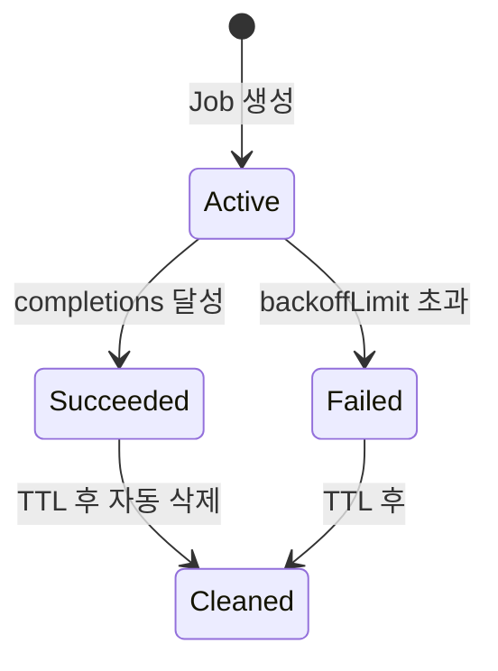
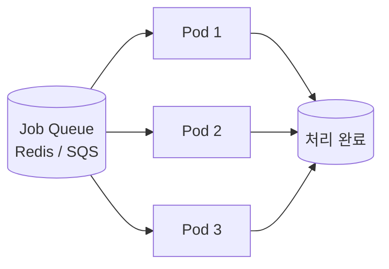

## 정의

| 컨트롤러 | 의미 |
|---|---|
| **Job** | *완료까지 실행하는 일회성 작업* |
| **CronJob** | *스케줄 (cron) 에 따라 Job 생성* |

## Job

```yaml
apiVersion: batch/v1
kind: Job
metadata: { name: migrate }
spec:
  backoffLimit: 3                # 실패 시 재시도 한도
  ttlSecondsAfterFinished: 3600  # 완료 후 1시간 뒤 정리
  template:
    spec:
      restartPolicy: OnFailure
      containers:
        - name: migrate
          image: app:v2
          command: ['python', 'manage.py', 'migrate']
```

## 흐름



## 병렬 실행 (parallelism / completions)

```yaml
spec:
  completions: 10       # 총 10개 완료 필요
  parallelism: 3        # 동시 3개 실행
```

| 패턴 | 의미 |
|---|---|
| `completions=1, parallelism=1` | 단일 작업 (기본) |
| `completions=N, parallelism=N` | N개 병렬 |
| `completions=N, parallelism=M < N` | 동시 M, 총 N |
| `completions=null, parallelism=M` | 무한 (작업 큐 패턴) |

## 작업 큐 패턴



각 pod 가 *큐에서 work 가져와 처리 후 종료*. completions 없이 *queue 가 빌 때까지*.

## Indexed Job (1.24+)

```yaml
spec:
  completions: 10
  parallelism: 3
  completionMode: Indexed
  template:
    spec:
      containers:
        - name: worker
          image: app:v1
          env:
            - name: JOB_COMPLETION_INDEX
              valueFrom:
                fieldRef:
                  fieldPath: metadata.annotations['batch.kubernetes.io/job-completion-index']
```

> 각 pod 가 *고유 인덱스 (0..N-1)*. *파티션된 작업* 분배.

## CronJob

```yaml
apiVersion: batch/v1
kind: CronJob
metadata: { name: nightly-backup }
spec:
  schedule: "0 2 * * *"           # 매일 2시
  timeZone: "Asia/Seoul"           # K8s 1.27+
  successfulJobsHistoryLimit: 3
  failedJobsHistoryLimit: 1
  concurrencyPolicy: Forbid       # 이전 job 끝나기 전 새 job 안 만듦
  startingDeadlineSeconds: 300    # 5분 안에 시작 못 하면 skip
  jobTemplate:
    spec:
      template:
        spec:
          restartPolicy: OnFailure
          containers:
            - name: backup
              image: db-backup:v1
```

## concurrencyPolicy

| 정책 | 의미 |
|---|---|
| `Allow` (기본) | 동시 실행 허용 |
| `Forbid` | 이전 job 끝나기 전 *새 job skip* |
| `Replace` | 이전 job 중단 + 새 job |

## Cron 식

```
┌──── 분 (0-59)
│ ┌── 시 (0-23)
│ │ ┌── 일 (1-31)
│ │ │ ┌── 월 (1-12)
│ │ │ │ ┌── 요일 (0-6, 0=Sun)
│ │ │ │ │
0 2 * * *    매일 2시
*/15 * * * * 15분마다
0 9 * * 1-5  평일 9시
```

## 흔한 함정

> [!WARNING]
> 1. **`restartPolicy: Always`** = Job 의 의미 깨짐. `OnFailure` 또는 `Never`.
> 2. **`ttlSecondsAfterFinished` 없음** = 완료된 Job 누적. cluster cluttered.
> 3. **CronJob 의 *시간대*** = K8s 1.27+ 까지 *UTC 만*. timeZone 명시 권장.
> 4. **`concurrencyPolicy: Allow` + 무거운 작업** = job 들이 *겹쳐 시스템 부하*. `Forbid` 안전.
> 5. **JOB 실패 알림 부재** = silent fail. Prometheus + Alertmanager 로 *failed Job* 알림.

## 관련 위키

- [[k8s-deployment]]
- [[k8s-pod]]
- [[prometheus]] (job 모니터링)
- [[kafka]] (작업 큐 대안)
