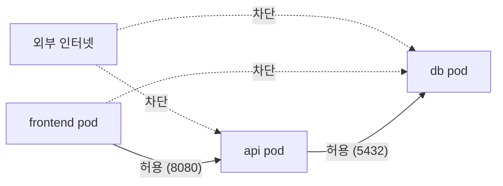
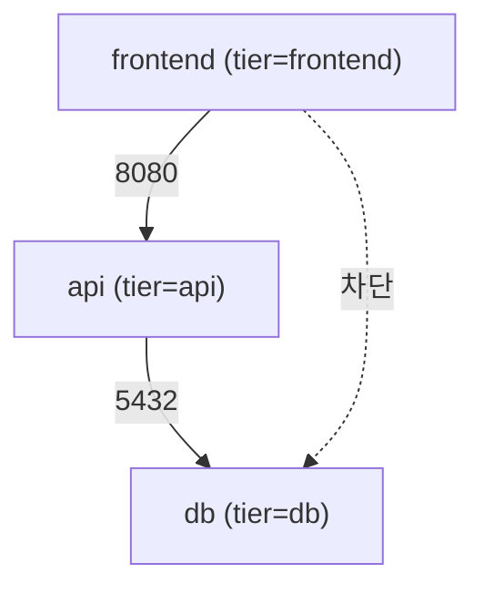

## 정의

**NetworkPolicy** = pod 간 *허용된 트래픽만* 통과. *없으면 모든 pod ↔ pod 가 허용* (기본 open).

> [!IMPORTANT]
> NetworkPolicy 는 *CNI 플러그인이 구현*. Calico, Cilium, Weave 가 *지원*. *Flannel 단독은 미지원*.

## 사용 시나리오

| 상황 | NetworkPolicy 역할 |
|---|---|
| Zero-Trust 마이크로서비스 | 서비스 간 허가된 경로만 개방 |
| PCI-DSS / HIPAA 규정 준수 | 민감 데이터 namespace 격리 |
| 멀티 테넌트 클러스터 | 테넌트 간 트래픽 완전 격리 |
| DB 보호 | frontend 가 db 직접 접근 금지 |
| 외부 API 제한 | 특정 pod 만 외부 인터넷 egress 허용 |

## 트래픽 흐름 시각화



> NetworkPolicy 는 *L3/L4 방화벽*. 각 pod 에 ingress/egress 규칙이 *독립 적용*.

## Default Deny

```yaml
apiVersion: networking.k8s.io/v1
kind: NetworkPolicy
metadata: { name: default-deny }
spec:
  podSelector: {}        # 모든 pod
  policyTypes: [Ingress, Egress]
  # ingress / egress 비어있음 → 전부 차단
```

> *모든 namespace 에 default deny* + 필요한 규칙만 *명시 허용* 이 *Zero-Trust 정통*.

## Ingress 허용 예시

```yaml
kind: NetworkPolicy
metadata: { name: allow-frontend-to-api }
spec:
  podSelector:
    matchLabels: { app: api }
  policyTypes: [Ingress]
  ingress:
    - from:
        - podSelector:
            matchLabels: { app: frontend }
      ports:
        - protocol: TCP
          port: 8080
```

> `api` pod 는 *`frontend` pod 의 8080 트래픽만 허용*.

## Egress 허용 예시

```yaml
kind: NetworkPolicy
metadata: { name: allow-egress-to-db }
spec:
  podSelector:
    matchLabels: { app: api }
  policyTypes: [Egress]
  egress:
    - to:
        - podSelector:
            matchLabels: { app: db }
      ports:
        - protocol: TCP
          port: 5432
    - to:                    # DNS 허용 (필수)
        - namespaceSelector:
            matchLabels: { kubernetes.io/metadata.name: kube-system }
          podSelector:
            matchLabels: { k8s-app: kube-dns }
      ports:
        - protocol: UDP
          port: 53
```

> [!CAUTION]
> Egress default-deny 시 *DNS (kube-dns) 허용* 잊지 말 것. 안 그러면 *모든 외부 호출이 DNS resolution 실패*.

## AND / OR 조건 이해

`from` / `to` 배열에서 *같은 항목 내* 두 selector 나열 = **AND** (교집합). *다른 항목* 으로 나열 = **OR** (합집합).

```yaml
# AND: prod namespace 의 frontend pod 만 허용
ingress:
  - from:
      - namespaceSelector:           # 같은 항목
          matchLabels: { env: prod }
        podSelector:                 # AND 조건
          matchLabels: { app: frontend }

# OR: prod namespace 전체 OR frontend pod (namespace 무관)
ingress:
  - from:
      - namespaceSelector:           # 항목 1
          matchLabels: { env: prod }
      - podSelector:                 # 항목 2 → OR
          matchLabels: { app: frontend }
```

> [!WARNING]
> AND / OR 구별이 *가장 흔한 NetworkPolicy 실수*. YAML 들여쓰기 위치가 전부.

## Namespace 격리

```yaml
metadata: { name: allow-from-same-namespace }
spec:
  podSelector: {}
  policyTypes: [Ingress]
  ingress:
    - from:
        - namespaceSelector:
            matchLabels:
              kubernetes.io/metadata.name: same-namespace
```

## IP Block (외부 IP 허용)

```yaml
spec:
  egress:
    - to:
        - ipBlock:
            cidr: 0.0.0.0/0
            except:
              - 10.0.0.0/8        # 내부 IP 제외
              - 172.16.0.0/12
              - 192.168.0.0/16
```

## CNI 플러그인 비교

| CNI | NetworkPolicy 지원 | 추가 기능 |
|---|---|---|
| Calico | 완전 지원 | GlobalNetworkPolicy, eBPF 옵션 |
| Cilium | 완전 지원 | L7 HTTP/gRPC, eBPF, Hubble 관측 |
| Weave | 지원 | 단순, 기능 제한 |
| Flannel | 미지원 | 별도 Calico overlay 필요 |
| AWS VPC CNI | 지원 | EKS 기본, Security Group for Pods |

> Calico/Cilium 이 *프로덕션 표준*. CNI 없이 NetworkPolicy 적용 시 *YAML 만 저장되고 실제 차단 없음*.

## 프로덕션 패턴: 3-tier 격리



```yaml
# 1. 모든 트래픽 기본 차단
apiVersion: networking.k8s.io/v1
kind: NetworkPolicy
metadata:
  name: default-deny-all
  namespace: production
spec:
  podSelector: {}
  policyTypes: [Ingress, Egress]
---
# 2. frontend → api (8080)
apiVersion: networking.k8s.io/v1
kind: NetworkPolicy
metadata:
  name: allow-fe-to-api
  namespace: production
spec:
  podSelector: { matchLabels: { tier: api } }
  policyTypes: [Ingress]
  ingress:
    - from:
        - podSelector: { matchLabels: { tier: frontend } }
      ports:
        - { protocol: TCP, port: 8080 }
---
# 3. api → db (5432)
apiVersion: networking.k8s.io/v1
kind: NetworkPolicy
metadata:
  name: allow-api-to-db
  namespace: production
spec:
  podSelector: { matchLabels: { tier: db } }
  policyTypes: [Ingress]
  ingress:
    - from:
        - podSelector: { matchLabels: { tier: api } }
      ports:
        - { protocol: TCP, port: 5432 }
---
# 4. api egress: db + DNS 만
apiVersion: networking.k8s.io/v1
kind: NetworkPolicy
metadata:
  name: api-egress-allow
  namespace: production
spec:
  podSelector: { matchLabels: { tier: api } }
  policyTypes: [Egress]
  egress:
    - to:
        - podSelector: { matchLabels: { tier: db } }
      ports:
        - { protocol: TCP, port: 5432 }
    - to:
        - namespaceSelector:
            matchLabels: { kubernetes.io/metadata.name: kube-system }
          podSelector: { matchLabels: { k8s-app: kube-dns } }
      ports:
        - { protocol: UDP, port: 53 }
```

## Cilium 의 확장 (L7 NetworkPolicy)

```yaml
apiVersion: cilium.io/v2
kind: CiliumNetworkPolicy
metadata: { name: api-l7 }
spec:
  endpointSelector: { matchLabels: { app: api } }
  ingress:
    - fromEndpoints: [{ matchLabels: { app: frontend } }]
      toPorts:
        - ports: [{ port: "80", protocol: TCP }]
          rules:
            http:
              - method: GET
                path: "/api/.*"
              - method: POST
                path: "/api/orders"
```

> L7 (HTTP method / path) 까지. *Service Mesh* 가 아니어도 *L7 보안*.

## Policy 검증 / 디버깅

```bash
# 현재 namespace 의 NetworkPolicy 목록
kubectl get networkpolicy -n production

# 특정 policy 상세 보기
kubectl describe networkpolicy default-deny-all -n production

# pod 의 label 확인 (selector 매칭용)
kubectl get pod frontend-xyz -n production --show-labels

# Cilium: 엔드포인트 정책 상태
kubectl exec -n kube-system cilium-xxx -- cilium endpoint list
kubectl exec -n kube-system cilium-xxx -- cilium policy get
```

> [!TIP]
> *Cilium Hubble UI*: 실시간 트래픽 흐름 + 차단 이유 시각화. 디버깅 시 가장 강력한 도구.

## 흔한 함정

> [!WARNING]
> 1. **CNI 가 NetworkPolicy 미지원** = YAML 만 적용되고 *실제 동작 안 함*. Calico/Cilium 확인.
> 2. **Egress default-deny + DNS 차단** = 모든 외부 호출 실패. DNS 항상 허용.
> 3. **policyTypes 누락** = `Egress` 없으면 egress 규칙 무시.
> 4. **namespaceSelector 의 label** = 1.21+ 부터 자동 `kubernetes.io/metadata.name`. 옛 버전은 namespace 에 *직접 label*.
> 5. **AND/OR 혼동** = 같은 `from` 항목 내 두 selector = AND. 다른 항목 = OR.

## 관련 위키

- [[k8s-pod]]
- [[k8s-service]]
- [[mtls]]
- [[Service Mesh]]
