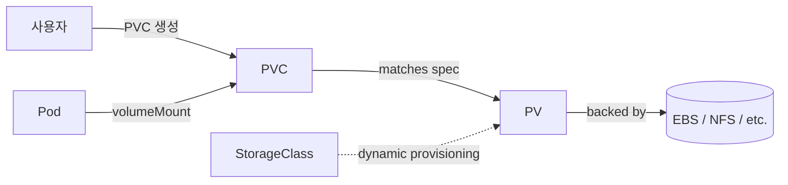

## 정의

**Kubernetes Storage 계층** 은 세 리소스로 구성됩니다.

- **PersistentVolume (PV)**: 실제 스토리지 (EBS, GCE PD, NFS, iSCSI 등) 를 나타내는 클러스터 리소스
- **PersistentVolumeClaim (PVC)**: 사용자가 스토리지를 요청하는 리소스 (크기, 접근 모드, StorageClass)
- **StorageClass**: PV 를 동적으로 프로비저닝하는 템플릿

Pod 은 PVC 를 mount 하고, PVC 는 PV 에 binding 됩니다. **동적 프로비저닝** 시에는 사용자가 PVC 만 만들면 StorageClass 가 자동으로 PV 를 만듭니다.

## 왜 필요한가

컨테이너는 stateless 지향이지만 실제 앱은 상태가 있습니다.

- **DB, 캐시, 큐**: Postgres, Redis, Kafka 등
- **파일 업로드**: 사용자 첨부 파일
- **로그, 메트릭**: 영속 저장
- **모델, 데이터셋**: ML 학습

Pod 이 재시작되거나 노드가 옮겨져도 데이터가 유지되어야 합니다.

## 컨셉



## PV vs PVC vs StorageClass

| 리소스 | 만드는 사람 | 스코프 | 역할 |
|:---|:---|:---|:---|
| **PV** | 관리자 (static) 또는 자동 (dynamic) | Cluster | 실제 스토리지 표현 |
| **PVC** | 개발자 | Namespace | 스토리지 요청 |
| **StorageClass** | 관리자 | Cluster | PV 자동 생성 템플릿 |

## Static Provisioning (수동)

관리자가 미리 PV 를 만들고 사용자가 PVC 로 청구.

```yaml
apiVersion: v1
kind: PersistentVolume
metadata:
  name: pv-example
spec:
  capacity:
    storage: 10Gi
  accessModes:
    - ReadWriteOnce
  persistentVolumeReclaimPolicy: Retain
  storageClassName: manual
  nfs:
    server: nfs.example.com
    path: /exports/data
```

```yaml
apiVersion: v1
kind: PersistentVolumeClaim
metadata:
  name: pvc-example
spec:
  accessModes:
    - ReadWriteOnce
  resources:
    requests:
      storage: 10Gi
  storageClassName: manual
```

Kubernetes 가 크기와 access mode 매칭되는 PV 를 찾아 binding.

## Dynamic Provisioning (권장)

StorageClass 가 자동으로 PV 생성.

```yaml
apiVersion: storage.k8s.io/v1
kind: StorageClass
metadata:
  name: gp3-encrypted
  annotations:
    storageclass.kubernetes.io/is-default-class: "true"
provisioner: ebs.csi.aws.com
parameters:
  type: gp3
  iops: "3000"
  throughput: "125"
  encrypted: "true"
  kmsKeyId: "arn:aws:kms:..."
reclaimPolicy: Delete
allowVolumeExpansion: true
volumeBindingMode: WaitForFirstConsumer
```

```yaml
apiVersion: v1
kind: PersistentVolumeClaim
metadata:
  name: postgres-data
spec:
  accessModes: [ReadWriteOnce]
  resources:
    requests:
      storage: 100Gi
  storageClassName: gp3-encrypted
```

PVC 를 만들면 EBS 볼륨이 자동 생성 -> PV 자동 생성 -> PVC 에 binding.

## Access Modes

| 모드 | 의미 | 지원 스토리지 |
|:---|:---|:---|
| **ReadWriteOnce (RWO)** | 한 노드에서 R/W | EBS, GCE PD, Azure Disk (대부분 블록) |
| **ReadOnlyMany (ROX)** | 여러 노드에서 R only | NFS, CephFS |
| **ReadWriteMany (RWX)** | 여러 노드에서 R/W | NFS, CephFS, EFS |
| **ReadWriteOncePod (RWOP)** | 한 Pod 에서만 R/W | K8s 1.22+ CSI |

**주의**: 접근 모드는 스토리지 driver 의 능력. 지원 안 하는 모드로 요청하면 binding 실패.

## Reclaim Policy

PVC 삭제 시 PV 의 운명:

- **`Delete`** (기본, dynamic): 실제 스토리지도 삭제
- **`Retain`**: PV 는 남아 관리자가 수동 처리
- **`Recycle`** (deprecated): 데이터 wipe 후 재사용

프로덕션 DB PVC 는 `Retain` 이 안전. 실수로 PVC 지워도 데이터 살아있음.

## Volume Binding Mode

- **`Immediate`** (기본): PVC 만드는 즉시 PV 프로비저닝
- **`WaitForFirstConsumer`**: Pod 이 실제로 스케줄될 때 프로비저닝

`WaitForFirstConsumer` 권장 이유: 스케줄러가 노드 결정 후 그 노드의 AZ 에 볼륨 생성. 아니면 볼륨이 A zone 인데 Pod 이 B zone 에 스케줄되어 실패.

## Volume Expansion

```yaml
storageClassName: gp3-encrypted
allowVolumeExpansion: true
```

`kubectl edit pvc` 로 크기 증가:

```yaml
resources:
  requests:
    storage: 200Gi   # 100 -> 200
```

CSI driver 가 volume + filesystem 확장. **축소는 대부분 지원 안 함**.

## Volume 유형

### emptyDir

Pod 생명주기. Pod 삭제되면 사라짐.

```yaml
volumes:
  - name: cache
    emptyDir:
      sizeLimit: 500Mi
      medium: Memory   # tmpfs (RAM), 기본은 disk
```

### hostPath

노드의 파일시스템 mount. 보안 위험 (탈출 가능), 프로덕션 지양.

### configMap / secret

ConfigMap/Secret 을 파일로 mount.

```yaml
volumes:
  - name: config
    configMap:
      name: app-config
volumeMounts:
  - name: config
    mountPath: /etc/config
    readOnly: true
```

### PVC (persistent)

```yaml
volumes:
  - name: data
    persistentVolumeClaim:
      claimName: postgres-data
```

### Projected

여러 소스를 한 디렉토리에 합쳐 mount (secret + configMap + downwardAPI + serviceAccountToken).

### CSI ephemeral (K8s 1.25+)

Pod 생명주기지만 CSI driver 로 프로비저닝 (secrets store CSI, secrets manager 등).

## CSI (Container Storage Interface)

CSI 는 스토리지 provider 와 컨테이너 오케스트레이터 사이의 **표준 인터페이스**. 이전에는 k8s 안에 in-tree driver (EBS, GCE PD 등) 였지만, 이제는 모두 **CSI out-of-tree** 로 이관.

**CSI 컴포넌트**:
- **Controller Plugin**: 볼륨 생성/삭제/attach/detach. Deployment 로 실행.
- **Node Plugin**: 볼륨을 파일시스템에 mount/unmount. DaemonSet 로 각 노드.
- **CSI Sidecar**: `external-provisioner`, `external-attacher`, `external-resizer`, `external-snapshotter` 표준 컨트롤러들.

주요 CSI drivers:
- **[[aws-ebs-vs-instance-store|AWS EBS CSI]]** (ebs.csi.aws.com)
- **AWS EFS CSI** (efs.csi.aws.com) - RWX
- **GCE PD CSI**
- **Azure Disk / File CSI**
- **Ceph RBD / CephFS CSI**
- **Longhorn** (Rancher)
- **OpenEBS**
- **Rook** (Ceph 관리)

## Volume Snapshot

CSI 스냅샷 지원 시:

```yaml
apiVersion: snapshot.storage.k8s.io/v1
kind: VolumeSnapshot
metadata:
  name: postgres-snap-20260707
spec:
  volumeSnapshotClassName: csi-hostpath-snapclass
  source:
    persistentVolumeClaimName: postgres-data
```

Snapshot 에서 새 PVC 복원:

```yaml
apiVersion: v1
kind: PersistentVolumeClaim
metadata:
  name: postgres-restored
spec:
  storageClassName: gp3-encrypted
  dataSource:
    name: postgres-snap-20260707
    kind: VolumeSnapshot
    apiGroup: snapshot.storage.k8s.io
  resources:
    requests:
      storage: 100Gi
```

## StatefulSet 과의 조합

[[k8s-statefulset|StatefulSet]] 의 `volumeClaimTemplates` 는 각 Pod 마다 PVC 자동 생성:

```yaml
kind: StatefulSet
spec:
  volumeClaimTemplates:
    - metadata:
        name: data
      spec:
        accessModes: [ReadWriteOnce]
        storageClassName: gp3-encrypted
        resources:
          requests:
            storage: 100Gi
```

`web-0`, `web-1`, `web-2` 각 Pod 이 `data-web-0`, `data-web-1`, `data-web-2` PVC 를 갖음. Pod 삭제 후 재생성해도 같은 PVC 재연결.

## Multi-AZ 함정

블록 스토리지 (EBS, GCE PD) 는 **한 AZ 에 종속**. 다른 AZ 로 옮기려면:

1. Snapshot 생성
2. Snapshot 을 새 AZ 에 복제
3. 새 PV 생성

이래서 **StatefulSet + [[k8s-scheduling|topology spread]]** 가 조합됩니다. Pod 이 AZ 를 옮기면 PVC 재연결 실패 가능성.

RWX 파일시스템 (EFS, NFS) 은 AZ 무관 하지만 성능 낮음.

## 함정

> [!WARNING]
> **`reclaimPolicy: Delete`** 로 프로덕션 DB PVC 를 만들면 실수로 PVC 삭제 시 **데이터 영구 소실**. 반드시 `Retain`.

> [!CAUTION]
> **RWO 는 한 노드**. Multi-writer 앱은 실패. RWX 필요.

> [!WARNING]
> **AZ 교차 볼륨 attach 불가** (EBS 등). `WaitForFirstConsumer` + AZ affinity 필수.

> [!IMPORTANT]
> **StorageClass 없이 PVC 만들면 default StorageClass 로 fallback**. 없으면 pending. 명시적 지정.

> [!CAUTION]
> **CSI 스냅샷 삭제 정책**. 스냅샷 class 의 `deletionPolicy: Retain` 이 아니면 원본 삭제 시 함께 삭제.

## 관련 위키

- [[kubernetes|Kubernetes]] - 상위 개요
- [[k8s-pod|Pod]] - volumeMount 대상
- [[k8s-statefulset|StatefulSet]] - volumeClaimTemplates
- [[k8s-architecture|Kubernetes Architecture]] - CSI 아키텍처
- [[k8s-configmap-secret|ConfigMap / Secret]] - projected volume
- [[k8s-scheduling|Scheduling]] - AZ affinity
- [[aws-ebs-vs-instance-store|EBS vs Instance Store]] - AWS 스토리지
- [[aws-s3-files|S3 File Access]] - S3 를 파일로
