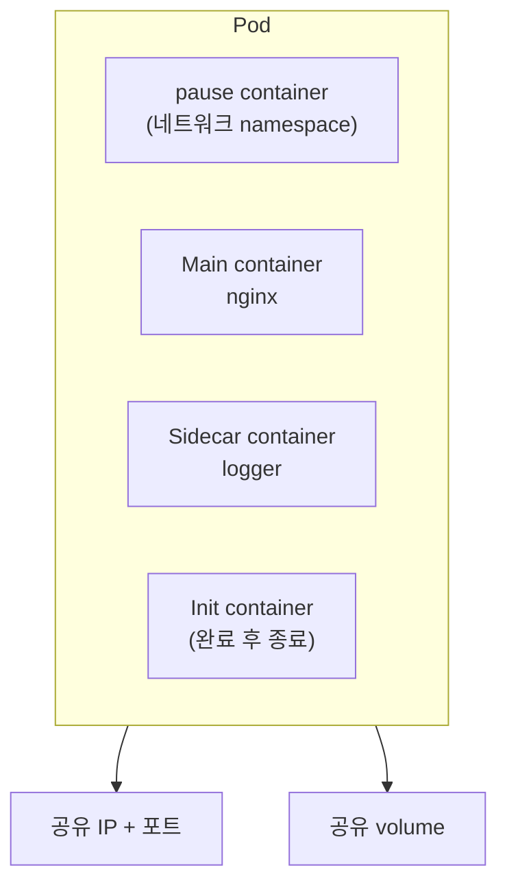
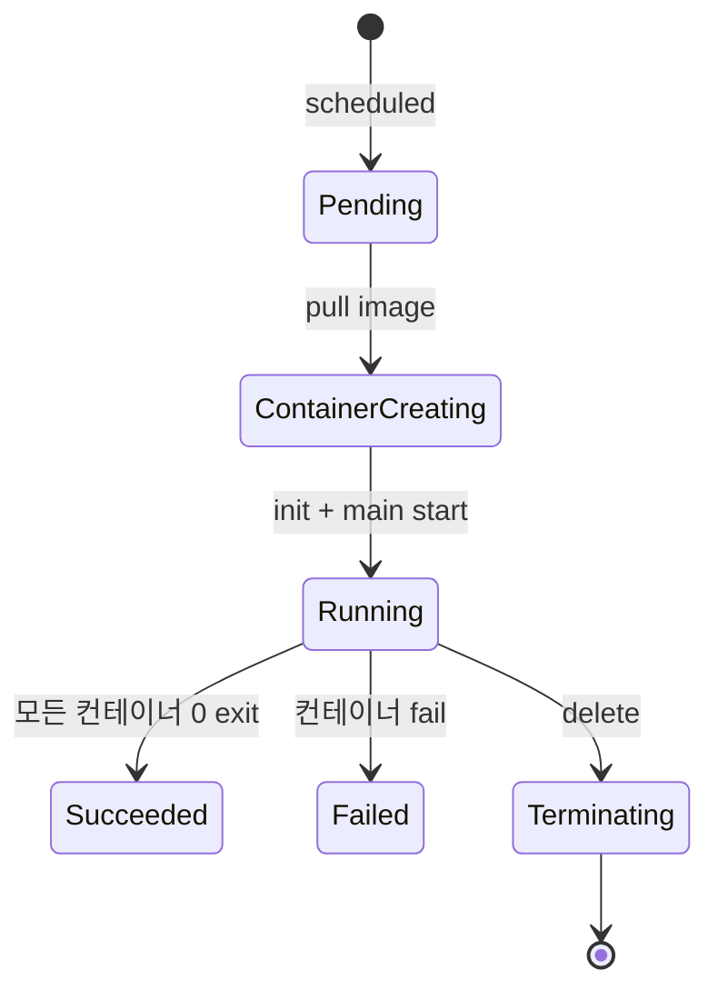
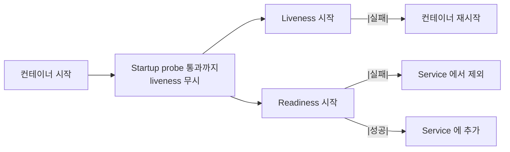
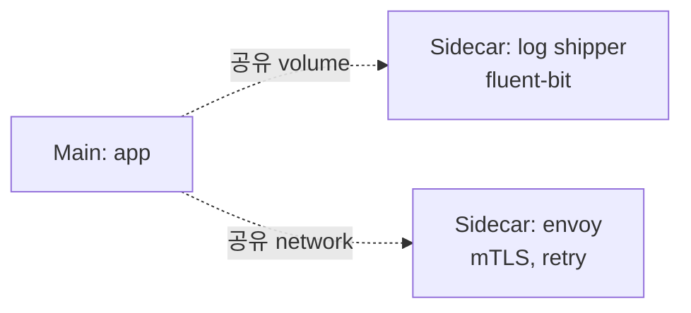
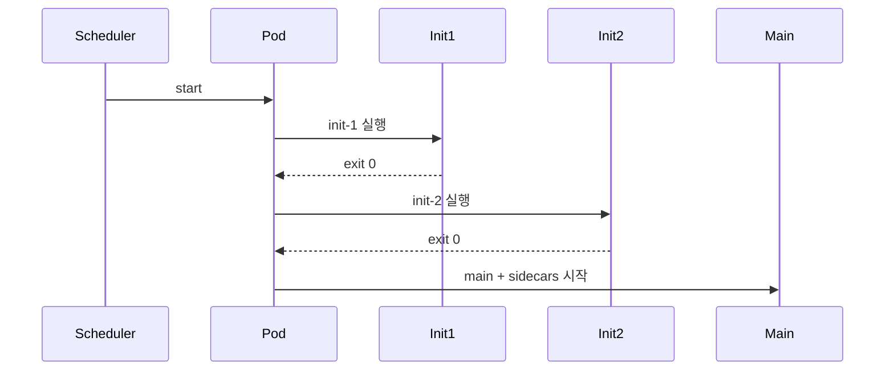
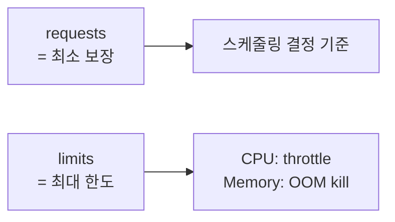

## 정의

**Pod** = K8s 의 *가장 작은 배포 단위*. *1개 이상의 컨테이너 + 공유 네트워크 + 공유 스토리지*.

> [!IMPORTANT]
> Pod 는 *컨테이너의 wrapping* 이 아니다. *서로 강하게 결합한 컨테이너들의 묶음* (메인 + sidecar). *단일 컨테이너 pod 가 가장 흔함*.

## 구조



## 라이프사이클



| Phase | 의미 |
|---|---|
| Pending | 스케줄링 대기 / 이미지 pull |
| Running | 모든 컨테이너 시작 |
| Succeeded | 모든 컨테이너 성공 종료 |
| Failed | 컨테이너 실패 |
| Unknown | API server 통신 실패 |

## YAML 예시

```yaml
apiVersion: v1
kind: Pod
metadata:
  name: web
  labels:
    app: web
spec:
  initContainers:
    - name: setup
      image: busybox
      command: ['sh', '-c', 'echo init done > /shared/ready']
      volumeMounts:
        - name: shared
          mountPath: /shared
  containers:
    - name: nginx
      image: nginx:1.27
      ports:
        - containerPort: 80
      resources:
        requests: { cpu: 100m, memory: 128Mi }
        limits:   { cpu: 500m, memory: 512Mi }
      livenessProbe:
        httpGet: { path: /, port: 80 }
        initialDelaySeconds: 10
      readinessProbe:
        httpGet: { path: /ready, port: 80 }
      volumeMounts:
        - name: shared
          mountPath: /var/data
    - name: log-sidecar
      image: fluent-bit:3
      volumeMounts:
        - name: shared
          mountPath: /var/log/source
  volumes:
    - name: shared
      emptyDir: {}
```

## Probes (3종)

| Probe | 목적 | 실패 시 |
|---|---|---|
| **Startup** | 느린 시작 보호 | 죽인 후 재시작 |
| **Liveness** | 살아있나 | 컨테이너 재시작 |
| **Readiness** | 트래픽 받을 준비 | Service endpoint 에서 제외 |



> [!IMPORTANT]
> Probe 가 *없으면* K8s 가 *언제 트래픽 보낼지 모름* → 첫 요청 *실패*. *readiness 는 거의 필수*.

## Sidecar Pattern



흔한 sidecar:

- **Log shipper** (fluent-bit, vector)
- **Service mesh proxy** (envoy, linkerd)
- **Secret rotation** (vault-agent)
- **TLS termination** (nginx)
- **Metrics adapter** (statsd → prometheus)

## Init Container



용도:

- DB schema migration
- 설정 파일 생성
- TLS cert pre-fetch
- 데이터 download

## Resource: Requests / Limits



> [!CAUTION]
> *Memory limit 초과 = OOM kill (즉시)*. *CPU limit 초과 = throttle (느려짐)*. *memory 는 보수적으로*.

## Pod 의 *변경 불가성*

```
Pod spec 의 대부분 필드 = immutable
변경하려면 → 새 Pod 생성, 옛 Pod 삭제
```

→ 직접 Pod 만들 일 거의 없음. *Deployment / StatefulSet / DaemonSet* 이 자동 관리.

## 흔한 함정

> [!WARNING]
> 1. **Probe 없음** = 트래픽 일부 실패. readiness 필수.
> 2. **Memory limit 너무 작음** = OOM kill 반복. Resource 측정 후 결정.
> 3. **Sidecar 가 main 보다 늦게 종료** = pre-stop hook + grace period 부족 → log 누락.
> 4. **Init container 가 *느림*** = pod 시작 자체 지연.

## 관련 위키

- [[k8s-deployment]]
- [[k8s-statefulset]]
- [[k8s-service]]
- [[cgroups-namespaces]]
- [[docker]]
