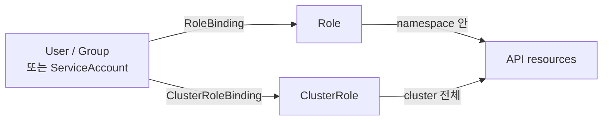

## 정의

**RBAC (Role-Based Access Control)** = K8s 의 *권한 부여 모델*. *주체 + 권한 + 바인딩*.

## 4 객체



| 객체 | 범위 |
|---|---|
| `Role` | 단일 namespace |
| `ClusterRole` | 전체 cluster |
| `RoleBinding` | 같은 namespace 안 user → Role |
| `ClusterRoleBinding` | cluster 전체 user → ClusterRole |

## ServiceAccount

```yaml
apiVersion: v1
kind: ServiceAccount
metadata:
  name: app-sa
  namespace: default
```

- Pod 가 *K8s API 호출* 할 때의 identity.
- 기본은 `default` SA. *명시 권장*.
- 모든 SA 는 *토큰 자동 마운트* (`/var/run/secrets/kubernetes.io/serviceaccount/token`).

## Role 예시

```yaml
apiVersion: rbac.authorization.k8s.io/v1
kind: Role
metadata:
  name: pod-reader
  namespace: default
rules:
  - apiGroups: [""]
    resources: [pods, pods/log]
    verbs: [get, list, watch]
  - apiGroups: [apps]
    resources: [deployments]
    verbs: [get, list]
```

| verb | 의미 |
|---|---|
| `get` | 단일 |
| `list` | 목록 |
| `watch` | 변경 stream |
| `create` | 생성 |
| `update` | 갱신 |
| `patch` | 부분 갱신 |
| `delete` | 삭제 |
| `deletecollection` | 일괄 삭제 |

## RoleBinding

```yaml
apiVersion: rbac.authorization.k8s.io/v1
kind: RoleBinding
metadata:
  name: app-pod-reader
  namespace: default
subjects:
  - kind: ServiceAccount
    name: app-sa
    namespace: default
roleRef:
  kind: Role
  name: pod-reader
  apiGroup: rbac.authorization.k8s.io
```

## ClusterRole + ClusterRoleBinding

```yaml
apiVersion: rbac.authorization.k8s.io/v1
kind: ClusterRole
metadata: { name: namespace-admin }
rules:
  - apiGroups: ["*"]
    resources: ["*"]
    verbs: ["*"]
---
kind: ClusterRoleBinding
metadata: { name: alice-cluster-admin }
subjects:
  - kind: User
    name: alice
roleRef:
  kind: ClusterRole
  name: namespace-admin
```

## 검사 / 디버깅

```bash
# 내가 무엇을 할 수 있나?
kubectl auth can-i get pods
kubectl auth can-i list secrets --as alice

# 특정 SA 권한
kubectl auth can-i get pods --as=system:serviceaccount:default:app-sa

# 누가 어떤 권한?
kubectl get rolebinding,clusterrolebinding -A | grep alice
```

## Aggregated ClusterRole

```yaml
apiVersion: rbac.authorization.k8s.io/v1
kind: ClusterRole
metadata:
  name: monitoring
  labels:
    rbac.authorization.k8s.io/aggregate-to-monitoring: "true"
rules: [...]
```

> 다른 ClusterRole 이 *자동 결합*. 운영 도구의 *plugin 권한 추가* 패턴.

## 흔한 함정

> [!WARNING]
> 1. **`verbs: ["*"]` 남발** = 권한 최소화 원칙 위배. 필요한 verb 만.
> 2. **default SA 사용** = 모든 pod 가 *같은 권한*. 명시 SA + 최소 Role.
> 3. **`apiGroups: ["*"]` 와 `resources: ["*"]`** = 모든 자원 접근. *cluster-admin*과 다를 바 없음.
> 4. **RoleBinding namespace 잘못** = Role 은 같은 namespace 만. 다른 namespace 면 무효.
> 5. **token 직접 사용** = 만료 짧음 (1시간 기본, 1.24+). *projected SA token* 으로 자동 갱신.

## 관련 위키

- [[k8s-pod]]
- [[mtls]]
- [[OAuth2]]
- [[aws-iam]] (대조)
