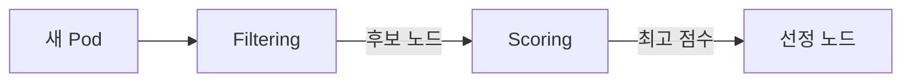

## 정의

**Kubernetes Scheduling** 은 kube-scheduler 가 새 Pod 을 어느 노드에 배치할지 결정하는 과정입니다. 두 단계 (Filtering + Scoring), 여러 정책 (nodeSelector, Affinity, Taints/Tolerations, Topology Spread, PriorityClass) 을 조합해 세밀한 배치 제어를 제공합니다.

## 기본 흐름



### Filtering (predicates)

노드가 Pod 실행 조건 만족하는지 검사:
- 리소스 여유 (CPU, memory)
- nodeSelector / nodeAffinity 매치
- Taints 를 tolerate
- Volume affinity (AZ 매치)
- Port 충돌 없음
- 노드 상태 Ready

### Scoring (priorities)

살아남은 노드에 점수 (0-100):
- **LeastRequested**: request 여유 많은 노드 선호
- **BalancedResourceAllocation**: CPU/memory 균형
- **NodeAffinity preferred**: 선호도 매치
- **InterPodAffinity preferred**
- **ImageLocality**: 이미지 이미 있는 노드
- **TopologySpread**: 균형 분산

## nodeSelector (가장 단순)

```yaml
apiVersion: v1
kind: Pod
metadata:
  name: gpu-workload
spec:
  nodeSelector:
    accelerator: nvidia
    disktype: ssd
  containers: [...]
```

노드에 라벨이 있어야 매치. 정확히 이 라벨을 가진 노드에만 배치.

**단점**: AND 만 지원. 유연성 낮음. 신규 코드는 Node Affinity 권장.

## Node Affinity

### requiredDuringScheduling (hard)

```yaml
affinity:
  nodeAffinity:
    requiredDuringSchedulingIgnoredDuringExecution:
      nodeSelectorTerms:
        - matchExpressions:
            - key: topology.kubernetes.io/zone
              operator: In
              values: [us-east-1a, us-east-1b]
            - key: node-type
              operator: NotIn
              values: [spot]
```

만족 못 하면 스케줄 안 됨. `IgnoredDuringExecution` 은 실행 중 노드 라벨 바뀌어도 evict 안 함.

### preferredDuringScheduling (soft)

```yaml
affinity:
  nodeAffinity:
    preferredDuringSchedulingIgnoredDuringExecution:
      - weight: 100
        preference:
          matchExpressions:
            - key: instance-type
              operator: In
              values: [m5.large]
      - weight: 50
        preference:
          matchExpressions:
            - key: zone
              operator: In
              values: [us-east-1a]
```

선호도. 완벽 매치 못 해도 스케줄됨.

### Operators

- **In**, **NotIn**: 값 목록
- **Exists**, **DoesNotExist**: 라벨 존재 여부
- **Gt**, **Lt**: 숫자 비교

## Pod Affinity / Anti-Affinity

### Pod Affinity (다른 Pod 옆에)

같은 노드/AZ 에 있는 다른 Pod 옆에 배치. 캐시 지역성, 통신 지연 최소화.

```yaml
affinity:
  podAffinity:
    requiredDuringSchedulingIgnoredDuringExecution:
      - labelSelector:
          matchLabels:
            app: cache
        topologyKey: kubernetes.io/hostname   # 같은 노드
```

`topologyKey`: 어느 단위 (호스트, zone, region) 로 판단.

### Pod Anti-Affinity (다른 Pod 피해)

같은 노드/AZ 에 없어야. **HA 의 핵심**.

```yaml
affinity:
  podAntiAffinity:
    requiredDuringSchedulingIgnoredDuringExecution:
      - labelSelector:
          matchLabels:
            app: web
        topologyKey: kubernetes.io/hostname
```

`app: web` Pod 이 같은 노드에 있으면 스케줄 실패. Replica 를 여러 노드에 강제 분산.

**AZ 분산**:

```yaml
topologyKey: topology.kubernetes.io/zone
```

각 AZ 에 최대 하나. 3 AZ + 3 replica 면 각 zone 1개.

**주의**: `required` anti-affinity 는 스케줄러가 O(N^2) 검사. 큰 클러스터에서 느림. 대안: Topology Spread.

## Topology Spread Constraints

```yaml
topologySpreadConstraints:
  - maxSkew: 1
    topologyKey: topology.kubernetes.io/zone
    whenUnsatisfiable: DoNotSchedule
    labelSelector:
      matchLabels:
        app: web
```

각 zone 의 Pod 수 차이 (skew) 가 `maxSkew` 이하가 되도록. `app: web` Pod 이 zone A 에 5개, B 에 4개인데 새 pod 추가하면 A 에는 못 감 (skew 2 초과).

`whenUnsatisfiable`:
- **DoNotSchedule** (hard): 불만족이면 pending
- **ScheduleAnyway** (soft): 조건 안 맞아도 스케줄

Anti-affinity 보다 성능 좋고 유연. **HA + 균형 분산의 표준**.

## Taints and Tolerations

Taint 는 노드에 붙이는 "특정 Pod 만 허용" 표시. Toleration 은 Pod 이 taint 를 견딜 수 있다는 선언.

### Taint 부여

```bash
kubectl taint nodes node1 dedicated=gpu:NoSchedule
kubectl taint nodes node1 spot=true:PreferNoSchedule
kubectl taint nodes node1 out-of-service:NoExecute
```

### Effect

- **`NoSchedule`**: 매치 안 되는 Pod 은 스케줄 안 됨 (기존 Pod 은 유지)
- **`PreferNoSchedule`**: soft 버전
- **`NoExecute`**: 매치 안 되는 기존 Pod evict + 새 Pod 안 옴

### Toleration

```yaml
tolerations:
  - key: dedicated
    operator: Equal
    value: gpu
    effect: NoSchedule
  - key: spot
    operator: Exists                # 값 무관, 키만 매치
    effect: PreferNoSchedule
  - key: out-of-service
    operator: Exists
    effect: NoExecute
    tolerationSeconds: 300           # evict 유예 (초)
```

### 관용

- **`dedicated=team-x:NoSchedule`**: 특정 팀 전용 노드
- **`nvidia.com/gpu:NoSchedule`**: GPU 노드 (Karpenter, GPU Operator 자동)
- **`node.kubernetes.io/unreachable:NoExecute`**: 시스템 taint, unreachable 노드
- **`node.kubernetes.io/not-ready:NoExecute`**: NotReady 노드

## PodDisruptionBudget (PDB)

Voluntary disruption (Drain, PDB 존중 rolling update 등) 중 최소 실행 Pod 수 보장.

```yaml
apiVersion: policy/v1
kind: PodDisruptionBudget
metadata:
  name: web-pdb
spec:
  minAvailable: 2       # 항상 2개 이상 실행
  # 또는
  maxUnavailable: 1     # 최대 1개만 죽어도 됨
  selector:
    matchLabels:
      app: web
```

`kubectl drain` 시 PDB 위반될 pod 은 evict 안 함.

**주의**: PDB 는 voluntary 만 적용. Node crash, kernel OOM 등 involuntary 는 못 막음.

## Priority & Preemption

높은 priority Pod 이 낮은 priority Pod 을 evict.

```yaml
apiVersion: scheduling.k8s.io/v1
kind: PriorityClass
metadata:
  name: prod-critical
value: 1000000
description: "Production critical workloads"
```

```yaml
spec:
  priorityClassName: prod-critical
```

- **System critical**: `system-cluster-critical` (2 000 000 000), `system-node-critical` (2 000 001 000)
- **User**: 0 ~ 1 000 000 000 권장

## nodeName (강제 지정, 지양)

```yaml
spec:
  nodeName: node1
```

스케줄러 우회. 노드 이름 하드코딩 => 확장성 없음. 개발/디버깅만.

## 스케줄러 확장

- **Scheduling Framework**: 커스텀 plugin (필터, 스코어 등) 삽입
- **Multiple Schedulers**: `spec.schedulerName` 으로 다른 스케줄러 선택
- **Volcano**: 배치/ML 워크로드 스케줄러
- **Karpenter (AWS/Azure)**: 노드 프로비저닝 스케줄러 (kube-scheduler 보완)

## 실전 패턴

### HA 웹앱 (3 replica, 3 AZ 분산)

```yaml
spec:
  replicas: 3
  template:
    spec:
      topologySpreadConstraints:
        - maxSkew: 1
          topologyKey: topology.kubernetes.io/zone
          whenUnsatisfiable: DoNotSchedule
          labelSelector:
            matchLabels:
              app: web
      affinity:
        podAntiAffinity:
          preferredDuringSchedulingIgnoredDuringExecution:
            - weight: 100
              podAffinityTerm:
                labelSelector:
                  matchLabels:
                    app: web
                topologyKey: kubernetes.io/hostname
```

zone 균등 + 같은 노드 회피 (soft).

### GPU 워크로드 (전용 노드)

```yaml
spec:
  nodeSelector:
    accelerator: nvidia-tesla-t4
  tolerations:
    - key: nvidia.com/gpu
      operator: Exists
      effect: NoSchedule
  containers:
    - name: trainer
      resources:
        limits:
          nvidia.com/gpu: 1
```

### Spot 노드 (비용 절감)

```yaml
spec:
  nodeSelector:
    node-type: spot
  tolerations:
    - key: spot
      operator: Exists
      effect: PreferNoSchedule
```

## 함정

> [!WARNING]
> **Anti-affinity `required` + 대규모 클러스터** = 스케줄러 성능 저하. Topology Spread 로 대체.

> [!CAUTION]
> **AZ 3개 + replica 4 개** 에 `maxSkew: 1` 이면 균등 분산 불가. 조합 수학 확인.

> [!WARNING]
> **Taint 잘못 걸면 시스템 pod 도 못 뜸**. `NoExecute` 는 특히 위험. Test cluster 에서 검증.

> [!IMPORTANT]
> **PDB 는 rolling update 를 막을 수도 있음**. 항상 `maxUnavailable` 이 replica 총합보다 작아야 rolling 가능.

> [!CAUTION]
> **nodeName 하드코딩 지양**. Pod 이 오직 그 노드에 만. 노드 죽으면 재스케줄 없음.

## 관련 위키

- [[kubernetes|Kubernetes]] - 상위 개요
- [[k8s-architecture|Architecture]] - kube-scheduler
- [[k8s-pod|Pod]]
- [[k8s-labels-selectors|Labels & Selectors]] - Selector 근간
- [[k8s-namespace|Namespace]]
- [[k8s-resource-management|Resource Management]] - Request 는 스케줄러 기준
- [[k8s-persistent-volumes|PV / PVC]] - Volume AZ affinity
- [[k8s-deployment|Deployment]]
- [[k8s-statefulset|StatefulSet]]
- [[k8s-daemonset|DaemonSet]] - Taint tolerance
