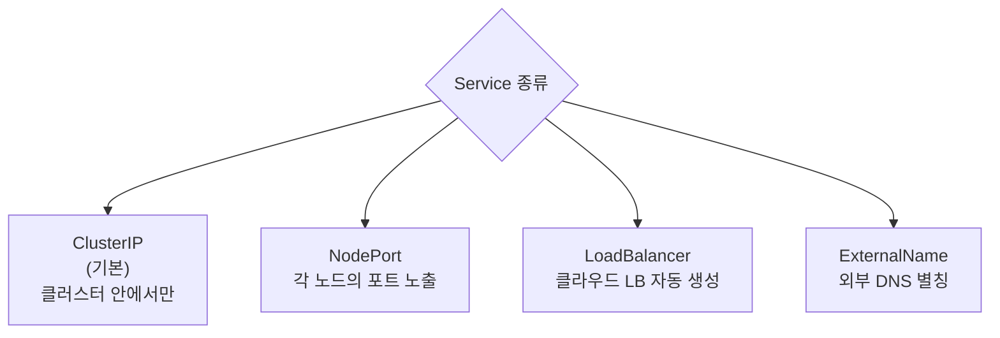
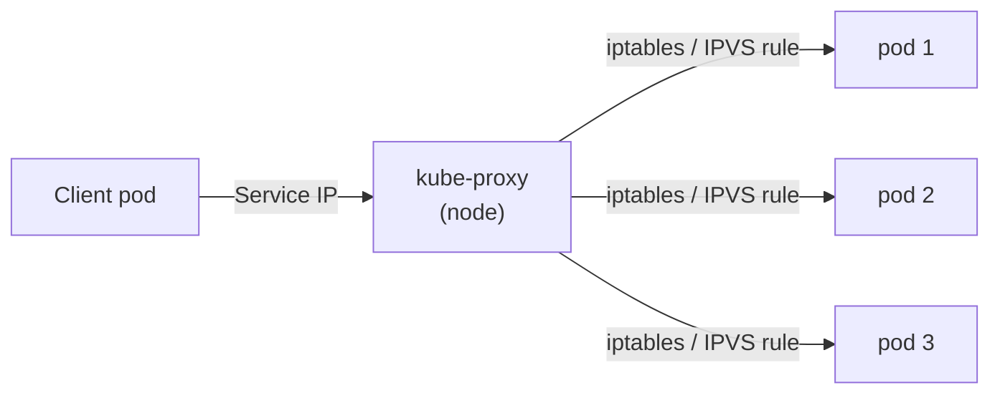
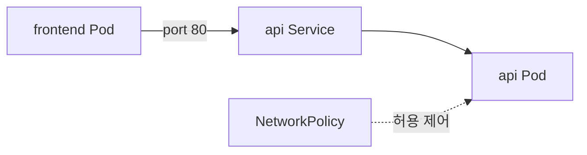
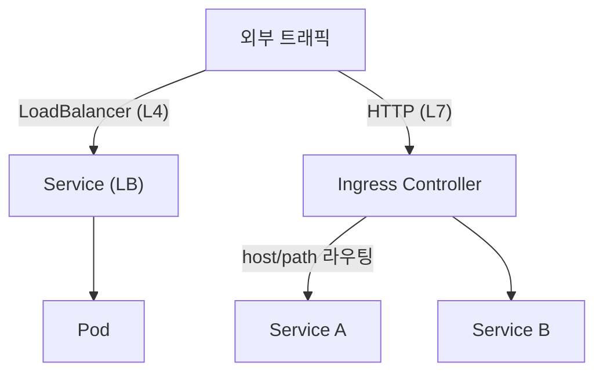

## 정의

**Service** = *Pod 집합에 *안정 가상 IP + DNS** 부여. Pod 가 죽고 다시 만들어져도 *Service IP 는 그대로*.

```anim:load-balancer
{}
```

## 4가지 타입



### 1. ClusterIP (기본)

```yaml
apiVersion: v1
kind: Service
metadata:
  name: api
spec:
  type: ClusterIP
  selector: { app: api }
  ports:
    - port: 80
      targetPort: 8080
```

- *클러스터 안에서만* 접근.
- 다른 pod 가 `http://api:80` 로 호출.
- DNS: `<service>.<namespace>.svc.cluster.local`.

### 2. NodePort

```yaml
spec:
  type: NodePort
  ports:
    - port: 80
      targetPort: 8080
      nodePort: 30080   # 옵션
```

- *모든 노드의 30000-32767 포트* 에서 접근.
- `http://<any-node>:30080`.
- 보통 *개발용*. 프로덕션은 LoadBalancer 또는 Ingress.

### 3. LoadBalancer

```yaml
spec:
  type: LoadBalancer
  selector: { app: api }
  ports: [{ port: 80, targetPort: 8080 }]
```

- 클라우드 (AWS, GCP) 가 *자동으로 LB 생성* + 외부 IP.
- AWS = ALB / NLB.
- *Service 당 LB 하나* → 많으면 *비싸다*. Ingress 가 대안.

### 4. ExternalName

```yaml
spec:
  type: ExternalName
  externalName: api.external.com
```

- DNS CNAME 처럼 *외부 호스트* 별칭.
- *기존 외부 service 와 통합* 용.

## Headless Service

```yaml
spec:
  clusterIP: None    # ← Headless
```

- *Service IP 없음*.
- DNS 가 *모든 pod IP 직접 반환*.
- StatefulSet 의 *peer discovery* 에 필수.

## DNS 와 Service Discovery

```
nslookup api
→ api.default.svc.cluster.local
→ 10.96.0.42 (ClusterIP)

nslookup api-headless
→ 10.244.0.5  (pod-1)
→ 10.244.0.6  (pod-2)
→ 10.244.0.7  (pod-3)
```

## 내부 동작: kube-proxy



| 모드 | 특징 |
|---|---|
| `iptables` (기본) | nat 규칙. 수천 Service 까지 OK |
| `IPVS` | 더 빠름, 더 큰 규모 |
| `nftables` (1.31+) | iptables 대체, 더 빠름 |

## 트래픽 분배

```
Service → endpoints (Pod IP 목록)
kube-proxy → random pick (iptables) 또는 알고리즘 (IPVS)
```

> *L4 round-robin*. 세션 sticky 가 필요하면 `service.spec.sessionAffinity: ClientIP`.

## Service 와 Endpoints

```bash
kubectl get endpoints api
NAME   ENDPOINTS                                AGE
api    10.244.0.5:8080,10.244.0.6:8080,...      5m
```

- Service = *추상*.
- Endpoints = *실제 pod IP*.
- Pod 의 *readiness* 가 OK 인 것만 endpoint 에 포함.

## EndpointSlice (1.21+)

큰 클러스터에서 Endpoints 의 *확장*. 1000+ pod 의 Service 에 효율적.

## 흔한 함정

> [!WARNING]
> 1. **LoadBalancer 남발** = AWS 1 LB = 시간당 비용 + LCU. *Ingress 로 통합* 권장.
> 2. **Service IP 변경 시도** = ClusterIP 는 *immutable*. 변경하려면 *삭제 + 재생성*.
> 3. **Headless 잘못 사용** = LB 동작 없음. StatefulSet 만.
> 4. **selector label 오타** = endpoints 0개. *Service 동작 안 함*.

## Multi-Port Service

한 Service 에서 *여러 포트* 노출 시 이름 필수.

```yaml
spec:
  type: ClusterIP
  selector: { app: api }
  ports:
    - name: http
      port: 80
      targetPort: 8080
    - name: grpc
      port: 9090
      targetPort: 9090
    - name: metrics
      port: 9100
      targetPort: 9100
```

## Port Naming 컨벤션

Ingress, Istio, Prometheus 가 *이름으로 프로토콜 자동 감지*.

| Port 이름 | 프로토콜 |
|---|---|
| `http` | HTTP/1.1 |
| `https` | HTTPS/TLS |
| `grpc` | gRPC |
| `http2` | HTTP/2 평문 |
| `metrics` | Prometheus scrape |

## Session Affinity 상세

```yaml
spec:
  sessionAffinity: ClientIP
  sessionAffinityConfig:
    clientIP:
      timeoutSeconds: 3600
```

같은 ClientIP 의 요청을 *동일 Pod 으로 고정*. `None` (기본) = 무작위. L7 쿠키 sticky 는 Ingress 레벨.

## External Traffic Policy

외부 트래픽 (NodePort / LoadBalancer) 의 라우팅 전략.

```yaml
spec:
  type: LoadBalancer
  externalTrafficPolicy: Local
```

| Policy | 동작 | 트레이드오프 |
|---|---|---|
| `Cluster` | 모든 노드 경유, SNAT | 균등 분배, *클라이언트 IP 유실* |
| `Local` | 같은 노드 Pod 만 | *소스 IP 보존*, Pod 없는 노드에서 드롭 |

## Service + NetworkPolicy 연계



NetworkPolicy 는 *Service IP 가 아니라 최종 Pod IP* 에 적용. Service 는 변환 중간점.

```yaml
apiVersion: networking.k8s.io/v1
kind: NetworkPolicy
metadata:
  name: api-allow-frontend
spec:
  podSelector:
    matchLabels:
      app: api
  ingress:
    - from:
        - podSelector:
            matchLabels:
              app: frontend
      ports:
        - port: 8080
```

## Service vs Ingress 비교



| 항목 | Service LoadBalancer | Ingress |
|---|---|---|
| 레이어 | L4 | L7 |
| LB 개수 | Service 당 1개 | 1개로 N 서비스 |
| 비용 | 높음 | 낮음 |
| 기능 | 포트 포워딩 | 호스트/경로 라우팅, TLS, 재작성 |

## 트러블슈팅

```bash
# Endpoint 확인 (0 이면 selector 불일치)
kubectl get endpoints <svc-name>

# Pod label 확인
kubectl get pods --show-labels -l app=<name>

# Service 상세 (Selector, Port, Endpoints 포함)
kubectl describe service <svc-name>

# DNS 조회 (파드 내부에서)
kubectl exec -it <pod> -- nslookup <svc>.<ns>.svc.cluster.local

# ClusterIP 직접 접근 테스트
kubectl exec -it <pod> -- curl http://<cluster-ip>:<port>
```

> [!TIP]
> Endpoints 가 0 이면 *selector label 불일치*. `kubectl describe service` 의 `Selector` 와 Pod 의 실제 label 을 비교.

## 관련 위키

- [[k8s-ingress]]
- [[k8s-pod]]
- [[k8s-statefulset]]
- [[k8s-network-policy]]
- [[k8s-service-mesh]]
- [[Load Balancer]]
- [[CORS]] (Ingress 가 CORS 헤더 추가)
