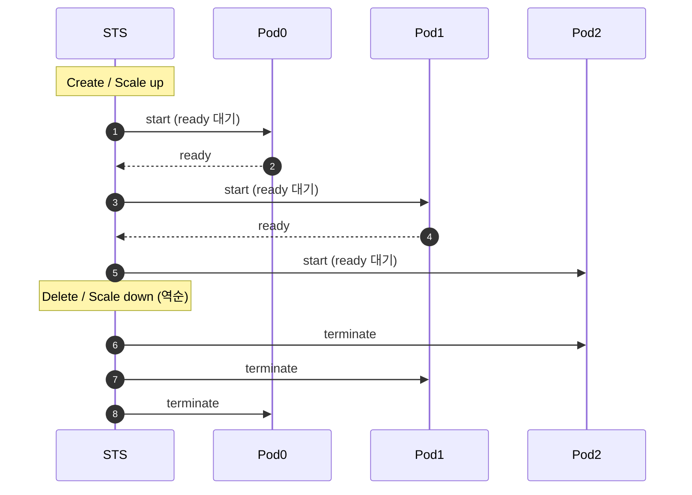
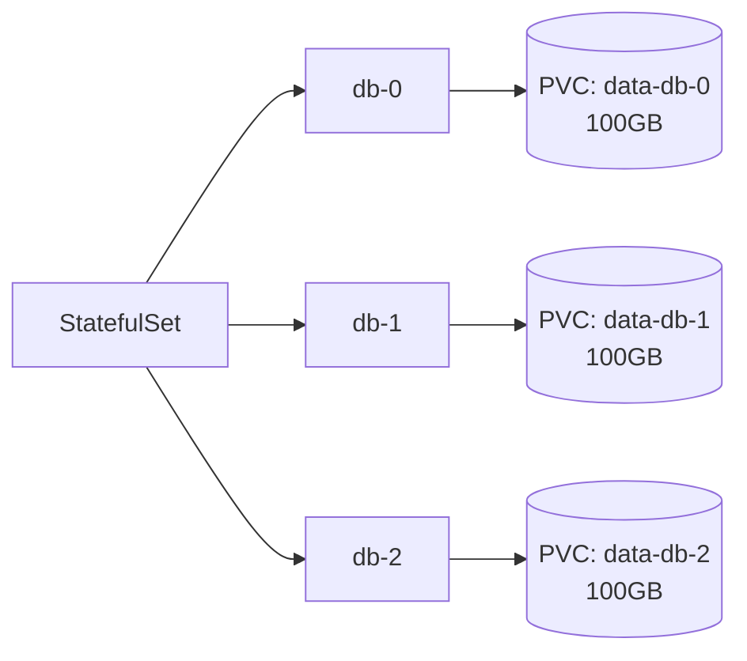

## 정의

**StatefulSet** = *상태 있는 워크로드를 위한 컨트롤러*. Deployment 와의 차이:

| 항목 | Deployment | StatefulSet |
|---|---|---|
| Pod 이름 | random hash (`web-7d9c-xpqr`) | *순서* (`db-0, db-1, db-2`) |
| Pod 식별 | 변경됨 | *고정 (sticky identity)* |
| 시작 순서 | parallel | *순차 (0 → 1 → 2)* |
| 종료 순서 | parallel | *역순 (N-1 → 0)* |
| 스토리지 | 공유 또는 ephemeral | *pod 별 PVC* |
| Headless Service | 옵션 | *필수* |

## 사용처

```mermaid
flowchart TD
    Yes[StatefulSet 적합]
    Yes --> Y1[DB (PostgreSQL, MySQL replica)]
    Yes --> Y2[Kafka, Zookeeper]
    Yes --> Y3[Elasticsearch]
    Yes --> Y4[etcd]
    Yes --> Y5[Cassandra]
    No[Deployment 가 충분]
    No --> N1[Stateless API]
    No --> N2[Web frontend]
    No --> N3[Worker]
```

## YAML

```yaml
apiVersion: v1
kind: Service
metadata: { name: db-headless }
spec:
  clusterIP: None        # ← Headless 필수
  selector: { app: db }
  ports: [{ port: 5432, targetPort: 5432 }]
---
apiVersion: apps/v1
kind: StatefulSet
metadata: { name: db }
spec:
  serviceName: db-headless
  replicas: 3
  selector: { matchLabels: { app: db } }
  template:
    metadata: { labels: { app: db } }
    spec:
      containers:
        - name: postgres
          image: postgres:17
          ports: [{ containerPort: 5432 }]
          volumeMounts:
            - name: data
              mountPath: /var/lib/postgresql/data
  volumeClaimTemplates:
    - metadata: { name: data }
      spec:
        accessModes: [ReadWriteOnce]
        storageClassName: fast-ssd
        resources: { requests: { storage: 100Gi } }
```

## Pod 이름과 DNS

```
pod 0: db-0   → db-0.db-headless.default.svc.cluster.local
pod 1: db-1   → db-1.db-headless.default.svc.cluster.local
pod 2: db-2   → db-2.db-headless.default.svc.cluster.local
```

> *각 pod 가 고유 DNS 이름*. peer 끼리 *서로 직접 통신* (replication 등).

## 시작 / 종료 순서



> [!IMPORTANT]
> *Master-replica DB* 처럼 *순서가 중요* 한 경우 핵심. `podManagementPolicy: Parallel` 로 *순차 종속성 제거* 가능 (Kafka 같이 *peer 끼리 sync*).

## PVC per Pod (영속 스토리지)



- *pod 재생성* 후에도 *같은 PVC 재연결*.
- *pod 삭제* 해도 *PVC 보존* (직접 삭제 필요).

## Update 전략

| 전략 | 의미 |
|---|---|
| `RollingUpdate` (기본) | *순차 업데이트* (N-1 → 0) |
| `OnDelete` | *수동 삭제 시* 만 새 spec |
| `partition: N` | 인덱스 ≥ N 만 업데이트 (canary) |

## 운영 패턴: Operator

```mermaid
flowchart LR
    Op[Operator (controller)] -->|관리| STS[StatefulSet]
    Op -->|backup| Backup[(S3 backup)]
    Op -->|failover| Promote[Replica → Primary]
    Op -->|scale| Add[새 replica join]
```

- *DB 운영의 표준* (PostgreSQL Operator, Kafka Strimzi, ElasticSearch ECK).
- StatefulSet 만으로 부족한 *애플리케이션 특화 로직* 자동화.

## 흔한 함정

> [!WARNING]
> 1. **Headless Service 없음** = pod DNS 안 잡힘 → peer discovery 실패.
> 2. **`partition` 활용 안 함** = canary 불가. 모든 pod 한 번에 업데이트.
> 3. **PVC delete 정책** = StatefulSet 삭제 시 *PVC 보존* (기본). 의도적으로 삭제 안 하면 *영구 storage cost*.
> 4. **DB 의 *순서 의존성 + parallel 정책 잘못*** = 데이터 손상.

## 관련 위키

- [[k8s-deployment]]
- [[k8s-pod]]
- [[k8s-service]]
- [[postgresql]]
- [[kafka]]
