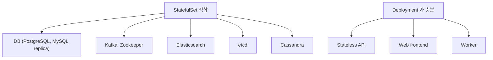
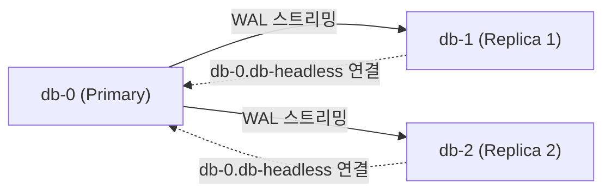
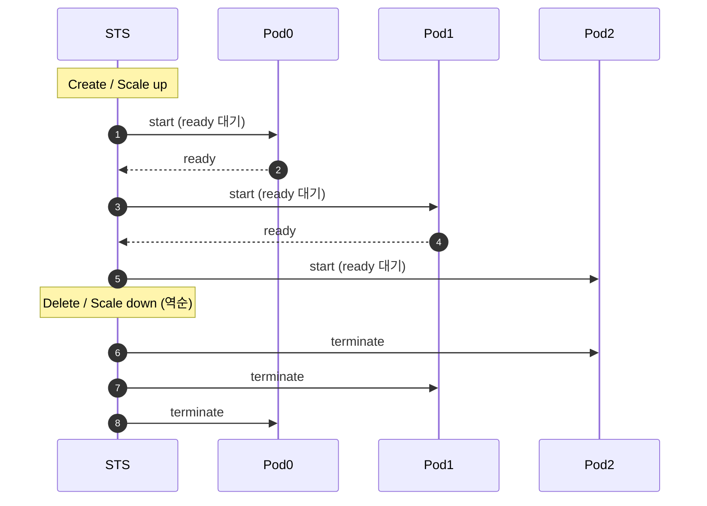
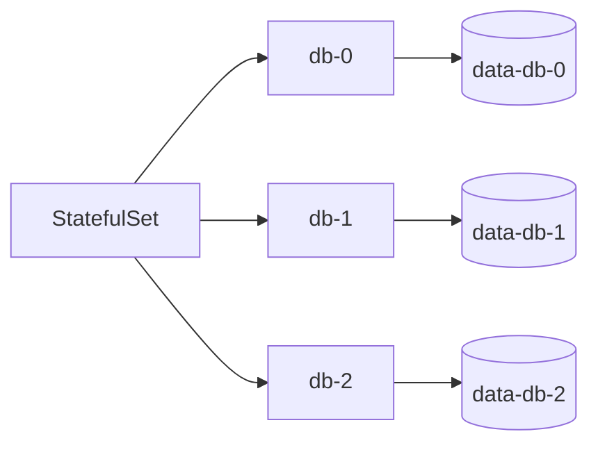
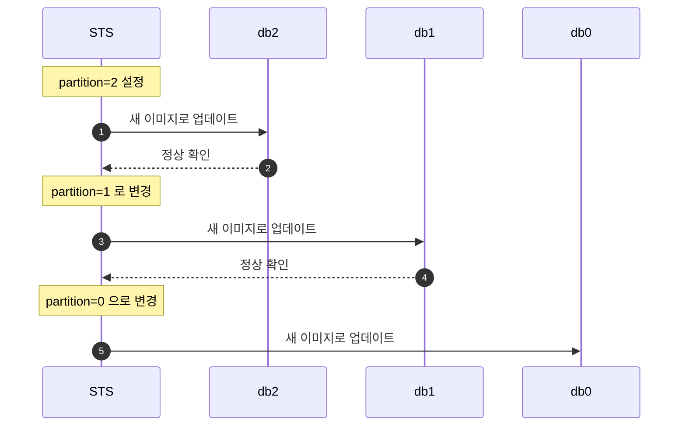
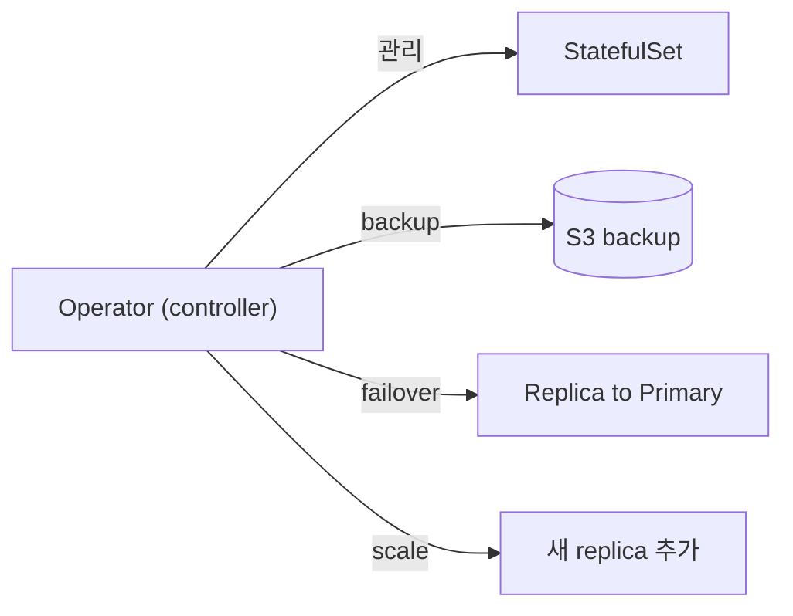
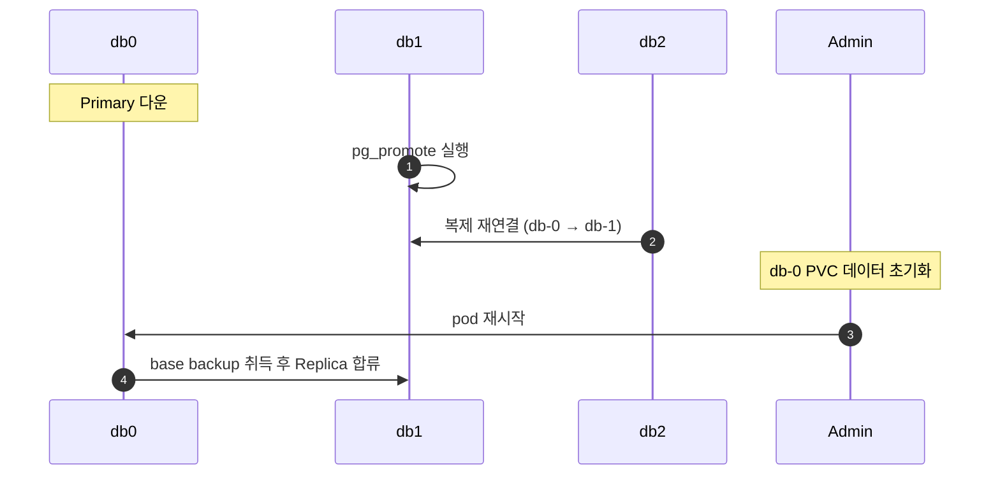

## 정의

**StatefulSet** = *상태 있는 워크로드를 위한 컨트롤러*. Deployment 와의 차이:

| 항목 | Deployment | StatefulSet |
|---|---|---|
| Pod 이름 | random hash (`web-7d9c-xpqr`) | *순서* (`db-0, db-1, db-2`) |
| Pod 식별 | 변경됨 | *고정 (sticky identity)* |
| 시작 순서 | parallel | *순차 (0 → 1 → 2)* |
| 종료 순서 | parallel | *역순 (N-1 → 0)* |
| 스토리지 | 공유 또는 ephemeral | *pod 별 PVC* |
| Headless Service | 옵션 | *필수* |

## 사용처



## YAML

```yaml
apiVersion: v1
kind: Service
metadata: { name: db-headless }
spec:
  clusterIP: None        # Headless 필수
  selector: { app: db }
  ports: [{ port: 5432, targetPort: 5432 }]
---
apiVersion: apps/v1
kind: StatefulSet
metadata: { name: db }
spec:
  serviceName: db-headless
  replicas: 3
  selector: { matchLabels: { app: db } }
  template:
    metadata: { labels: { app: db } }
    spec:
      containers:
        - name: postgres
          image: postgres:17
          ports: [{ containerPort: 5432 }]
          readinessProbe:
            exec:
              command: [pg_isready, -U, postgres]
            initialDelaySeconds: 5
            periodSeconds: 5
          volumeMounts:
            - name: data
              mountPath: /var/lib/postgresql/data
  volumeClaimTemplates:
    - metadata: { name: data }
      spec:
        accessModes: [ReadWriteOnce]
        storageClassName: fast-ssd
        resources: { requests: { storage: 100Gi } }
```

## Pod 이름과 DNS

```
pod 0: db-0   → db-0.db-headless.default.svc.cluster.local
pod 1: db-1   → db-1.db-headless.default.svc.cluster.local
pod 2: db-2   → db-2.db-headless.default.svc.cluster.local
```

> *각 pod 가 고유 DNS 이름*. peer 끼리 *서로 직접 통신* (replication 등).

## Peer Discovery 패턴

StatefulSet + Headless Service 조합이 *peer discovery 의 핵심*:



- Replica 가 Primary 에 연결: `postgresql://db-0.db-headless:5432`
- pod 재시작 후에도 *같은 DNS 유지*
- 애플리케이션이 *Primary 주소를 안정적으로 참조* 가능

## 시작 / 종료 순서



> [!IMPORTANT]
> *Master-replica DB* 처럼 *순서가 중요* 한 경우 핵심. `podManagementPolicy: Parallel` 로 *순차 종속성 제거* 가능 (Kafka 같이 *peer 끼리 sync*).

## initContainers로 초기화

Replica pod 가 시작 전 Primary 에서 데이터를 받아야 할 때:

```yaml
initContainers:
  - name: init-replica
    image: postgres:17
    command:
      - bash
      - -c
      - |
        # db-0 (Primary) 은 초기화 스킵
        [ "$(hostname)" = "db-0" ] && exit 0
        # Primary 에서 base backup 취득
        pg_basebackup -h db-0.db-headless \
          -U replicator -D /var/lib/postgresql/data \
          -Xs -R
    volumeMounts:
      - name: data
        mountPath: /var/lib/postgresql/data
```

- `db-0` (Primary) 은 initContainer 를 스킵
- `db-1`, `db-2` 는 *기동 전 Primary 에서 base backup 취득*
- *데이터가 있는 상태* 에서 Replica 시작 보장

## PVC per Pod (영속 스토리지)



- *pod 재생성* 후에도 *같은 PVC 재연결*
- *pod 삭제* 해도 *PVC 보존* (직접 삭제 필요)

## PVC 생명주기 관리

| 작업 | 동작 |
|---|---|
| Pod 재시작 | PVC 자동 재연결 |
| Scale down | PVC 보존 (삭제 안 됨) |
| StatefulSet 삭제 | PVC 보존 (수동 삭제 필요) |
| PVC 용량 확장 | `StorageClass allowVolumeExpansion: true` 필요 |

```yaml
# K8s 1.27+: StatefulSet 삭제/축소 시 PVC 정책 설정
spec:
  persistentVolumeClaimRetentionPolicy:
    whenDeleted: Delete    # StatefulSet 삭제 시 PVC 도 삭제
    whenScaled: Retain     # Scale down 시 PVC 유지
```

## Update 전략

| 전략 | 의미 |
|---|---|
| `RollingUpdate` (기본) | *순차 업데이트* (N-1 → 0) |
| `OnDelete` | *수동 삭제 시* 만 새 spec |
| `partition: N` | 인덱스 ≥ N 만 업데이트 (canary) |

## Canary Update (partition 활용)

```yaml
spec:
  updateStrategy:
    type: RollingUpdate
    rollingUpdate:
      partition: 2    # db-2 만 먼저 업데이트
```



*문제 발생 시*: `image` 를 이전 버전으로 되돌리면 이미 업데이트된 pod 도 재시작 시 롤백.

## 운영 패턴: Operator



- *DB 운영의 표준* (PostgreSQL Operator, Kafka Strimzi, ElasticSearch ECK)
- StatefulSet 만으로 부족한 *애플리케이션 특화 로직* 자동화

| 대상 | 대표 Operator |
|---|---|
| PostgreSQL | CNPG (CloudNativePG), Zalando postgres-operator |
| Kafka | Strimzi |
| Elasticsearch | ECK (Elastic Cloud on K8s) |
| Redis | Redis Operator |

## Primary 장애 복구 흐름

Operator 없이 *수동 failover* 시:



> [!IMPORTANT]
> Operator (예: CNPG, Zalando) 를 사용하면 *이 모든 흐름이 자동화*. 수동 StatefulSet 만으로 DB HA 구현은 권장하지 않음.

## 흔한 함정

> [!WARNING]
> 1. **Headless Service 없음** = pod DNS 안 잡힘 → peer discovery 실패.
> 2. **`partition` 활용 안 함** = canary 불가. 모든 pod 한 번에 업데이트.
> 3. **PVC delete 정책** = StatefulSet 삭제 시 *PVC 보존* (기본). 의도적으로 삭제 안 하면 *영구 storage cost*.
> 4. **DB 의 순서 의존성 + parallel 정책 잘못** = 데이터 손상.
> 5. **initContainer 없이 Replica 시작** = *빈 PVC 로 Replica 가 기동*, 데이터 없는 상태.
> 6. **Operator 없이 DB HA 구현** = failover, backup, scale 을 손으로. Operator 사용 권장.

## 관련 위키

- [[k8s-deployment]]
- [[k8s-pod]]
- [[k8s-service]]
- [[postgresql]]
- [[kafka]]
