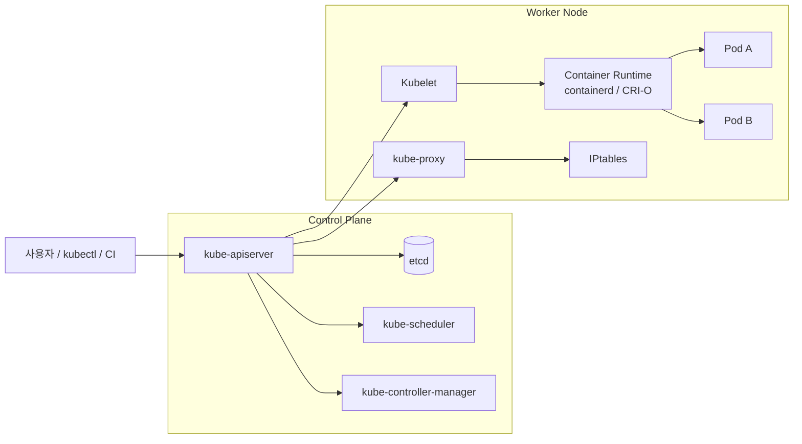

## 정의

**Kubernetes (k8s)** 는 컨테이너화된 애플리케이션의 **배포, 스케일링, 관리** 를 자동화하는 오픈소스 오케스트레이터입니다. Google 이 2014년 발표하고 2015년 v1.0 릴리스 이후 **CNCF (Cloud Native Computing Foundation)** 재단으로 이관되어 사실상 클라우드 네이티브 표준이 되었습니다.

이름은 그리스어 "조타수" 에서 왔고, 약어 **k8s** 는 "K" 와 "s" 사이에 8글자 (ubernete) 가 있다는 뜻입니다.

## 왜 Kubernetes 인가

컨테이너만으로는 부족한 것들을 채웁니다.

- **선언적 관리**: `kubectl apply -f deployment.yaml` -> 원하는 상태 선언, k8s 가 실제 상태를 그것에 맞춤
- **자동 스케일링**: HPA/VPA/CA 가 부하에 따라 파드/노드 조정
- **자가 치유**: 실패한 컨테이너/노드를 자동 재시작/재배치
- **롤링 업데이트**: 무중단 배포 (canary, blue/green)
- **서비스 디스커버리**: DNS + Service 로 앱 간 연결 (IP 불변)
- **로드 밸런싱**: 파드에 트래픽 분산
- **비밀 관리**: Secret + KMS 로 API key, 비밀번호 저장
- **스토리지 오케스트레이션**: CSI 로 PV/PVC 자동 프로비저닝
- **배치 처리**: Job, CronJob

## 아키텍처 요약



- **[[k8s-architecture|Control Plane]]**: kube-apiserver, etcd, kube-scheduler, kube-controller-manager, cloud-controller-manager
- **Worker Node**: kubelet, kube-proxy, container runtime (CRI 호환), CNI 플러그인
- **네트워킹**: 모든 Pod 이 유일한 IP, Pod 간 NAT 없이 통신 (Kubernetes network model)

자세한 것은 [[k8s-architecture|Kubernetes Architecture]] 참조.

## 핵심 리소스

| 리소스 | 역할 | 자세히 |
|:---|:---|:---|
| **[[k8s-pod|Pod]]** | 1+ 컨테이너의 최소 배포 단위 | 공유 network namespace, volume |
| **[[k8s-deployment|Deployment]]** | Stateless 앱 배포 (ReplicaSet 관리) | 롤링 업데이트, 롤백 |
| **[[k8s-statefulset|StatefulSet]]** | Stateful 앱 (DB, Kafka 등) | 순서 있는 배포, 안정된 이름 |
| **[[k8s-daemonset|DaemonSet]]** | 모든 노드에 1개씩 (로그, 모니터링) | 노드 필터링 지원 |
| **[[k8s-job-cronjob|Job / CronJob]]** | 배치, 스케줄 | 완료 지향 |
| **[[k8s-service|Service]]** | Pod 그룹의 안정된 endpoint | ClusterIP, NodePort, LoadBalancer |
| **[[k8s-ingress|Ingress]]** | HTTP(S) L7 라우팅 | Nginx, ALB, Istio Gateway |
| **[[k8s-configmap-secret|ConfigMap / Secret]]** | 설정 / 비밀 값 주입 | env, volume mount |
| **[[k8s-persistent-volumes|PV / PVC]]** | 영속 스토리지 | CSI 프로비저닝 |
| **[[k8s-namespace|Namespace]]** | 논리적 격리 단위 | 팀 / 환경 분리 |
| **[[k8s-labels-selectors|Labels / Selectors]]** | 리소스 조직화 | Deployment / Service 매칭 |
| **[[k8s-rbac|RBAC]]** | 권한 관리 | Role, ClusterRole, Binding |
| **[[k8s-network-policy|NetworkPolicy]]** | Pod 간 네트워크 제어 | Ingress / Egress 규칙 |
| **[[k8s-hpa-vpa|HPA / VPA]]** | 자동 스케일링 | Horizontal / Vertical |

## 선언적 워크플로

```bash
# 1. 원하는 상태를 YAML 로 선언
cat > deploy.yaml <<EOF
apiVersion: apps/v1
kind: Deployment
metadata:
  name: web
spec:
  replicas: 3
  selector:
    matchLabels: {app: web}
  template:
    metadata:
      labels: {app: web}
    spec:
      containers:
        - name: nginx
          image: nginx:1.27
          ports: [{containerPort: 80}]
EOF

# 2. apply -> 컨트롤러가 실제 상태를 그것에 맞춤
kubectl apply -f deploy.yaml

# 3. 확인
kubectl get pods -l app=web
kubectl describe deploy web
kubectl logs -l app=web
```

이 선언적 방식이 k8s 의 정수. **명령형 (`kubectl run`)** 은 학습/디버깅용, **선언적 (`kubectl apply`)** 은 프로덕션.

## 컴포넌트 상세 (한 줄 소개)

### Control Plane
- **kube-apiserver**: 모든 요청의 진입점. RESTful API. etcd 앞의 유일한 클라이언트.
- **etcd**: 클러스터 상태 저장. Raft 합의 알고리즘. 백업 필수.
- **kube-scheduler**: 새 Pod 을 어느 노드에 배치할지 결정.
- **kube-controller-manager**: Deployment/ReplicaSet/Node 등 컨트롤러 실행.
- **cloud-controller-manager**: 클라우드 특화 (LB, Volume, Route). AWS/GCP/Azure 마다 다름.

### Node
- **kubelet**: 노드의 Pod 을 관리. Container Runtime 과 CRI 로 통신.
- **kube-proxy**: 노드의 Service iptables/IPVS 규칙 관리.
- **Container Runtime**: containerd (기본), CRI-O. Docker 는 v1.24+ 제거.
- **CNI 플러그인**: Pod 네트워킹. Calico, Cilium, Flannel, Weave 등.

## 관리형 vs 자체 운영

| 옵션 | 설명 | 언제 |
|:---|:---|:---|
| **[[aws-eks|EKS]]** | AWS 관리형 | AWS 워크로드 |
| **GKE** | Google 관리형 | GCP, 원조 답게 안정성 최상급 |
| **AKS** | Azure 관리형 | Azure 워크로드 |
| **Rancher / RKE2** | 오픈소스 배포판 | 온프렘 |
| **kubeadm** | 표준 부트스트랩 도구 | 커스텀 노드 |
| **k3s / k3d** | 경량 (< 100 MB) | 엣지, 로컬 개발 |
| **minikube / kind** | 로컬 개발 | 개발자 노트북 |

**결정 룰**: 프로덕션이면 관리형 (EKS/GKE/AKS). 학습/특수 요구면 kubeadm 이나 k3s.

## 배포 관리 도구

- **[[helm|Helm]]**: 패키지 매니저. Chart = k8s manifests 템플릿
- **[[k8s-kustomize|Kustomize]]**: overlay 기반 manifest 조합. `kubectl` 내장
- **[[argocd|ArgoCD]] / Flux**: GitOps CD
- **Terraform + kubectl_manifest**: IaC

## 관측성

- **로그**: kubectl logs, Fluent Bit -> Loki/Elasticsearch
- **메트릭**: [[prometheus|Prometheus]] + Grafana
- **트레이스**: [[opentelemetry|OpenTelemetry]] + Jaeger/Tempo
- **이벤트**: kubectl get events

## 보안 계층

- **[[k8s-rbac|RBAC]]**: 사용자/ServiceAccount 권한
- **[[k8s-network-policy|NetworkPolicy]]**: L3/L4 Pod 간 네트워크
- **Pod Security Admission (PSA)**: privileged/baseline/restricted 정책 강제
- **[[k8s-admission-controllers|Admission Controllers]]**: MutatingWebhook, ValidatingWebhook (OPA/Gatekeeper, Kyverno)
- **Secrets**: KMS 암호화 at rest
- **imagePullPolicy + 이미지 서명** (Sigstore, Cosign)
- **CIS Benchmark**: kube-bench 로 감사

## Release Cadence

Kubernetes 는 **약 3-4개월마다 마이너 릴리스**. 각 마이너는 **약 14개월** 지원. 오래된 클러스터는 정기적 업그레이드 필수.

**최근 하이라이트 (2024-2025)**:
- **v1.29 (2024-01)**: [[k8s-init-sidecar|SidecarContainers]] 기능 게이트 default enabled
- **v1.31 (2024-08)**: AppArmor 프로필 stable, VolumeAttributes API 등
- **v1.32 (2024-12)**: Dynamic Resource Allocation beta, memory manager stable
- **v1.33 (2025-04)**: **SidecarContainers GA**, Pod-level 리소스 옵션 등
- **v1.34+ (2025)**: 지속 진화

## 학습 로드맵

1. **Pod, Deployment, Service** 이해 -> 앱 배포 성공
2. **ConfigMap, Secret** -> 설정 관리
3. **Ingress + Cert-Manager** -> 외부 노출 + TLS
4. **StatefulSet + PV** -> 상태 있는 앱
5. **HPA + 리소스 요청/한계** -> 스케일링
6. **RBAC + NetworkPolicy** -> 보안
7. **Helm / Kustomize** -> 패키지 관리
8. **CRD + Operator** -> 확장
9. **관측 (Prom, OTel)** -> 프로덕션 운영
10. **GitOps (ArgoCD)** -> 배포 자동화

## 함정

> [!WARNING]
> **`latest` 이미지 태그 사용 금지**. Immutable digest 나 semver pin.

> [!CAUTION]
> **리소스 요청/한계 안 걸면 노이지 이웃**. Memory limit 없으면 OOM 도미노.

> [!WARNING]
> **etcd 백업 필수**. 클러스터 완전 재구성 유일 수단.

> [!IMPORTANT]
> **버전 스킵 업그레이드 금지**. 마이너 하나씩만 (n → n+1). API 폐지 정보 확인.

> [!CAUTION]
> **`kubectl edit` 남용**. 클러스터 상태와 git 이 어긋남. GitOps 로 통일.

## 관련 위키

- [[k8s-architecture|Kubernetes Architecture]] - 컴포넌트 심화
- [[k8s-pod|Pod]] - 최소 배포 단위
- [[k8s-deployment|Deployment]] - Stateless 배포
- [[k8s-statefulset|StatefulSet]] - Stateful
- [[k8s-daemonset|DaemonSet]]
- [[k8s-service|Service]] - 네트워크 endpoint
- [[k8s-ingress|Ingress]] - L7 라우팅
- [[k8s-configmap-secret|ConfigMap / Secret]]
- [[k8s-persistent-volumes|PV / PVC]]
- [[k8s-namespace|Namespace]]
- [[k8s-labels-selectors|Labels & Selectors]]
- [[k8s-rbac|RBAC]]
- [[k8s-network-policy|NetworkPolicy]]
- [[k8s-hpa-vpa|HPA / VPA]]
- [[k8s-job-cronjob|Job / CronJob]]
- [[k8s-init-sidecar|Init & Sidecar Containers]]
- [[k8s-resource-management|Resource Management]]
- [[k8s-scheduling|Scheduling]]
- [[k8s-crd-operators|CRDs & Operators]]
- [[k8s-admission-controllers|Admission Controllers]]
- [[k8s-service-mesh|Service Mesh]]
- [[k8s-debugging|Debugging]]
- [[kubectl|kubectl]]
- [[k8s-kustomize|Kustomize]]
- [[helm|Helm]]
- [[argocd|ArgoCD]]
- [[aws-eks|EKS]] - AWS managed
