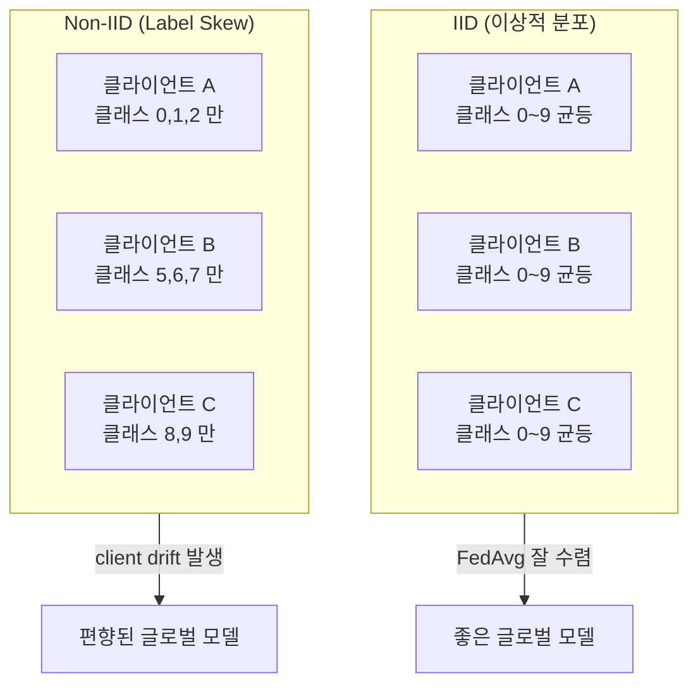
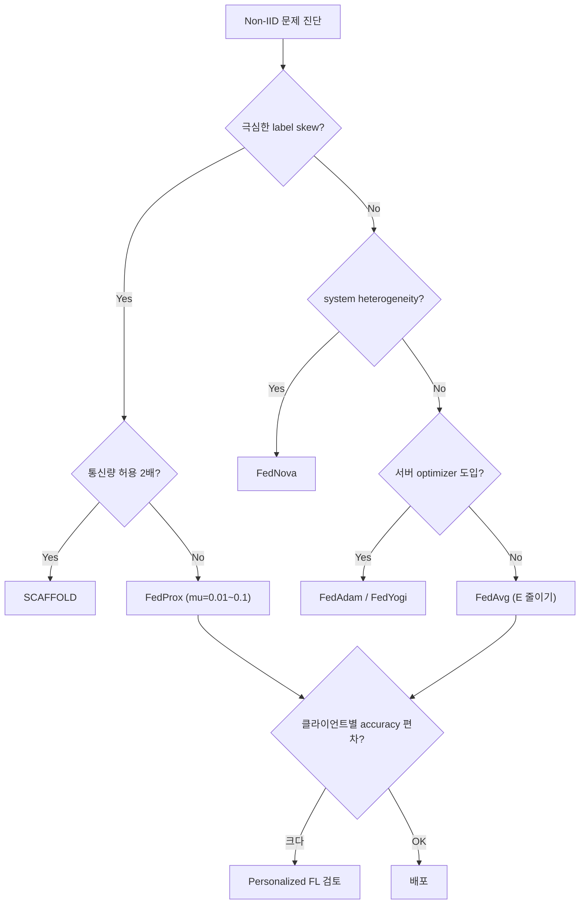

## 정의

**Non-IID data** 는 연합 학습에서 각 클라이언트의 데이터가 서로 다른 분포에서 추출되는 상황을 말합니다. FedAvg 를 비롯한 대부분 FL 알고리즘의 최대 난관이며, **client drift** (각 클라이언트가 자기 로컬 optimum 으로 이탈해 평균이 잘못된 방향으로 이동) 를 유발합니다.

## Non-IID 의 유형

Kairouz et al. (2021) 서베이 분류:

### 1. Feature distribution skew (covariate shift)

$P_k(x) \ne P_{k'}(x)$, but $P_k(y|x)$ 는 동일.

- 예: 여러 병원의 X-ray 데이터. 라벨 (질병) 규칙은 같지만 촬영 장비/환자군이 달라 이미지 통계가 다름.

### 2. Label distribution skew (prior probability shift)

$P_k(y) \ne P_{k'}(y)$, but $P_k(x|y)$ 는 동일.

- 예: MNIST 를 100명에게 나눠주되 각자는 특정 숫자 3-4개만 받음. 클래스 사전 분포가 극단적으로 다름.
- 실전에서 흔한 유형. 사용자별 관심사 편중.

### 3. Same label, different features (concept shift)

$P_k(x|y) \ne P_{k'}(x|y)$.

- 예: 여러 나라의 "긴급 상황" 라벨 데이터. 라벨은 같지만 특성 분포가 다름.

### 4. Same features, different label (concept drift)

$P_k(y|x) \ne P_{k'}(y|x)$.

- 예: 다국어 감정 분석. 같은 단어가 나라마다 다른 감정.

### 5. Quantity skew (unbalancedness)

$|D_k|$ 가 클라이언트별로 크게 다름. 대형 클라이언트 몇 개가 지배.

실무에서는 이 유형들이 **혼합** 되어 나타납니다.

## Non-IID 상황 시각화

## Client Drift 의 수학적 원인

로컬 objective $F_k(w)$ 는 클라이언트 $k$ 의 로컬 데이터에 대한 손실. 글로벌 objective 는:

$$
F(w) = \sum_k \frac{n_k}{n} F_k(w)
$$

로컬 SGD 를 $E$ epoch 돌리면 클라이언트 $k$ 는 $F_k$ 의 로컬 minimum $w_k^*$ 에 접근합니다.

$$
w_k^{t+1} \approx w_k^* = \arg\min_w F_k(w)
$$

Non-IID 상황에서 $\{w_k^*\}$ 들은 서로 멀리 흩어져 있고, 그들의 평균은 **글로벌 minimum $w^* = \arg\min_w F(w)$ 와 무관** 할 수 있습니다.

$$
\sum_k \frac{n_k}{n} w_k^* \not\approx w^*
$$

이것이 client drift. E 가 클수록 더 심해집니다.

## 완화 전략

### A. Reduce local computation

- **E 축소** (극단적으로는 E=1, 즉 FedSGD): drift 감소, 대신 통신 폭증
- **B 확대**: 배치를 크게 (분산 감소, 하지만 GPU 메모리 요구 증가)

**Trade-off**: 통신 vs drift.

### B. Proximal Regularization (FedProx)

Li et al. (2020) 의 **FedProx** 는 로컬 objective 에 **proximal term** 을 추가:

$$
\min_w F_k(w) + \frac{\mu}{2} \| w - w_t \|^2
$$

- $\mu$: 하이퍼파라미터 (0.001 ~ 1)
- 로컬 update 가 글로벌 모델에서 멀리 벗어나지 못하도록 제약
- Straggler (느린 클라이언트) 가 partial work 만 해도 안전

**Pros**: 구현 간단 (loss 에 term 하나 추가), FedAvg 대비 안정성 향상.
**Cons**: $\mu$ 튜닝 필요, drift 를 완전히 없애진 못함.

### C. Control Variate (SCAFFOLD)

Karimireddy et al. (2020) 의 **SCAFFOLD** 는 각 클라이언트의 drift 방향을 **control variate** $c_k$ 로 추적하고 로컬 gradient 에서 빼줍니다.

로컬 SGD update:

$$
w \leftarrow w - \eta \left( \nabla F_k(w) - c_k + c \right)
$$

- $c_k$: 클라이언트 $k$ 의 로컬 correction (drift 방향)
- $c$: 서버 correction (모든 클라이언트 평균)
- $c_k - c$: "이 클라이언트가 평균보다 얼마나 편향된가"

라운드 종료 시 $c_k$ 를 업데이트하고 서버가 $c$ 를 재집계.

**Pros**: 이론적으로 IID 급 수렴 rate 회복.
**Cons**: 통신량 2배 (weight + control variate 모두 전송), 메모리 2배.

### D. Objective Consistency (FedNova)

Wang et al. (2020) 의 **FedNova** 는 각 클라이언트의 로컬 step 수 $\tau_k$ 가 다를 때 정규화. FedAvg 는 클라이언트별로 step 수가 달라도 그냥 평균하지만, 이는 objective inconsistency 를 야기.

FedNova 는 normalized gradient 를 집계:

$$
w_{t+1} = w_t - \tau_{\text{eff}} \cdot \sum_k \frac{n_k}{n} \cdot \frac{d_k}{\tau_k}
$$

- $d_k = w_t - w_k^{t+1}$: 클라이언트 $k$ 의 delta
- $\tau_k$: 클라이언트 $k$ 의 로컬 step 수
- $\tau_{\text{eff}}$: 유효 step 수 (스케일 조정)

특히 system heterogeneity (느린/빠른 클라이언트 혼재) 상황에 강함.

### E. Server-side adaptive optimizer

Reddi et al. (2020) 의 **FedAdam, FedYogi, FedAdagrad**. 서버에서 pseudo-gradient $\Delta_t = w_t - w_{t+1}^{\text{avg}}$ 를 Adam/Yogi/Adagrad 로 적용.

$$
w_{t+1} = w_t - \eta \cdot \text{AdamUpdate}(\Delta_t)
$$

Non-IID 하에서 학습 안정성 향상.

### F. Data augmentation / Mixup

클라이언트가 로컬에서 data augmentation 을 강하게 하면 로컬 분포가 완화되어 drift 감소. Mixup, CutMix, RandAugment 등이 흔히 결합.

### G. Personalization (개인화)

Non-IID 를 **없애려 하지 말고** 각 클라이언트가 자기 분포에 맞게 개인화 모델을 갖도록 함. 자세한 것은 [[personalized-fl|Personalized FL]] 참조.

## 벤치마크 데이터셋

Non-IID FL 연구에 자주 쓰이는:

- **Federated MNIST / FEMNIST**: 필기 데이터를 작가별로 자연 분할
- **Federated CIFAR-10 (Dirichlet split)**: Dirichlet 파라미터 $\alpha$ 로 non-IID 정도 조절
- **Shakespeare**: 극중 인물별 대사, 언어 모델링
- **StackOverflow**: 사용자별 질문/답변
- **iNaturalist**: 지역별 야생동물 이미지
- **Reddit**: user별 댓글

**Dirichlet split**: 라벨 $y$ 의 클라이언트 분포를 $\text{Dir}(\alpha)$ 로 샘플. $\alpha$ 가 작을수록 극단적 non-IID.

## BatchNorm 특별 주의 (FedBN)

Non-IID 에서 Batch Normalization 은 특히 취약합니다. 각 클라이언트의 배치 통계 (mean, variance) 가 달라서 글로벌 집계 후 BN 레이어가 "틀린 통계" 로 추론합니다.

**해결책**:

- **FedBN** (Li et al., 2021): BN 레이어는 집계하지 않고 각 클라이언트에서 로컬 통계를 유지
- **GroupNorm / LayerNorm 대체**: 배치 통계에 의존하지 않아 Non-IID 에 강함
- **InstanceNorm**: 각 샘플마다 정규화, 배치 크기에 무관

모델 설계 단계에서 FL 을 고려하면 처음부터 GroupNorm 을 쓰는 것이 좋습니다.

## 알고리즘 선택 가이드

| 상황 | 권장 |
|:---|:---|
| Mild non-IID + IID 근접 | **FedAvg** (그대로) |
| 표준 non-IID (label skew) | **FedProx** ($\mu$ = 0.01) |
| 극심한 drift, 클라이언트 다수 | **SCAFFOLD** |
| System heterogeneity (다양한 로컬 step) | **FedNova** |
| 서버 최적화 여지 | **FedAdam / FedYogi** |
| BatchNorm 통계 문제 | **FedBN** or **GroupNorm** 대체 |
| 개인화가 목적 | **Personalized FL** |

## 실험 체크리스트

Non-IID FL 논문/프로젝트에서 반드시 보고해야 하는 항목:

1. **Non-IID 정도 정량화**: Dirichlet $\alpha$, 클라이언트당 클래스 수, Earth Mover's Distance 등
2. **클라이언트 참여율**: 라운드당 샘플링 비율 (full participation vs partial participation)
3. **로컬 epoch E**: drift 의 직접 파라미터
4. **글로벌 accuracy 뿐 아니라 per-client accuracy 분포**: worst-10% 클라이언트 성능 필수
5. **통신 라운드 수 vs 성능**: 총 통신량 비교 (알고리즘마다 라운드당 비용 다름)
6. **SCAFFOLD 는 통신 2배 반영**: 단순 accuracy 비교는 불공평

## 함정

> [!WARNING]
> **Non-IID 를 IID 처럼 다루면 수렴 실패**. 처음부터 데이터 분포를 EDA 로 파악.

> [!CAUTION]
> **BN 은 non-IID 에서 특히 취약**. 로컬 통계가 글로벌 분포를 대표하지 않아 성능 저하. GroupNorm 또는 FedBN 을 첫 손에 검토.

> [!WARNING]
> **극심한 non-IID + partial participation 은 이론적 수렴 보장이 약함**. 실전에서 learning rate decay + warm-up 이 필수.

> [!IMPORTANT]
> **개인화 지표를 평가**. 글로벌 모델의 accuracy 뿐 아니라 클라이언트별 accuracy 분포도 함께 리포트. 평균은 좋지만 최악의 클라이언트가 안 되면 UX 실패.

> [!CAUTION]
> **Fairness 함정**. Non-IID FL 은 소수 그룹 (소량 데이터 클라이언트) 이 대형 클라이언트에 종속될 수 있음. 가중 평균 외에도 min-max fairness (q-FFL 등) 검토.

## 관련 위키

- [[federated-learning|Federated Learning]] - 상위 개념
- [[fedavg|FedAvg]] - 기본 알고리즘 (drift 의 배경)
- [[personalized-fl|Personalized FL]] - Drift 대신 개인화
- [[secure-aggregation|Secure Aggregation]] - 프라이버시 강화
- [[differential-privacy|Differential Privacy]] - Non-IID 상 DP 는 특히 어려움
- [[fl-frameworks|FL Frameworks]] - 구현 도구
