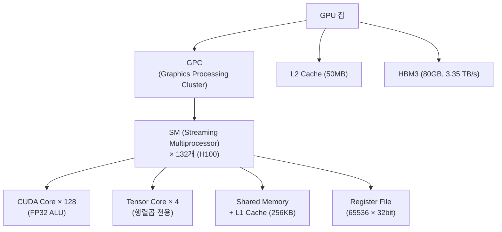
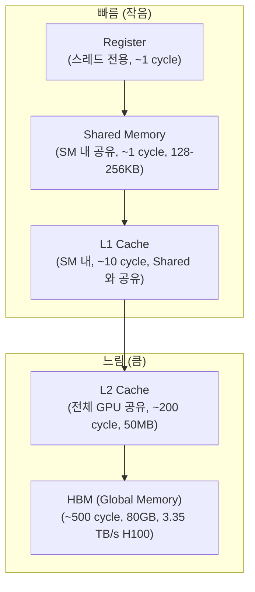
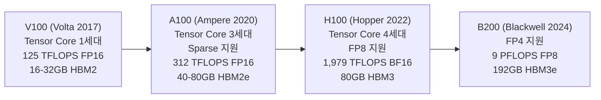
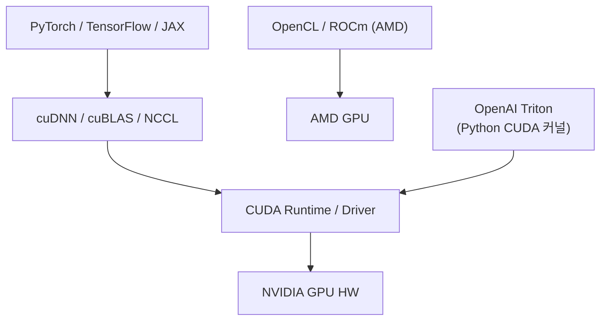
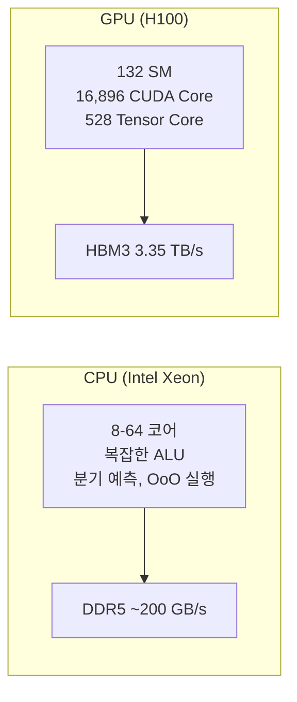
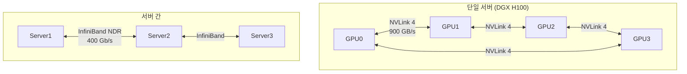

## 정의

**GPU (Graphics Processing Unit)** 는 원래 3D 그래픽 렌더링을 위해 설계됐지만, **massively parallel** 아키텍처가 딥러닝의 행렬 연산과 완벽히 맞아 현재 AI 컴퓨팅의 표준 하드웨어가 됐다. NVIDIA, AMD, Intel 이 3대 제조사.

## 언제 쓰이나

- 딥러닝 모델 학습 / 추론
- LLM inference serving (vLLM, TGI 등)
- 3D 그래픽 렌더링, 영상 처리
- 과학 시뮬레이션 (HPC), 암호화폐 채굴
- CUDA 에코시스템이 필요한 모든 병렬 워크로드

## 아키텍처 개요

### 전체 계층 구조



### SM (Streaming Multiprocessor)

NVIDIA GPU 의 핵심 실행 단위. 각 SM 은 독립적인 연산 블록.

H100 (Hopper 아키텍처) SM 구성:
- **128개 FP32 CUDA 코어** (일반 연산)
- **4개 Tensor Core** (3세대 Hopper TC: FP8/FP16/BF16/FP32 지원)
- **256KB L1 cache + Shared Memory** (프로그래머 제어 가능)
- **Register file 65,536 × 32bit** (스레드 간 공유 없음)
- **Warp Scheduler 4개** (32스레드 warp 관리)

```
H100 SXM5: 132 SM × (128 FP32 + 4 Tensor Core) = 16,896 CUDA cores
```

## SIMT: GPU 실행 모델

[[simt|SIMT (Single Instruction Multiple Thread)]] 는 GPU 의 병렬 실행 모델.

### Warp 실행

```text
Warp = 32개 스레드의 묶음 (하드웨어 실행 단위)
 ┌──────────────────────────────────┐
 │ Thread 0  Thread 1  ... Thread 31│   ← 동일 명령 동시 실행
 └──────────────────────────────────┘
           Warp 0 (32T)

SM 은 최대 64 warp (2048 스레드) 를 동시에 관리
활성 warp 중 하나가 메모리 대기 → 즉시 다른 warp 전환 (zero-cost context switch)
```

### Branch Divergence (분기 발산)

```cuda
// SIMT 의 함정: if-else 분기
if (threadIdx.x % 2 == 0) {
    do_A();  // 짝수 스레드만
} else {
    do_B();  // 홀수 스레드만
}
// Warp 내 분기 → 두 경로 순차 실행 (SIMD 효율 50% 낙하)
```

Warp 내 스레드가 다른 분기를 탈 경우, 두 경로를 순차적으로 실행하고 비활성 스레드는 마스킹. 성능 반감.

## 메모리 계층



| 계층 | 크기 | 지연 | 대역폭 | 접근 |
|:---|:---|:---:|:---|:---|
| Register | 스레드별 64KB | ~1 cycle | 최고 | 스레드 전용 |
| Shared Memory | SM당 최대 228KB | ~1 cycle | 매우 높음 | SM 내 블록 공유 |
| L1 Cache | SM당 128KB | ~28 cycle | 높음 | 자동 |
| L2 Cache | 50MB (H100) | ~200 cycle | 중간 | 자동 |
| HBM (Global) | 80GB (H100) | ~500 cycle | 3.35 TB/s | 전체 커널 |

> [!IMPORTANT]
> 메모리 대역폭이 병목인 커널(bandwidth-bound)을 컴퓨트 집약 커널(compute-bound)로 바꾸는 것이 GPU 최적화의 핵심. Shared Memory 활용과 메모리 coalescing 이 주요 기법.

## Tensor Core: 딥러닝 특화 유닛

CUDA 코어가 scalar(단일 FP32) 연산을 하는 반면, **Tensor Core 는 4×4 행렬 연산을 1 클럭에 처리**.

```text
Tensor Core (Hopper, 3세대):
  D = A × B + C
  A: [16×16], B: [16×8], C/D: [16×8]
  지원 형식: FP8, FP16, BF16, FP32, INT8, INT4

CUDA Core (FP32):
  d = a * b + c   (scalar)
  1개 연산/clock
```

### Tensor Core 성능 (H100 SXM5)

| 정밀도 | 피크 TFLOPS |
|:---|:---:|
| FP64 | 66.9 |
| FP32 (CUDA Core) | 133.8 |
| TF32 (Tensor Core) | 989 |
| FP16/BF16 (Tensor Core) | 1,979 |
| FP8 (Tensor Core) | 3,958 |
| INT8 (Tensor Core) | 3,958 |

## 세대 비교



| GPU | 아키텍처 | BF16 TFLOPS | HBM | NVLink |
|:---|:---|:---:|:---:|:---|
| V100 | Volta (2017) | 125 | 32GB | NVLink 2 |
| A100 | Ampere (2020) | 312 | 80GB | NVLink 3 |
| H100 | Hopper (2022) | 1,979 | 80GB | NVLink 4 |
| H200 | Hopper (2024) | 1,979 | 141GB HBM3e | NVLink 4 |
| B200 | Blackwell (2024) | 4,500 | 192GB | NVLink 5 |

## 소프트웨어 스택



| 라이브러리 | 역할 |
|:---|:---|
| **CUDA** | NVIDIA 독점 GPU 프로그래밍 API |
| **cuDNN** | CNN, Transformer 최적화 커널 |
| **cuBLAS** | GEMM 최적화 |
| **NCCL** | 멀티 GPU 통신 (all-reduce 등) |
| **Triton** | Python 에서 CUDA 커널 작성 (OpenAI) |
| **ROCm** | AMD GPU 대응 오픈소스 스택 |

## 실전: CUDA / PyTorch 최적화

### 기본 행렬곱 (CUDA)

```cuda
// naive: global memory 직접 접근 (느림)
__global__ void matmul_naive(float *A, float *B, float *C, int N) {
    int row = blockIdx.y * blockDim.y + threadIdx.y;
    int col = blockIdx.x * blockDim.x + threadIdx.x;
    float sum = 0.0f;
    for (int k = 0; k < N; k++) {
        sum += A[row * N + k] * B[k * N + col];
    }
    C[row * N + col] = sum;
}

// shared memory tiling: L1 활용 (빠름)
__global__ void matmul_tiled(float *A, float *B, float *C, int N) {
    __shared__ float As[TILE][TILE];
    __shared__ float Bs[TILE][TILE];
    // ... tiling 로직
}
```

### PyTorch 에서 Tensor Core 활용

```python
import torch

# Tensor Core 활성화: AMP (Automatic Mixed Precision)
from torch.cuda.amp import autocast, GradScaler

scaler = GradScaler()

with autocast(dtype=torch.bfloat16):  # BF16 → Tensor Core 자동 사용
    output = model(input)
    loss = criterion(output, target)

scaler.scale(loss).backward()
scaler.step(optimizer)
scaler.update()
```

### Flash Attention: 메모리 효율 Attention

```python
# standard: O(seq^2) HBM 접근
# flash attention: HBM 접근 최소화, Shared Memory 활용
import torch.nn.functional as F

# PyTorch 2.0+ 기본 내장 (SDPA)
with torch.backends.cuda.sdp_kernel(
    enable_flash=True,
    enable_math=False,
    enable_mem_efficient=True
):
    output = F.scaled_dot_product_attention(q, k, v)
```

## CPU 와 비교



| 항목 | CPU (Xeon) | GPU (H100) |
|:---|:---|:---|
| 코어 수 | 8-64 | 16,896 CUDA |
| 클럭 | 3-5 GHz | ~1.98 GHz |
| 메모리 BW | ~200 GB/s | 3.35 TB/s |
| 분기 처리 | 최적화 (예측) | 비효율 (warp divergence) |
| 단일 스레드 성능 | 높음 | 낮음 |
| 병렬 스루풋 | 낮음 | 극도로 높음 |
| 딥러닝 행렬곱 | 낮음 (~2 TFLOPS) | 1,979 TFLOPS (BF16) |

## 다중 GPU 연결



- **NVLink**: 노드 내 GPU 간 고속 상호연결 (단방향 900 GB/s, H100)
- **NVSwitch**: NVLink 스위치 패브릭, 8-16 GPU 완전 연결
- **InfiniBand**: 노드 간 연결, NCCL all-reduce 에 활용

## 흔한 함정

> [!WARNING]
> 1. **메모리 coalescing 무시** = warp 32 스레드가 연속 주소 접근 안 하면 실효 BW 1/32. 메모리 레이아웃 설계 중요.
> 2. **작은 커널 남발** = 커널 launch overhead 누적. 여러 op 을 하나로 fusion (torch.compile / Triton).
> 3. **CPU-GPU 동기화 남발** = `.item()`, `print(tensor)` 호출 시 CPU 동기화 발생. 학습 루프에서 최소화.
> 4. **Host-Device 전송 병목** = CPU 에서 GPU 로 데이터 복사(PCIe 16-64 GB/s)가 병목. DataLoader 의 `pin_memory=True`, `num_workers` 활용.
> 5. **AMP 미사용** = FP32 로 학습 시 Tensor Core 를 사용하지 못함. `torch.autocast('cuda')` 로 BF16/FP16 전환.

## 관련 위키

- [[TPU]] - Google 의 ML 특화 ASIC 비교
- [[systolic-array]] - TPU 의 MXU 와 Tensor Core 비교
- [[simt]] - SIMT 실행 모델 상세
- [[hbm]] - HBM 고대역폭 메모리
- [[distributed-training]] - 멀티 GPU 분산 학습
- [[양자화]] - FP8/INT8 추론으로 Tensor Core 활용 극대화
- [[llm-serving-vllm]] - GPU 에서의 LLM 서빙
