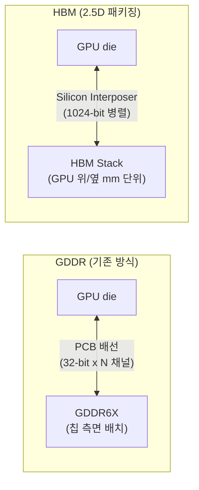

## 정의

**HBM** (High Bandwidth Memory)는 DRAM die 를 수직으로 적층해 매우 높은 대역폭을 제공하는 메모리 패키지. AI 시대 GPU/TPU 의 메모리 병목 해결을 담당한다.

기존 GDDR 메모리가 PCB 위에서 칩 옆에 배치되는 것과 달리, HBM 은 GPU/TPU die 와 같은 **interposer** 위에 수 mm 거리에 배치되어 **수천 개의 병렬 채널**로 연결된다.

```anim:hbm-vs-ddr
{}
```

## GDDR 대비 차이



| 항목 | GDDR6X | HBM3e |
|:---|:---:|:---:|
| 버스 폭 | 32-bit per chip | 1024-bit per stack |
| 대역폭 (단일) | ~56 GB/s | ~1,218 GB/s |
| 레이턴시 | ~낮음 | ~비슷 |
| 전력 효율 | 낮음 | 높음 (TSV 짧음) |
| 비용 | 저렴 | 비쌈 (~20배) |
| 용량 | 높음 | 제한적 (die 수) |
| 사용처 | 게임 GPU | AI GPU/TPU |

## 구조

```text
                     [HBM Stack]
        +-------------------------+
        |     DRAM Die (layer 12) |  ← HBM3e 까지 12 단
        +-------------------------+
        |     DRAM Die (layer 11) |
        +-------------------------+
        |          ...            |
        +-------------------------+
        |     DRAM Die (layer 1)  |
        +-------------------------+
        |     Base Die (Logic)    |  ← I/O + Refresh + ECC
        +-----+-------+-----+-----+
              |       |     |
              ↓       ↓     ↓  (TSV: 수천 개의 실리콘 관통 전극)
        +-----+-------+-----+-----+
        |    Silicon Interposer   |  ← 마이크론 단위 배선
        +-----+-------+-----+-----+
              |       |     |
        +-----+-------+-----+-----+
        |       GPU / TPU         |
        +-------------------------+
```

### Base Die (Logic Die)

스택의 가장 아래. DRAM die 가 아니라 **로직 회로** 만 들어있다.

- I/O 컨트롤러
- ECC (Error Correcting Code) 회로
- Refresh 로직 (DRAM 셀이 주기적 갱신 필요)
- Channel 관리

### Through-Silicon Via (TSV)

핵심 기술. die 를 수직으로 관통하는 전극.

- HBM3 기준 한 스택에 **약 1,024 개 TSV**
- 직경 수 마이크로미터
- 모든 die 를 통과해야 하므로 정렬 정밀도가 핵심

### Silicon Interposer

GPU/TPU die 와 HBM stack 을 연결하는 작은 PCB 같은 실리콘 기판. 일반 PCB 보다 훨씬 미세한 배선 (마이크론 단위).

HBM 의 비용 큰 이유 중 하나가 interposer + 패키징 (2.5D 패키징, 또는 CoWoS).

## Channel 과 Bank 구조

HBM 한 스택은 내부적으로 여러 channel 로 나뉜다.

```
1 HBM3 stack
  ├── 8 channels (병렬 접근 가능)
  │   ├── 16 banks 각각
  │   └── 각 bank: row + column address
  └── 1024-bit wide interface
```

- **Channel**: 독립적으로 read/write 가능. 8 channel = 8 개 메모리 컨트롤러가 동시 동작
- **Bank**: 한 channel 안에서 여러 행이 동시 활성화. bank parallelism 으로 throughput 증가
- **Wide interface**: 한 cycle 에 1024 bit (128 bytes) 동시 전송

GPU 메모리 컨트롤러는 이 8 channels × 16 banks 를 잘 활용해야 최대 대역폭을 낸다. 그래서 GPU 의 메모리 접근 패턴 (coalesced access) 이 중요.

## 동작 원리

DRAM 의 기본 동작은 같다.

```
1. ACTIVATE: row 를 row buffer 로 가져오기 (RAS, ~15ns)
2. READ/WRITE: row buffer 의 column 선택 (CAS, ~15ns)
3. PRECHARGE: 다음 access 를 위해 row 닫기

HBM 의 트릭:
- 8 channel × 16 bank = 128개 작업을 동시 진행
- TSV 가 짧아 latency 가 일반 DDR 과 비슷 (~80ns) 이지만
- 동시 처리량은 ~20배 (1.2 TB/s vs 50 GB/s)
```

즉 HBM 은 *latency* 가 아니라 *throughput* 으로 이긴다. 한 access 의 응답 시간은 비슷하지만 **동시 처리 가능 수가 압도적**.

## 세대별 대역폭

| 세대 | 출시 | 스택당 대역폭 | 비고 |
|:---|:---:|:---:|:---|
| HBM1 | 2015 | 128 GB/s | AMD Fiji |
| HBM2 | 2016 | 256 GB/s | NVIDIA V100 |
| HBM2e | 2019 | 460 GB/s | NVIDIA A100 |
| **HBM3** | **2022** | **819 GB/s** | NVIDIA H100, TPU v5p |
| **HBM3e** | **2024** | **1,218 GB/s** | NVIDIA H200, B200 (12-stack) |
| HBM4 | 2026 예정 | ~2,048 GB/s | NVIDIA Rubin, AMD MI400 |

비교용으로, DDR5 한 채널은 약 51 GB/s. **HBM3e 한 스택이 DDR5 의 24배** 대역폭.

## 왜 AI 에 필수인가

### Roofline Model: 산술 강도

AI 워크로드를 분류하는 핵심 개념.

```
산술 강도 = FLOPs / 메모리 바이트 전송량
```

- **메모리 바운드**: 산술 강도 낮음. GPU 연산 유닛이 놀고 메모리 기다림. HBM 이 직접 영향.
- **컴퓨트 바운드**: 산술 강도 높음. 메모리보다 연산이 병목. Tensor Core 가 영향.

LLM 추론 예:

| 단계 | 산술 강도 | 병목 |
|:---|:---:|:---|
| Prefill (긴 입력 처리) | 높음 | 컴퓨트 바운드 |
| Decode (토큰 생성) | 낮음 | **메모리 바운드** (HBM 직결) |
| Attention (긴 컨텍스트) | 낮음 | **메모리 바운드** |

LLM 서빙 속도는 대부분 **HBM 대역폭이 결정**한다.

### 실제 수치

- GPT-3 175B 모델은 FP16 으로 350 GB
- 매 토큰 생성마다 모델 가중치를 전부 메모리에서 가져와야 함
- 1초에 100 토큰 생성하려면 35 TB/s 대역폭 필요

이 수치는 HBM 8 스택 (8 × 1.2 TB/s = 9.6 TB/s) 으로도 부족하다. 그래서:

- 모델 분할 (multi-GPU)
- 양자화 (FP16 → INT8 → INT4)
- KV cache 최적화 (Flash Attention)
- HBM4, HBM5 로의 지속 진화

### Flash Attention 과 HBM

Flash Attention (Dao et al., 2022) 은 HBM I/O 를 최소화하는 어텐션 구현.

```
기존 Attention:
  Q, K, V 행렬 HBM → SRAM 이동 (대용량)
  S = QK^T 계산
  S HBM 에 저장
  P = softmax(S) 계산
  P HBM 에 저장
  O = PV 계산 → HBM

Flash Attention:
  Q, K, V 타일(tile)만 SRAM 에 로드
  타일 단위 내에서 softmax + 곱 완결
  HBM write 획기적 감소 (2-4배 속도 향상)
```

HBM 대역폭을 아끼는 알고리즘 설계가 성능의 핵심.

## 비용 구조

HBM 은 비싸다.

- 일반 DDR5 16GB: ~$50
- HBM3e 16GB: ~$1,000 (20배)

이유:
1. TSV 공정 복잡 (수율 낮음)
2. 수직 적층 패키징 비용
3. SK Hynix 사실상 독점 (HBM3e 의 75%+ 점유)

NVIDIA H100 의 HBM 비용이 전체 칩 가격 (~$30,000) 의 약 1/3 을 차지한다.

## CPU vs GPU 메모리 격차

| 프로세서 | 메모리 종류 | 대역폭 |
|:---|:---|:---:|
| Intel Core i9 (DDR5) | DDR5-5600 | ~89 GB/s |
| Apple M4 Max (LPDDR5X) | unified | ~546 GB/s |
| AMD Threadripper (DDR5) | DDR5-5200 | ~166 GB/s |
| **NVIDIA H100 (HBM3)** | HBM3 5 stack | **~3,350 GB/s** |
| **NVIDIA B200 (HBM3e)** | HBM3e 8 stack | **~8,000 GB/s** |

GPU/TPU 가 AI 워크로드를 압도하는 핵심 이유 = HBM 의 대역폭.

## 용량 vs 대역폭 trade-off

HBM 은 대역폭은 압도적이지만 **용량 한계**가 있다.

| 시스템 | HBM 용량 | GDDR/DDR 최대 |
|:---|:---:|:---:|
| NVIDIA H100 (80GB) | 80 GB | (DDR5 호스트 2TB) |
| NVIDIA H200 | 141 GB | (DDR5 호스트 2TB) |
| Google TPU v5p pod | 스택 수에 비례 | (TPU HBM only) |

GPU 가속기에서 모델이 HBM 용량을 초과하면 두 가지 선택:
1. **Multi-GPU 샤딩**: tensor/pipeline parallelism 으로 분산
2. **Offloading**: CPU RAM 으로 overflow (대역폭 급감)

HBM 용량은 AI 모델 크기의 자연적 상한선이다.

## 함정

> [!WARNING]
> **대역폭이 높아도 접근 패턴이 비효율이면 낭비**: GPU 는 coalesced memory access (연속된 주소) 일 때 최대 대역폭을 낸다. 랜덤 접근이면 대역폭의 일부만 활용.

> [!CAUTION]
> **용량 한계**: HBM3e 최대 약 96 GB (H200). 모델이 이를 초과하면 multi-GPU 분산이 불가피. HBM 용량은 GDDR 대비 여전히 제한적.

## 관련 위키

- [[GPU]] - GPU 아키텍처: Tensor Core, SIMT, SM
- [[TPU]] - Google TPU 와 HBM 활용
- [[SIMT]] - GPU 실행 모델: warp, coalesced access
- [[분산 학습]] - HBM 한계 초과 시: tensor/pipeline parallelism
- [[quantization]] - 메모리 절약으로 HBM 부담 줄이기
