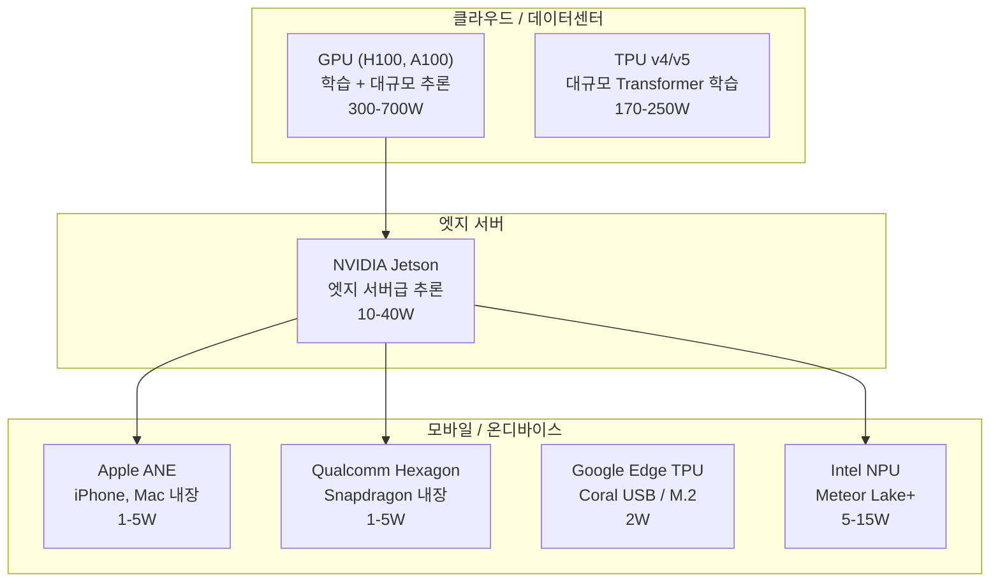
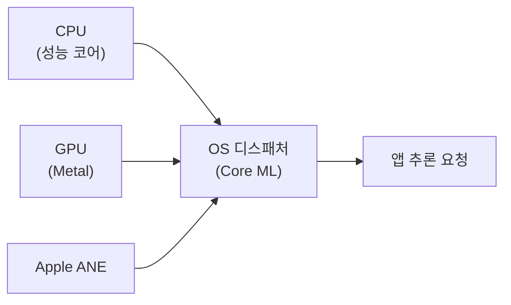
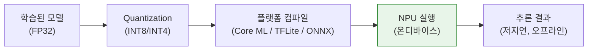

## 정의

**NPU (Neural Processing Unit)** 는 모바일/엣지 디바이스용 저전력 AI 가속기. 스마트폰, 노트북, IoT 에 내장되어 온디바이스 AI 추론을 담당한다.

[[gpu|GPU]] 는 범용 병렬 연산을, [[tpu|TPU]] 는 데이터센터 규모 학습을 처리하는 데 비해, NPU 는 **배터리 구동 장치에서 수 와트 이하**로 신경망 추론을 실행하는 데 특화된다.

## 언제 쓰이나

- **스마트폰 실시간 기능**: 얼굴 인식 (Face ID), 사진 처리 (Portrait mode, Deep Fusion)
- **온디바이스 음성 인식**: Siri, Google Assistant 오프라인 모드
- **온디바이스 LLM**: Apple Intelligence (iOS 18+), Copilot+ (Windows 11)
- **실시간 번역**: 오프라인 번역 앱
- **헬스케어 센싱**: 심박, 혈중 산소 모니터링
- **자율주행 엣지 유닛**: 산업용 IoT, 로봇

## 컴퓨트 계층 구조



## NPU 아키텍처 특성

NPU 는 [[gpu|GPU]] 와 같은 범용 병렬 프로세서가 아닌, **신경망 연산 (행렬 곱, 컨볼루션, 활성화 함수) 에 최적화된 고정 파이프라인** 을 가진다.

### 핵심 특성

- **저전력**: 배터리 구동 (수 W ~ 수십 W)
- **정수 연산 위주**: INT8, INT4 로 추론 최적화 (학습은 FP32/BF16)
- **온디바이스 추론**: 개인정보 보호, 지연시간 낮음, 인터넷 불필요
- **고정 연산 그래프**: GPU/CPU 처럼 임의 커널을 실행하는 게 아니라, 컴파일된 모델 그래프를 실행

### INT8 추론

[[quantization|Quantization]] 을 통해 FP32(32비트) 모델 가중치를 INT8(8비트) 로 변환. 메모리 4배 절약, 연산 4-8배 빠름, 정확도 손실은 일반적으로 1% 이내.

```
FP32 가중치: [-0.234, 0.891, -1.23, ...]
                    ↓ Post-Training Quantization
INT8 가중치:  [-30,   114,  -157, ...]  + scale factor
```

NPU 는 INT8 행렬 곱 유닛을 하드웨어에 내장해 FP32 대비 에너지 효율이 10배 이상.

## GPU / CPU / NPU 비교

| 항목 | CPU | GPU | NPU |
|:---|:---|:---|:---|
| 설계 목적 | 범용 순차 연산 | 범용 병렬 연산 | 신경망 추론 특화 |
| 코어 수 | 8-128 | 수천~수만 | 수십~수백 (행렬 유닛) |
| 정밀도 | FP32/INT | FP16/FP32 | INT4/INT8 |
| 전력 소모 | 15-350W | 100-700W | 1-20W |
| 지연시간 | 낮음 (단일) | 배치 지향 | 즉각 처리 |
| 유연성 | 최고 | 높음 | 낮음 (고정 연산) |
| 프로그래밍 | 직접 | CUDA / OpenCL | Core ML / ONNX |

## 대표 NPU

### Apple Neural Engine (ANE)



Core ML 프레임워크가 모델의 각 연산 레이어를 CPU / GPU / ANE 중 최적 유닛에 자동 분배한다.

| 칩 | 출시 | TOPS | 주요 기능 |
|:---|:---:|:---:|:---|
| A11 Bionic | 2017 | 0.6 | 최초 ANE, Face ID |
| A14 Bionic | 2020 | 11 | 5nm, Neural Engine 16코어 |
| A16 Bionic | 2022 | 15.8 | iPhone 14 Pro |
| A17 Pro | 2023 | 35 | 3nm, iPhone 15 Pro |
| M2 | 2022 | 15.8 | Mac, iPad Pro |
| M4 | 2024 | 38 | Apple Intelligence 온디바이스 LLM |

**TOPS** (Tera Operations Per Second): 초당 1조 연산. NPU 성능 측정 단위.

ANE 는 Core ML 프레임워크를 통해서만 접근 가능하다 (직접 프로그래밍 불가). Apple Intelligence 의 온디바이스 LLM 추론은 ANE + CPU + GPU 를 동시에 활용한다.

### Qualcomm Hexagon DSP/NPU

Snapdragon 8 Gen 시리즈에 내장. Hexagon DSP 위에 HTP (Hexagon Tensor Processor) 가 추가된 구조.

- Android 기기 대부분의 NPU 역할
- Qualcomm AI Engine API, ONNX Runtime (QNN 백엔드) 로 접근
- Snapdragon 8 Gen 3: 98 TOPS

### Google Edge TPU (Coral)

[[tpu|TPU]] 아키텍처를 엣지용으로 축소한 제품. USB Accelerator (2W) 와 M.2 모듈 형태.

- TensorFlow Lite 모델만 지원
- 단 8MB 온칩 SRAM 으로 모델이 작아야 함 (MobileNet 급)
- 라즈베리파이에 USB 로 연결해 추론 보조

### Intel NPU (Meteor Lake+)

2024년 출시된 Intel Core Ultra 칩에 내장. 저전력 AI 워크로드를 CPU, GPU 가 아닌 NPU 에 오프로드.

- OpenVINO, ONNX Runtime (OpenVINO 백엔드) 지원
- Microsoft Copilot+ PC 의 요건 (40 TOPS 이상)

## 실전: Core ML 로 ANE 활용 (iOS/Swift)

```swift
import CoreML
import Vision

// 1. 모델 로드 (ANE 자동 활용)
let config = MLModelConfiguration()
config.computeUnits = .cpuAndNeuralEngine  // ANE 우선, 폴백은 CPU

guard let model = try? MyVisionModel(configuration: config) else { return }

// 2. 이미지 분류 요청
let request = VNCoreMLRequest(model: VNCoreMLModel(for: model.model)!) { request, _ in
    guard let results = request.results as? [VNClassificationObservation] else { return }
    let top = results.first!
    print("\(top.identifier): \(top.confidence)")
}

let handler = VNImageRequestHandler(ciImage: ciImage)
try? handler.perform([request])
```

`computeUnits = .cpuAndNeuralEngine` 로 ANE 를 명시하면 Core ML 이 지원되는 레이어를 ANE 로 보낸다. `.all` 은 GPU 도 포함.

## 실전: ONNX Runtime 으로 NPU 활용 (Python)

```python
import onnxruntime as ort
import numpy as np

# Qualcomm NPU (QNN) 또는 Intel NPU (OpenVINO) 백엔드
providers = [
    ("QNNExecutionProvider", {"backend_type": "htp"}),  # Qualcomm Hexagon
    "CPUExecutionProvider",  # 폴백
]

session = ort.InferenceSession("model_int8.onnx", providers=providers)

input_name = session.get_inputs()[0].name
result = session.run(
    None,
    {input_name: np.random.randn(1, 3, 224, 224).astype(np.float32)}
)
print(result[0].argmax())
```

INT8 ONNX 모델을 생성하려면 먼저 [[quantization|Post-Training Quantization]] 으로 변환해야 한다:

```python
from onnxruntime.quantization import quantize_dynamic, QuantType

quantize_dynamic(
    model_input="model_fp32.onnx",
    model_output="model_int8.onnx",
    weight_type=QuantType.QInt8,
)
```

## TOPS 비교 (2024-2025 대표 기기)

| 기기 | NPU | TOPS | 출시 |
|:---|:---|:---:|:---:|
| iPhone 15 Pro | A17 Pro ANE | 35 | 2023 |
| iPhone 16 Pro | A18 Pro ANE | 38 | 2024 |
| MacBook Pro M4 | M4 ANE | 38 | 2024 |
| Galaxy S24 Ultra | Snapdragon 8 Gen 3 Hexagon | 98 | 2024 |
| Microsoft Surface Pro 11 | Snapdragon X Elite XDNA | 45 | 2024 |
| Lenovo ThinkPad X1 Carbon Gen 13 | Intel Core Ultra 7 NPU | 47 | 2025 |

> [!IMPORTANT]
> TOPS 수치는 INT8 기준이 일반적이나, 벤더마다 INT4/INT8/FP16 기준이 달라 단순 비교는 어렵다. 실제 추론 속도는 지원하는 op 범위와 모델 구조에 따라 크게 달라진다.

## 모바일 추론 파이프라인



## 함정

> [!WARNING]
> **NPU 는 모든 연산을 가속하지 않는다.** 지원하지 않는 연산자 (op) 가 있으면 자동으로 CPU 로 폴백된다. 폴백이 많으면 NPU 와 CPU 간 데이터 복사 오버헤드가 오히려 성능을 떨어뜨린다. 반드시 프로파일러로 op 지원 여부를 확인해야 한다.

> [!CAUTION]
> **INT8 Quantization 은 calibration 없이 하면 정확도가 급락한다.** Weight 만 양자화하는 dynamic quantization 과 달리, static quantization 은 대표 데이터셋으로 activation 분포를 측정하는 calibration 이 필수다.

> [!IMPORTANT]
> **NPU API 는 플랫폼 종속이 심하다.** ANE 는 Core ML 만, Hexagon 은 QNN/ONNX, Edge TPU 는 TFLite 만 지원한다. ONNX 를 중간 포맷으로 쓰면 플랫폼 간 이식이 쉬워진다.

## 관련 위키

- [[tpu|TPU]] - 데이터센터 AI 가속기
- [[gpu|GPU]] - 범용 병렬 가속기
- [[quantization|Quantization]] - INT8/INT4 최적화 기법
- [[federated-learning|Federated Learning]] - 엣지 디바이스 분산 학습
- [[distributed-training|Distributed Training]] - 클라우드 규모 학습
- [[transfer-learning|Transfer Learning]] - 엣지 모델 경량화 기반
