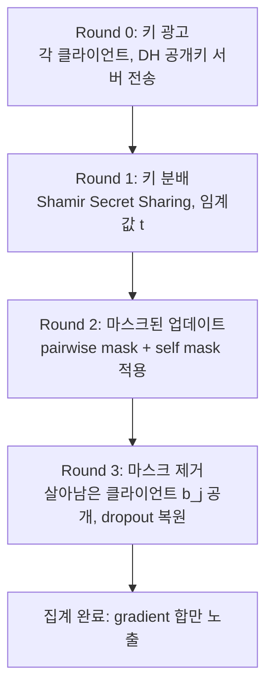
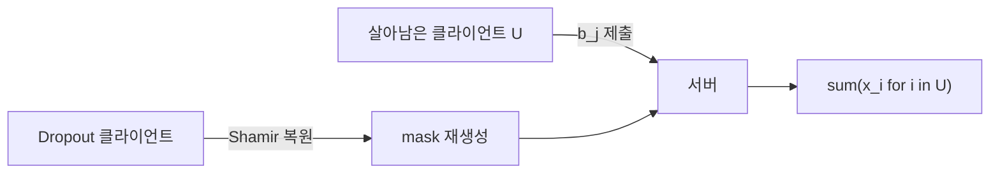

## 정의

**Secure Aggregation** 은 연합 학습 서버가 **개별 클라이언트 업데이트** 를 보지 못하고 **오직 합 (또는 평균)** 만 볼 수 있도록 보장하는 암호학 프로토콜입니다. 서버가 honest-but-curious 라도 (프로토콜은 따르지만 학습 데이터를 캐내려 함) 개별 gradient 를 복원할 수 없습니다.

Bonawitz et al. (2017) 의 논문 "Practical Secure Aggregation" 이 사실상 표준이며, Google 이 실제 Gboard 학습에 배포하면서 실용성이 입증되었습니다.

## 왜 필요한가

- **Raw 데이터 미공개** 만으로는 부족합니다. gradient 자체에서 원본이 복원될 수 있습니다 (gradient inversion attack).
- **Differential Privacy 만으로는** 개별 값에 노이즈를 크게 넣어야 하고 유용성이 크게 손상됩니다.
- 서버가 실제 관측하는 것을 **집계 값** 으로만 제한하면, 개별 편향 없이 학습 가능.

## 위협 모델

- **Honest-but-curious server**: 프로토콜은 따르지만 로그를 뒤져 개별 값 복원 시도
- **Malicious 최대 $t$ 클라이언트**: 담합 (collusion) 가능. 프로토콜은 이 $t$ 이하 담합 아래 안전
- **Client dropout**: 프로토콜 실행 중 이탈 (배터리, 네트워크). 필수 대응
- **Network eavesdropper**: 전송 도청. TLS 로 방어 가정

**Non-goals** (Secure Aggregation 이 해결하지 않는 것):
- 집계 결과 자체의 프라이버시: 이는 [[differential-privacy|DP]] 로 별도 처리
- Byzantine robustness (악성 값 주입): 이는 robust aggregation 으로 별도

## 기본 아이디어

각 클라이언트 $i$ 의 업데이트 $x_i$ 를 서로 다른 **랜덤 마스크 $m_{ij}$** 로 감춥니다. 마스크는 **쌍 (i, j) 에 대해 상쇄** 되도록 설계:

$$
y_i = x_i + \sum_{j > i} m_{ij} - \sum_{j < i} m_{ji} \pmod{R}
$$

여기서 $m_{ij} = -m_{ji}$ (반대 부호로 상쇄되는 쌍별 마스크).

서버가 모든 $y_i$ 를 더하면:

$$
\sum_i y_i = \sum_i x_i + \underbrace{\sum_i \sum_{j > i} m_{ij} - \sum_i \sum_{j < i} m_{ji}}_{= 0} = \sum_i x_i
$$

마스크가 서로 상쇄되어 **합만** 남습니다. 개별 $x_i$ 는 마스크로 감춰져 있어 서버가 볼 수 없습니다.

## 프로토콜 단계

Bonawitz et al. 의 실제 프로토콜은 4 라운드 구성:

### Round 0: Advertise Keys

각 클라이언트가 **Diffie-Hellman public key** 두 쌍을 생성해 서버에 전송.
- $c_i^{PK}, c_i^{SK}$: 마스크용 shared secret 유도 키
- $s_i^{PK}, s_i^{SK}$: 자기 secret 백업 키

### Round 1: Share Keys

각 클라이언트가 자기 **secret key** 를 Shamir's Secret Sharing 으로 $n$ 조각으로 나눠 다른 $n-1$ 클라이언트에게 분배. 임계값 $t$ 이하 담합으로는 복원 불가.

### Round 2: Masked Input Collection

각 클라이언트 $i$:

1. 다른 클라이언트 $j$ 와의 shared secret $s_{ij} = KDF(c_i^{SK} \cdot c_j^{PK})$ 로 pairwise mask $m_{ij}$ 유도 (PRG)
2. 자기 개인 mask $b_i$ 생성 (자기 secret 로부터)
3. 마스크된 업데이트 전송:
   $$y_i = x_i + \sum_{j > i} m_{ij} - \sum_{j < i} m_{ji} + b_i \pmod{R}$$

$b_i$ 는 자기 자신만 아는 additional mask, dropout 대응용.

### Round 3: Unmasking

서버는 살아남은 클라이언트 집합 $U$ 를 확정. 살아남은 클라이언트는:

- $j \in U$ 라면: $b_j$ 를 자기 secret 로 복원 후 서버에 전송
- $j \notin U$ (dropout) 라면: $j$ 의 secret share 를 다른 클라이언트들이 서버에 전송해 $s_j$ 복원, 이로부터 $\{m_{ij}\}$ 재생성

서버가 **살아남은 클라이언트의 $b_j$ 합** 을 계산해 빼고, **dropout 클라이언트의 pairwise mask 합** 도 계산해 빼면:

$$
\sum_{i \in U} y_i - \sum_{i \in U} b_i - \sum_{\text{dropped}} \text{recovered masks} = \sum_{i \in U} x_i
$$

깨끗한 합이 도출됩니다.

## 왜 두 개의 마스크가 필요한가

- **Pairwise mask** ($m_{ij}$): 모든 클라이언트가 살아있다면 상쇄, 서버가 개별 값 못 봄
- **Self mask** ($b_i$): dropout 이 발생해도 $x_i$ 노출 방지

만약 self mask 없이 pairwise 만 있다면, dropout 클라이언트의 pairwise 를 복원할 때 **살아있는 클라이언트의 $x_i$ 가 잠깐 노출** 될 수 있습니다. Self mask 로 이 constraint 를 해소.

## 통신 복잡도

Bonawitz 원 프로토콜:
- 클라이언트당 $O(n)$ 통신 (모든 다른 클라이언트와 key exchange)
- $n$ = 1000 정도면 감내 가능하지만 $n = 10^6$ 은 불가능

**SecAgg+ (Bell et al., 2022)**: 통신을 $O(\log n)$ 으로 줄임. 각 클라이언트는 로그 스케일의 이웃과만 통신. 대규모 cross-device FL 에서 실용화.

## 대안 접근

### 1. Homomorphic Encryption (HE)

각 클라이언트가 업데이트를 **HE 로 암호화** 하여 서버에 전송. 서버는 암호화된 상태로 덧셈 수행, 결과만 신뢰된 aggregator 가 복호화.

- **Pros**: 담합 우려 없음, 단순한 데이터 흐름
- **Cons**: 연산 비용이 매우 큼 (수십~수백 배), gradient 크기 큰 딥러닝에 부담
- **대표 스킴**: BFV, CKKS (approximate arithmetic)

### 2. Trusted Execution Environment (TEE)

서버측 **SGX/TDX enclave** 에서 raw 업데이트를 받아 집계. Enclave 코드가 서명되어 외부에서 검증 가능.

- **Pros**: 성능 오버헤드 작음
- **Cons**: 하드웨어 신뢰 필요, side-channel 공격 사례 존재

### 3. Multi-Party Computation (MPC)

여러 non-colluding 서버가 집계 계산을 분산 수행. 어느 한 서버도 완전한 정보를 갖지 않음.

- **Pros**: 강한 이론 보장
- **Cons**: 여러 서버 인프라 필요, 통신 라운드 증가

## Differential Privacy 와의 결합

Secure Aggregation 은 **집계의 은닉** 을 보장하지만, **집계 결과 자체** 에는 정보가 남습니다. 서버가 집계된 gradient 를 여러 라운드 관찰하면 개별 정보를 추정할 수 있음.

**해결**: 각 클라이언트가 자기 gradient 에 [[differential-privacy|DP noise]] 를 추가하고 그 결과를 Secure Aggregation.

$$
\tilde{x}_i = x_i + \mathcal{N}(0, \sigma^2 I)
$$

또는 **central DP**: 신뢰된 aggregator 가 집계 후에 노이즈 추가. 필요 노이즈 양이 client-level DP 대비 작음.

## 실전 프레임워크 지원

- **TensorFlow Federated**: `tff.aggregators.secure_aggregation`
- **Flower**: `FedAvg` 에 secure aggregation strategy plugin
- **NVFlare**: SAG (Scatter and Gather) 워크플로에 통합
- **CrypTen** (Meta): PyTorch 기반 MPC
- **PySyft** (OpenMined): HE + MPC 통합

## 함정

> [!WARNING]
> **DP 없는 Secure Aggregation 은 완전한 프라이버시가 아닙니다.** 집계된 gradient 로부터도 정보가 새므로, DP 와 반드시 결합.

> [!CAUTION]
> **Dropout 관리가 까다롭습니다.** 임계값 $t$ 를 잘못 잡으면 프로토콜이 실패하거나 (너무 많이 dropout) 프라이버시가 훼손 (담합 임계값 낮음).

> [!WARNING]
> **Byzantine 클라이언트가 임의의 큰 값을 넣으면 결과가 오염** 됩니다. Secure Aggregation 은 담합/도청은 방어하지만 값 검증은 안 함. Robust aggregation (Krum, Median) 이 별도 필요.

> [!IMPORTANT]
> **모듈러 산술 (mod R) 오버플로 관리**. 실수를 정수로 quantize 하고 R 을 충분히 크게 잡아야 합계가 wrap-around 안 함.

> [!CAUTION]
> **암호학적 primitive 를 직접 구현하지 마세요**. 검증된 라이브러리 (TFF, Flower, OpenMined) 를 사용. Side-channel 공격은 다이렉트 구현에서 흔한 위험.

## 프로토콜 흐름 시각화



### Dropout 처리 흐름



## SecAgg+ 통신 복잡도

| 프로토콜 | 클라이언트당 통신 | n=10^6 적합 |
|:---|:---|:---|
| Bonawitz SecAgg | O(n) | 불가 |
| SecAgg+ (Bell 2022) | O(log n) | 가능 |
| TEE 방식 | O(1) | 가능 (하드웨어 신뢰 필요) |

SecAgg+ 는 각 클라이언트를 $k$-정규 그래프 이웃과만 연결. 이웃 수 $k = O(\log n)$ 로 전체 통신량이 대폭 감소.

## 공격 방어 매핑

| 공격 유형 | Secure Aggregation 대응 | 추가 방어 필요 |
|:---|:---|:---|
| Gradient inversion | 개별 gradient 미노출 | DP noise 병행 권장 |
| Honest-but-curious server | 집계 값만 노출 | - |
| Collusion (t 이하) | Shamir threshold 로 차단 | - |
| Byzantine (값 오염) | 미대응 | Robust aggregation (Krum, Median) |
| Model poisoning | 미대응 | 이상값 탐지 |
| Dropout 공격 | t 이하 dropout 허용 | 임계값 조정 |

> Secure Aggregation 은 **누가 무엇을 보는가** 를 제어. **무엇을 넣는가** 는 별도 방어 레이어가 필요.

## 실전 구현 고려사항

```python
# TensorFlow Federated
import tensorflow_federated as tff

secure_sum = tff.aggregators.SecureModularSumFactory(
    modulus=2**20,   # R: wrap-around 방지. gradient 합이 R 을 넘지 않도록 설정
)

# Flower: strategy 플러그인 방식으로 SecAgg 적용
# from flwr.server.strategy import FedAvg + SecureAggregation adapter
```

클라이언트 수 $n$, 임계값 $t$, gradient 차원 $d$ 에 따라 통신 오버헤드 추정:

$$
\text{총 통신량} \approx n \cdot k \cdot d \cdot \text{element\_size}
$$

대규모 배포 전 $d \times n$ 통신량 계산 필수. 7B 모델 ($d \approx 10^7$) 에서 클라이언트당 수백 MB 발생.

## 관련 위키

- [[federated-learning|Federated Learning]] - 상위 개념
- [[fedavg|FedAvg]] - 집계 대상 기본 알고리즘
- [[differential-privacy|Differential Privacy]] - Secure Aggregation 과 반드시 결합
- [[fl-non-iid|Non-IID Data in FL]] - 프라이버시와 무관한 다른 도전
- [[personalized-fl|Personalized FL]]
- [[fl-frameworks|FL Frameworks]] - 프레임워크의 SecAgg 지원
