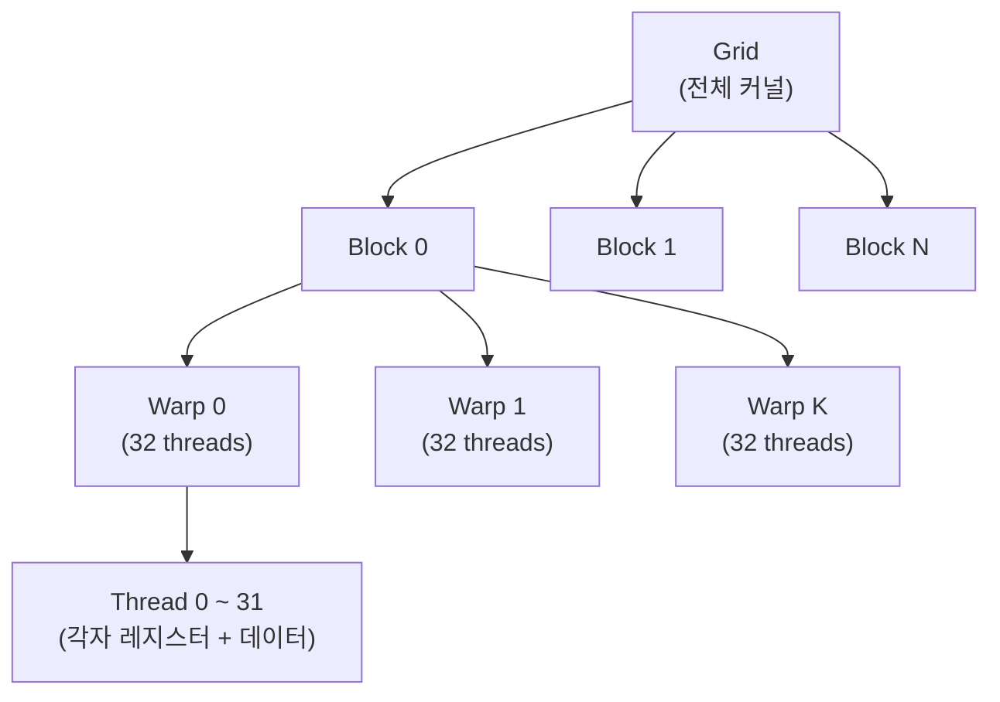
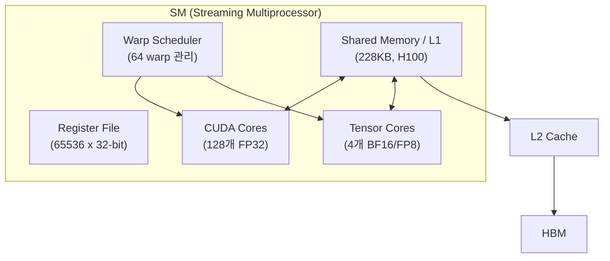

## 정의

**SIMT** (Single Instruction, Multiple Threads) 는 NVIDIA 가 정립한 GPU 의 실행 모델이다. 한 명령(instruction) 을 한 그룹의 thread(warp) 가 동시에 실행하되, **각 thread 는 자기 레지스터와 데이터**를 갖는다.

```anim:gpu-simt
{}
```

## 언제 쓰이나

- GPU 프로그래밍 (CUDA, ROCm, OpenCL) 의 실행 원리 이해
- 커널 최적화: warp divergence, memory coalescing, occupancy
- ML 모델 추론/학습 시 GPU 활용률 분석
- [[TPU|TPU]] 의 Systolic Array 와 비교 시 기준점

## SIMD 와의 차이

SIMD (Single Instruction Multiple Data) 와 헷갈리기 쉽다.

| | SIMD | SIMT |
|:---|:---|:---|
| 데이터 그룹 | 벡터 레지스터 (예: AVX-512 = 16 floats) | thread (수 십개) |
| 분기 처리 | 어렵음 (masked operation) | 자동 (warp divergence) |
| 프로그래밍 모델 | 명시적 SIMD intrinsic | 평범한 thread 코드 |
| 레지스터 | 공유 벡터 레지스터 | 각 thread 독립 레지스터 |
| 대표 사례 | CPU AVX, ARM NEON | NVIDIA CUDA, AMD ROCm |

CUDA 코드는 마치 각 thread 가 독립적으로 도는 것처럼 작성하지만, 하드웨어는 32 thread (= 1 warp)를 lockstep 으로 함께 실행한다.

```cpp
__global__ void add(float* a, float* b, float* c, int n) {
  int i = blockIdx.x * blockDim.x + threadIdx.x;
  if (i < n) c[i] = a[i] + b[i];
}
// 각 thread 가 c[i] = a[i] + b[i] 를 자기 i 로 수행
// 한 warp 의 32 thread 가 동시에 ADD 명령 실행
```

## Thread 계층: Thread / Block / Grid

CUDA 커널은 3단계 계층으로 thread 를 구성한다.



- **Thread**: 독립적 레지스터 + 스택. 고유 `threadIdx`.
- **Block**: 공유 메모리(SRAM)를 공유하는 thread 그룹. 한 SM 에 할당.
- **Grid**: 전체 커널 실행 범위. 여러 SM 에 분산.

```cpp
// 예: 1M 원소 덧셈
// Grid = 1000 blocks, Block = 1024 threads
add<<<1000, 1024>>>(a, b, c, N);
// threadIdx.x: 0~1023 (블록 내)
// blockIdx.x : 0~999  (그리드 내)
// globalIdx   = blockIdx.x * 1024 + threadIdx.x
```

## SM (Streaming Multiprocessor) 아키텍처



H100 SM 기준:
- 128 CUDA Cores (FP32)
- 4 Tensor Cores (BF16/FP8 matmul)
- 최대 64 warp 동시 보유, 한 cycle 에 4 warp 디스패치
- Shared Memory: 228 KB / SM (L1 와 공유)
- Register File: 65536 x 32-bit

NVIDIA H100 = 132 SM × 64 warp × 32 thread = **약 27만 thread 동시 처리** 가능.

## Warp

- **Warp 크기**: NVIDIA = 32 threads, AMD wavefront = 32 또는 64
- 1 warp 의 모든 thread 는 **같은 PC (program counter)** 를 공유 → 같은 명령 동시 수행
- 각 thread 는 **고유한 thread index** + 자기 레지스터 보유

```
SM (Streaming Multiprocessor) 한 개:
  - 64 개의 warp 동시 보유 가능
  - 한 cycle 에 1~4 개의 warp 명령 디스패치
  - 같은 SM 의 warp 들은 공유 메모리(SRAM) 접근 가능
```

## Occupancy

**Occupancy** = SM 에 실제 할당된 warp 수 / SM 최대 warp 수.

높은 occupancy 는 메모리 레이턴시를 숨기는 데 중요하다. 한 warp 가 메모리 대기 중일 때 다른 warp 를 실행해 파이프라인을 채운다.

| Occupancy 저하 요인 | 영향 |
|:---|:---|
| 레지스터 과다 사용 | 1 SM 의 Register File 총량 초과 시 block 수 감소 |
| 공유 메모리 과사용 | 1 SM 의 SRAM 을 여러 block 이 나눠 씀 |
| Block 크기가 warp 배수 아님 | 마지막 warp 에 idle thread 발생 |
| 큰 Block | 한 SM 에 몇 개 block 만 들어감 |

```cpp
// Occupancy 계산 보조 API
int numBlocks;
cudaOccupancyMaxActiveBlocksPerMultiprocessor(
    &numBlocks,
    myKernel,
    blockSize,
    sharedMemBytes
);
```

## Warp Divergence

SIMT 의 가장 큰 함정.

```cpp
if (x > 0) {
  result = compute_A();
} else {
  result = compute_B();
}
```

같은 warp 의 일부 thread 만 `if` 경로를 타고 나머지가 `else` 를 타면, **GPU 는 두 경로를 직렬로 실행**한다.

```
Cycle 1: warp 의 (x>0) thread 만 활성, compute_A 실행
         (x<=0) thread 는 idle
Cycle 2: warp 의 (x<=0) thread 만 활성, compute_B 실행
         (x>0) thread 는 idle
```

결과적으로 같은 warp 안에서 분기가 갈리면 **활용률이 절반**으로 떨어진다.

### Divergence 최소화 패턴

- **데이터 정렬**: 비슷한 분기 결과를 가진 thread 를 같은 warp 로 모음
- **분기 단순화**: triangle ops, masked select 등으로 변환
- **branch-free 알고리즘 선호**: `min(a, b)` 대신 조건 없는 수식

## 메모리 접근 패턴

SIMT 의 또 다른 성능 결정 요인은 **coalesced memory access**.

- 한 warp 의 32 thread 가 연속된 메모리 주소를 접근 → 1번의 메모리 트랜잭션으로 처리 (좋음)
- 흩어진 주소를 접근 → 32번의 트랜잭션 (나쁨, 32x 메모리 대역폭 소모)

배열 인덱스를 thread ID 로 만드는 게 정석.

```cpp
// Good: thread 0 → a[0], thread 1 → a[1], ... → coalesced
data[threadIdx.x]

// Bad: thread 0 → a[0], thread 1 → a[32], ... → scattered
data[threadIdx.x * 32]
```

## Shared Memory (SRAM) 활용

같은 block 의 thread 들이 공유하는 빠른 SRAM 을 활용하면 전역 메모리 접근을 줄일 수 있다.

```cpp
__global__ void matrix_mul_shared(float* A, float* B, float* C, int N) {
    __shared__ float tileA[32][32];
    __shared__ float tileB[32][32];

    int row = blockIdx.y * 32 + threadIdx.y;
    int col = blockIdx.x * 32 + threadIdx.x;
    float sum = 0.0f;

    for (int t = 0; t < N / 32; t++) {
        // 전역 메모리 → 공유 메모리 (coalesced 로드)
        tileA[threadIdx.y][threadIdx.x] = A[row * N + t * 32 + threadIdx.x];
        tileB[threadIdx.y][threadIdx.x] = B[(t * 32 + threadIdx.y) * N + col];
        __syncthreads();  // 모든 thread 로드 완료 대기

        for (int k = 0; k < 32; k++)
            sum += tileA[threadIdx.y][k] * tileB[k][threadIdx.x];

        __syncthreads();
    }
    C[row * N + col] = sum;
}
```

Shared Memory 에 tile 을 올린 뒤 반복 참조 → 전역 메모리 접근 횟수 크게 감소.

## NVIDIA vs AMD

| 항목 | NVIDIA (CUDA) | AMD (ROCm/HIP) |
|:---|:---|:---|
| Warp 단위 | 32 threads (warp) | 32 또는 64 threads (wavefront) |
| 코어 명칭 | CUDA Core | Stream Processor |
| SM 명칭 | SM (Streaming Multiprocessor) | CU (Compute Unit) |
| 행렬 가속 | Tensor Core | Matrix Core |
| 언어 | CUDA C++ | HIP (CUDA 유사), OpenCL |
| 이식성 | 낮음 (NVIDIA only) | HIP 은 CUDA 코드 자동 변환 가능 |

AMD wavefront 크기가 64 인 경우, branch divergence 의 비용이 NVIDIA 대비 2배가 될 수 있다.

## 관련 모델: SPMD

SIMT 와 비슷하지만 더 일반적인 모델로 **SPMD** (Single Program Multiple Data) 가 있다. MPI 같은 분산 컴퓨팅에서 모든 노드가 같은 프로그램을 다른 데이터로 실행하는 패턴.

SIMT 는 SPMD 의 GPU 하드웨어 구현 정도로 보면 맞다.

## 흔한 함정

> [!WARNING]
> 1. **Warp divergence 무시** = 분기 많은 커널에서 활용률 50% 이하로 급락. 데이터 정렬 또는 branch-free 패턴으로 최소화.
> 2. **Uncoalesced memory access** = 흩어진 주소 접근은 대역폭 낭비. thread ID 를 연속 인덱스로 매핑.
> 3. **Block 크기가 32 배수 아님** = 마지막 warp 에 idle thread. block 크기는 항상 32 배수로.
> 4. **Shared memory bank conflict** = 같은 bank 에 여러 thread 가 동시 접근 시 직렬화. padding 으로 해결.
> 5. **Occupancy 무조건 최대화** = 레지스터/SRAM 을 너무 아끼면 오히려 스루풋 감소. profiler 로 최적점 탐색.

## 관련 위키

- [[HBM]] - SIMT thread 수만큼 메모리 대역폭이 중요한 이유
- [[Systolic Array]] - SIMT 와 다른 행렬 곱셈 전용 구조
- [[TPU]] - Systolic Array 기반 ML 가속기 (SIMT 와 비교)
- [[SPMD]] - 분산 컴퓨팅에서의 유사 패턴
