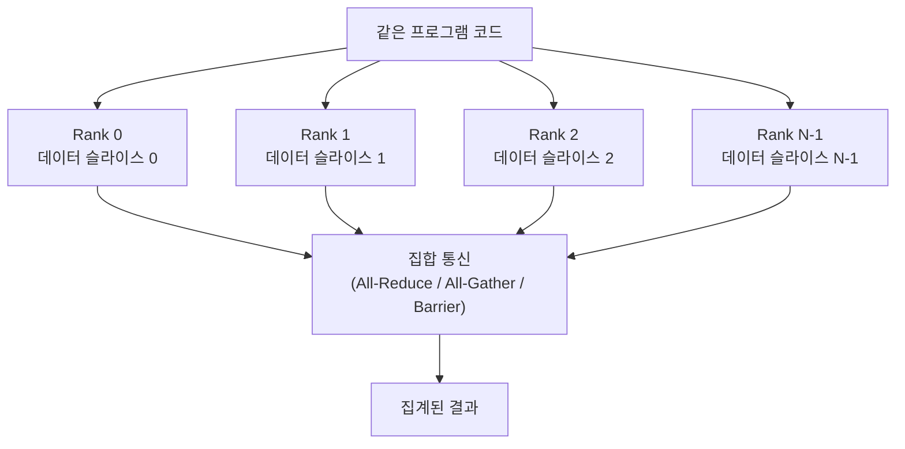
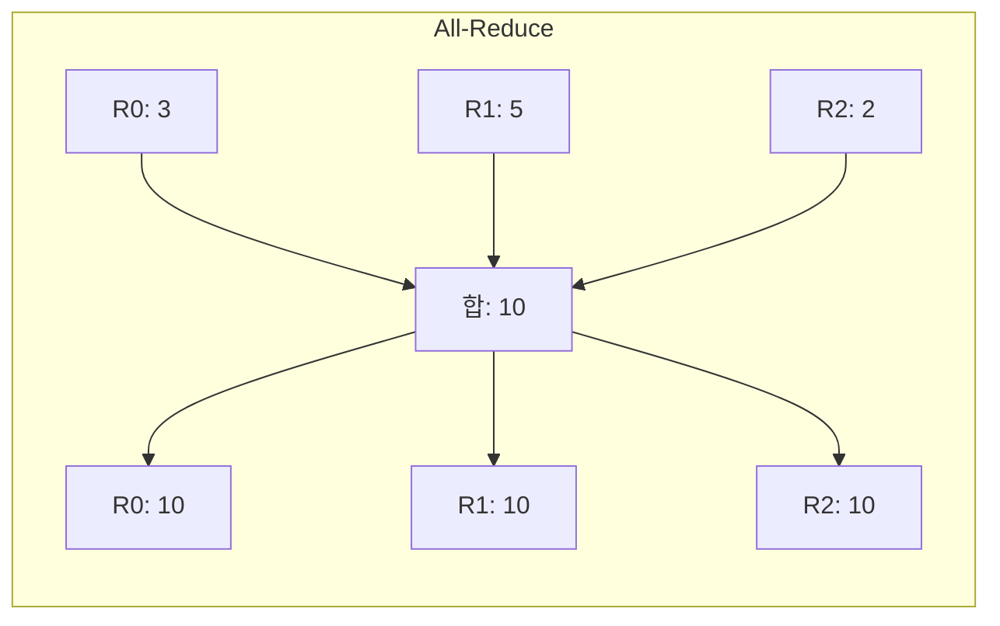

## 정의

**SPMD** (Single Program, Multiple Data)는 병렬 컴퓨팅의 대표 모델 중 하나. **모든 프로세스(또는 thread)가 같은 프로그램을 실행하되, 각자 다른 데이터를 처리**한다.

Frederica Darema 가 1980년대 후반 IBM 에서 정의한 개념. MPI, CUDA, OpenMP 등 거의 모든 병렬 컴퓨팅 프레임워크의 기본 추상화.

## 동작 방식



```python
# SPMD 의사 코드 (모든 노드가 같은 코드 실행)
my_rank = get_rank()           # 0, 1, 2, ..., N-1
my_data = load_data(my_rank)   # 노드마다 다른 데이터 슬라이스
result = process(my_data)      # 같은 처리 로직
all_results = collective_op(result)  # 통신 (all-reduce 등)
```

각 노드/프로세스는:
- **rank (또는 id)** 로 자기를 식별
- **자기 데이터 슬라이스**만 처리
- **동기화 지점** 에서 통신 (barrier, all-reduce, broadcast 등)

## 다른 병렬 모델과의 차이

| 모델 | 프로그램 | 데이터 | 동기화 | 대표 사례 |
|:---|:---|:---|:---|:---|
| **SIMD** | 1 | 여러 vector | 매 사이클 | CPU AVX, SSE |
| **[[SIMT]]** | 1 | thread 마다 | warp 단위 | GPU CUDA |
| **SPMD** | 1 (인스턴스 N개) | 노드 마다 | 명시적 | MPI, 분산 학습 |
| **MIMD** | 여러 | 여러 | 명시적 | 일반 멀티스레드 |

[[SIMT]] 는 SPMD 의 GPU 하드웨어 구현 정도로 볼 수 있다. CUDA 코드를 작성할 때 각 thread 가 자기 `threadIdx.x` 로 자기 데이터를 처리하는 패턴이 정확히 SPMD.

## SPMD 의 매력

### 1. 프로그래밍 단순함

여러 다른 프로그램을 짜는 게 아니라 하나만 짜면 됨. rank 로 분기.

```python
if my_rank == 0:
    coordinator_logic()
else:
    worker_logic()
```

### 2. 확장 용이

같은 코드를 100 노드든 10,000 노드든 실행 가능. 노드 수만 바꾸면 끝.

### 3. 동기화가 명시적

모든 노드가 같은 코드를 실행하므로 `collective_op` 같은 동기화 지점이 자연스럽게 일치.

## 실제 예시

### MPI (Message Passing Interface)

전통적인 HPC 의 SPMD 표준.

```c
MPI_Init(&argc, &argv);
int rank, size;
MPI_Comm_rank(MPI_COMM_WORLD, &rank);
MPI_Comm_size(MPI_COMM_WORLD, &size);

// 각 rank 가 자기 데이터 슬라이스 처리
double local_sum = compute_local_sum(rank);

// 모든 노드의 합 = global_sum 으로 집계
double global_sum;
MPI_Reduce(&local_sum, &global_sum, 1, MPI_DOUBLE, MPI_SUM, 0, MPI_COMM_WORLD);

MPI_Finalize();
```

### CUDA (GPU)

GPU 의 SPMD 구현. 각 thread 가 자기 인덱스로 작업.

```cpp
__global__ void add_vectors(float* a, float* b, float* c, int n) {
  int i = blockIdx.x * blockDim.x + threadIdx.x;
  if (i < n) c[i] = a[i] + b[i];
}
```

### PyTorch DDP / FSDP

[[분산 학습]] 의 SPMD 패턴. 모든 GPU 가 같은 모델 코드를 실행, 각자 다른 배치 처리, `all_reduce` 로 gradient 동기화.

```python
# 모든 rank 가 실행 (DDP)
dist.init_process_group()
model = DDP(model)
for batch in dataloader:  # rank 마다 다른 배치
    loss = model(batch)
    loss.backward()
    # DDP 가 자동으로 all-reduce
    optimizer.step()
```

DDP 와 FSDP 의 차이:

| 항목 | DDP | FSDP |
|:---|:---|:---|
| 모델 복제 | 각 GPU 에 전체 복사 | 파라미터 샤딩 |
| 메모리 | GPU 수만큼 중복 | 효율적 |
| 대상 | 모델이 단일 GPU 에 맞을 때 | 초대형 모델 |

### JAX `pmap`

함수형 SPMD. XLA 컴파일러가 device 배치를 자동 최적화.

```python
import jax
import jax.numpy as jnp

@jax.pmap
def step(params, batch):
    loss, grads = jax.value_and_grad(compute_loss)(params, batch)
    # pmap 이 자동으로 all-reduce
    grads = jax.lax.pmean(grads, axis_name="batch")
    new_params = params - learning_rate * grads
    return new_params, loss

# pmap 은 모든 device 에 같은 함수를 자동 분배
new_params, losses = step(replicated_params, sharded_batch)
```

### JAX `shard_map` / `jit` + sharding (최신)

JAX 의 최신 권장 패턴. `pmap` 보다 더 유연한 샤딩 명세.

```python
from jax.sharding import Mesh, PartitionSpec as P
from jax.experimental import mesh_utils

# 8 GPU 를 (data, model) 2D 메시로
devices = mesh_utils.create_device_mesh((2, 4))
mesh = Mesh(devices, ("data", "model"))

# 텐서 샤딩 명세
data_sharding = jax.sharding.NamedSharding(mesh, P("data", None))
model_sharding = jax.sharding.NamedSharding(mesh, P(None, "model"))

@functools.partial(jax.jit, in_shardings=(model_sharding, data_sharding))
def train_step(params, batch):
    ...
```

## Collective 통신 종류

SPMD 프로그램의 동기화 지점.



| 연산 | 설명 | 사용처 |
|:---|:---|:---|
| **All-Reduce** | 모든 노드 값 집계 후 전체 배포 | gradient 합산 |
| **Broadcast** | 한 노드에서 전체로 배포 | 파라미터 초기 동기화 |
| **Scatter** | 한 노드에서 각 노드로 분배 | 배치 분할 |
| **Gather** | 각 노드에서 한 노드로 집결 | 결과 모으기 |
| **All-Gather** | Scatter 의 역: 분산 배열 전체 복원 | FSDP 파라미터 복원 |
| **Reduce-Scatter** | Reduce + 결과를 노드별로 샤딩 | FSDP gradient 집계 |
| **Barrier** | 모든 노드 도착 대기 | 단순 동기화 |

## SPMD 의 한계

### 1. Heterogeneous 워크로드 어려움

모든 노드가 같은 일을 한다는 가정. 일부 노드만 다른 작업이 필요한 경우 ([[분산 학습#pipeline-parallelism|Pipeline Parallelism]] 등) MIMD 스타일로 전환 필요.

### 2. Load imbalance

각 노드의 작업량이 다르면 빠른 노드가 느린 노드를 기다림. 균형 분할이 중요.

```
Rank 0: 배치 크기 1024 (처리 완료: t=1.0s)
Rank 1: 배치 크기 1024 (처리 완료: t=1.0s)
Rank 2: 배치 크기 1024 (처리 완료: t=1.0s)
Rank 3: 배치 크기 1024 이지만 긴 시퀀스 (처리 완료: t=2.5s)
          ↑ 모든 rank 가 rank 3 을 기다림 (bubble)
```

### 3. 통신 비용

`all_reduce`, `all_gather` 같은 collective 가 노드 수에 따라 비용 급증. 100 노드 → 10,000 노드 확장 시 통신 패턴 재설계 필요.

Ring-AllReduce 같은 최적화된 통신 토폴로지가 실제로는 O(N) 이 아닌 O(1) 에 가까운 성능을 낸다.

## SPMD 와 Data Parallelism 관계

**Data Parallelism (데이터 병렬)** 은 SPMD 의 가장 흔한 구현 패턴이다.

```
Data Parallelism 구조:
  전체 배치 N
  ├── GPU 0: 배치 0 ~ N/k (같은 모델, 다른 배치)
  ├── GPU 1: 배치 N/k ~ 2N/k
  └── GPU k-1: ...
  → backward: gradient all-reduce
  → optimizer: 동기화된 weight update
```

SPMD 관점에서 각 GPU 는 완전히 동일한 코드를 실행하되 `rank` 로 배치 슬라이스를 식별한다. `DDP` 와 `FSDP` 모두 이 패턴.

반면 **Tensor Parallelism** 은 **같은 배치**를 여러 GPU 에 나눠 처리. 같은 코드이지만 데이터 대신 **연산(행렬 곱)** 를 분할 → 이것도 SPMD 이지만 데이터 분할 축이 다르다.

## 함정

> [!WARNING]
> **XLA/JAX 에서 동적 shape 주의**: `pmap` 내부 shape 이 rank 마다 달라지면 XLA 재컴파일 트리거. 배치 크기를 rank 수의 배수로 패딩해 shape 고정.

> [!CAUTION]
> **MPI 프로세스 중 하나만 죽어도 전체 중단**: SPMD 는 모든 rank 가 같은 코드를 실행하므로 장애 허용이 어렵다. Checkpoint + restart 전략 필수.

## 관련 위키

- [[SIMT]] - GPU 하드웨어 SPMD 구현: warp, thread block
- [[분산 학습]] - 대규모 모델 학습의 SPMD 패턴: DDP, FSDP, Megatron
- [[HBM]] - 각 노드의 메모리 대역폭: 통신과 메모리의 trade-off
- [[GPU]] - SPMD 실행 기반: SM, warp scheduler
