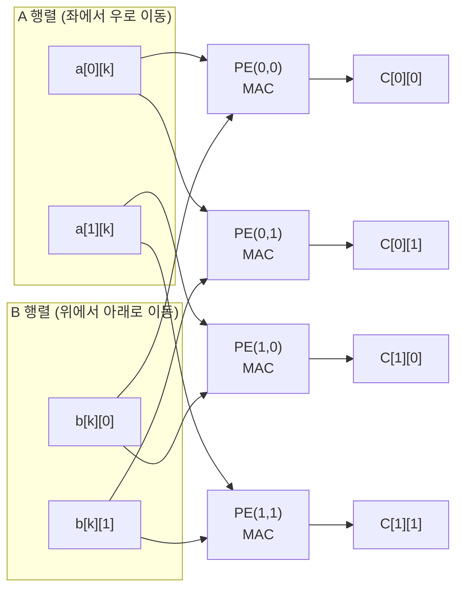
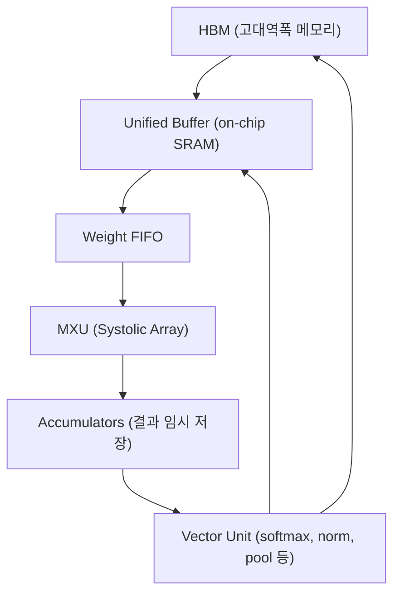
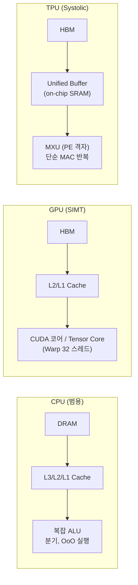

## 정의

**Systolic Array** 는 격자 형태로 배치된 다수의 Processing Element (PE) 가, 입력 데이터가 박동(systolic)처럼 격자를 가로질러 흐르는 동안 각 PE 가 곱셈+누적(MAC) 을 수행하는 하드웨어 구조다.

H.T. Kung 이 1978년 제안한 개념이며, [[TPU]] 의 핵심 컴퓨팅 단위로 부활했다. TPU 에서는 **MXU (Matrix Multiply Unit)** 으로 불린다.

```anim:systolic-array
{}
```

이름의 유래는 심장 박동(systole): 데이터가 규칙적으로 PE 사이를 리드미컬하게 펌핑하며 이동하는 모습에서 온다.

## 언제 쓰이나

- 대규모 행렬곱(GEMM) 이 반복적으로 필요한 딥러닝 학습/추론
- 전통적인 범용 프로세서(CPU/GPU)로는 메모리 대역폭 병목이 발생하는 상황
- Google TPU, 일부 Edge AI 칩(Google Edge TPU, 삼성 Exynos NPU), FPGA 구현 등

## Systolic Pumping: 핵심 동작 원리

행렬 곱셈 `C = A × B` 의 기본 연산:

```text
C[i][j] += A[i][k] * B[k][j]   (k = 0 ~ K-1)
```

Systolic Array 에서는 이 연산을 PE 격자가 담당한다:



각 클럭 사이클마다:
1. A 행렬 원소가 왼쪽에서 오른쪽으로 이동
2. B 행렬 원소가 위에서 아래로 이동
3. 각 PE 가 수신한 두 값을 곱해 누적

### Weight Stationary vs Output Stationary

[[TPU]] 는 **Weight Stationary** 방식을 채택한다.

| 방식 | 정주(고정) 데이터 | 흐름 데이터 | 적합한 상황 |
|:---|:---|:---|:---|
| **Weight Stationary** | 가중치 (B) | 활성화 (A) | 추론, 가중치 재사용 |
| **Output Stationary** | 부분합 출력 (C) | 가중치 + 활성화 | 작은 필터 합성곱 |
| **Input Stationary** | 활성화 입력 (A) | 가중치 | 모바일 NPU |

추론 시 가중치는 고정, 입력(활성화)만 바뀌므로 Weight Stationary 가 이상적.

## 3가지 우아함

### 1. 메모리 접근 최소화

각 가중치(weight)는 PE 에 한 번 적재 후 수많은 활성화 벡터와의 곱셈에 재사용된다. DRAM/HBM 접근 횟수가 극적으로 줄어든다.

```text
전통 방식: C[i][j] 계산 시마다 A[i][k], B[k][j] 메모리 로드 → K 번 * M*N 회 = K*M*N 접근
Systolic:  B 행렬 한 번 적재 → A 원소마다 재사용 → M*N + K*M 회 접근
```

### 2. 완벽한 데이터 재사용

한 활성화 값이 PE 배열을 가로질러 이동하면서 N 개의 PE 와 연산. 단 1번 메모리에서 읽어 N 번 사용.

### 3. 단순한 제어 회로

모든 PE 가 동일한 동작(MAC: Multiply-Accumulate) 반복 실행. CPU 의 분기 예측, OoO 실행 등 복잡한 제어 회로가 불필요 → 동일 면적에 훨씬 많은 연산 유닛 배치 가능.

## Google TPU MXU 실제 구현

### TPU 내부 아키텍처



| 세대 | MXU 크기 | 피크 성능 | 메모리 |
|:---|:---:|:---:|:---|
| TPU v1 | 256×256 | 92 TOPS (INT8) | 8 GB LPDDR |
| TPU v2 | 128×128 × 2 | 45 TFLOPS (BF16) | 16 GB HBM |
| TPU v3 | 128×128 × 2 | 123 TFLOPS (BF16) | 32 GB HBM |
| TPU v4 | 128×128 × 4 | 275 TFLOPS (BF16) | 32 GB HBM |
| TPU v5e (Trillium) | - | ~394 TFLOPS (BF16) | 16 GB HBM |

> [!IMPORTANT]
> TPU MXU 는 **BF16 (bfloat16)** 형식을 사용한다. BF16 은 FP32 와 같은 exponent(8bit) 범위를 유지하면서 mantissa 를 줄여(7bit), 학습 안정성을 보존하면서 메모리 대역폭을 절반으로 줄인다.

### Unified Buffer 역할

MXU 가 쉬지 않고 연산하려면 데이터 공급이 끊기지 않아야 한다. Unified Buffer (on-chip SRAM, 16-128MB) 가 HBM 과 MXU 사이 버퍼 역할을 맡는다.

```text
재사용 계수(reuse factor) = 행렬 차원 N
행렬 N=1024 이면: 각 가중치 원소 1024 번 재사용
→ 효과적인 메모리 대역폭 = HBM 실제 BW × 1024
```

## GEMM 과 딥러닝 연산 맵핑

딥러닝의 주요 연산은 대부분 GEMM 으로 표현된다:

| 딥러닝 연산 | GEMM 형태 | 비고 |
|:---|:---|:---|
| `nn.Linear(in, out)` | `[B, in] × [in, out]` | 가장 기본 |
| Attention `Q @ K.T` | `[B*H, seq, d] × [B*H, d, seq]` | 배치 GEMM |
| Conv2d (im2col) | `[B*OH*OW, IC*KH*KW] × [IC*KH*KW, OC]` | 변환 필요 |
| LayerNorm, Softmax | GEMM 아님 | Vector Unit 에서 처리 |

### Tiling 전략

MXU 가 128×128 이고 행렬이 1024×1024 라면 *타일링*:

```text
A[1024×1024] = 8×8 타일 (각 128×128)
B[1024×1024] = 8×8 타일

C[i][j] = sum over k { A_tile[i][k] × B_tile[k][j] }
```

XLA 컴파일러가 타일링 크기를 자동 결정하므로 수동 지정 불필요.

## CPU / GPU 와 비교



| 항목 | CPU | GPU (H100) | TPU v4 |
|:---|:---:|:---:|:---:|
| 피크 컴퓨트 (BF16) | ~2 TFLOPS | 1,979 TFLOPS | 275 TFLOPS |
| 메모리 대역폭 | ~100 GB/s | 3.35 TB/s | 1.2 TB/s |
| 제어 회로 비중 | 매우 높음 | 중간 | 낮음 |
| 범용성 | 최고 | 높음 | ML 특화 |
| 실제 MFU | ~5% | 30-50% | 60-70% |

> MFU (Model FLOP Utilization): 이론 피크 대비 실제 활용률. TPU MFU 가 GPU 보다 높다.

## 실전: XLA + JAX 로 MXU 최대 활용

```python
import jax
import jax.numpy as jnp
from functools import partial

# XLA jit 컴파일: TPU에서 MXU 타일링 자동 최적화
@partial(jax.jit, backend='tpu')
def matmul(a: jnp.ndarray, b: jnp.ndarray) -> jnp.ndarray:
    return jnp.dot(a, b)

# 배치 행렬곱 (vmap으로 자동 벡터화)
@jax.jit
def batched_matmul(a, b):
    return jax.vmap(jnp.dot)(a, b)

# Transformer 셀프 어텐션 (MXU 에 최적화된 einsum)
def scaled_dot_product_attention(q, k, v, scale):
    # q, k, v: [batch, heads, seq, dim]
    scores = jnp.einsum('bhid,bhjd->bhij', q, k) * scale
    weights = jax.nn.softmax(scores, axis=-1)
    return jnp.einsum('bhij,bhjd->bhid', weights, v)
```

XLA 가 `jnp.dot`, `jnp.einsum` 을 HLO (High-Level Optimizer IR) 로 낮추고, MXU 크기에 맞는 타일을 생성한다.

### 배치 크기 권장

```text
MXU 효율 극대화: seq_len, hidden_dim 등이 128(또는 256) 배수여야 함
예: hidden_dim=512(ok), 500(비효율), 768(ok)
    batch_size: 8, 16, 32 등 2의 거듭제곱 권장
```

## 한계

### MXU 크기 미스매치 (Underutilization)

MXU 128×128 에 64×64 행렬을 넣으면:

```text
실제 연산: 64 × 64 = 4,096 MAC
MXU 최대: 128 × 128 = 16,384 MAC
활용률: 25%
```

**회피 전략**: 배치 크기 늘리기, 행렬 패딩, 모델 차원을 128(또는 256) 배수로 설계.

### 비행렬 연산 병목

Softmax, LayerNorm, ReLU 등은 Vector Unit 에서 처리. MXU 와 VU 가 번갈아 작동하면 파이프라인 낭비. Fused kernel (XLA 가 자동) 으로 경감.

### 희소 행렬 비효율

대부분 원소가 0인 sparse matrix 에서도 모든 PE 가 쓸모없는 곱셈을 실행. TPU v4+ 에서 SparseCore 별도 추가로 일부 해소.

## 흔한 함정

> [!WARNING]
> 1. **행렬 차원이 MXU 크기 배수 아님** = 자동 패딩 낭비, 활용률 급락. 모델 설계 시 128/256 배수 권장.
> 2. **작은 배치 크기** = MXU 활용률 급락. 추론 시 배치 큐잉(dynamic batching)으로 보정.
> 3. **`jit` 없이 실행** = 각 연산이 개별 커널 실행, XLA 최적화 불가. 반드시 `@jax.jit` 적용.
> 4. **element-wise 연산 남발** = Vector Unit 병목으로 MXU idle. XLA 의 op-fusion 에 맡기고 개별 kernel 실행 최소화.
> 5. **TPU v1 사용 시 INT8 고정** = 추론 전용, 학습 불가. v2+ 에서 BF16 학습 가능.

## 관련 위키

- [[TPU]] - Systolic Array 를 MXU 로 탑재한 Google ASIC
- [[gpu]] - GPU 의 Tensor Core 와 비교
- [[hbm]] - MXU 에 데이터를 공급하는 고대역폭 메모리
- [[simt]] - GPU 의 병렬 실행 모델 (Systolic 과 대비)
- [[distributed-training]] - MXU 다수를 묶어 수천 TPU 로 확장
- [[SPMD]] - TPU 분산 프로그래밍 모델
