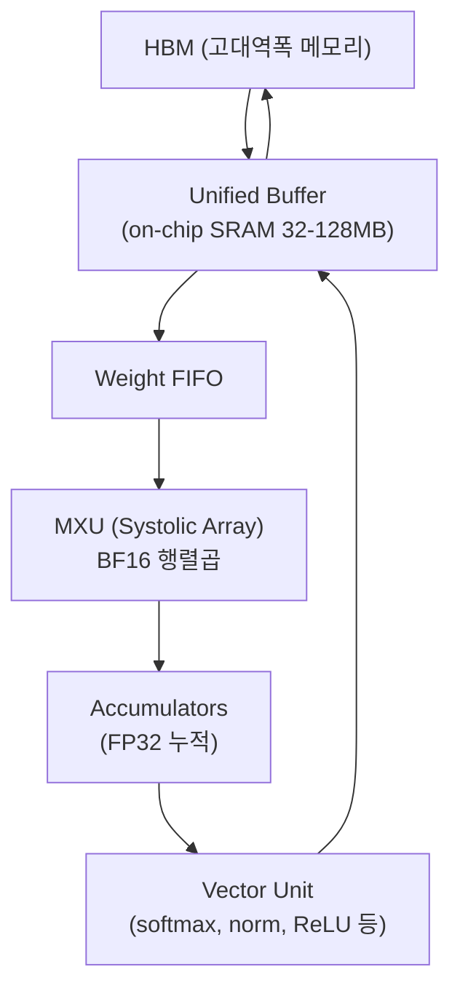
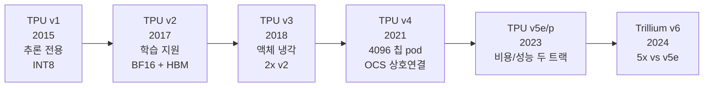
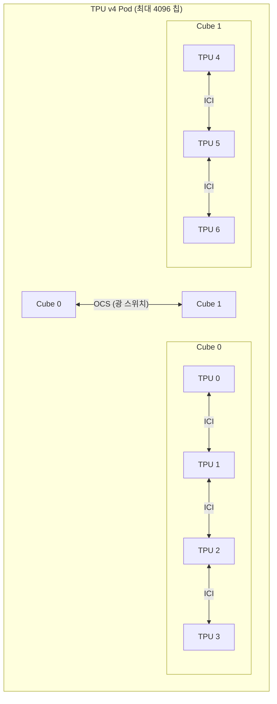
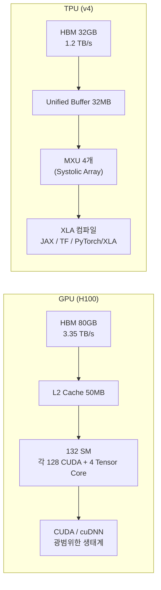

## 정의

**TPU (Tensor Processing Unit)** 는 Google 이 딥러닝 워크로드 전용으로 설계한 **ASIC (Application-Specific Integrated Circuit)**. 2015년 내부 투입, 2017년 ISCA 발표. GPU 처럼 범용 병렬 프로세서가 아닌 **행렬 곱셈 특화** 가속기.

핵심 컴퓨팅 단위는 [[systolic-array|Systolic Array]] 기반 **MXU (Matrix Multiply Unit)**.

## 언제 쓰이나

- 대규모 Transformer (LLM, Vision Transformer) 학습/추론
- Google Gemini, PaLM, BERT 등 Google 모델 대부분 TPU 에서 학습
- JAX/XLA 스택으로 분산 학습을 구현할 때
- GPU 에 비해 비용 효율($/TFLOPS) 이 중요한 장기 학습

## 핵심 아키텍처

### MXU (Matrix Multiply Unit)

[[systolic-array|Systolic Array]] 를 이용한 대규모 병렬 행렬곱. 가중치(weight)가 PE 격자에 정주(stationary)하고 활성화(activation)가 격자를 통과하며 MAC 수행.



### bfloat16

FP32 exponent(8bit) + 축소된 mantissa(7bit). GPU 의 FP16(5+10) 과 달리 FP32 와 exponent 범위 동일 → 오버플로/언더플로 없이 학습 안정성 유지.

| 형식 | exponent | mantissa | 동적 범위 |
|:---|:---:|:---:|:---|
| FP32 | 8bit | 23bit | FP32 |
| FP16 | 5bit | 10bit | 좁음 (오버플로 위험) |
| **BF16** | **8bit** | **7bit** | FP32 와 동일 |
| FP8 E4M3 | 4bit | 3bit | 매우 좁음 (추론용) |

## 세대별 발전



### 세대별 상세

| 세대 | 출시 | MXU 크기 | 피크 TFLOPS (BF16) | HBM | 특징 |
|:---|:---:|:---:|:---:|:---:|:---|
| v1 | 2015 | 256×256 | 92 TOPS (INT8) | 없음 | 추론 전용, AlphaGo 사용 |
| v2 | 2017 | 128×128 × 2 | 45 TFLOPS | 16 GB | 최초 BF16 학습, HBM 도입 |
| v3 | 2018 | 128×128 × 2 | 123 TFLOPS | 32 GB | 액체 냉각, v2 2배 |
| v4 | 2021 | 128×128 × 4 | 275 TFLOPS | 32 GB | OCS 광 상호연결, PaLM 학습 |
| v5e | 2023 | - | ~197 TFLOPS | 16 GB | 비용 효율 트랙 |
| v5p | 2023 | - | ~459 TFLOPS | 95 GB | 성능 트랙 |
| Trillium (v6) | 2024 | - | ~918 TFLOPS | 32 GB | v5e 대비 4.7x 컴퓨트 |

## TPU Pod: 수천 칩 연결

개별 TPU 칩을 고속 인터커넥트로 묶은 단위. Pod 안에서 칩들이 **dedicated ICI (Inter-Chip Interconnect)** 로 연결.



TPU v4 Pod 의 혁신: **OCS (Optical Circuit Switch)** 로 수백~수천 칩을 유연하게 연결. 임의의 topology 구성 가능.

| Pod 크기 | 칩 수 | 피크 성능 |
|:---|:---:|:---|
| TPU v4 슬라이스 | 8~512 | 수십 petaFLOPS |
| TPU v4 Pod | 4096 | ~1 exaFLOPS |

## XLA: 컴파일러가 MXU 를 최대한 활용

TPU 는 **XLA (Accelerated Linear Algebra)** 컴파일러 없이는 제 성능이 나오지 않는다.


XLA 가 자동으로 수행하는 최적화:

| 최적화 | 효과 |
|:---|:---|
| **Op fusion** | softmax = exp + sum + div → 단일 커널 |
| **Tiling** | 행렬을 MXU 크기에 맞게 분할 |
| **Layout optimization** | 메모리 레이아웃을 MXU 친화적으로 전환 |
| **Rematerialization** | activation checkpoint (메모리/컴퓨트 트레이드오프) |
| **SPMD partitioning** | 분산 학습 자동 샤딩 |

## 실전: JAX 로 TPU 활용

### 기본 설정

```python
import jax
import jax.numpy as jnp

# 사용 가능한 TPU 장치 확인
devices = jax.devices('tpu')
print(f"TPU 장치 수: {len(devices)}")

# jit 컴파일: XLA 가 MXU 최적화 적용
@jax.jit
def linear(weights, x):
    return jnp.dot(x, weights)

# BF16 명시 사용
x = jnp.ones((1024, 512), dtype=jnp.bfloat16)
W = jnp.ones((512, 256), dtype=jnp.bfloat16)
y = linear(W, x)  # [1024, 256] BF16
```

### 분산 학습 (pmap / pjit)

```python
from jax.experimental import mesh_utils
from jax.sharding import Mesh, PartitionSpec, NamedSharding

# TPU Pod: 64 칩을 8x8 mesh 로 배치
devices = mesh_utils.create_device_mesh((8, 8))
mesh = Mesh(devices, axis_names=('data', 'model'))

# 가중치 모델 병렬, 배치 데이터 병렬 샤딩
weight_sharding = NamedSharding(mesh, PartitionSpec('model', None))
data_sharding   = NamedSharding(mesh, PartitionSpec('data', None))

@jax.jit
def train_step(state, batch):
    # pjit 내부에서 자동 collective (all-reduce, all-gather)
    loss, grads = jax.value_and_grad(loss_fn)(state.params, batch)
    return state.apply_gradients(grads=grads), loss
```

### Flax 모델 정의

```python
from flax import linen as nn

class TransformerBlock(nn.Module):
    hidden: int
    heads: int

    @nn.compact
    def __call__(self, x):
        # 모든 dot/matmul 이 XLA 에 의해 MXU 최적화됨
        attn_out = nn.MultiHeadDotProductAttention(
            num_heads=self.heads
        )(x, x)
        x = nn.LayerNorm()(x + attn_out)
        mlp_out = nn.Dense(self.hidden * 4)(x)
        mlp_out = nn.gelu(mlp_out)
        mlp_out = nn.Dense(self.hidden)(mlp_out)
        return nn.LayerNorm()(x + mlp_out)
```

## GPU 와 비교



| 항목 | GPU (H100) | TPU v4 |
|:---|:---|:---|
| 피크 TFLOPS (BF16) | 1,979 | 275 (칩당) |
| MFU (실제 활용률) | 30-50% | 60-70% |
| 메모리 대역폭 | 3.35 TB/s | 1.2 TB/s |
| 소프트웨어 | CUDA (광범위) | XLA 중심 |
| 병렬 실행 모델 | SIMT (warp 32T) | Systolic Array |
| 지연시간 | 낮음 (스트리밍) | 배치 지향 |
| 접근성 | AWS, Azure, GCP, on-prem | GCP TPU 만 |
| 유연성 | 높음 (그래픽, HPC 포함) | ML 특화 |

> [!IMPORTANT]
> H100 의 피크 TFLOPS 가 훨씬 높지만, MFU 를 감안하면 실효 성능 차는 크게 줄어든다. TPU 는 행렬 연산에서 효율이 매우 높고, Pod 로 묶으면 H100 클러스터보다 통신 대역폭이 유리하다.

## 한계

| 한계 | 상세 |
|:---|:---|
| **GCP 한정** | AWS, Azure, on-prem 불가. 벤더 종속 |
| **CUDA 생태계 없음** | PyTorch CUDA 확장 직접 사용 불가. XLA 기반 재작성 필요 |
| **동적 shape 비효율** | XLA 는 shape 별 재컴파일. 가변 길이 시퀀스 처리 까다로움 |
| **디버깅 어려움** | JIT 컴파일 후 실행 → 스택 트레이스 추적 복잡 |
| **소형 모델** | 작은 모델/배치에서는 GPU 가 오히려 빠름 |

## 흔한 함정

> [!WARNING]
> 1. **`jax.jit` 없이 실행** = Python 레벨 eager 실행, MXU 최적화 전혀 없음. 항상 `@jax.jit` 필수.
> 2. **행렬 차원이 128 배수 아님** = MXU padding 낭비. hidden_dim, intermediate 크기를 128 배수로.
> 3. **동적 shape 남발** = 매번 재컴파일 발생. 고정 shape 또는 `jax.vmap` + padding.
> 4. **HBM 부족 무시** = TPU v4 HBM 32GB. 큰 모델은 분산 샤딩 (tensor/pipeline parallelism) 필수.
> 5. **PyTorch 습관 그대로** = TPU 에서 `.cuda()` 대신 `jax.device_put(x, devices[0])` 사용.

## 관련 위키

- [[systolic-array]] - TPU 의 핵심 컴퓨팅 유닛
- [[gpu]] - GPU 와 비교
- [[hbm]] - HBM 메모리 (TPU/GPU 공통)
- [[distributed-training]] - TPU Pod 를 활용한 분산 학습
- [[SPMD]] - JAX/XLA 분산 학습 모델
- [[양자화]] - FP8/INT8 추론 (TPU v5+ 지원)
