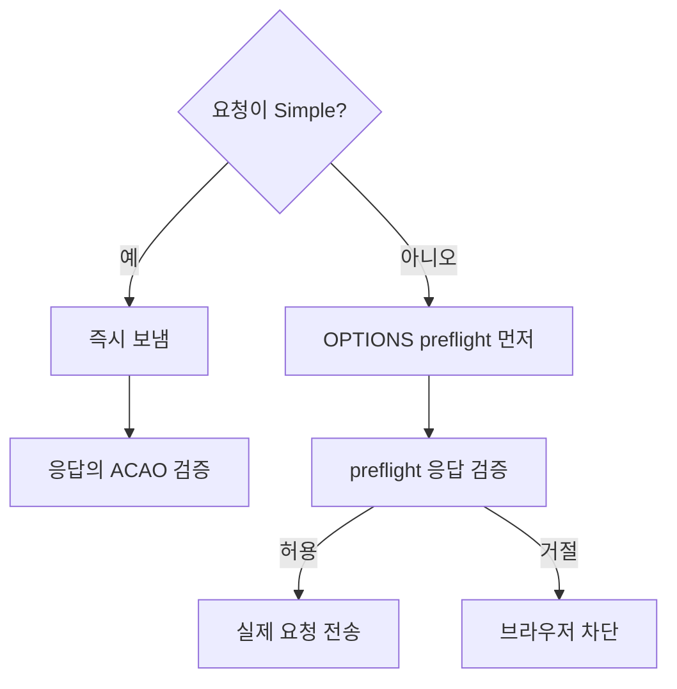
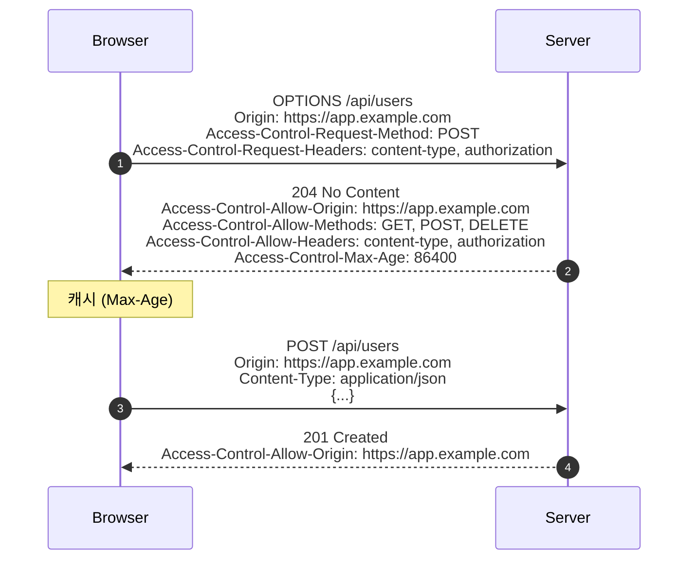

## 정의

**CORS (Cross-Origin Resource Sharing)** 는 *Same-Origin Policy (SOP)* 의 *완화 메커니즘*. 브라우저가 *origin 이 다른* 리소스에 *조건부로 접근* 할 수 있게 한다.

> [!IMPORTANT]
> CORS 는 *브라우저의 보안 모델*. *서버 → 서버* 호출에는 영향 없음. *curl, Postman 도 CORS 적용 안 함*. *오로지 브라우저가 JS 코드의 cross-origin fetch* 를 막거나 허용한다.

## Origin = scheme + host + port

| URL | Origin |
|---|---|
| `https://app.example.com/page` | `https://app.example.com` |
| `https://app.example.com:443` | `https://app.example.com` (default port) |
| `http://app.example.com` | `http://app.example.com` (scheme 다름) |
| `https://api.example.com` | `https://api.example.com` (host 다름) |

## Simple Request vs Preflight



### Simple Request 조건 (모두 만족):

- Method: GET, HEAD, POST
- 헤더: 안전한 헤더 + `Content-Type: application/x-www-form-urlencoded | multipart/form-data | text/plain`
- 이벤트 listener 없음 (XHR upload)
- `ReadableStream` body 없음

→ 위 조건 *하나라도 어기면 preflight*. JSON `Content-Type: application/json` 도 *preflight 유발*.

## Preflight 흐름



## Response 헤더 가이드

| 헤더 | 의미 |
|---|---|
| `Access-Control-Allow-Origin` | 허용된 origin (*하나만* 또는 `*`) |
| `Access-Control-Allow-Methods` | preflight 응답에서 허용 method |
| `Access-Control-Allow-Headers` | 허용 헤더 |
| `Access-Control-Expose-Headers` | JS 가 읽을 수 있는 응답 헤더 |
| `Access-Control-Max-Age` | preflight 캐시 (초) |
| `Access-Control-Allow-Credentials` | `true` 면 cookie/Authorization 허용 |

## Credentials (cookie / Authorization)

```js
fetch('https://api.example.com/me', {
  credentials: 'include',   // cookie 보내기
});
```

이 경우 서버는 *반드시*:

```http
Access-Control-Allow-Origin: https://app.example.com   ← * 불가능!
Access-Control-Allow-Credentials: true
```

> [!CAUTION]
> *`Allow-Origin: *` + `Allow-Credentials: true` 는 *RFC 위반*. 브라우저가 거절. credentials 가 필요하면 *명시적 origin*.

## 흔한 함정

> [!WARNING]
> 1. **`Allow-Origin: *` 를 *모든 경우에* 박음** = credentials 모드에서 동작 안 함.
> 2. **preflight 응답에 *200* 보냄** = 보통 *204 No Content* 가 정석. 200 도 동작은 함.
> 3. **`Vary: Origin` 누락** = CDN 이 *다른 origin 응답* 을 캐시. 모든 사용자에게 *같은 origin 의 응답* 이 감.
> 4. **CORS 가 *서버 보안* 이라고 오해** = 브라우저 보안. *curl 은 CORS 무시*. *서버 보안은 별도* (auth, IP allowlist 등).
> 5. **로컬 개발 환경 (`localhost:3000`) 만 허용** 으로 *프로덕션 cross-origin 미테스트*.

## CORS vs CSRF

| | CORS | CSRF |
|---|---|---|
| 본질 | *cross-origin fetch 허용* | *cross-origin 의 *위조 요청* 방어* |
| 방향 | 브라우저 → 서버 *허용* | 브라우저 → 서버 *거절* |
| 토대 | Same-Origin Policy 의 *완화* | Same-Origin Policy 의 *우회 방어* |
| 도구 | Response 헤더 (ACAO) | CSRF token, SameSite cookie |

자세한 건 [[CSRF]] 참고.

## 서버 구현 예시 (Express)

```js
import cors from 'cors';

app.use(cors({
  origin: ['https://app.example.com', 'https://staging.example.com'],
  credentials: true,
  methods: ['GET', 'POST', 'PUT', 'DELETE'],
  allowedHeaders: ['Content-Type', 'Authorization'],
  exposedHeaders: ['X-Total-Count'],
  maxAge: 86400,
}));
```

## SOP 가 막는 것들

- `fetch('https://other.com')` 의 응답 읽기
- 다른 origin iframe 의 DOM 접근
- 다른 origin 의 cookie 읽기

SOP 가 *막지 않는 것* (CSRF 의 토대):

- `<form action="https://other.com">` 의 POST
- `` (GET)
- `<script src="https://other.com/api">` (실행됨)

## 관련 위키

- [[CSRF]]
- [[Session Cookie]]
- [[JWT]]
- [[HTTP/1.1]]
