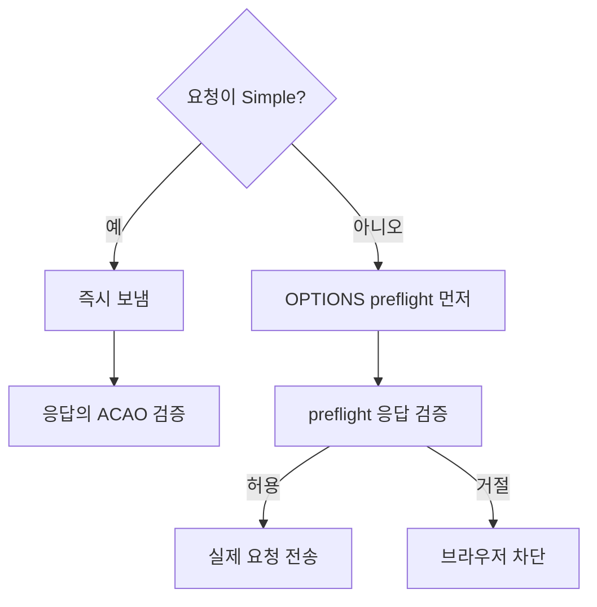
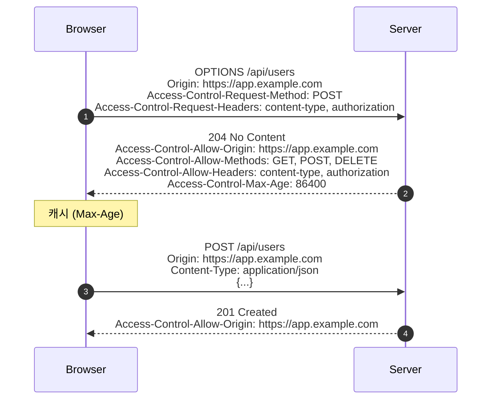

## 정의

**CORS (Cross-Origin Resource Sharing)** 는 *Same-Origin Policy (SOP)* 의 *완화 메커니즘*. 브라우저가 *origin 이 다른* 리소스에 *조건부로 접근* 할 수 있게 한다.

> [!IMPORTANT]
> CORS 는 *브라우저의 보안 모델*. *서버 -> 서버* 호출에는 영향 없음. *curl, Postman 도 CORS 적용 안 함*. *오로지 브라우저가 JS 코드의 cross-origin fetch* 를 막거나 허용한다.

## Origin = scheme + host + port

| URL | Origin |
|---|---|
| `https://app.example.com/page` | `https://app.example.com` |
| `https://app.example.com:443` | `https://app.example.com` (default port) |
| `http://app.example.com` | `http://app.example.com` (scheme 다름) |
| `https://api.example.com` | `https://api.example.com` (host 다름) |

## Simple Request vs Preflight



### Simple Request 조건 (모두 만족)

- Method: GET, HEAD, POST
- 헤더: 안전한 헤더 + `Content-Type: application/x-www-form-urlencoded | multipart/form-data | text/plain`
- 이벤트 listener 없음 (XHR upload)
- `ReadableStream` body 없음

위 조건 *하나라도 어기면 preflight*. JSON `Content-Type: application/json` 도 *preflight 유발*.

## Preflight 흐름



## Response 헤더 가이드

| 헤더 | 의미 |
|---|---|
| `Access-Control-Allow-Origin` | 허용된 origin (하나만 또는 `*`) |
| `Access-Control-Allow-Methods` | preflight 응답에서 허용 method |
| `Access-Control-Allow-Headers` | 허용 헤더 |
| `Access-Control-Expose-Headers` | JS 가 읽을 수 있는 응답 헤더 |
| `Access-Control-Max-Age` | preflight 캐시 (초) |
| `Access-Control-Allow-Credentials` | `true` 면 cookie/Authorization 허용 |

## Credentials (cookie / Authorization)

```js
fetch('https://api.example.com/me', {
  credentials: 'include',   // cookie 보내기
});
```

이 경우 서버는 *반드시*:

```http
Access-Control-Allow-Origin: https://app.example.com   # * 불가능
Access-Control-Allow-Credentials: true
```

> [!CAUTION]
> `Allow-Origin: *` + `Allow-Credentials: true` 는 RFC 위반. 브라우저가 거절. credentials 가 필요하면 *명시적 origin*.

## 서버 구현 가이드

### Express (Node.js)

```js
import cors from 'cors';

app.use(cors({
  origin: ['https://app.example.com', 'https://staging.example.com'],
  credentials: true,
  methods: ['GET', 'POST', 'PUT', 'DELETE'],
  allowedHeaders: ['Content-Type', 'Authorization'],
  exposedHeaders: ['X-Total-Count'],
  maxAge: 86400,
}));
```

### Spring Boot

```java
@Configuration
public class CorsConfig {
    @Bean
    public WebMvcConfigurer corsConfigurer() {
        return new WebMvcConfigurer() {
            @Override
            public void addCorsMappings(CorsRegistry registry) {
                registry.addMapping("/api/**")
                    .allowedOrigins(
                        "https://app.example.com",
                        "https://staging.example.com"
                    )
                    .allowedMethods("GET", "POST", "PUT", "DELETE")
                    .allowedHeaders("Content-Type", "Authorization")
                    .exposedHeaders("X-Total-Count")
                    .allowCredentials(true)
                    .maxAge(86400);
            }
        };
    }
}
```

### nginx

```nginx
location /api/ {
    if ($request_method = OPTIONS) {
        add_header Access-Control-Allow-Origin  $http_origin;
        add_header Access-Control-Allow-Methods "GET, POST, PUT, DELETE, OPTIONS";
        add_header Access-Control-Allow-Headers "Content-Type, Authorization";
        add_header Access-Control-Allow-Credentials true;
        add_header Access-Control-Max-Age 86400;
        return 204;
    }

    add_header Access-Control-Allow-Origin  $http_origin always;
    add_header Access-Control-Allow-Credentials true always;
    proxy_pass http://backend;
}
```

> [!WARNING]
> nginx 에서 `$http_origin` 를 그대로 반영하면 *모든 origin 허용* 과 같음. 허용된 origin 목록을 `map` 디렉티브로 먼저 검증해야 한다.

## 동적 Origin 허용 패턴

`Allow-Origin` 에 *하나의 값만* 담을 수 있다. 여러 origin 을 허용할 때:

```js
const ALLOWED_ORIGINS = new Set([
  'https://app.example.com',
  'https://staging.example.com',
  'http://localhost:3000',
]);

app.use((req, res, next) => {
  const origin = req.headers.origin;
  if (ALLOWED_ORIGINS.has(origin)) {
    res.setHeader('Access-Control-Allow-Origin', origin);
    res.setHeader('Vary', 'Origin');       // CDN 캐시 분리
  }
  next();
});
```

`Vary: Origin` 이 없으면 CDN 이 *다른 origin 의 응답* 을 캐시해서 제공. 반드시 추가.

## SOP 가 막는 것들

- `fetch('https://other.com')` 의 응답 읽기
- 다른 origin iframe 의 DOM 접근
- 다른 origin 의 cookie 읽기

SOP 가 *막지 않는 것* (CSRF 의 토대):

- `<form action="https://other.com">` 의 POST
- `` (GET)
- `<script src="https://other.com/api">` (실행됨)

## CORS vs CSRF

| | CORS | CSRF |
|---|---|---|
| 본질 | cross-origin fetch 허용 | cross-origin 의 위조 요청 방어 |
| 방향 | 브라우저 -> 서버 *허용* | 브라우저 -> 서버 *거절* |
| 토대 | Same-Origin Policy 의 *완화* | Same-Origin Policy 의 *우회 방어* |
| 도구 | Response 헤더 (ACAO) | CSRF token, SameSite cookie |

자세한 건 [[csrf|CSRF]] 참고.

## 개발 환경 팁

로컬 개발 시 `localhost:3000` (프론트) -> `localhost:8080` (백엔드) 도 cross-origin.

- **프록시**: `vite.config.ts` 의 `server.proxy` 로 `/api/*` 를 백엔드로 라우팅 (브라우저 관점에서 same-origin)
- **백엔드 allowOrigin**: `http://localhost:3000` 을 명시적으로 허용
- **HTTPS 불일치**: 로컬에서 `http://`, 프로덕션에서 `https://` 를 혼용하면 다른 origin

## 흔한 함정

> [!WARNING]
> 1. **`Allow-Origin: *` 를 모든 경우에 박음**: credentials 모드에서 동작 안 함.
> 2. **preflight 응답에 200 보냄**: 보통 *204 No Content* 가 정석. 200 도 동작은 하지만 관습 아님.
> 3. **`Vary: Origin` 누락**: CDN 이 *다른 origin 응답* 을 캐시. 모든 사용자에게 *같은 origin 의 응답* 이 감.
> 4. **CORS 가 서버 보안이라고 오해**: 브라우저 보안. *curl 은 CORS 무시*. 서버 보안은 auth, IP allowlist 등 별도.
> 5. **로컬 환경만 허용**: `http://localhost:3000` 만 허용해두고 프로덕션 cross-origin 미테스트.

## CORS 디버깅 체크리스트

브라우저 콘솔에서 CORS 오류가 났을 때:

1. **Network 탭 확인**: OPTIONS preflight 가 발생했는지, 응답 코드 확인
2. **응답 헤더 확인**: `Access-Control-Allow-Origin` 이 실제로 존재하는지
3. **origin 비교**: 요청 `Origin` 헤더와 응답 `ACAO` 값이 정확히 일치하는지 (trailing slash 주의)
4. **credentials 모드**: `credentials: 'include'` 인데 `ACAO: *` 이면 실패
5. **CDN 캐시**: `Vary: Origin` 없이 캐싱된 preflight 응답이 문제일 수 있음

```js
// 빠른 CORS 테스트
fetch('https://api.example.com/health', {
  method: 'OPTIONS',
  headers: {
    'Origin': 'https://app.example.com',
    'Access-Control-Request-Method': 'POST',
    'Access-Control-Request-Headers': 'content-type',
  },
}).then(res => {
  console.log('Status:', res.status);
  console.log('ACAO:', res.headers.get('access-control-allow-origin'));
  console.log('Credentials:', res.headers.get('access-control-allow-credentials'));
});
```

## Private Network Access (PNA)

Chrome 94+ 에서 추가된 보안 정책. *Public internet -> Private network (192.168.x.x, 10.x.x.x)* 로의 요청도 preflight 를 요구.

```http
# PNA preflight 에 추가 헤더
Access-Control-Request-Private-Network: true

# 서버 응답 필요
Access-Control-Allow-Private-Network: true
```

로컬 개발 서버 (localhost) 에 외부 스크립트가 접근할 때 발생. 서버에 위 헤더 추가 필요.

## 관련 위키

- [[csrf]]
- [[session-cookie|Session Cookie]]
- [[jwt|JWT]]
- [[http-1-1|HTTP/1.1]]
- [[tls|TLS]]
- [[http-2]] - HTTP/2 에서도 CORS 동일 적용
- [[network-http-caching]] - `Vary: Origin` 과 캐시 관계
