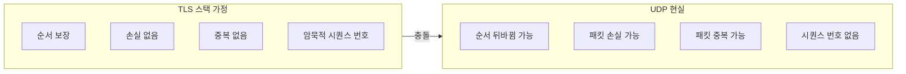
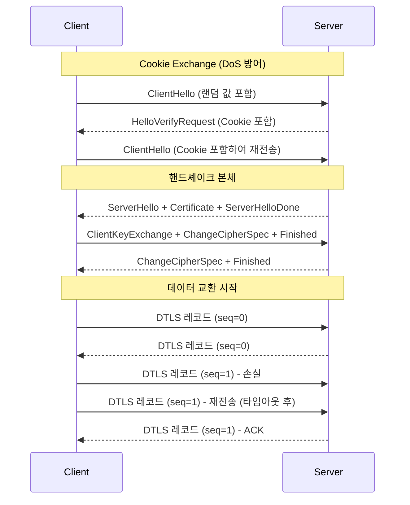
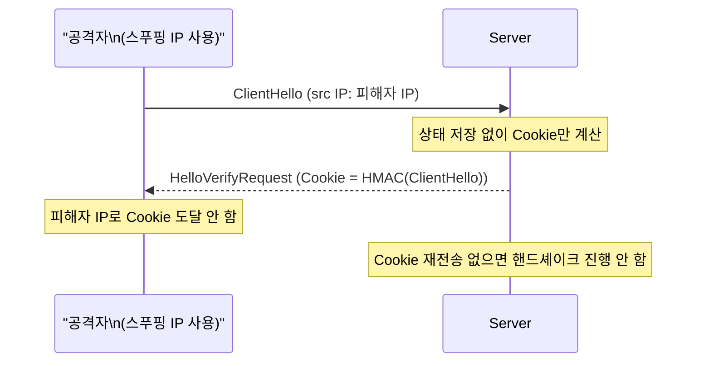
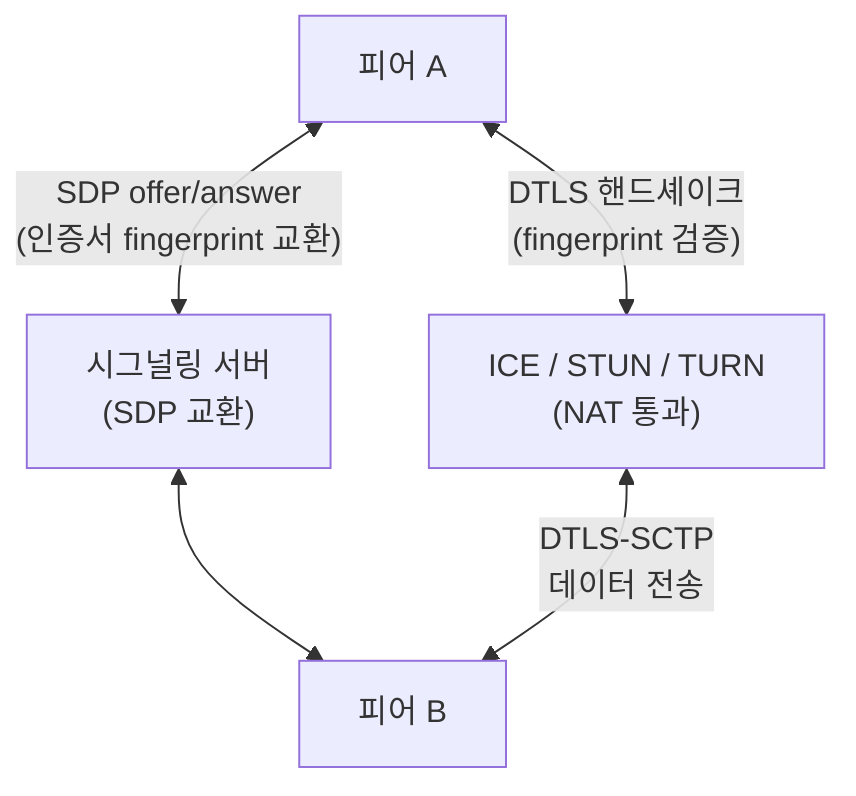

## 정의

**DTLS** (Datagram Transport Layer Security)는 [[udp|UDP]] 위에서 동작하는 [[tls|TLS]]의 변형이다. 데이터그램 기반 통신에 TLS와 동등한 보안 보장(서버 인증, 키 교환, 암호화, 무결성)을 제공하면서 UDP의 특성(비순서, 손실 허용, 비연결)을 그대로 유지한다.

[[webrtc|WebRTC]] DataChannel, VoIP, IoT, VPN 등 UDP를 사용하는 보안 통신에 광범위하게 쓰인다.

## 왜 TLS가 아닌 DTLS인가

[[tls|TLS]]는 [[tcp|TCP]]의 "순서 보장된 신뢰성 있는 스트림" 위에서 설계되었다.



| 비교 항목 | TLS (TCP 위) | DTLS (UDP 위) |
|:---|:---|:---|
| 핸드셰이크 순서 | 가정됨 (TCP 보장) | 메시지 번호화 + 재전송 |
| 시퀀스 번호 | 암묵적 (전송 안 함) | 명시적 (레코드 헤더에 포함) |
| 패킷 손실 | TCP가 재전송 처리 | 레코드 손실/중복 허용 |
| 큰 메시지 처리 | TCP 스트림으로 분할 | 레코드 fragmentation 지원 |
| DoS 방어 | TCP SYN Cookies | Cookie Exchange (HelloVerifyRequest) |

## 핸드셰이크 플로우



핵심: 손실된 핸드셰이크 메시지는 **타이머 기반 재전송**으로 복구한다. 타이머는 지수 백오프 방식으로 늘어난다 (초기 1초, 최대 60초).

## Cookie Exchange (DoS 방어)

UDP는 소스 IP 스푸핑이 쉬워 서버가 대량의 핸드셰이크 상태를 만들어두게 하는 증폭 공격에 취약하다.



서버는 `HelloVerifyRequest`를 보낼 때 **어떤 상태도 저장하지 않는다**. 클라이언트가 Cookie를 포함한 `ClientHello`를 재전송했을 때 비로소 핸드셰이크를 진행한다. HMAC으로 서명된 Cookie이므로 위조 불가.

## 버전

| 버전 | 출시 | 기반 TLS | 핵심 변경 |
|:---|:---:|:---|:---|
| DTLS 1.0 | 2006 | TLS 1.1 | 첫 UDP TLS 표준 |
| DTLS 1.2 | 2012 ([RFC 6347](https://datatracker.ietf.org/doc/html/rfc6347)) | TLS 1.2 | 현재 가장 널리 사용 |
| **DTLS 1.3** | **2022** ([RFC 9147](https://datatracker.ietf.org/doc/html/rfc9147)) | TLS 1.3 | 1-RTT / 0-RTT, 연결 ID |

DTLS 1.3은 TLS 1.3의 1-RTT 핸드셰이크 단축, 0-RTT 재접속, 개선된 암호화 스위트를 그대로 가져왔다.

## 사용처

### 1. WebRTC DataChannel

브라우저 간 P2P 데이터 채널은 모두 DTLS로 암호화된다.



흐름:
1. 시그널링으로 양쪽 인증서 fingerprint 사전 교환
2. DTLS 핸드셰이크로 키 확립 (fingerprint 검증)
3. SCTP over DTLS로 DataChannel 데이터 전송

WebRTC에서 DTLS는 MITM 방어를 위해 인증서 fingerprint를 시그널링 채널로 사전 교환하는 방식을 쓴다.

### 2. DTLS-SRTP (미디어 채널)

WebRTC 음성/영상 트래픽은 SRTP로 암호화하지만, **SRTP 키는 DTLS 핸드셰이크로 협상**한다.

```
DTLS 핸드셰이크 → keying material 추출 → SRTP 키 파생
      ↓
RTP/SRTP 미디어 데이터 전송 (DTLS 레코드 아님)
```

이를 DTLS-SRTP ([RFC 5764](https://datatracker.ietf.org/doc/html/rfc5764))라 부른다. 핸드셰이크만 DTLS이고 실제 미디어는 SRTP 패킷으로 전송된다.

### 3. VPN / OpenVPN UDP 모드

OpenVPN은 TCP 모드와 UDP 모드를 지원한다. UDP 모드에서 DTLS와 유사한 자체 보안 레이어를 사용한다. WireGuard는 별도 프로토콜을 사용하지만 UDP 위 암호화라는 점에서 같은 범주다.

### 4. IoT: CoAP + DTLS

CoAP (Constrained Application Protocol)는 IoT 기기를 위한 HTTP 대안이다. UDP 위에서 동작하며, 보안 레이어로 DTLS를 사용한다. TLS를 쓰기에 너무 자원이 제한적인 기기(MCU)에서 DTLS 1.2가 표준이다.

```
CoAP (UDP/5683)   → 평문 (테스트 환경)
CoAPS (UDP/5684)  → DTLS 암호화 (운영 환경)
```

## 레코드 구조

DTLS 레코드 헤더에는 TLS와 달리 **epoch + sequence number**가 명시적으로 포함된다.

```
DTLS 1.2 레코드 헤더 (13 bytes):

+--+--+--+--+--+--+--+--+--+--+--+--+--+
|CT|  Version | Epoch |  Sequence Num   |Length|
|1B|   2B     |  2B   |      6B         |  2B  |
+--+--+--+--+--+--+--+--+--+--+--+--+--+

CT: Content Type (Handshake=22, Alert=21, ApplicationData=23)
Epoch: 키 교환 횟수 (재키잉 시 증가)
Sequence Num: 레코드 순서 번호 (중복 탐지에 사용)
```

수신측은 슬라이딩 윈도우로 시퀀스 번호를 추적하여 **재전송 중복**과 **재생 공격**을 방어한다.

## 실전 예시

### Python으로 DTLS 서버/클라이언트

```python
# pip install dtls (PyDTLS 패키지)
from dtls import do_patch
do_patch()  # SSL 모듈을 DTLS 지원으로 패치

import ssl
import socket

# DTLS 서버
def dtls_server():
    sock = socket.socket(socket.AF_INET, socket.SOCK_DGRAM)
    sock.bind(("0.0.0.0", 4433))

    ctx = ssl.SSLContext(ssl.PROTOCOL_DTLS_SERVER)
    ctx.load_cert_chain("server.crt", "server.key")

    with ctx.wrap_socket(sock, server_side=True) as ssock:
        data, addr = ssock.recvfrom(1024)
        print(f"수신: {data} from {addr}")
        ssock.sendto(b"Hello from DTLS server!", addr)
```

### OpenSSL로 DTLS 테스트

```bash
# DTLS 서버 시작
openssl s_server -dtls1_2 -port 4433 -cert server.crt -key server.key

# DTLS 클라이언트 연결
openssl s_client -dtls1_2 -connect localhost:4433

# DTLS 1.3 (OpenSSL 3.2+)
openssl s_server -dtls -port 4433 -cert server.crt -key server.key
openssl s_client -dtls -connect localhost:4433

# Wireshark 캡처 - DTLS 패킷 확인
# 필터: dtls
# 복호화: Edit > Preferences > Protocols > DTLS > RSA keys list
```

### WebRTC DataChannel DTLS fingerprint 확인

```javascript
// 브라우저에서 DataChannel DTLS 인증서 fingerprint 확인
const pc = new RTCPeerConnection();

// 로컬 인증서 fingerprint (시그널링으로 상대방에게 전달)
const cert = await RTCPeerConnection.generateCertificate({ name: "ECDSA", namedCurve: "P-256" });
console.log(cert.getFingerprints());
// [{ algorithm: "sha-256", value: "AA:BB:CC:..." }]

// SDP에서 fingerprint 확인
const offer = await pc.createOffer();
const sdpLines = offer.sdp.split("\n");
const fingerprintLine = sdpLines.find(l => l.startsWith("a=fingerprint:"));
console.log(fingerprintLine);
// a=fingerprint:sha-256 AA:BB:CC:DD:...
```

## DTLS vs QUIC 비교

[[quic|QUIC]]도 UDP 위에서 TLS 1.3을 사용하지만, DTLS와는 다른 방식으로 동작한다.

| 항목 | DTLS | QUIC |
|:---|:---|:---|
| 레이어 | 순수 보안 레이어 | 전송 + 보안 통합 |
| TLS 방식 | TLS 1.3 핸드셰이크 응용 | TLS 1.3 직접 통합 (QUIC 레코드) |
| 신뢰성 | 하위 프로토콜이 처리 (SCTP 등) | QUIC 스트림 내장 |
| 헤더 압축 | 없음 | QPACK |
| 멀티플렉싱 | SCTP 조합 필요 | 내장 |
| 주 사용처 | WebRTC, IoT, VPN | HTTP/3, WebTransport |

QUIC은 "UDP 위에서 모든 것을 새로 만든" 반면, DTLS는 "기존 TLS를 UDP에 적응시킨" 접근이다.

## 함정

> [!WARNING]
> 1. **재전송 비용**: 핸드셰이크 패킷 손실 시 타이머 기반 재전송이 발생한다. 고손실 환경에서 초기 연결이 TCP+TLS보다 느릴 수 있다.
> 2. **MTU 제약**: UDP 패킷이 MTU(일반적으로 1500 bytes, 터널링 시 더 작음)를 초과하면 IP fragmentation이 발생한다. DTLS 핸드셰이크 메시지가 큰 경우 레코드 단위 fragmentation이 필요하다.
> 3. **Cookie 검증 우회**: DoS 방어용 Cookie Exchange를 비활성화하는 구현도 있다. 공개 서버에서는 반드시 활성화해야 한다.
> 4. **epoch rollover**: epoch 필드(2 bytes)는 65535회 재키잉 후 오버플로우한다. 장기 실행 세션에서 주의.
> 5. **인증서 검증 생략**: 특히 IoT 구현에서 self-signed 인증서를 검증하지 않는 경우가 많다. DTLS가 있어도 MITM에 취약해진다.

## 관련 위키

- [[udp|UDP]] - DTLS가 동작하는 기반 프로토콜
- [[tls|TLS]] - DTLS의 원형
- [[webrtc|WebRTC]] - DTLS를 핵심 보안 레이어로 사용
- [[quic|QUIC]] - UDP 위 보안의 다른 접근법
- [[network-nat|NAT]] - DTLS와 NAT Traversal 연관성
